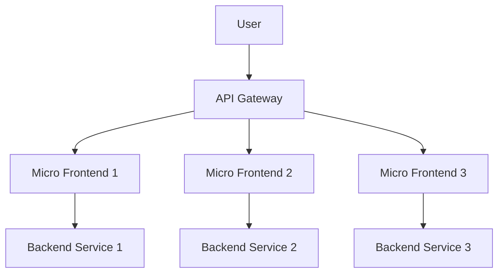

## 12.11 Micro Frontends with Scala.js

In the rapidly evolving landscape of web development, the concept of micro frontends has emerged as a powerful architectural pattern. This approach extends the principles of microservices to the frontend, enabling teams to build scalable, maintainable, and modular web applications. In this comprehensive guide, we will delve into the benefits of micro frontends, explore how to implement them using Scala.js, and discuss integration strategies and tooling that facilitate this architectural style.

### Understanding Micro Frontends

Micro frontends are an architectural style where a web application is divided into smaller, independent fragments, each owned by different teams. These fragments, or micro frontends, can be developed, deployed, and maintained independently, allowing for greater flexibility and scalability.

#### Benefits of Micro Frontends

1. **Scalability**: By breaking down a monolithic frontend into smaller, manageable pieces, teams can scale their applications more effectively. Each micro frontend can be developed and deployed independently, allowing for parallel development and faster release cycles.

2. **Team Autonomy**: Micro frontends empower teams to own specific parts of the application, promoting autonomy and reducing dependencies. Teams can choose their own technology stack, tools, and processes, leading to increased innovation and productivity.

3. **Improved Maintainability**: Smaller codebases are easier to understand, test, and maintain. By isolating changes to specific micro frontends, teams can reduce the risk of introducing bugs or regressions in other parts of the application.

4. **Technology Diversity**: Micro frontends allow teams to experiment with different technologies and frameworks. This flexibility can lead to better solutions tailored to specific use cases and requirements.

5. **Incremental Upgrades**: With micro frontends, teams can incrementally upgrade or replace parts of the application without disrupting the entire system. This approach minimizes risk and allows for smoother transitions to new technologies.

### Implementing Micro Frontends Using Scala.js

Scala.js is a powerful tool for building micro frontends. It compiles Scala code to JavaScript, allowing developers to leverage Scala's strong type system, functional programming paradigms, and extensive ecosystem in the browser. Let's explore how to implement micro frontends using Scala.js.

#### Setting Up a Scala.js Project

To get started with Scala.js, you'll need to set up a project. Here's a simple example using the `sbt` build tool:

```scala
// build.sbt
enablePlugins(ScalaJSPlugin)

scalaVersion := "2.13.10"

libraryDependencies += "org.scala-js" %%% "scalajs-dom" % "2.0.0"

scalaJSUseMainModuleInitializer := true
```

This setup enables Scala.js in your project and includes the `scalajs-dom` library for interacting with the DOM.

#### Creating a Simple Micro Frontend

Let's create a simple micro frontend using Scala.js. We'll build a component that displays a greeting message.

```scala
import org.scalajs.dom
import org.scalajs.dom.document

object HelloWorld {
  def main(args: Array[String]): Unit = {
    val greeting = document.createElement("div")
    greeting.textContent = "Hello, Micro Frontends with Scala.js!"
    document.body.appendChild(greeting)
  }
}
```

This code creates a `div` element with a greeting message and appends it to the document body. You can compile and run this Scala.js application using `sbt`:

```bash
sbt fastOptJS
```

This command generates a JavaScript file that you can include in your HTML page.

#### Integrating Multiple Micro Frontends

In a real-world application, you'll likely have multiple micro frontends that need to be integrated. There are several strategies for integrating micro frontends:

1. **Server-Side Composition**: Assemble the micro frontends on the server and deliver a single HTML page to the client. This approach simplifies client-side logic but may increase server load.

2. **Client-Side Composition**: Load and compose micro frontends dynamically on the client. This approach reduces server load and allows for more flexible client-side interactions.

3. **Edge-Side Composition**: Use a content delivery network (CDN) or edge server to compose micro frontends. This approach can improve performance by reducing latency and offloading work from the origin server.

#### Communication Between Micro Frontends

Communication between micro frontends is crucial for a cohesive user experience. Here are some common patterns:

- **Custom Events**: Use the browser's event system to emit and listen for custom events. This approach is simple and works well for loosely coupled components.

- **Shared State**: Use a shared state management library, such as Redux or MobX, to manage application state across micro frontends. This approach provides a consistent and predictable state management solution.

- **API Gateway**: Use an API gateway to handle communication between micro frontends and backend services. This approach centralizes API management and simplifies backend integration.

### Integration Strategies and Tooling

Integrating micro frontends requires careful planning and tooling. Here are some strategies and tools to consider:

#### Module Federation

Module Federation is a Webpack feature that allows you to dynamically load and share modules between applications. It enables micro frontends to share code and dependencies, reducing duplication and improving performance.

```javascript
// webpack.config.js
module.exports = {
  plugins: [
    new ModuleFederationPlugin({
      name: 'app',
      remotes: {
        otherApp: 'otherApp@http://localhost:3001/remoteEntry.js',
      },
      shared: ['react', 'react-dom'],
    }),
  ],
};
```

#### Single SPA

Single SPA is a framework for building micro frontends. It provides a simple API for registering and managing micro frontends, making it easy to integrate them into a single application.

```javascript
import { registerApplication, start } from 'single-spa';

registerApplication({
  name: 'app1',
  app: () => System.import('app1'),
  activeWhen: ['/app1'],
});

start();
```

#### Scalably

Scalably is a tool for managing micro frontends in Scala.js projects. It provides a set of utilities for building, deploying, and integrating micro frontends, making it easier to manage complex applications.

### Visualizing Micro Frontend Architecture

To better understand the architecture of micro frontends, let's visualize a typical setup using a diagram.



This diagram illustrates how an API gateway routes requests from the user to different micro frontends, which in turn communicate with their respective backend services.

### Design Considerations

When implementing micro frontends with Scala.js, consider the following design considerations:

- **Performance**: Ensure that micro frontends are optimized for performance. Use techniques like lazy loading and code splitting to reduce initial load times.

- **Security**: Implement security best practices to protect micro frontends from common vulnerabilities. Use HTTPS, content security policies, and input validation to secure your application.

- **Testing**: Test micro frontends independently and as part of the integrated application. Use unit tests, integration tests, and end-to-end tests to ensure quality and reliability.

- **Deployment**: Automate the deployment process for micro frontends. Use continuous integration and continuous deployment (CI/CD) pipelines to streamline releases and reduce downtime.

### Differences and Similarities

Micro frontends share similarities with microservices, such as modularity and team autonomy. However, they differ in their focus and implementation:

- **Focus**: Microservices focus on backend services, while micro frontends focus on the frontend layer.

- **Implementation**: Microservices are typically implemented using RESTful APIs or GraphQL, while micro frontends are implemented using JavaScript frameworks and libraries.

### Try It Yourself

To get hands-on experience with micro frontends using Scala.js, try modifying the code examples provided in this guide. Experiment with different integration strategies, communication patterns, and tooling options to see how they affect your application.

### Knowledge Check

- What are the main benefits of using micro frontends?
- How can Scala.js be used to implement micro frontends?
- What are some common strategies for integrating micro frontends?
- How do micro frontends differ from microservices?

### Embrace the Journey

Remember, transitioning to micro frontends is a journey. It requires careful planning, collaboration, and experimentation. As you explore this architectural style, keep an open mind and be willing to adapt to new challenges and opportunities.

### References and Links

- [Scala.js Documentation](https://www.scala-js.org/doc/)
- [Single SPA Documentation](https://single-spa.js.org/docs/getting-started-overview)
- [Webpack Module Federation](https://webpack.js.org/concepts/module-federation/)

## Quiz Time!



### What is a primary benefit of micro frontends?

- [x] Scalability
- [ ] Increased complexity
- [ ] Monolithic architecture
- [ ] Reduced team autonomy

> **Explanation:** Micro frontends enhance scalability by allowing independent development and deployment of frontend components.

### Which tool is used for managing micro frontends in Scala.js projects?

- [ ] Redux
- [ ] MobX
- [ ] Webpack
- [x] Scalably

> **Explanation:** Scalably provides utilities for building, deploying, and integrating micro frontends in Scala.js projects.

### What is the role of an API gateway in micro frontend architecture?

- [x] Routes requests from users to micro frontends
- [ ] Hosts backend services
- [ ] Manages database connections
- [ ] Compiles Scala.js code

> **Explanation:** An API gateway routes requests from users to the appropriate micro frontends, facilitating communication.

### Which pattern is commonly used for communication between micro frontends?

- [ ] RESTful APIs
- [ ] GraphQL
- [x] Custom Events
- [ ] SOAP

> **Explanation:** Custom events are a simple and effective way to enable communication between loosely coupled micro frontends.

### What is a key difference between micro frontends and microservices?

- [x] Micro frontends focus on the frontend layer
- [ ] Micro frontends use RESTful APIs
- [ ] Microservices are implemented with JavaScript
- [ ] Microservices focus on the frontend layer

> **Explanation:** Micro frontends focus on the frontend layer, while microservices focus on backend services.

### How can performance be optimized in micro frontends?

- [x] Use lazy loading and code splitting
- [ ] Increase server load
- [ ] Reduce team autonomy
- [ ] Use monolithic architecture

> **Explanation:** Lazy loading and code splitting help reduce initial load times, optimizing performance in micro frontends.

### What is the purpose of Single SPA in micro frontend architecture?

- [x] Registers and manages micro frontends
- [ ] Hosts backend services
- [ ] Compiles Scala.js code
- [ ] Manages database connections

> **Explanation:** Single SPA provides an API for registering and managing micro frontends within a single application.

### Which integration strategy involves assembling micro frontends on the server?

- [x] Server-Side Composition
- [ ] Client-Side Composition
- [ ] Edge-Side Composition
- [ ] API Gateway

> **Explanation:** Server-side composition involves assembling micro frontends on the server before delivering a single HTML page to the client.

### What is a common security practice for micro frontends?

- [x] Use HTTPS and content security policies
- [ ] Increase server load
- [ ] Use monolithic architecture
- [ ] Reduce team autonomy

> **Explanation:** Using HTTPS and content security policies helps protect micro frontends from common security vulnerabilities.

### True or False: Micro frontends allow for incremental upgrades without disrupting the entire system.

- [x] True
- [ ] False

> **Explanation:** Micro frontends enable incremental upgrades by allowing parts of the application to be updated or replaced independently.


