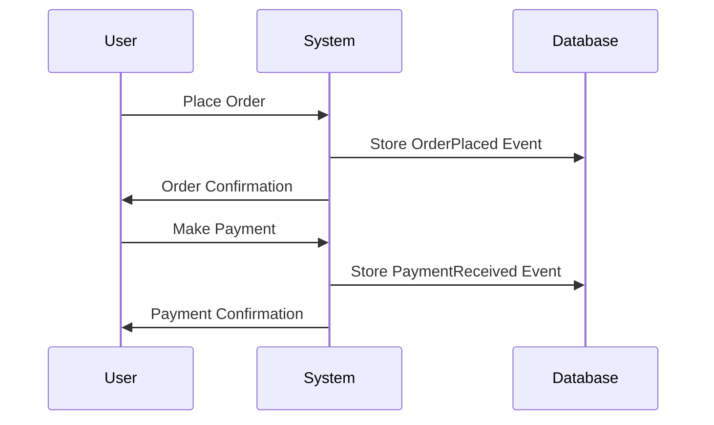

## 12.12 Event Modeling

Event modeling is a powerful technique for designing systems that align closely with real-world business processes. By focusing on events as the primary unit of change, developers can create systems that are both flexible and scalable. In this section, we will delve into the principles of event modeling, explore how to align business processes with event flows, and demonstrate practical applications in Scala.

### Understanding Event Modeling

Event modeling is a method of designing systems where events are the central focus. An event is a significant change in state that is meaningful to the business. This approach allows for a clear representation of how data flows through a system and how different components interact with each other.

#### Key Concepts

1. **Events**: Events represent changes in state. They are immutable facts that have occurred in the past. Examples include "Order Placed", "Payment Received", or "User Registered".

2. **Event Streams**: A sequence of events that occur over time. Event streams are often used to capture the history of changes for a particular entity or process.

3. **Event Sourcing**: A pattern where state changes are stored as a sequence of events. The current state of an entity is derived by replaying these events.

4. **Command**: An action that triggers an event. Commands are requests to perform an operation, such as "Place Order" or "Cancel Subscription".

5. **Projection**: A read model that is derived from events. Projections are used to present data in a form that is optimized for querying.

6. **Process Manager**: A component that coordinates long-running business processes, often by listening to events and dispatching commands.

### Aligning Business Processes with Event Flows

Aligning business processes with event flows involves mapping out the events that occur within a business domain and designing systems that can handle these events effectively. This alignment ensures that the system accurately reflects the business logic and can adapt to changes over time.

#### Steps to Align Business Processes

1. **Identify Key Events**: Start by identifying the key events that occur within the business domain. These events should represent meaningful changes in state.

2. **Define Event Streams**: Organize events into streams that represent the lifecycle of an entity or process. This helps in understanding the sequence of events and their relationships.

3. **Model Commands and Projections**: Define the commands that trigger events and the projections that provide read models. This separation of concerns allows for a clear distinction between write and read operations.

4. **Design Process Managers**: Implement process managers to handle complex workflows that involve multiple steps and interactions. Process managers listen to events and dispatch commands as needed.

5. **Iterate and Refine**: Continuously iterate and refine the event model as the business evolves. This ensures that the system remains aligned with the business processes.

### Practical Applications in Scala

Scala, with its functional programming capabilities and strong type system, is well-suited for implementing event-driven systems. Let's explore some practical applications of event modeling in Scala.

#### Implementing Event Sourcing in Scala

Event sourcing is a key pattern in event modeling. In Scala, we can implement event sourcing using case classes to represent events and a sequence of these events to represent the state of an entity.

```scala
// Define an event trait
sealed trait Event

// Define specific events
case class OrderPlaced(orderId: String, amount: Double) extends Event
case class PaymentReceived(orderId: String, amount: Double) extends Event

// Define an entity state
case class OrderState(orderId: String, totalAmount: Double, isPaid: Boolean)

// Define a function to apply events to the state
def applyEvent(state: OrderState, event: Event): OrderState = event match {
  case OrderPlaced(id, amount) => state.copy(orderId = id, totalAmount = amount)
  case PaymentReceived(_, amount) => state.copy(isPaid = true)
}

// Reconstruct state from a sequence of events
def reconstructState(events: Seq[Event]): OrderState = {
  events.foldLeft(OrderState("", 0.0, false))(applyEvent)
}

// Example usage
val events = Seq(OrderPlaced("123", 100.0), PaymentReceived("123", 100.0))
val currentState = reconstructState(events)
println(currentState) // Output: OrderState(123, 100.0, true)
```

In this example, we define a trait `Event` and two case classes `OrderPlaced` and `PaymentReceived` to represent specific events. The `applyEvent` function updates the `OrderState` based on the events, and `reconstructState` uses a fold operation to apply a sequence of events to an initial state.

#### Using Akka for Event-Driven Systems

Akka is a powerful toolkit for building concurrent, distributed, and fault-tolerant applications in Scala. It provides actors for managing state and processing events asynchronously.

```scala
import akka.actor.{Actor, ActorSystem, Props}

// Define messages
case class PlaceOrder(orderId: String, amount: Double)
case class ReceivePayment(orderId: String, amount: Double)

// Define an actor to handle orders
class OrderActor extends Actor {
  var state: OrderState = OrderState("", 0.0, false)

  def receive: Receive = {
    case PlaceOrder(id, amount) =>
      state = applyEvent(state, OrderPlaced(id, amount))
      println(s"Order placed: $state")
    case ReceivePayment(id, amount) =>
      state = applyEvent(state, PaymentReceived(id, amount))
      println(s"Payment received: $state")
  }
}

// Create an actor system and actor
val system = ActorSystem("OrderSystem")
val orderActor = system.actorOf(Props[OrderActor], "orderActor")

// Send messages to the actor
orderActor ! PlaceOrder("123", 100.0)
orderActor ! ReceivePayment("123", 100.0)
```

In this example, we define an `OrderActor` that maintains the state of an order and processes `PlaceOrder` and `ReceivePayment` messages. The actor updates its state using the `applyEvent` function and prints the updated state.

#### Designing Projections

Projections are read models derived from events. They provide a way to query the current state of the system efficiently.

```scala
// Define a projection for order summaries
case class OrderSummary(orderId: String, totalAmount: Double, status: String)

// Function to create a projection from events
def createOrderSummary(events: Seq[Event]): OrderSummary = {
  val state = reconstructState(events)
  val status = if (state.isPaid) "Paid" else "Pending"
  OrderSummary(state.orderId, state.totalAmount, status)
}

// Example usage
val orderSummary = createOrderSummary(events)
println(orderSummary) // Output: OrderSummary(123, 100.0, Paid)
```

Here, we define an `OrderSummary` case class to represent the projection. The `createOrderSummary` function uses the `reconstructState` function to derive the current state and then creates a summary with the appropriate status.

### Visualizing Event Flows

Visualizing event flows is crucial for understanding how events interact within a system. We can use diagrams to represent the flow of events, commands, and projections.



This sequence diagram illustrates the interaction between a user, the system, and the database. The user places an order, which triggers the `OrderPlaced` event, and makes a payment, which triggers the `PaymentReceived` event. The system stores these events in the database and provides confirmations to the user.

### Design Considerations

When implementing event modeling in Scala, consider the following:

- **Immutability**: Use immutable data structures for events and state to ensure consistency and avoid side effects.
- **Scalability**: Design the system to handle a large number of events and users concurrently. Akka and other reactive libraries can help achieve this.
- **Consistency**: Ensure that the system maintains consistency across different components and services. Event sourcing can help achieve eventual consistency.
- **Error Handling**: Implement robust error handling to manage failures gracefully. Use patterns like Circuit Breaker and Retry for resilience.
- **Testing**: Test the system thoroughly to ensure that it behaves correctly under different scenarios. Use property-based testing to validate the behavior of event flows.

### Differences and Similarities with Other Patterns

Event modeling shares similarities with other patterns, such as:

- **CQRS (Command Query Responsibility Segregation)**: Both patterns separate read and write operations, but event modeling focuses more on the flow of events.
- **Domain-Driven Design (DDD)**: Event modeling aligns well with DDD, as both emphasize modeling the business domain accurately.
- **Event-Driven Architecture (EDA)**: Event modeling is a subset of EDA, focusing specifically on the design and flow of events.

### Try It Yourself

To deepen your understanding of event modeling, try modifying the code examples provided:

- Add new events and commands to the system, such as "Order Shipped" or "Order Cancelled".
- Implement additional projections, such as a report of all paid orders.
- Experiment with Akka actors to handle more complex workflows and interactions.

### Conclusion

Event modeling is a powerful approach to designing systems that align with real-world business processes. By focusing on events as the primary unit of change, developers can create systems that are both flexible and scalable. Scala, with its functional programming capabilities, provides an excellent platform for implementing event-driven systems. By following the principles outlined in this guide, you can design robust systems that accurately reflect your business domain.

## Quiz Time!



### What is an event in the context of event modeling?

- [x] A significant change in state that is meaningful to the business.
- [ ] A request to perform an operation.
- [ ] A read model derived from events.
- [ ] A component that coordinates long-running business processes.

> **Explanation:** An event represents a significant change in state that is meaningful to the business.

### What is the purpose of a projection in event modeling?

- [x] To provide a read model that is derived from events.
- [ ] To trigger an event.
- [ ] To store state changes as a sequence of events.
- [ ] To dispatch commands in a system.

> **Explanation:** Projections are read models derived from events, optimized for querying.

### Which Scala library is commonly used for building concurrent, distributed, and fault-tolerant applications?

- [x] Akka
- [ ] Cats
- [ ] Monix
- [ ] Slick

> **Explanation:** Akka is a toolkit for building concurrent, distributed, and fault-tolerant applications in Scala.

### What is the role of a process manager in event modeling?

- [x] To coordinate long-running business processes by listening to events and dispatching commands.
- [ ] To provide a read model derived from events.
- [ ] To store state changes as a sequence of events.
- [ ] To represent a significant change in state.

> **Explanation:** A process manager coordinates long-running business processes by listening to events and dispatching commands.

### Which pattern focuses on separating read and write operations?

- [x] CQRS (Command Query Responsibility Segregation)
- [ ] Event Sourcing
- [ ] Domain-Driven Design
- [ ] Event-Driven Architecture

> **Explanation:** CQRS focuses on separating read and write operations.

### What is the main benefit of using immutable data structures in event modeling?

- [x] To ensure consistency and avoid side effects.
- [ ] To improve performance.
- [ ] To simplify error handling.
- [ ] To reduce memory usage.

> **Explanation:** Immutable data structures ensure consistency and avoid side effects.

### How can event modeling help achieve eventual consistency?

- [x] By using event sourcing to store state changes as a sequence of events.
- [ ] By separating read and write operations.
- [ ] By using process managers to coordinate business processes.
- [ ] By implementing robust error handling.

> **Explanation:** Event sourcing helps achieve eventual consistency by storing state changes as a sequence of events.

### What is the relationship between event modeling and Domain-Driven Design (DDD)?

- [x] Both emphasize modeling the business domain accurately.
- [ ] Both focus on separating read and write operations.
- [ ] Both use actors for managing state.
- [ ] Both are subsets of Event-Driven Architecture.

> **Explanation:** Event modeling and DDD both emphasize modeling the business domain accurately.

### Which of the following is a key consideration when implementing event modeling in Scala?

- [x] Immutability
- [ ] Inheritance
- [ ] Polymorphism
- [ ] Reflection

> **Explanation:** Immutability is a key consideration when implementing event modeling in Scala.

### Event modeling is a subset of which architectural pattern?

- [x] Event-Driven Architecture
- [ ] Domain-Driven Design
- [ ] Command Query Responsibility Segregation
- [ ] Microservices Architecture

> **Explanation:** Event modeling is a subset of Event-Driven Architecture.


