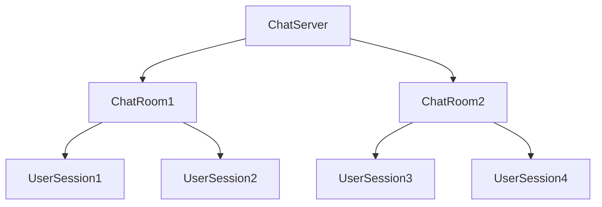

## 12.13 Responsive Systems Design

In today's fast-paced digital world, the demand for responsive, scalable, and resilient systems is ever-increasing. The principles of the *Reactive Manifesto* provide a foundation for building systems that can handle the complexities of modern software applications. In this section, we will delve into the core principles of the Reactive Manifesto and explore how to implement responsive systems using Scala, a language well-suited for building reactive applications.

### Understanding the Reactive Manifesto

The Reactive Manifesto is a set of design principles aimed at creating systems that are more flexible, loosely-coupled, and scalable. It emphasizes four key principles:

1. **Responsive**: Systems should respond in a timely manner. Responsiveness is the cornerstone of usability and reliability, ensuring that users receive prompt feedback and that the system remains available under varying load conditions.

2. **Resilient**: Systems must remain responsive in the face of failure. This involves designing systems that can recover from failures and continue to function, often by employing redundancy and isolation techniques.

3. **Elastic**: Systems should adapt to changes in load. Elasticity allows systems to scale up or down as needed, ensuring efficient resource utilization and maintaining performance levels.

4. **Message-Driven**: Systems should rely on asynchronous message-passing to establish boundaries between components. This decouples components and allows them to interact without blocking, enhancing both scalability and resilience.

These principles are interrelated and together form the foundation of reactive systems. Let's explore how these principles can be applied in Scala to design responsive systems.

### Designing Responsive Systems in Scala

Scala, with its functional programming capabilities and strong support for concurrent and distributed computing, is an excellent choice for building reactive systems. Here, we will discuss how to leverage Scala's features to implement each of the Reactive Manifesto's principles.

#### 1. Building Responsiveness

Responsiveness is about ensuring that systems can provide timely responses to user requests. In Scala, this can be achieved through:

- **Non-blocking I/O**: Use libraries like Akka HTTP or Play Framework that support non-blocking I/O operations, allowing the system to handle multiple requests concurrently without waiting for each to complete.

- **Futures and Promises**: Utilize Scala's `Future` and `Promise` constructs to perform asynchronous computations. This allows tasks to run in parallel, improving system throughput and responsiveness.

```scala
import scala.concurrent.Future
import scala.concurrent.ExecutionContext.Implicits.global

def fetchData(): Future[String] = Future {
  // Simulate a long-running computation
  Thread.sleep(1000)
  "Data fetched"
}

fetchData().foreach(println)
```

- **Reactive Streams**: Implement backpressure handling using reactive streams, ensuring that the system can handle varying loads without overwhelming resources.

#### 2. Ensuring Resilience

Resilience involves designing systems that can withstand and recover from failures. In Scala, resilience can be achieved through:

- **Supervision Strategies**: Use Akka's actor model to implement supervision strategies, where supervisors can restart failed actors, isolating failures and preventing them from affecting the entire system.

```scala
import akka.actor.{Actor, ActorSystem, Props, SupervisorStrategy, OneForOneStrategy}
import akka.actor.SupervisorStrategy._

class WorkerActor extends Actor {
  def receive = {
    case "fail" => throw new Exception("Failure")
    case msg => println(s"Received: $msg")
  }
}

class SupervisorActor extends Actor {
  override val supervisorStrategy = OneForOneStrategy() {
    case _: Exception => Restart
  }

  val worker = context.actorOf(Props[WorkerActor], "worker")

  def receive = {
    case msg => worker ! msg
  }
}

val system = ActorSystem("ResilienceExample")
val supervisor = system.actorOf(Props[SupervisorActor], "supervisor")
supervisor ! "fail"
supervisor ! "Hello"
```

- **Circuit Breakers**: Implement circuit breakers to prevent cascading failures by temporarily halting requests to a failing component.

- **Retry Mechanisms**: Use retry mechanisms to handle transient failures, ensuring that operations are retried a specified number of times before failing.

#### 3. Achieving Elasticity

Elasticity is about adapting to changes in load. In Scala, you can achieve elasticity by:

- **Dynamic Resource Allocation**: Use tools like Kubernetes to dynamically allocate resources based on load, scaling the system up or down as needed.

- **Load Balancing**: Implement load balancing to distribute requests evenly across available resources, preventing any single component from becoming a bottleneck.

- **Asynchronous Processing**: Use asynchronous processing to handle tasks in parallel, allowing the system to scale horizontally.

#### 4. Embracing Message-Driven Architecture

A message-driven architecture is key to building decoupled and scalable systems. In Scala, this can be implemented using:

- **Akka Actors**: Use Akka's actor model to build systems that communicate through asynchronous message-passing, decoupling components and enhancing scalability.

```scala
import akka.actor.{Actor, ActorSystem, Props}

class PrinterActor extends Actor {
  def receive = {
    case msg: String => println(s"Received message: $msg")
  }
}

val system = ActorSystem("MessageDrivenExample")
val printer = system.actorOf(Props[PrinterActor], "printer")
printer ! "Hello, Akka!"
```

- **Event Sourcing**: Implement event sourcing to capture changes as a sequence of events, allowing for easier recovery and auditing.

- **CQRS (Command Query Responsibility Segregation)**: Use CQRS to separate read and write operations, optimizing each for its specific use case.

### Implementing Reactive Systems in Scala

Now that we have explored the principles of the Reactive Manifesto and how they can be applied in Scala, let's look at a comprehensive example of implementing a reactive system using Scala and Akka.

#### Example: Building a Reactive Chat Application

In this example, we will build a simple chat application using Scala and Akka. The application will demonstrate responsiveness, resilience, elasticity, and a message-driven architecture.

**System Architecture**

The chat application will consist of the following components:

- **ChatServer**: Manages chat rooms and user sessions.
- **ChatRoom**: Handles messages for a specific chat room.
- **UserSession**: Represents a user's connection to the chat server.

**Mermaid Diagram: System Architecture**



**Code Implementation**

Let's start by defining the `ChatServer` actor, which will manage chat rooms and user sessions.

```scala
import akka.actor.{Actor, ActorRef, ActorSystem, Props}

case class JoinRoom(user: ActorRef, roomName: String)
case class LeaveRoom(user: ActorRef, roomName: String)
case class SendMessage(user: ActorRef, roomName: String, message: String)

class ChatServer extends Actor {
  var chatRooms = Map.empty[String, ActorRef]

  def receive = {
    case JoinRoom(user, roomName) =>
      val chatRoom = chatRooms.getOrElseUpdate(roomName, context.actorOf(Props[ChatRoom], roomName))
      chatRoom ! JoinRoom(user, roomName)

    case LeaveRoom(user, roomName) =>
      chatRooms.get(roomName).foreach(_ ! LeaveRoom(user, roomName))

    case msg @ SendMessage(_, roomName, _) =>
      chatRooms.get(roomName).foreach(_ ! msg)
  }
}
```

Next, we'll define the `ChatRoom` actor, which will handle messages for a specific chat room.

```scala
class ChatRoom extends Actor {
  var users = Set.empty[ActorRef]

  def receive = {
    case JoinRoom(user, _) =>
      users += user
      context.watch(user)

    case LeaveRoom(user, _) =>
      users -= user

    case SendMessage(user, _, message) =>
      users.foreach(_ ! s"${user.path.name}: $message")
  }
}
```

Finally, we'll define the `UserSession` actor, which represents a user's connection to the chat server.

```scala
class UserSession(username: String, chatServer: ActorRef) extends Actor {
  def receive = {
    case message: String =>
      println(s"[$username] $message")

    case other =>
      chatServer ! other
  }
}
```

**Running the Application**

To run the chat application, we need to create an `ActorSystem` and instantiate the `ChatServer` and `UserSession` actors.

```scala
val system = ActorSystem("ChatSystem")
val chatServer = system.actorOf(Props[ChatServer], "chatServer")

val user1 = system.actorOf(Props(new UserSession("Alice", chatServer)), "Alice")
val user2 = system.actorOf(Props(new UserSession("Bob", chatServer)), "Bob")

chatServer ! JoinRoom(user1, "ScalaRoom")
chatServer ! JoinRoom(user2, "ScalaRoom")

chatServer ! SendMessage(user1, "ScalaRoom", "Hello, everyone!")
chatServer ! SendMessage(user2, "ScalaRoom", "Hi, Alice!")
```

**Try It Yourself**

Experiment with the chat application by adding more users and chat rooms. Try implementing additional features such as private messaging or user authentication.

### Design Considerations

When designing responsive systems, consider the following:

- **Scalability**: Ensure that the system can handle increased load by distributing work across multiple nodes or processes.

- **Fault Tolerance**: Design for failure by implementing redundancy and isolation techniques.

- **Performance**: Optimize for performance by minimizing blocking operations and using efficient data structures.

- **Security**: Implement security measures to protect against unauthorized access and data breaches.

### Differences and Similarities with Other Patterns

Responsive systems design shares similarities with other architectural patterns, such as microservices and event-driven architectures. However, it emphasizes responsiveness and scalability as primary goals, making it distinct in its focus on user experience and system performance.

### Conclusion

Responsive systems design is a critical aspect of modern software architecture, enabling systems to meet the demands of today's users and environments. By embracing the principles of the Reactive Manifesto and leveraging Scala's powerful features, you can build systems that are not only responsive but also resilient, elastic, and message-driven. As you continue to explore and implement these concepts, remember to experiment, iterate, and refine your designs to achieve the best possible outcomes.

## Quiz Time!



### What is the cornerstone of the Reactive Manifesto?

- [x] Responsiveness
- [ ] Resilience
- [ ] Elasticity
- [ ] Message-Driven

> **Explanation:** Responsiveness is the cornerstone of the Reactive Manifesto, as it ensures timely responses and system availability.

### Which Scala feature is commonly used for asynchronous computations?

- [x] Futures and Promises
- [ ] Case Classes
- [ ] Pattern Matching
- [ ] Traits

> **Explanation:** Futures and Promises are used in Scala for asynchronous computations, allowing tasks to run in parallel.

### What is the primary purpose of a circuit breaker in a reactive system?

- [x] To prevent cascading failures
- [ ] To enhance performance
- [ ] To manage user sessions
- [ ] To handle authentication

> **Explanation:** Circuit breakers prevent cascading failures by temporarily halting requests to a failing component.

### In a message-driven architecture, what is the primary means of communication between components?

- [x] Asynchronous message-passing
- [ ] Synchronous calls
- [ ] Shared memory
- [ ] Direct method invocation

> **Explanation:** Asynchronous message-passing is the primary means of communication in a message-driven architecture, decoupling components.

### Which library is commonly used in Scala for implementing non-blocking I/O?

- [x] Akka HTTP
- [ ] ScalaTest
- [ ] Slick
- [ ] Monix

> **Explanation:** Akka HTTP is commonly used for implementing non-blocking I/O in Scala applications.

### What is the role of a supervisor in Akka's actor model?

- [x] To manage and restart failed actors
- [ ] To handle user input
- [ ] To perform database operations
- [ ] To render UI components

> **Explanation:** A supervisor in Akka's actor model manages and restarts failed actors, ensuring system resilience.

### How can elasticity be achieved in a Scala application?

- [x] By dynamically allocating resources based on load
- [ ] By using synchronous processing
- [ ] By implementing deep inheritance hierarchies
- [ ] By overusing implicits

> **Explanation:** Elasticity can be achieved by dynamically allocating resources based on load, allowing the system to scale.

### What is the primary benefit of using event sourcing in a reactive system?

- [x] Easier recovery and auditing
- [ ] Improved UI rendering
- [ ] Faster database queries
- [ ] Simplified user authentication

> **Explanation:** Event sourcing captures changes as a sequence of events, allowing for easier recovery and auditing.

### Which of the following is NOT a principle of the Reactive Manifesto?

- [ ] Responsive
- [ ] Resilient
- [ ] Elastic
- [x] Synchronous

> **Explanation:** Synchronous is not a principle of the Reactive Manifesto; the manifesto emphasizes asynchronous communication.

### True or False: The Reactive Manifesto emphasizes the use of blocking operations to ensure system responsiveness.

- [ ] True
- [x] False

> **Explanation:** False. The Reactive Manifesto emphasizes non-blocking operations to ensure system responsiveness.


