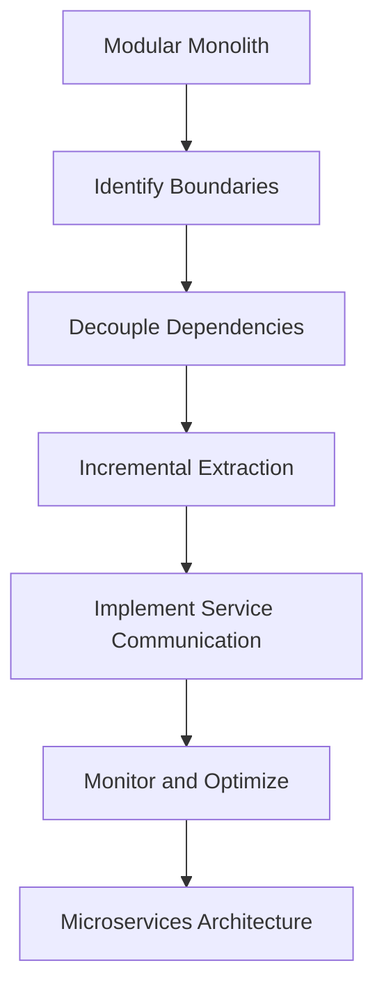

## 12.14 Modular Monolith

In the ever-evolving landscape of software architecture, the modular monolith stands out as a robust and pragmatic approach to building scalable and maintainable applications. This section delves into the concept of the modular monolith, its benefits, use cases, and how to design such applications in Scala. We will also explore the transition from a monolith to microservices, should the need arise.

### Understanding the Modular Monolith

#### What is a Modular Monolith?

A modular monolith is a software architecture pattern that combines the simplicity of a monolithic application with the flexibility of modular design. Unlike a traditional monolith, where all components are tightly coupled, a modular monolith is composed of distinct, independent modules that interact through well-defined interfaces.

#### Benefits of a Modular Monolith

1. **Simplicity and Manageability**: A modular monolith is easier to develop, deploy, and manage compared to microservices. It avoids the complexity of distributed systems while maintaining a clear separation of concerns.

2. **Performance**: Since all modules reside within a single process, communication between them is faster and more efficient than in a microservices architecture, which relies on network calls.

3. **Ease of Testing**: Testing a modular monolith is straightforward as it runs in a single environment. Integration tests can be performed without the overhead of setting up multiple services.

4. **Gradual Transition to Microservices**: A well-designed modular monolith can serve as a stepping stone to a microservices architecture. Modules can be extracted into services incrementally as the application grows.

5. **Cost-Effectiveness**: With fewer moving parts, a modular monolith is often more cost-effective to maintain and operate, especially for small to medium-sized applications.

#### Use Cases for Modular Monoliths

- **Startups and Small Teams**: When resources are limited, a modular monolith allows teams to focus on delivering features without the overhead of managing a distributed system.
- **Applications with Low Complexity**: For applications that do not require the scalability of microservices, a modular monolith provides a simpler and more efficient solution.
- **Legacy Systems**: Refactoring a legacy monolith into a modular monolith can improve maintainability and set the stage for future scalability.

### Designing Modular Applications in Scala

Scala, with its powerful type system and functional programming capabilities, is well-suited for designing modular monoliths. Let's explore how to architect a modular application in Scala.

#### Key Principles of Modular Design

1. **Separation of Concerns**: Divide the application into distinct modules, each responsible for a specific functionality. This separation enhances maintainability and scalability.

2. **Encapsulation**: Encapsulate module internals and expose only necessary interfaces. This ensures that changes within a module do not affect others.

3. **Loose Coupling**: Design modules to be loosely coupled, allowing them to interact through well-defined interfaces or APIs.

4. **High Cohesion**: Ensure that each module has a single, well-defined purpose, with related functionalities grouped together.

5. **Reusability**: Design modules to be reusable across different parts of the application or even in other projects.

#### Implementing Modular Design in Scala

To illustrate modular design in Scala, let's consider an example of an e-commerce application with modules for user management, product catalog, and order processing.

```scala
// Define a trait for the User Management module
trait UserManagement {
  def createUser(name: String, email: String): User
  def getUser(id: String): Option[User]
}

// Implement the User Management module
class UserManagementImpl extends UserManagement {
  private var users: Map[String, User] = Map()

  override def createUser(name: String, email: String): User = {
    val user = User(java.util.UUID.randomUUID().toString, name, email)
    users += (user.id -> user)
    user
  }

  override def getUser(id: String): Option[User] = users.get(id)
}

// Define a case class for User
case class User(id: String, name: String, email: String)

// Define a trait for the Product Catalog module
trait ProductCatalog {
  def addProduct(name: String, price: Double): Product
  def getProduct(id: String): Option[Product]
}

// Implement the Product Catalog module
class ProductCatalogImpl extends ProductCatalog {
  private var products: Map[String, Product] = Map()

  override def addProduct(name: String, price: Double): Product = {
    val product = Product(java.util.UUID.randomUUID().toString, name, price)
    products += (product.id -> product)
    product
  }

  override def getProduct(id: String): Option[Product] = products.get(id)
}

// Define a case class for Product
case class Product(id: String, name: String, price: Double)

// Define a trait for the Order Processing module
trait OrderProcessing {
  def createOrder(userId: String, productId: String): Order
  def getOrder(id: String): Option[Order]
}

// Implement the Order Processing module
class OrderProcessingImpl(userManagement: UserManagement, productCatalog: ProductCatalog) extends OrderProcessing {
  private var orders: Map[String, Order] = Map()

  override def createOrder(userId: String, productId: String): Order = {
    val user = userManagement.getUser(userId)
    val product = productCatalog.getProduct(productId)

    (user, product) match {
      case (Some(u), Some(p)) =>
        val order = Order(java.util.UUID.randomUUID().toString, u, p)
        orders += (order.id -> order)
        order
      case _ => throw new IllegalArgumentException("Invalid user or product ID")
    }
  }

  override def getOrder(id: String): Option[Order] = orders.get(id)
}

// Define a case class for Order
case class Order(id: String, user: User, product: Product)
```

In this example, we have three modules: `UserManagement`, `ProductCatalog`, and `OrderProcessing`. Each module is defined by a trait, and its implementation encapsulates the module's logic. The `OrderProcessing` module depends on the other two modules, demonstrating how modules can interact through interfaces.

#### Try It Yourself

Experiment with the code by adding new functionalities, such as updating user information or handling product inventory. Consider how you might refactor the code to introduce new modules, such as a payment processing module.

### Transitioning from a Monolith to Microservices

While a modular monolith offers many advantages, there may come a time when transitioning to microservices becomes necessary. This section explores how to make that transition smoothly.

#### When to Consider Microservices

1. **Scalability Needs**: If certain modules require independent scaling due to increased load, microservices can provide the necessary flexibility.

2. **Team Structure**: As teams grow, having independent services can align better with team boundaries, allowing teams to work autonomously.

3. **Technology Diversity**: Microservices allow different services to use different technologies, which can be beneficial if specific technologies are better suited for certain tasks.

4. **Deployment Flexibility**: Microservices enable independent deployment, reducing the risk of deploying changes to a single monolith.

#### Steps to Transition

1. **Identify Boundaries**: Analyze the existing modular monolith to identify clear boundaries between modules that can be extracted into services.

2. **Decouple Dependencies**: Ensure that modules have minimal dependencies on each other. Use APIs or message queues to facilitate communication between services.

3. **Incremental Extraction**: Start by extracting the most independent modules first. This reduces risk and allows for gradual adaptation to the new architecture.

4. **Implement Service Communication**: Choose appropriate communication protocols (e.g., REST, gRPC) and implement service communication.

5. **Monitor and Optimize**: Continuously monitor the performance and reliability of the new microservices architecture. Optimize as needed to ensure it meets business requirements.

#### Design Considerations

- **Data Consistency**: Ensure data consistency across services. Consider using event sourcing or distributed transactions if necessary.
- **Security**: Implement security measures to protect inter-service communication.
- **Observability**: Enhance observability with logging, monitoring, and tracing to diagnose issues effectively.

### Visualizing the Transition

To better understand the transition from a modular monolith to microservices, let's visualize the process using a diagram.



This flowchart illustrates the key steps in transitioning from a modular monolith to a microservices architecture. Each step builds upon the previous one, ensuring a smooth and controlled transition.

### Knowledge Check

- **Question**: What are the main benefits of a modular monolith?
- **Answer**: Simplicity, performance, ease of testing, gradual transition to microservices, and cost-effectiveness.

- **Question**: How does Scala's type system aid in designing modular applications?
- **Answer**: Scala's type system allows for strong typing, ensuring interfaces are well-defined and modules are loosely coupled.

### Conclusion

The modular monolith is a powerful architectural pattern that combines the best of both worlds: the simplicity of a monolith and the flexibility of modular design. By leveraging Scala's capabilities, developers can build robust and maintainable applications that can evolve into microservices as needed. Remember, this is just the beginning. As you progress, you'll build more complex and interactive applications. Keep experimenting, stay curious, and enjoy the journey!

## Quiz Time!



### What is a modular monolith?

- [x] A monolithic application with distinct, independent modules
- [ ] A microservices architecture with tightly coupled services
- [ ] A single module application with no separation of concerns
- [ ] A distributed system with multiple databases

> **Explanation:** A modular monolith is a monolithic application that is divided into distinct, independent modules, each with a specific responsibility.

### Which of the following is a benefit of a modular monolith?

- [x] Simplicity and manageability
- [x] Performance
- [ ] Requires complex deployment infrastructure
- [ ] High network latency

> **Explanation:** A modular monolith is simpler to manage and deploy than microservices and offers better performance due to in-process communication.

### How does Scala's type system contribute to modular design?

- [x] By ensuring strong typing and well-defined interfaces
- [ ] By allowing dynamic typing and loose interfaces
- [ ] By enforcing global state across modules
- [ ] By promoting tight coupling between modules

> **Explanation:** Scala's strong type system ensures that interfaces are well-defined and modules are loosely coupled, aiding in modular design.

### What is a key principle of modular design?

- [x] Separation of concerns
- [ ] Tight coupling
- [ ] Global state management
- [ ] Single responsibility for the entire application

> **Explanation:** Separation of concerns is a key principle of modular design, ensuring that each module has a distinct responsibility.

### When should you consider transitioning to microservices?

- [x] When scalability needs increase
- [x] When team structure requires independent services
- [ ] When the application is small and simple
- [ ] When there is no need for independent deployment

> **Explanation:** Transitioning to microservices is beneficial when scalability needs increase and when team structure requires independent services.

### What is the first step in transitioning from a monolith to microservices?

- [x] Identify boundaries between modules
- [ ] Implement service communication
- [ ] Monitor and optimize
- [ ] Decouple dependencies

> **Explanation:** The first step is to identify clear boundaries between modules that can be extracted into services.

### How can you ensure data consistency across services?

- [x] Use event sourcing or distributed transactions
- [ ] Ignore data consistency
- [ ] Use a single database for all services
- [ ] Implement global state management

> **Explanation:** Using event sourcing or distributed transactions can help ensure data consistency across services.

### What is a key consideration when designing microservices?

- [x] Security of inter-service communication
- [ ] Ignoring observability
- [ ] Using the same technology stack for all services
- [ ] Implementing tight coupling between services

> **Explanation:** Security of inter-service communication is crucial when designing microservices.

### True or False: A modular monolith cannot transition to microservices.

- [ ] True
- [x] False

> **Explanation:** A modular monolith can transition to microservices by extracting modules into independent services.

### Which diagram best represents the transition from a modular monolith to microservices?

- [x] A flowchart showing steps like identifying boundaries, decoupling dependencies, and incremental extraction
- [ ] A pie chart showing the distribution of modules
- [ ] A bar graph comparing performance metrics
- [ ] A network diagram of service interactions

> **Explanation:** A flowchart showing the steps in the transition process best represents the transition from a modular monolith to microservices.


