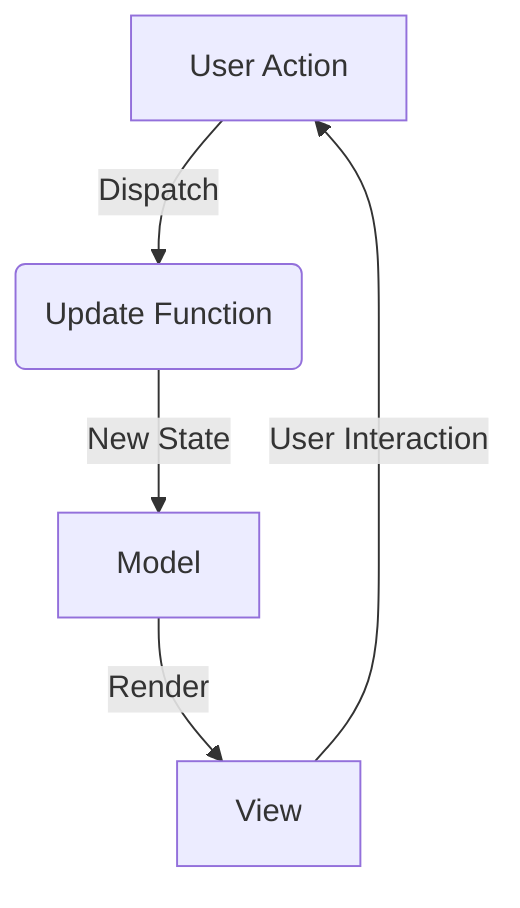
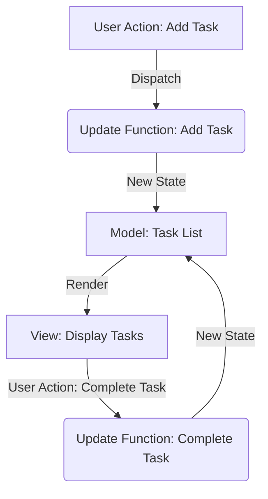

## 12.2 Model-View-Update (MVU) and Unidirectional Data Flow Patterns

In the realm of modern web development, the Model-View-Update (MVU) pattern, along with unidirectional data flow, has gained significant traction. These patterns, inspired by frameworks like Elm and Redux, offer a structured approach to managing state and rendering user interfaces. In this section, we will delve into the principles of unidirectional data flow, explore the MVU pattern, and demonstrate how to implement these concepts in Scala.js applications.

### Understanding Unidirectional Data Flow

Unidirectional data flow is a design principle that simplifies state management in applications by enforcing a single direction for data movement. This approach contrasts with traditional bidirectional data binding, where changes in the UI can directly affect the model and vice versa, often leading to complex and hard-to-debug code.

**Key Concepts of Unidirectional Data Flow:**

1. **Single Source of Truth:** The application state is maintained in a single, immutable data structure. This ensures consistency and predictability.

2. **State Changes Trigger Re-renders:** Whenever the state changes, the UI is re-rendered to reflect the new state. This is typically achieved through a virtual DOM or similar mechanism.

3. **Explicit State Transitions:** State changes are triggered by actions or events, which are dispatched to a central store or reducer that updates the state.

4. **Separation of Concerns:** The logic for updating the state is decoupled from the UI rendering logic, making the application easier to reason about and test.

### Introducing the Model-View-Update (MVU) Pattern

The MVU pattern, popularized by the Elm programming language, is a specific implementation of unidirectional data flow. It divides the application architecture into three core components:

1. **Model:** Represents the application state. It is immutable and can only be changed through updates.

2. **View:** A pure function that takes the model as input and returns a representation of the UI. In Scala.js, this could be a virtual DOM tree or a set of HTML elements.

3. **Update:** A function that takes the current model and an action (or message) and returns a new model. This function encapsulates the logic for state transitions.

#### Diagram: MVU Pattern Overview



**Description:** This diagram illustrates the flow of data in the MVU pattern. User actions are dispatched to the update function, which modifies the model. The view renders the model, and user interactions trigger further actions.

### Implementing MVU in Scala.js

Scala.js is a powerful tool that allows Scala developers to write client-side applications in Scala, which are then compiled to JavaScript. Implementing MVU in Scala.js involves leveraging Scala's functional programming capabilities to manage state and render the UI.

#### Setting Up a Scala.js Project

Before diving into the MVU implementation, let's set up a basic Scala.js project. Ensure you have [sbt](https://www.scala-sbt.org/) installed, as it is the build tool we will use.

1. **Create a New Scala.js Project:**

   ```bash
   sbt new scala/scala-seed.g8
   ```

2. **Configure sbt for Scala.js:**

   Modify the `build.sbt` file to include Scala.js settings:

   ```scala
   enablePlugins(ScalaJSPlugin)

   scalaVersion := "3.3.0"

   libraryDependencies += "org.scala-js" %%% "scalajs-dom" % "2.0.0"
   ```

3. **Run the Project:**

   Use the following sbt command to compile and run your Scala.js application:

   ```bash
   sbt fastOptJS
   ```

   This will generate JavaScript files that you can include in an HTML page.

#### Building the MVU Architecture

Now, let's implement the MVU pattern in our Scala.js project. We'll create a simple counter application to illustrate the concepts.

1. **Define the Model:**

   The model represents the state of the application. In this case, it's a simple integer representing the counter value.

   ```scala
   case class Model(counter: Int)
   ```

2. **Define Actions:**

   Actions represent the possible events that can occur in the application. For our counter, we have two actions: increment and decrement.

   ```scala
   sealed trait Action
   case object Increment extends Action
   case object Decrement extends Action
   ```

3. **Implement the Update Function:**

   The update function takes the current model and an action, returning a new model.

   ```scala
   def update(model: Model, action: Action): Model = action match {
     case Increment => model.copy(counter = model.counter + 1)
     case Decrement => model.copy(counter = model.counter - 1)
   }
   ```

4. **Create the View:**

   The view is a function that takes the model and returns a UI representation. We'll use Scala.js DOM to create HTML elements.

   ```scala
   import org.scalajs.dom
   import org.scalajs.dom.html

   def view(model: Model, dispatch: Action => Unit): html.Div = {
     val incrementButton = dom.document.createElement("button").asInstanceOf[html.Button]
     incrementButton.textContent = "Increment"
     incrementButton.onclick = (_: dom.MouseEvent) => dispatch(Increment)

     val decrementButton = dom.document.createElement("button").asInstanceOf[html.Button]
     decrementButton.textContent = "Decrement"
     decrementButton.onclick = (_: dom.MouseEvent) => dispatch(Decrement)

     val counterDisplay = dom.document.createElement("div").asInstanceOf[html.Div]
     counterDisplay.textContent = s"Counter: ${model.counter}"

     val container = dom.document.createElement("div").asInstanceOf[html.Div]
     container.appendChild(incrementButton)
     container.appendChild(decrementButton)
     container.appendChild(counterDisplay)

     container
   }
   ```

5. **Initialize the Application:**

   Finally, we need to initialize the application by setting up the initial model and rendering the view.

   ```scala
   def main(args: Array[String]): Unit = {
     var model = Model(0)

     def render(): Unit = {
       val root = dom.document.getElementById("app")
       root.innerHTML = "" // Clear previous content
       root.appendChild(view(model, action => {
         model = update(model, action)
         render()
       }))
     }

     render()
   }
   ```

### Patterns Inspired by Elm and Redux

Both Elm and Redux have influenced the development of unidirectional data flow patterns. Let's explore how these frameworks inspire Scala.js implementations.

#### Elm Architecture

Elm is a functional language for building web applications, and its architecture is the foundation of the MVU pattern. Elm enforces immutability and pure functions, ensuring that applications are predictable and easy to debug.

**Key Features of Elm:**

- **Immutability:** All data structures are immutable, preventing accidental state changes.
- **Type Safety:** Elm's strong type system catches errors at compile time.
- **Pure Functions:** All functions are pure, meaning they have no side effects.

Scala, with its functional programming capabilities, can emulate many of Elm's features, making it a suitable choice for implementing MVU.

#### Redux Architecture

Redux is a JavaScript library for managing application state, often used with React. It shares many similarities with Elm, particularly in its emphasis on a single source of truth and unidirectional data flow.

**Key Features of Redux:**

- **Centralized State Management:** All application state is stored in a single store.
- **Predictable State Changes:** State changes are handled by pure reducer functions.
- **Middleware Support:** Redux supports middleware for handling asynchronous actions and side effects.

Scala.js can leverage these concepts to create robust applications with clear state management.

### Design Considerations

When implementing MVU and unidirectional data flow patterns in Scala.js, consider the following:

1. **State Management:** Ensure that the application state is immutable and managed centrally. Use case classes and sealed traits to define state and actions.

2. **Performance:** Optimize rendering by minimizing unnecessary re-renders. Use virtual DOM libraries or efficient DOM manipulation techniques.

3. **Scalability:** As the application grows, consider modularizing the update function and view components to maintain readability and maintainability.

4. **Testing:** Write unit tests for the update function and view components to ensure correctness and prevent regressions.

### Differences and Similarities

While MVU, Elm, and Redux share common principles, there are key differences:

- **Elm vs. Redux:** Elm is a language with a built-in architecture, while Redux is a library that can be used with various JavaScript frameworks. Elm enforces stricter immutability and type safety.

- **MVU vs. Redux:** MVU is more of a pattern than a library, focusing on a simple cycle of model, view, and update. Redux offers additional features like middleware and devtools.

### Try It Yourself

To deepen your understanding, try modifying the counter application:

- **Add a Reset Button:** Implement an action and update logic to reset the counter to zero.
- **Display History:** Keep a history of counter values and display them in the view.
- **Asynchronous Actions:** Introduce a delay before incrementing or decrementing the counter.

### Visualizing MVU in Action

To further illustrate the MVU pattern, let's visualize the flow of data and interactions in a more complex application, such as a to-do list manager.

#### Diagram: MVU Flow in a To-Do List Application



**Description:** This diagram shows the flow of data in a to-do list application using the MVU pattern. User actions such as adding or completing tasks are dispatched to the update function, which modifies the model. The view renders the updated task list, and user interactions continue the cycle.

### References and Links

For further reading on MVU and unidirectional data flow patterns, consider the following resources:

- [Elm Official Website](https://elm-lang.org/)
- [Redux Documentation](https://redux.js.org/)
- [Scala.js Documentation](https://www.scala-js.org/)

### Knowledge Check

To reinforce your understanding, consider the following questions:

1. What are the key components of the MVU pattern?
2. How does unidirectional data flow differ from traditional bidirectional data binding?
3. What are the benefits of using immutable data structures in MVU?
4. How can you optimize rendering in a Scala.js application using MVU?
5. What are some common challenges when implementing MVU in large applications?

### Embrace the Journey

Remember, mastering MVU and unidirectional data flow patterns is a journey. As you experiment with these concepts, you'll gain a deeper understanding of state management and UI rendering. Keep exploring, stay curious, and enjoy the process!

## Quiz Time!



### What is the primary benefit of unidirectional data flow?

- [x] Simplifies state management by enforcing a single direction for data movement.
- [ ] Allows for bidirectional data binding between the model and view.
- [ ] Increases the complexity of state transitions.
- [ ] Requires more code to implement than traditional patterns.

> **Explanation:** Unidirectional data flow simplifies state management by enforcing a single direction for data movement, making applications more predictable and easier to debug.

### Which component of the MVU pattern is responsible for rendering the UI?

- [ ] Model
- [x] View
- [ ] Update
- [ ] Action

> **Explanation:** The View component is responsible for rendering the UI based on the current state of the Model.

### How does the update function in MVU modify the application state?

- [x] By taking the current model and an action, returning a new model.
- [ ] By directly modifying the model.
- [ ] By dispatching actions to the view.
- [ ] By rendering the UI.

> **Explanation:** The update function takes the current model and an action, returning a new model, which represents the updated state.

### What is a key difference between Elm and Redux?

- [x] Elm is a language with a built-in architecture, while Redux is a library.
- [ ] Redux enforces stricter immutability than Elm.
- [ ] Elm supports middleware, while Redux does not.
- [ ] Redux is used exclusively with React.

> **Explanation:** Elm is a language with a built-in architecture, while Redux is a library that can be used with various JavaScript frameworks.

### What is the role of actions in the MVU pattern?

- [x] Represent events that can occur in the application.
- [ ] Directly modify the model.
- [ ] Render the UI.
- [ ] Manage application state.

> **Explanation:** Actions represent events that can occur in the application, triggering state transitions through the update function.

### How can you test the update function in an MVU application?

- [x] By writing unit tests to ensure correctness of state transitions.
- [ ] By directly modifying the model in the view.
- [ ] By rendering the UI and checking for errors.
- [ ] By dispatching actions to the view.

> **Explanation:** You can write unit tests for the update function to ensure the correctness of state transitions and prevent regressions.

### What is a common challenge when implementing MVU in large applications?

- [x] Managing the complexity of state and actions.
- [ ] Rendering the UI efficiently.
- [ ] Writing unit tests for the view.
- [ ] Dispatching actions to the model.

> **Explanation:** Managing the complexity of state and actions can be challenging in large applications, requiring careful design and modularization.

### How does Scala.js facilitate the implementation of MVU?

- [x] By allowing Scala developers to write client-side applications in Scala.
- [ ] By providing a built-in virtual DOM library.
- [ ] By enforcing bidirectional data binding.
- [ ] By supporting middleware for asynchronous actions.

> **Explanation:** Scala.js allows Scala developers to write client-side applications in Scala, which are then compiled to JavaScript, facilitating the implementation of MVU.

### What is the purpose of the view function in MVU?

- [x] To take the model and return a representation of the UI.
- [ ] To modify the application state.
- [ ] To dispatch actions to the update function.
- [ ] To manage application state.

> **Explanation:** The view function takes the model and returns a representation of the UI, rendering the current state.

### True or False: In MVU, the model can be directly modified by the view.

- [ ] True
- [x] False

> **Explanation:** False. In MVU, the model is immutable and can only be modified through the update function, ensuring predictable state transitions.


