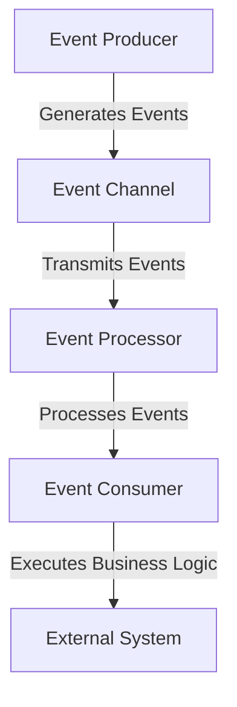

## 12.3 Event-Driven Architecture

Event-Driven Architecture (EDA) is a powerful architectural pattern that enables systems to react to events in real-time. This approach is particularly well-suited for applications that require high scalability, responsiveness, and decoupled components. In this section, we will explore the concepts of EDA, its implementation using Scala and Akka, and how it can be leveraged to build robust and efficient systems.

### Introduction to Event-Driven Architecture

**Event-Driven Architecture** is a design paradigm in which the flow of the program is determined by events. These events can be user actions, sensor outputs, or messages from other programs. EDA is characterized by the production, detection, consumption, and reaction to events.

#### Key Concepts

- **Event**: A significant change in state. Events are immutable facts that are recorded and can trigger further processing.
- **Event Producers**: Components that generate events. They are responsible for detecting changes and creating corresponding events.
- **Event Consumers**: Components that react to events. They subscribe to events and execute business logic in response.
- **Event Channels**: The medium through which events are transmitted from producers to consumers. This can be a message broker, a queue, or a direct method call.
- **Event Processors**: Intermediate components that transform, filter, or enrich events before they reach consumers.

#### Benefits of Event-Driven Architecture

- **Scalability**: EDA allows systems to scale horizontally by distributing event processing across multiple nodes.
- **Decoupling**: Components are loosely coupled, enabling independent development and deployment.
- **Responsiveness**: Systems can react to events in real-time, providing timely responses to users.
- **Flexibility**: New event producers and consumers can be added without affecting existing components.

### Implementing Event-Driven Systems with Akka

Akka is a powerful toolkit for building concurrent, distributed, and fault-tolerant systems in Scala. It provides a robust foundation for implementing event-driven architectures through its actor model.

#### The Actor Model

The actor model is a conceptual model that treats "actors" as the fundamental units of computation. Actors are objects that encapsulate state and behavior, communicate through message passing, and can create other actors.

##### Key Features of the Actor Model

- **Isolation**: Actors are isolated from each other and communicate only through messages, preventing shared state issues.
- **Concurrency**: Actors process messages asynchronously, allowing for concurrent execution.
- **Supervision**: Actors can monitor and manage the lifecycle of other actors, providing fault tolerance.

#### Setting Up Akka in Scala

To get started with Akka, you need to include the Akka library in your Scala project. Here's a simple build configuration using SBT:

```scala
libraryDependencies += "com.typesafe.akka" %% "akka-actor-typed" % "2.6.18"
```

#### Creating Actors in Akka

Let's create a simple actor that processes events. We'll define an `EventProcessor` actor that listens for `Event` messages and processes them.

```scala
import akka.actor.typed.{ActorSystem, Behavior}
import akka.actor.typed.scaladsl.Behaviors

// Define the Event message
final case class Event(data: String)

// Define the EventProcessor actor
object EventProcessor {
  def apply(): Behavior[Event] = Behaviors.receive { (context, message) =>
    context.log.info(s"Processing event with data: ${message.data}")
    Behaviors.same
  }
}

// Create the ActorSystem and spawn the EventProcessor actor
object EventDrivenApp extends App {
  val system: ActorSystem[Event] = ActorSystem(EventProcessor(), "event-driven-system")

  // Send an event to the EventProcessor actor
  system ! Event("Sample Event Data")
}
```

In this example, we define an `Event` case class to represent events. The `EventProcessor` actor logs the event data when it receives an `Event` message. The `ActorSystem` is used to create and manage the lifecycle of actors.

#### Handling Event Streams with Akka Streams

Akka Streams is an extension of Akka that provides a powerful API for handling streams of data. It is particularly useful for processing event streams in an event-driven architecture.

##### Setting Up Akka Streams

To use Akka Streams, add the following dependency to your build configuration:

```scala
libraryDependencies += "com.typesafe.akka" %% "akka-stream" % "2.6.18"
```

##### Processing Event Streams

Let's create a simple stream that processes a sequence of events.

```scala
import akka.actor.ActorSystem
import akka.stream.scaladsl.{Sink, Source}
import akka.stream.{ActorMaterializer, Materializer}

object EventStreamApp extends App {
  implicit val system: ActorSystem = ActorSystem("event-stream-system")
  implicit val materializer: Materializer = ActorMaterializer()

  // Create a source of events
  val events = List(Event("Event 1"), Event("Event 2"), Event("Event 3"))
  val eventSource = Source(events)

  // Define a sink that logs each event
  val eventSink = Sink.foreach[Event](event => println(s"Processing event: ${event.data}"))

  // Connect the source to the sink and run the stream
  eventSource.runWith(eventSink)
}
```

In this example, we create a `Source` of events and a `Sink` that logs each event. The `runWith` method connects the source to the sink and starts processing the stream.

### Designing Event-Driven Systems

Designing an event-driven system involves several considerations, including event modeling, event storage, and event processing.

#### Event Modeling

Event modeling is the process of defining the events that your system will produce and consume. It involves identifying the key events that drive your business processes and designing their structure.

##### Tips for Event Modeling

- **Identify Business Events**: Focus on events that represent significant changes in your business domain.
- **Use Descriptive Names**: Name events clearly to convey their purpose and context.
- **Define Event Schemas**: Specify the structure and data types for each event to ensure consistency.

#### Event Storage

Event storage involves persisting events for later retrieval and analysis. This is crucial for event sourcing, a pattern where the state of a system is derived from a sequence of events.

##### Choosing an Event Store

- **Relational Databases**: Use a relational database for simple event storage needs. Ensure that events are stored in a normalized format.
- **NoSQL Databases**: Consider NoSQL databases like Apache Cassandra for high-volume event storage with horizontal scalability.
- **Event Stores**: Use specialized event stores like EventStoreDB for advanced event sourcing capabilities.

#### Event Processing

Event processing involves consuming and reacting to events in real-time. This can be achieved using event processors, which are components that subscribe to events and execute business logic.

##### Types of Event Processing

- **Simple Event Processing**: Process each event independently, without considering the context of other events.
- **Complex Event Processing**: Analyze patterns and correlations across multiple events to derive insights.

### Visualizing Event-Driven Architecture

To better understand the flow of events in an event-driven architecture, let's visualize the components and their interactions using a Mermaid.js diagram.



**Diagram Description**: This diagram illustrates the flow of events from the event producer to the event consumer. Events are generated by the producer, transmitted through the event channel, processed by the event processor, and consumed by the event consumer, which executes business logic and interacts with external systems.

### Advanced Topics in Event-Driven Architecture

#### Event Sourcing

Event sourcing is a pattern where the state of a system is derived from a sequence of events. Instead of storing the current state, you store a log of all events that have occurred. This allows you to reconstruct the state at any point in time.

##### Benefits of Event Sourcing

- **Auditability**: Maintain a complete history of changes for auditing and compliance.
- **Reproducibility**: Reconstruct the state of the system at any point in time for debugging or analysis.
- **Scalability**: Distribute event processing across multiple nodes for horizontal scalability.

##### Implementing Event Sourcing in Scala

To implement event sourcing, you can use Akka Persistence, a module that provides event sourcing capabilities for Akka actors.

```scala
import akka.actor.typed.scaladsl.Behaviors
import akka.persistence.typed.PersistenceId
import akka.persistence.typed.scaladsl.{Effect, EventSourcedBehavior}

// Define the state of the system
final case class State(events: List[Event])

// Define the commands that the actor can handle
sealed trait Command
final case class AddEvent(event: Event) extends Command

// Define the events that can occur
sealed trait DomainEvent
final case class EventAdded(event: Event) extends DomainEvent

// Define the EventSourcedBehavior
object EventSourcedProcessor {
  def apply(persistenceId: PersistenceId): EventSourcedBehavior[Command, DomainEvent, State] = {
    EventSourcedBehavior[Command, DomainEvent, State](
      persistenceId = persistenceId,
      emptyState = State(Nil),
      commandHandler = (state, command) => command match {
        case AddEvent(event) => Effect.persist(EventAdded(event))
      },
      eventHandler = (state, event) => event match {
        case EventAdded(event) => state.copy(events = event :: state.events)
      }
    )
  }
}
```

In this example, we define an `EventSourcedBehavior` that persists `EventAdded` events and updates the state of the system. The `PersistenceId` is used to uniquely identify the actor's state.

#### CQRS (Command Query Responsibility Segregation)

CQRS is a pattern that separates the responsibility of handling commands (write operations) from queries (read operations). This allows for optimized data models and scalability.

##### Benefits of CQRS

- **Scalability**: Scale read and write operations independently.
- **Performance**: Optimize data models for specific use cases, improving performance.
- **Flexibility**: Evolve the read and write models independently.

##### Implementing CQRS in Scala

To implement CQRS, you can use Akka Persistence for command handling and Akka Streams for query processing.

```scala
import akka.actor.typed.scaladsl.Behaviors
import akka.persistence.typed.PersistenceId
import akka.persistence.typed.scaladsl.{Effect, EventSourcedBehavior}
import akka.stream.scaladsl.{Sink, Source}
import akka.stream.{ActorMaterializer, Materializer}

// Define the state of the system
final case class State(events: List[Event])

// Define the commands that the actor can handle
sealed trait Command
final case class AddEvent(event: Event) extends Command

// Define the events that can occur
sealed trait DomainEvent
final case class EventAdded(event: Event) extends DomainEvent

// Define the EventSourcedBehavior for command handling
object CommandHandler {
  def apply(persistenceId: PersistenceId): EventSourcedBehavior[Command, DomainEvent, State] = {
    EventSourcedBehavior[Command, DomainEvent, State](
      persistenceId = persistenceId,
      emptyState = State(Nil),
      commandHandler = (state, command) => command match {
        case AddEvent(event) => Effect.persist(EventAdded(event))
      },
      eventHandler = (state, event) => event match {
        case EventAdded(event) => state.copy(events = event :: state.events)
      }
    )
  }
}

// Define the query processing logic
object QueryProcessor {
  def processQueries(events: List[Event]): Unit = {
    implicit val system: ActorSystem = ActorSystem("query-processor-system")
    implicit val materializer: Materializer = ActorMaterializer()

    val eventSource = Source(events)
    val eventSink = Sink.foreach[Event](event => println(s"Querying event: ${event.data}"))

    eventSource.runWith(eventSink)
  }
}
```

In this example, we define a `CommandHandler` actor that persists events using Akka Persistence and a `QueryProcessor` that processes events using Akka Streams.

### Design Considerations for Event-Driven Architecture

When designing an event-driven architecture, there are several considerations to keep in mind:

#### Event Granularity

Determine the appropriate level of granularity for your events. Fine-grained events provide more detail but can increase complexity and overhead. Coarse-grained events are simpler but may lack necessary detail.

#### Event Ordering

Ensure that events are processed in the correct order, especially when the order of events affects the outcome. Use sequence numbers or timestamps to maintain order.

#### Event Consistency

Maintain consistency across distributed systems by ensuring that events are delivered and processed reliably. Consider using distributed consensus algorithms like Raft or Paxos for consistency.

#### Error Handling

Implement robust error handling mechanisms to manage failures in event processing. Use retries, dead-letter queues, and circuit breakers to handle errors gracefully.

### Differences and Similarities with Other Patterns

Event-driven architecture shares similarities with other patterns, such as:

- **Observer Pattern**: Both involve reacting to events, but EDA is more focused on decoupling and scalability.
- **Publish-Subscribe Pattern**: EDA can be implemented using publish-subscribe mechanisms, but it encompasses a broader set of concepts and practices.

### Try It Yourself

To deepen your understanding of event-driven architecture, try modifying the code examples provided:

- **Experiment with Different Event Types**: Create new event types and modify the event processors to handle them.
- **Implement Event Filtering**: Add logic to filter events based on specific criteria before processing them.
- **Simulate Event Failures**: Introduce errors in event processing and implement error handling mechanisms to recover from failures.

### Conclusion

Event-Driven Architecture is a powerful pattern for building scalable, responsive, and decoupled systems. By leveraging Scala and Akka, you can implement robust event-driven systems that efficiently handle events and provide real-time responses. As you continue to explore EDA, remember to experiment, iterate, and refine your designs to meet the unique needs of your applications.

---

## Quiz Time!



### What is a key benefit of Event-Driven Architecture?

- [x] Scalability
- [ ] Simplicity
- [ ] Centralized control
- [ ] Reduced latency

> **Explanation:** Scalability is a key benefit of Event-Driven Architecture, as it allows systems to scale horizontally by distributing event processing across multiple nodes.

### Which component in EDA is responsible for generating events?

- [x] Event Producer
- [ ] Event Consumer
- [ ] Event Channel
- [ ] Event Processor

> **Explanation:** Event Producers are responsible for generating events in an Event-Driven Architecture.

### What is the primary communication mechanism between actors in Akka?

- [x] Message Passing
- [ ] Shared Memory
- [ ] Sockets
- [ ] Remote Procedure Calls

> **Explanation:** In Akka, actors communicate primarily through message passing, which ensures isolation and concurrency.

### What is the purpose of Akka Streams in an event-driven system?

- [x] To handle streams of data
- [ ] To manage actor lifecycles
- [ ] To provide logging capabilities
- [ ] To enforce security policies

> **Explanation:** Akka Streams is used to handle streams of data, making it ideal for processing event streams in an event-driven system.

### What is a key feature of the actor model?

- [x] Isolation
- [ ] Shared State
- [ ] Centralized Control
- [ ] Synchronous Execution

> **Explanation:** Isolation is a key feature of the actor model, as actors are isolated from each other and communicate only through messages.

### What is event sourcing?

- [x] A pattern where the state of a system is derived from a sequence of events
- [ ] A method for storing events in a database
- [ ] A technique for optimizing event processing
- [ ] A strategy for reducing event latency

> **Explanation:** Event sourcing is a pattern where the state of a system is derived from a sequence of events, allowing for auditability and reproducibility.

### What is CQRS?

- [x] Command Query Responsibility Segregation
- [ ] Centralized Query Response System
- [ ] Concurrent Query Routing System
- [ ] Command Queue Routing Strategy

> **Explanation:** CQRS stands for Command Query Responsibility Segregation, a pattern that separates the responsibility of handling commands from queries.

### What is a common use case for event-driven architecture?

- [x] Real-time data processing
- [ ] Batch processing
- [ ] Static website hosting
- [ ] File storage

> **Explanation:** Event-driven architecture is commonly used for real-time data processing, where systems need to react to events as they occur.

### Which Akka module provides event sourcing capabilities?

- [x] Akka Persistence
- [ ] Akka Streams
- [ ] Akka HTTP
- [ ] Akka Cluster

> **Explanation:** Akka Persistence provides event sourcing capabilities for Akka actors.

### True or False: Event-Driven Architecture is suitable for systems that require tight coupling between components.

- [ ] True
- [x] False

> **Explanation:** False. Event-Driven Architecture is suitable for systems that require loose coupling between components, allowing for independent development and deployment.


