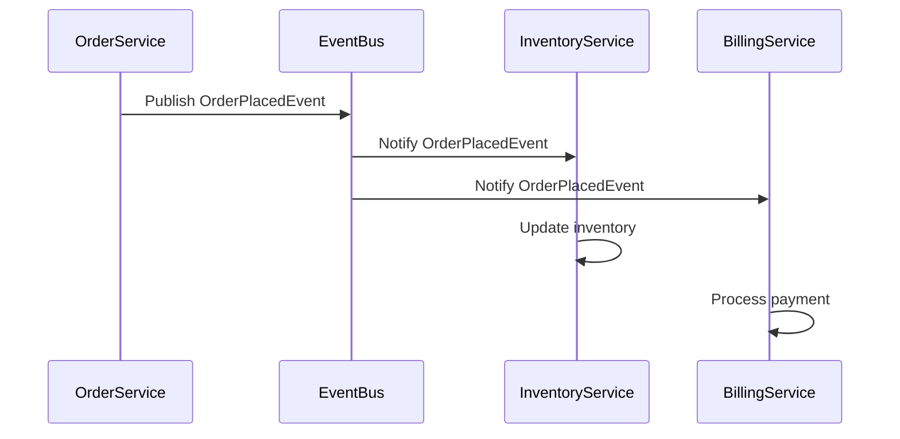

## 12.4 Domain Event Pattern

In the realm of software architecture, the Domain Event Pattern is a pivotal concept, particularly in the context of Domain-Driven Design (DDD). It facilitates communication between different parts of a system by capturing and disseminating changes in the domain. This pattern is especially useful in complex systems where different bounded contexts need to interact seamlessly. In this section, we will delve into the intricacies of the Domain Event Pattern, focusing on its implementation in Scala.

### Understanding Domain Events

**Domain Events** are significant occurrences within a domain that are worth capturing and communicating. They represent changes in the state of a domain entity and are used to notify other parts of the system about these changes. Domain events are immutable and should contain all the necessary information to describe the change.

#### Key Characteristics of Domain Events

- **Immutability**: Once a domain event is created, it should not be modified. This ensures consistency and reliability.
- **Descriptive**: A domain event should clearly describe what happened in the domain, including relevant data.
- **Temporal**: Events are time-stamped to provide a chronological order of occurrences.
- **Serializable**: Events should be serializable to facilitate storage and transmission across different systems.

### The Role of Domain Events in Bounded Contexts

In DDD, a **bounded context** is a logical boundary within which a particular domain model is defined and applicable. Domain events play a crucial role in enabling communication between these bounded contexts. They allow different parts of a system to remain decoupled while still being able to react to changes in other contexts.

#### Handling Events in Different Bounded Contexts

When a domain event occurs, it may be relevant to multiple bounded contexts. Handling these events involves:

- **Publishing Events**: The context where the event originates publishes it to a message broker or event bus.
- **Subscribing to Events**: Other contexts subscribe to relevant events and react accordingly.
- **Processing Events**: Each context processes the event based on its own domain logic.

### Implementing Domain Events in Scala

Scala, with its functional programming capabilities and strong type system, provides an excellent platform for implementing domain events. Let's explore how to define, publish, and handle domain events in Scala.

#### Defining Domain Events

In Scala, domain events are typically represented as case classes. This allows us to leverage Scala's pattern matching and immutability features.

```scala
// Define a domain event
case class OrderPlacedEvent(orderId: String, customerId: String, amount: Double, timestamp: Long)
```

#### Publishing Domain Events

Publishing domain events involves sending the event to a message broker or event bus. In Scala, this can be achieved using libraries like Akka or Kafka.

```scala
// Using Akka to publish an event
import akka.actor.ActorSystem
import akka.event.{EventBus, LookupClassification}

class OrderEventBus extends EventBus with LookupClassification {
  type Event = OrderPlacedEvent
  type Classifier = String
  type Subscriber = OrderPlacedEvent => Unit

  override protected def mapSize(): Int = 128

  override protected def classify(event: Event): Classifier = event.orderId

  override protected def publish(event: Event, subscriber: Subscriber): Unit = subscriber(event)
}

val system = ActorSystem("OrderSystem")
val orderEventBus = new OrderEventBus

orderEventBus.subscribe(event => println(s"Order placed: $event"), "order-123")
orderEventBus.publish(OrderPlacedEvent("order-123", "customer-456", 99.99, System.currentTimeMillis()))
```

#### Handling Domain Events

Handling domain events involves subscribing to the event bus and processing the events as they arrive. This can be done using Akka actors or reactive streams.

```scala
// Using Akka actors to handle events
import akka.actor.{Actor, Props}

class OrderEventHandler extends Actor {
  def receive: Receive = {
    case event: OrderPlacedEvent =>
      println(s"Handling order placed event: $event")
      // Add domain-specific logic here
  }
}

val orderEventHandler = system.actorOf(Props[OrderEventHandler], "orderEventHandler")
orderEventBus.subscribe(orderEventHandler ! _, "order-123")
```

### Visualizing Domain Events in Bounded Contexts

To better understand how domain events facilitate communication between bounded contexts, let's visualize the process using a sequence diagram.



**Figure 1**: This diagram illustrates how an `OrderPlacedEvent` is published by the `OrderService` and consumed by both the `InventoryService` and `BillingService`.

### Design Considerations for Domain Events

When implementing domain events, consider the following:

- **Event Granularity**: Determine the level of detail each event should contain. Too much detail can lead to bloated events, while too little can make them less useful.
- **Event Versioning**: As your domain evolves, so will your events. Implement versioning to handle changes in event structure.
- **Event Storage**: Decide whether to store events for auditing or replay purposes. This can be done using event sourcing techniques.
- **Error Handling**: Implement robust error handling to manage failures in event processing.

### Differences and Similarities with Other Patterns

The Domain Event Pattern is often compared to the **Observer Pattern**. While both involve notifying interested parties about changes, domain events are typically more decoupled and asynchronous, making them suitable for distributed systems.

#### Similarities

- Both patterns involve notifying subscribers about changes.
- Both can be used to decouple components.

#### Differences

- Domain events are usually asynchronous and can be persisted, while the Observer Pattern is often synchronous and in-memory.
- Domain events are more suitable for distributed systems, whereas the Observer Pattern is typically used within a single application.

### Try It Yourself

To deepen your understanding of domain events, try modifying the code examples provided:

1. **Add a New Domain Event**: Define a new event, such as `OrderCancelledEvent`, and implement the logic to handle it.
2. **Integrate with Kafka**: Replace the Akka event bus with Kafka for event publishing and handling.
3. **Implement Event Sourcing**: Store events in a database and implement logic to replay them to reconstruct the state of the system.

### Knowledge Check

- **What are the key characteristics of domain events?**
- **How do domain events facilitate communication between bounded contexts?**
- **What are some design considerations when implementing domain events?**

### Conclusion

The Domain Event Pattern is a powerful tool in the software architect's toolkit, particularly in the context of Domain-Driven Design. By capturing and disseminating significant changes within a domain, domain events enable decoupled communication between different parts of a system. Scala's functional programming capabilities and strong type system make it an excellent choice for implementing domain events, allowing developers to build robust and scalable systems.

Remember, mastering domain events is a journey. As you progress, you'll gain deeper insights into how to leverage this pattern to build more complex and interactive systems. Keep experimenting, stay curious, and enjoy the journey!

## Quiz Time!



### What is a key characteristic of domain events?

- [x] Immutability
- [ ] Mutability
- [ ] Volatility
- [ ] Transience

> **Explanation:** Domain events are immutable, meaning they cannot be changed once created. This ensures consistency and reliability.

### How do domain events facilitate communication between bounded contexts?

- [x] By publishing events to a message broker or event bus
- [ ] By directly calling methods in other contexts
- [ ] By sharing global variables
- [ ] By using synchronous function calls

> **Explanation:** Domain events are published to a message broker or event bus, allowing different bounded contexts to subscribe and react to these events asynchronously.

### What is a design consideration when implementing domain events?

- [x] Event Granularity
- [ ] Event Volatility
- [ ] Event Transience
- [ ] Event Mutability

> **Explanation:** Event granularity is important to determine the level of detail each event should contain, balancing between too much and too little information.

### Which pattern is often compared to the Domain Event Pattern?

- [x] Observer Pattern
- [ ] Singleton Pattern
- [ ] Factory Pattern
- [ ] Strategy Pattern

> **Explanation:** The Domain Event Pattern is often compared to the Observer Pattern, as both involve notifying interested parties about changes.

### What is a difference between domain events and the Observer Pattern?

- [x] Domain events are typically asynchronous
- [ ] Domain events are typically synchronous
- [ ] The Observer Pattern is typically asynchronous
- [ ] The Observer Pattern involves event persistence

> **Explanation:** Domain events are typically asynchronous and can be persisted, whereas the Observer Pattern is often synchronous and in-memory.

### What should domain events contain?

- [x] All necessary information to describe the change
- [ ] Only the event type
- [ ] Only the timestamp
- [ ] Only the event source

> **Explanation:** Domain events should contain all necessary information to describe the change, making them descriptive and useful.

### What is a benefit of using domain events?

- [x] Decoupled communication between system parts
- [ ] Increased coupling between system parts
- [ ] Reduced system scalability
- [ ] Increased system complexity

> **Explanation:** Domain events enable decoupled communication between different parts of a system, promoting scalability and flexibility.

### How can domain events be stored for future use?

- [x] Using event sourcing techniques
- [ ] Using global variables
- [ ] Using temporary files
- [ ] Using in-memory storage

> **Explanation:** Domain events can be stored using event sourcing techniques, allowing them to be replayed to reconstruct the state of the system.

### What is a common tool for publishing domain events in Scala?

- [x] Akka
- [ ] Spring
- [ ] Django
- [ ] Laravel

> **Explanation:** Akka is a common tool used in Scala for publishing domain events, leveraging its actor model and event bus capabilities.

### Domain events are more suitable for which type of systems?

- [x] Distributed systems
- [ ] Monolithic systems
- [ ] Single-threaded systems
- [ ] In-memory systems

> **Explanation:** Domain events are more suitable for distributed systems due to their asynchronous nature and ability to be persisted.


