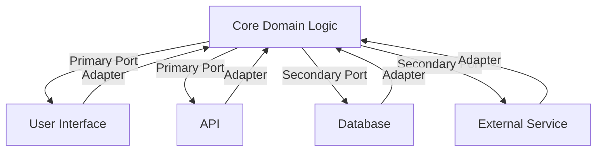

## 12.5 Hexagonal Architecture (Ports and Adapters)

Hexagonal Architecture, also known as Ports and Adapters, is a design pattern that aims to decouple the core logic of an application from its external dependencies, such as databases, user interfaces, and third-party services. This separation enhances testability, maintainability, and flexibility, allowing the core application logic to remain unaffected by changes in external systems. Let's delve into the details of this architectural pattern and explore how it can be effectively implemented in Scala.

### Understanding Hexagonal Architecture

Hexagonal Architecture was introduced by Alistair Cockburn in 2005. The primary goal of this architecture is to create a system that is adaptable to change by isolating the core business logic from external factors. This is achieved by defining clear boundaries between the core logic and the outside world through the use of ports and adapters.

#### Key Concepts

1. **Core Domain Logic**: This is the heart of the application, containing the business rules and logic. It is independent of any external systems and should remain unchanged regardless of how the application is used or deployed.

2. **Ports**: Ports are interfaces that define how the core logic interacts with the outside world. They act as entry and exit points for data, allowing the core logic to remain agnostic of the external systems.

3. **Adapters**: Adapters are implementations of the ports that connect the core logic to external systems. They translate the data and operations between the core logic and the external systems.

4. **Primary and Secondary Ports**: Primary ports are used to drive the application, typically representing use cases or services. Secondary ports are used by the application to access external systems, such as databases or messaging systems.

#### Visualizing Hexagonal Architecture

Below is a diagram representing the Hexagonal Architecture. The core logic is at the center, surrounded by ports, with adapters connecting to external systems.



**Diagram Description**: The diagram illustrates the core domain logic at the center, surrounded by primary and secondary ports. Adapters connect these ports to external systems like user interfaces, APIs, databases, and external services.

### Implementing Hexagonal Architecture in Scala

Scala, with its functional programming capabilities and strong type system, is well-suited for implementing Hexagonal Architecture. Let's explore how to structure a Scala application using this pattern.

#### Step 1: Define the Core Domain Logic

The core domain logic should be independent of any external systems. It should focus solely on the business rules and logic.

```scala
// Core domain logic
trait OrderService {
  def placeOrder(order: Order): Either[OrderError, OrderConfirmation]
}

case class Order(id: String, items: List[Item], total: Double)
case class OrderConfirmation(orderId: String, status: String)
sealed trait OrderError
case object InvalidOrder extends OrderError
```

**Explanation**: Here, we define a trait `OrderService` that represents a primary port. It contains a method `placeOrder` which takes an `Order` and returns either an `OrderError` or an `OrderConfirmation`.

#### Step 2: Define Ports

Ports are interfaces that the core logic uses to interact with the outside world. They should be defined in terms of the core domain logic.

```scala
// Primary port for order processing
trait OrderProcessor {
  def process(order: Order): Either[OrderError, OrderConfirmation]
}

// Secondary port for database access
trait OrderRepository {
  def save(order: Order): Either[OrderError, Unit]
  def find(orderId: String): Option[Order]
}
```

**Explanation**: We define two ports: `OrderProcessor` as a primary port for processing orders, and `OrderRepository` as a secondary port for database access.

#### Step 3: Implement Adapters

Adapters are responsible for connecting the core logic to external systems. They implement the ports and handle the translation between the core logic and external systems.

```scala
// Adapter for order processing
class OrderProcessorAdapter(orderRepository: OrderRepository) extends OrderProcessor {
  override def process(order: Order): Either[OrderError, OrderConfirmation] = {
    if (order.items.isEmpty) {
      Left(InvalidOrder)
    } else {
      orderRepository.save(order).map(_ => OrderConfirmation(order.id, "Processed"))
    }
  }
}

// Adapter for database access
class InMemoryOrderRepository extends OrderRepository {
  private var orders: Map[String, Order] = Map.empty

  override def save(order: Order): Either[OrderError, Unit] = {
    orders += (order.id -> order)
    Right(())
  }

  override def find(orderId: String): Option[Order] = orders.get(orderId)
}
```

**Explanation**: The `OrderProcessorAdapter` implements the `OrderProcessor` port and uses the `OrderRepository` to save orders. The `InMemoryOrderRepository` is a simple adapter for database access, storing orders in memory.

#### Step 4: Assemble the Application

Finally, we assemble the application by wiring the core logic, ports, and adapters together.

```scala
object Application extends App {
  val orderRepository = new InMemoryOrderRepository
  val orderProcessor = new OrderProcessorAdapter(orderRepository)

  val order = Order("1", List(Item("item1", 10.0)), 10.0)
  val result = orderProcessor.process(order)

  result match {
    case Right(confirmation) => println(s"Order processed: ${confirmation.status}")
    case Left(error) => println(s"Failed to process order: $error")
  }
}
```

**Explanation**: In the `Application` object, we create instances of the adapters and use them to process an order. The result is printed to the console.

### Design Considerations

When implementing Hexagonal Architecture, consider the following:

- **Testability**: By decoupling the core logic from external systems, you can easily test the core logic in isolation. Use mock implementations of ports for unit testing.

- **Flexibility**: The architecture allows you to change external systems without affecting the core logic. For example, you can switch from an in-memory database to a relational database by simply replacing the adapter.

- **Complexity**: While Hexagonal Architecture provides many benefits, it can introduce complexity due to the increased number of interfaces and classes. Ensure that the added complexity is justified by the benefits.

- **Performance**: Consider the performance implications of using adapters, especially if they introduce additional layers of abstraction.

### Differences and Similarities with Other Patterns

Hexagonal Architecture shares similarities with other architectural patterns, such as:

- **Layered Architecture**: Both patterns aim to separate concerns, but Hexagonal Architecture emphasizes the independence of the core logic from external systems, while Layered Architecture focuses on organizing code into layers.

- **Microservices Architecture**: Both patterns promote modularity and independence, but Microservices Architecture focuses on deploying independent services, while Hexagonal Architecture can be applied within a single application.

### Try It Yourself

Experiment with the provided code examples by:

- Modifying the `OrderRepository` to use a different storage mechanism, such as a file or a database.
- Adding new features to the `OrderService`, such as order cancellation or order tracking.
- Implementing additional adapters for different external systems, such as a messaging system or a third-party API.

### Knowledge Check

- How does Hexagonal Architecture enhance testability?
- What are the roles of ports and adapters in Hexagonal Architecture?
- How can you modify the architecture to support additional external systems?

### Conclusion

Hexagonal Architecture is a powerful pattern for decoupling core logic from external concerns, enhancing testability, maintainability, and flexibility. By implementing this architecture in Scala, you can create robust and adaptable applications that are easy to test and maintain. Remember, this is just the beginning. As you progress, you'll build more complex and interactive applications. Keep experimenting, stay curious, and enjoy the journey!

## Quiz Time!



### What is the primary goal of Hexagonal Architecture?

- [x] To decouple core logic from external systems
- [ ] To enhance user interface design
- [ ] To improve database performance
- [ ] To simplify network communication

> **Explanation:** Hexagonal Architecture aims to decouple the core logic from external systems, enhancing testability and maintainability.

### What are ports in Hexagonal Architecture?

- [x] Interfaces that define interactions with the outside world
- [ ] Implementations of core logic
- [ ] External systems like databases
- [ ] User interfaces

> **Explanation:** Ports are interfaces that define how the core logic interacts with external systems.

### What is the role of adapters in Hexagonal Architecture?

- [x] To connect the core logic to external systems
- [ ] To define business rules
- [ ] To manage user sessions
- [ ] To store application data

> **Explanation:** Adapters implement ports and connect the core logic to external systems.

### Which of the following is a primary port?

- [x] OrderProcessor
- [ ] OrderRepository
- [ ] InMemoryOrderRepository
- [ ] OrderConfirmation

> **Explanation:** `OrderProcessor` is a primary port that represents a use case or service.

### How does Hexagonal Architecture improve testability?

- [x] By allowing core logic to be tested in isolation
- [ ] By simplifying user interfaces
- [ ] By reducing database queries
- [ ] By enhancing network protocols

> **Explanation:** Hexagonal Architecture decouples core logic from external systems, allowing it to be tested independently.

### What is a secondary port in Hexagonal Architecture?

- [x] An interface for accessing external systems
- [ ] A user interface component
- [ ] A business rule definition
- [ ] A network protocol

> **Explanation:** Secondary ports are used by the application to access external systems.

### Which of the following is an example of an adapter?

- [x] InMemoryOrderRepository
- [ ] OrderProcessor
- [ ] Order
- [ ] OrderConfirmation

> **Explanation:** `InMemoryOrderRepository` is an adapter that implements the `OrderRepository` port.

### What is a potential drawback of Hexagonal Architecture?

- [x] Increased complexity due to more interfaces and classes
- [ ] Reduced performance in user interfaces
- [ ] Difficulty in implementing business rules
- [ ] Limited scalability

> **Explanation:** Hexagonal Architecture can introduce complexity due to the increased number of interfaces and classes.

### How can you switch from an in-memory database to a relational database in Hexagonal Architecture?

- [x] By replacing the adapter
- [ ] By modifying the core logic
- [ ] By changing the user interface
- [ ] By updating the network protocol

> **Explanation:** You can switch databases by replacing the adapter without affecting the core logic.

### True or False: Hexagonal Architecture is only applicable to microservices.

- [ ] True
- [x] False

> **Explanation:** Hexagonal Architecture can be applied within a single application or across microservices.


