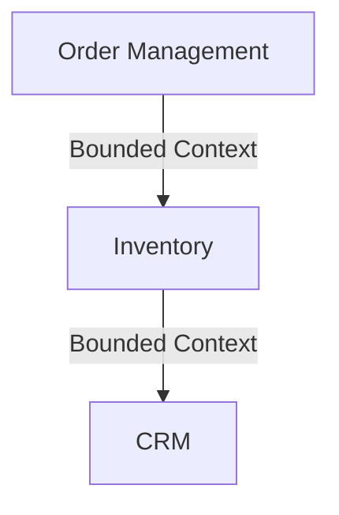

## 12.6 Domain-Driven Design (DDD) in Scala

Domain-Driven Design (DDD) is a strategic approach to software development that focuses on modeling complex business domains. By aligning the software model closely with business processes, DDD helps create systems that are more intuitive, maintainable, and scalable. In this section, we will explore how DDD principles can be effectively applied in Scala, leveraging its functional programming capabilities to enhance domain modeling.

### Introduction to Domain-Driven Design

Domain-Driven Design was popularized by Eric Evans in his seminal book "Domain-Driven Design: Tackling Complexity in the Heart of Software". The core idea is to place the domain model at the center of the software development process. This involves close collaboration between domain experts and developers to ensure that the software accurately reflects the business domain.

#### Key Concepts in DDD

1. **Ubiquitous Language**: A common language used by both developers and domain experts to ensure clear communication and understanding.

2. **Bounded Contexts**: A boundary within which a particular model is defined and applicable. It helps manage complexity by dividing the domain into smaller, more manageable parts.

3. **Aggregates**: A cluster of domain objects that can be treated as a single unit. Aggregates ensure consistency and encapsulate business rules.

4. **Entities and Value Objects**: Entities have a distinct identity that runs through time and different states, while value objects are immutable and defined by their attributes.

5. **Repositories**: Abstractions for accessing and persisting aggregates.

6. **Services**: Operations that do not naturally fit within entities or value objects.

### Bounded Contexts and Aggregates

#### Bounded Contexts

Bounded contexts are a fundamental concept in DDD. They help manage complexity by defining clear boundaries within which a particular model is valid. Each bounded context has its own ubiquitous language and can evolve independently of others.

**Example**: In an e-commerce system, you might have separate bounded contexts for Order Management, Inventory, and Customer Relationship Management (CRM).



#### Aggregates

Aggregates are clusters of domain objects that can be treated as a single unit. They ensure consistency and encapsulate business rules. An aggregate has a root entity, known as the aggregate root, which is responsible for maintaining the integrity of the aggregate.

**Example**: In an order management system, an `Order` aggregate might consist of an `Order` entity and several `OrderLine` value objects.

```scala
// Aggregate Root
case class Order(id: OrderId, customerId: CustomerId, orderLines: List[OrderLine]) {
  def addOrderLine(orderLine: OrderLine): Order = {
    // Business rule: Ensure no duplicate products in the order
    if (orderLines.exists(_.productId == orderLine.productId)) {
      throw new IllegalArgumentException("Duplicate product in order")
    }
    copy(orderLines = orderLine :: orderLines)
  }
}

// Value Object
case class OrderLine(productId: ProductId, quantity: Int, price: BigDecimal)
```

### Functional Domain Modeling

Functional programming principles can greatly enhance domain modeling by promoting immutability, composability, and expressive code. Scala, with its hybrid nature, allows us to leverage both object-oriented and functional paradigms to create robust domain models.

#### Applying Functional Programming Principles

1. **Immutability**: By default, model entities and value objects as immutable. This simplifies reasoning about code and prevents unintended side effects.

2. **Pure Functions**: Use pure functions to implement business logic. Pure functions are deterministic and side-effect-free, making them easier to test and reason about.

3. **Higher-Order Functions**: Utilize higher-order functions to abstract common patterns and operations, enhancing code reuse and readability.

#### Techniques for Modeling Domains

- **Algebraic Data Types (ADTs)**: Use case classes and sealed traits to define domain models. ADTs provide a powerful way to model complex data structures and domain logic.

- **Pattern Matching**: Leverage pattern matching to handle different cases and states within the domain model. It provides a clear and concise way to express business rules.

- **Monads and For-Comprehensions**: Use monads like `Option`, `Either`, and `Try` to handle optionality and errors in a functional way.

**Example**: Modeling a payment process using ADTs and pattern matching.

```scala
sealed trait PaymentStatus
case object Pending extends PaymentStatus
case object Completed extends PaymentStatus
case object Failed extends PaymentStatus

case class Payment(id: PaymentId, amount: BigDecimal, status: PaymentStatus)

def processPayment(payment: Payment): Payment = payment.status match {
  case Pending => payment.copy(status = Completed)
  case Completed => throw new IllegalStateException("Payment already completed")
  case Failed => throw new IllegalStateException("Cannot process failed payment")
}
```

#### Advantages of Functional Domain Models

- **Clarity and Expressiveness**: Functional domain models are often more concise and expressive, making them easier to understand and maintain.

- **Composability**: Functional programming promotes composability, allowing us to build complex functionality by combining simpler functions.

- **Testability**: Pure functions and immutability make functional domain models highly testable, leading to more reliable software.

### Integrating DDD with Scala

Scala's rich type system and functional programming capabilities make it an excellent choice for implementing DDD. Here are some strategies for integrating DDD with Scala:

#### Leveraging Scala's Type System

- **Type Safety**: Use Scala's type system to enforce domain constraints and invariants. Define custom types for domain concepts to prevent invalid states.

- **Case Classes and Sealed Traits**: Utilize case classes and sealed traits to define domain entities and value objects. They provide immutability and pattern matching capabilities.

- **Type Classes**: Implement type classes to define domain-specific behavior and operations. Type classes allow for ad-hoc polymorphism and can enhance the flexibility of domain models.

**Example**: Using custom types and type classes to model a domain.

```scala
case class CustomerId(value: String) extends AnyVal
case class OrderId(value: String) extends AnyVal

trait DiscountCalculator[T] {
  def calculateDiscount(entity: T): BigDecimal
}

object DiscountCalculator {
  implicit val orderDiscountCalculator: DiscountCalculator[Order] = new DiscountCalculator[Order] {
    def calculateDiscount(order: Order): BigDecimal = {
      // Example discount logic
      if (order.orderLines.size > 5) 0.1 else 0.0
    }
  }
}

def applyDiscount[T](entity: T)(implicit calculator: DiscountCalculator[T]): BigDecimal = {
  calculator.calculateDiscount(entity)
}
```

#### Functional Domain Modeling in Practice

- **Domain-Driven Design with Akka**: Use Akka's actor model to implement DDD concepts like aggregates and bounded contexts. Actors provide a natural way to model domain entities and handle concurrency.

- **Event Sourcing and CQRS**: Implement event sourcing and Command Query Responsibility Segregation (CQRS) patterns to manage state changes and queries in a scalable way.

- **Reactive Streams**: Leverage reactive streams to handle asynchronous data flows within the domain model.

### Design Considerations

When applying DDD in Scala, consider the following design considerations:

- **Bounded Contexts**: Clearly define bounded contexts and ensure that each context has its own ubiquitous language. Use Scala's package structure to organize code within bounded contexts.

- **Aggregate Design**: Design aggregates carefully to ensure consistency and encapsulate business rules. Use immutability and pure functions to implement aggregate logic.

- **Domain Events**: Define domain events to capture significant changes in the domain. Use event sourcing to persist and replay events.

- **Integration with Other Systems**: Consider how the domain model will integrate with external systems and services. Use adapters and anti-corruption layers to manage interactions with other bounded contexts.

### Differences and Similarities with Other Patterns

DDD shares similarities with other architectural patterns, such as microservices and event-driven architecture. However, it is distinct in its focus on the domain model and ubiquitous language.

- **Microservices**: Both DDD and microservices emphasize modularity and bounded contexts. However, DDD focuses more on the domain model, while microservices focus on service boundaries and deployment.

- **Event-Driven Architecture**: DDD and event-driven architecture both use events to capture changes in the system. DDD uses domain events to model business processes, while event-driven architecture focuses on event streams and messaging.

### Try It Yourself

To deepen your understanding of DDD in Scala, try the following exercises:

1. **Model a Library System**: Define bounded contexts for Catalog, Borrowing, and Membership. Implement aggregates for Book, Borrower, and Loan.

2. **Implement Event Sourcing**: Create a simple event-sourced application that tracks changes to an aggregate. Use Akka Persistence to persist and replay events.

3. **Explore Type Classes**: Define a type class for calculating discounts in different bounded contexts. Implement instances for different domain entities.

### Conclusion

Domain-Driven Design in Scala offers a powerful approach to modeling complex business domains. By leveraging Scala's functional programming capabilities, we can create expressive, maintainable, and scalable domain models. Remember, this is just the beginning. As you progress, you'll build more complex and interactive systems. Keep experimenting, stay curious, and enjoy the journey!

## Quiz Time!



### What is a bounded context in Domain-Driven Design?

- [x] A boundary within which a particular model is defined and applicable.
- [ ] A type of database used in DDD.
- [ ] A method for optimizing code performance.
- [ ] A tool for generating code documentation.

> **Explanation:** A bounded context defines the boundaries within which a particular domain model is valid, helping to manage complexity by dividing the domain into smaller parts.

### What is the role of an aggregate in DDD?

- [x] To ensure consistency and encapsulate business rules.
- [ ] To manage database connections.
- [ ] To handle user authentication.
- [ ] To optimize code execution.

> **Explanation:** Aggregates are clusters of domain objects that ensure consistency and encapsulate business rules, with a root entity maintaining the integrity of the aggregate.

### How does Scala's type system enhance domain modeling?

- [x] By enforcing domain constraints and preventing invalid states.
- [ ] By automatically generating user interfaces.
- [ ] By optimizing network communication.
- [ ] By managing memory allocation.

> **Explanation:** Scala's type system can enforce domain constraints and prevent invalid states by using custom types and type safety.

### What is the advantage of using functional programming in domain modeling?

- [x] It promotes immutability and composability, leading to more reliable software.
- [ ] It simplifies user interface design.
- [ ] It enhances database performance.
- [ ] It automates code documentation.

> **Explanation:** Functional programming promotes immutability and composability, making domain models more reliable and easier to test.

### What is the purpose of a ubiquitous language in DDD?

- [x] To ensure clear communication and understanding between developers and domain experts.
- [ ] To optimize code execution.
- [ ] To manage database schemas.
- [ ] To automate testing processes.

> **Explanation:** A ubiquitous language is a common language used by both developers and domain experts to ensure clear communication and understanding.

### What is a key benefit of using pattern matching in Scala?

- [x] It provides a clear and concise way to express business rules.
- [ ] It automatically generates database queries.
- [ ] It enhances network security.
- [ ] It simplifies memory management.

> **Explanation:** Pattern matching provides a clear and concise way to express business rules, making it easier to handle different cases and states within the domain model.

### How can event sourcing be implemented in Scala?

- [x] By using Akka Persistence to persist and replay events.
- [ ] By using a relational database to store events.
- [ ] By generating events with a code generator.
- [ ] By optimizing network communication.

> **Explanation:** Event sourcing can be implemented in Scala by using Akka Persistence to persist and replay events, capturing significant changes in the domain.

### What is a common use case for type classes in Scala?

- [x] To define domain-specific behavior and operations.
- [ ] To manage user authentication.
- [ ] To optimize code execution.
- [ ] To handle database transactions.

> **Explanation:** Type classes are used to define domain-specific behavior and operations, allowing for ad-hoc polymorphism and enhancing the flexibility of domain models.

### What is the relationship between DDD and microservices?

- [x] Both emphasize modularity and bounded contexts, but focus on different aspects.
- [ ] Both are used to optimize database performance.
- [ ] Both are tools for generating user interfaces.
- [ ] Both are methods for managing memory allocation.

> **Explanation:** Both DDD and microservices emphasize modularity and bounded contexts, but DDD focuses more on the domain model, while microservices focus on service boundaries and deployment.

### True or False: Functional domain models are often more concise and expressive.

- [x] True
- [ ] False

> **Explanation:** Functional domain models are often more concise and expressive, making them easier to understand and maintain.


