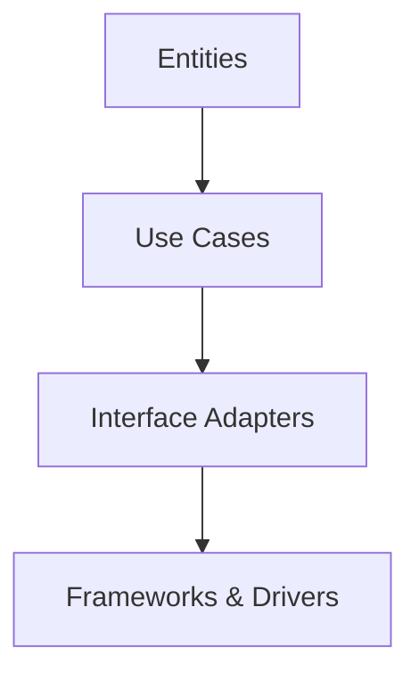
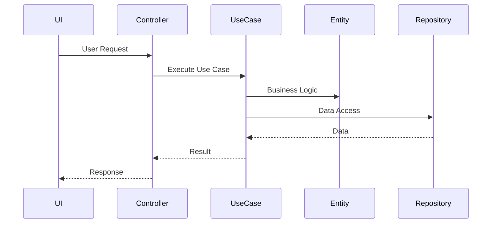

## 12.7 Clean Architecture

In the realm of software engineering, Clean Architecture stands as a beacon for creating robust, maintainable, and scalable systems. It emphasizes the separation of concerns, allowing developers to build systems that are easy to understand, extend, and test. In this section, we will delve into the principles of Clean Architecture, how it can be implemented in Scala, and the benefits it brings to software design.

### Understanding Clean Architecture

Clean Architecture is a software design philosophy introduced by Robert C. Martin (Uncle Bob). It aims to create systems that are:

- **Independent of Frameworks**: The architecture does not depend on the existence of some library of feature-laden software. This allows you to use such frameworks as tools rather than forcing you to cram your system into their limited constraints.
- **Testable**: The business rules can be tested without the UI, database, web server, or any other external element.
- **Independent of UI**: The UI can change easily, without changing the rest of the system. A web UI could be replaced with a console UI, for example, without changing the business rules.
- **Independent of Database**: You can swap out Oracle or SQL Server, for Mongo, BigTable, CouchDB, or something else. Your business rules are not bound to the database.
- **Independent of any external agency**: In fact, your business rules simply don’t know anything at all about the outside world.

### Core Principles of Clean Architecture

At its core, Clean Architecture is about organizing code in a way that separates the business logic from the infrastructure and frameworks. Here are the key principles:

1. **Separation of Concerns**: Each module or layer in the architecture should have a single responsibility. This makes the system easier to understand and maintain.

2. **Dependency Inversion**: High-level modules should not depend on low-level modules. Both should depend on abstractions. This principle is crucial in Clean Architecture to ensure that the core logic is not dependent on external systems.

3. **Encapsulation**: The internal details of a module should be hidden from other modules. This allows for changes within a module without affecting others.

4. **Testability**: The architecture should facilitate easy testing of the business logic without the need for external systems like databases or web servers.

### Layers of Clean Architecture

Clean Architecture is typically represented by a series of concentric circles, each representing a different layer of the system. Let's explore these layers:



#### 1. Entities

Entities encapsulate the most general and high-level business rules. An entity can be an object with methods, or it can be a set of data structures and functions. Entities are the core of the application and are independent of any external systems.

#### 2. Use Cases

Use cases contain application-specific business rules. They orchestrate the flow of data to and from the entities and direct those entities to use their enterprise-wide business rules to achieve the goals of the use case.

#### 3. Interface Adapters

This layer contains adapters that convert data from the format most convenient for the use cases and entities to the format most convenient for some external agency such as the Database or the Web.

#### 4. Frameworks & Drivers

This is the outermost layer and contains frameworks and tools such as the database, web framework, etc. This layer is where all the details go. The web is a detail, the database is a detail. We keep these things on the outside where they can do little harm.

### Implementing Clean Architecture in Scala

Scala, with its powerful type system and functional programming capabilities, is well-suited for implementing Clean Architecture. Let's explore how we can implement each layer in Scala.

#### Entities

Entities in Scala can be represented using case classes and traits. These entities should be immutable and encapsulate the core business logic.

```scala
// Define a trait for a generic entity
trait Entity {
  def id: String
}

// Define a case class for a specific entity
case class User(id: String, name: String, email: String) extends Entity {
  def changeEmail(newEmail: String): User = this.copy(email = newEmail)
}
```

#### Use Cases

Use cases in Scala can be implemented as services or functions that orchestrate the business logic. They should be independent of any external systems.

```scala
// Define a trait for user use cases
trait UserUseCase {
  def changeUserEmail(userId: String, newEmail: String): Either[String, User]
}

// Implement the use case
class UserService(userRepository: UserRepository) extends UserUseCase {
  override def changeUserEmail(userId: String, newEmail: String): Either[String, User] = {
    userRepository.findById(userId) match {
      case Some(user) => Right(user.changeEmail(newEmail))
      case None => Left("User not found")
    }
  }
}
```

#### Interface Adapters

Interface adapters in Scala can be implemented using traits and classes that convert data between the use cases and external systems.

```scala
// Define a trait for user repository
trait UserRepository {
  def findById(userId: String): Option[User]
  def save(user: User): Unit
}

// Implement the repository using a database
class DatabaseUserRepository extends UserRepository {
  private val users = scala.collection.mutable.Map[String, User]()

  override def findById(userId: String): Option[User] = users.get(userId)

  override def save(user: User): Unit = {
    users(user.id) = user
  }
}
```

#### Frameworks & Drivers

This layer includes the actual implementation details such as the database or web framework. In Scala, you might use libraries like Akka HTTP for web services or Slick for database access.

```scala
// Define a simple HTTP server using Akka HTTP
import akka.http.scaladsl.server.Directives._
import akka.http.scaladsl.server.Route

class UserRoutes(userService: UserService) {
  val routes: Route = pathPrefix("users") {
    path(Segment / "email") { userId =>
      put {
        entity(as[String]) { newEmail =>
          complete {
            userService.changeUserEmail(userId, newEmail) match {
              case Right(user) => s"Email updated to ${user.email}"
              case Left(error) => s"Error: $error"
            }
          }
        }
      }
    }
  }
}
```

### Design Considerations

When implementing Clean Architecture in Scala, consider the following:

- **Immutability**: Leverage Scala's support for immutability to ensure that your entities and data structures are immutable. This will help maintain consistency and avoid side effects.

- **Functional Programming**: Use Scala's functional programming features to create pure functions and manage side effects effectively. This aligns well with the principles of Clean Architecture.

- **Dependency Injection**: Use dependency injection to manage dependencies between layers. This can be achieved using constructor injection or libraries like MacWire.

- **Testing**: Ensure that each layer can be tested independently. Use ScalaTest or Specs2 for unit testing and integration testing.

### Differences and Similarities with Other Patterns

Clean Architecture shares similarities with other architectural patterns like Hexagonal Architecture and Onion Architecture. All these patterns emphasize separation of concerns and dependency inversion. However, Clean Architecture is more explicit about the direction of dependencies and the independence of the core business logic.

### Try It Yourself

To get hands-on experience with Clean Architecture in Scala, try the following:

- **Modify the Code**: Extend the `UserService` to include more use cases, such as updating the user's name or deleting a user.

- **Add a New Layer**: Implement a new interface adapter for a different database or a REST API.

- **Experiment with Frameworks**: Try using different Scala frameworks for the frameworks and drivers layer, such as Play Framework or Http4s.

### Visualizing Clean Architecture

To better understand how Clean Architecture components interact, let's visualize the flow of data and control within the system.



### Knowledge Check

Before we wrap up, let's reinforce what we've learned:

- **What is the primary goal of Clean Architecture?**
  - To separate business logic from external systems.

- **How does Clean Architecture achieve separation of concerns?**
  - By organizing code into layers with specific responsibilities.

- **What role do entities play in Clean Architecture?**
  - They encapsulate core business rules and logic.

### Conclusion

Clean Architecture provides a robust framework for building scalable and maintainable systems in Scala. By adhering to its principles, you can create software that is easy to test, extend, and understand. Remember, the journey to mastering Clean Architecture is ongoing, and experimentation is key. Keep exploring, stay curious, and enjoy the process of building clean and efficient software systems.

## Quiz Time!



### What is the primary goal of Clean Architecture?

- [x] To separate business logic from external systems
- [ ] To increase the speed of development
- [ ] To reduce the number of lines of code
- [ ] To make the UI more responsive

> **Explanation:** Clean Architecture aims to separate business logic from external systems, ensuring that the core logic is independent and easily testable.

### Which layer in Clean Architecture contains the core business rules?

- [x] Entities
- [ ] Use Cases
- [ ] Interface Adapters
- [ ] Frameworks & Drivers

> **Explanation:** The Entities layer encapsulates the core business rules and logic, making it independent of external systems.

### What is the role of the Use Cases layer in Clean Architecture?

- [x] To orchestrate the flow of data to and from the entities
- [ ] To handle database operations
- [ ] To manage user interface interactions
- [ ] To provide logging and monitoring

> **Explanation:** The Use Cases layer orchestrates the flow of data to and from the entities, directing them to use their business rules to achieve the goals of the use case.

### How does Clean Architecture ensure testability?

- [x] By separating business logic from external systems
- [ ] By using a specific testing framework
- [ ] By minimizing the number of dependencies
- [ ] By writing more unit tests

> **Explanation:** Clean Architecture ensures testability by separating business logic from external systems, allowing for independent testing of the core logic.

### What is the Dependency Inversion principle in Clean Architecture?

- [x] High-level modules should not depend on low-level modules
- [ ] Low-level modules should control the flow of data
- [ ] All modules should depend on the database
- [ ] The UI should be the entry point for all logic

> **Explanation:** The Dependency Inversion principle states that high-level modules should not depend on low-level modules; both should depend on abstractions.

### Which Scala feature is most aligned with the principles of Clean Architecture?

- [x] Immutability
- [ ] Dynamic typing
- [ ] Reflection
- [ ] Scripting

> **Explanation:** Immutability in Scala aligns well with Clean Architecture principles, helping maintain consistency and avoiding side effects.

### What is the purpose of Interface Adapters in Clean Architecture?

- [x] To convert data between use cases and external systems
- [ ] To manage user authentication
- [ ] To handle network requests
- [ ] To provide caching mechanisms

> **Explanation:** Interface Adapters convert data between the format most convenient for use cases and entities and the format most convenient for external systems.

### How can dependency injection be achieved in Scala for Clean Architecture?

- [x] Using constructor injection or libraries like MacWire
- [ ] By hardcoding dependencies
- [ ] By using global variables
- [ ] By relying on the JVM

> **Explanation:** Dependency injection in Scala can be achieved using constructor injection or libraries like MacWire, allowing for better management of dependencies.

### What is a key benefit of using Clean Architecture?

- [x] Improved maintainability and scalability
- [ ] Faster execution time
- [ ] Reduced memory usage
- [ ] Increased number of features

> **Explanation:** Clean Architecture improves maintainability and scalability by organizing code into layers with specific responsibilities.

### True or False: Clean Architecture is only applicable to web applications.

- [ ] True
- [x] False

> **Explanation:** Clean Architecture is not limited to web applications; it can be applied to any type of software system to improve maintainability and scalability.


