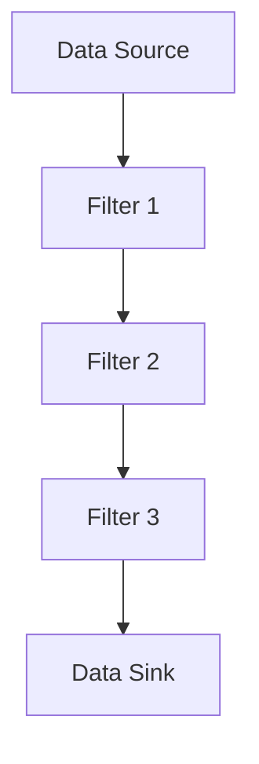

## 12.8 Pipe and Filter Architecture

The Pipe and Filter architecture is a powerful design pattern that facilitates the processing of data streams through a series of modular components. This pattern is particularly effective in scenarios where data needs to be transformed, filtered, or aggregated in a flexible and scalable manner. In this section, we will explore the Pipe and Filter architecture in the context of Scala, leveraging the capabilities of Akka Streams to implement this pattern efficiently.

### Intent

The primary intent of the Pipe and Filter architecture is to decompose a complex processing task into a series of discrete, reusable components (filters) that are connected by channels (pipes). Each filter performs a specific transformation on the data, allowing for a high degree of modularity and reusability. This architecture is especially useful in data processing pipelines, where the ability to easily add, remove, or rearrange processing steps is crucial.

### Key Participants

- **Filters**: Independent processing units that perform specific transformations or computations on the data. Filters are designed to be reusable and composable.
- **Pipes**: Channels that connect filters, facilitating the flow of data between them. Pipes can be implemented as queues, streams, or other data structures that support data transfer.
- **Data Source**: The origin of the data stream, which feeds data into the pipeline.
- **Data Sink**: The endpoint of the pipeline, where processed data is collected or outputted.

### Applicability

The Pipe and Filter architecture is applicable in scenarios where:

- Data processing tasks can be decomposed into independent steps.
- There is a need for flexibility in the processing pipeline, allowing for easy modification and extension.
- Scalability and parallel processing are important considerations.
- The system requires a high degree of reusability and maintainability.

### Implementing Pipes and Filters with Akka Streams

Akka Streams is a powerful library in the Scala ecosystem that provides a robust framework for implementing reactive stream processing. It is built on top of Akka, a toolkit for building concurrent, distributed, and resilient message-driven applications. Akka Streams leverages the Actor model to provide a high-level API for defining and running stream processing pipelines.

#### Basic Concepts of Akka Streams

Before diving into the implementation of the Pipe and Filter architecture, let's briefly review some fundamental concepts of Akka Streams:

- **Source**: Represents the starting point of a stream, producing data elements.
- **Flow**: Represents a processing stage that can transform or filter data elements.
- **Sink**: Represents the endpoint of a stream, consuming data elements.
- **Graph**: A directed graph that defines the flow of data through various processing stages.

#### Sample Code Snippet

Let's implement a simple Pipe and Filter architecture using Akka Streams. In this example, we will create a pipeline that processes a stream of integers, filtering out even numbers and then doubling the remaining odd numbers.

```scala
import akka.actor.ActorSystem
import akka.stream.scaladsl.{Flow, Sink, Source}
import akka.stream.{ActorMaterializer, Materializer}

object PipeAndFilterExample extends App {
  implicit val system: ActorSystem = ActorSystem("PipeAndFilterSystem")
  implicit val materializer: Materializer = ActorMaterializer()

  // Source: A stream of integers from 1 to 10
  val source = Source(1 to 10)

  // Filter: Remove even numbers
  val filterEvenNumbers = Flow[Int].filter(_ % 2 != 0)

  // Transform: Double the remaining numbers
  val doubleNumbers = Flow[Int].map(_ * 2)

  // Sink: Print the result to the console
  val sink = Sink.foreach[Int](println)

  // Build the pipeline
  val pipeline = source.via(filterEvenNumbers).via(doubleNumbers).to(sink)

  // Run the pipeline
  pipeline.run()
}
```

In this example, we define a `Source` that generates a stream of integers from 1 to 10. We then create two `Flow` components: one to filter out even numbers and another to double the remaining numbers. Finally, we connect these components to a `Sink` that prints the results to the console. The `via` method is used to connect the `Source`, `Flow`, and `Sink` components, forming a complete processing pipeline.

#### Try It Yourself

Experiment with the code by modifying the filter and transformation logic. For example, try filtering out numbers greater than 5 or tripling the numbers instead of doubling them. This flexibility is one of the key advantages of the Pipe and Filter architecture.

### Design Considerations

When implementing the Pipe and Filter architecture, consider the following design considerations:

- **Modularity**: Design filters to be independent and reusable. Each filter should perform a single, well-defined task.
- **Scalability**: Leverage Akka Streams' support for parallel processing to scale the pipeline across multiple cores or nodes.
- **Error Handling**: Implement robust error handling strategies to manage exceptions and failures within the pipeline.
- **Backpressure**: Use Akka Streams' built-in backpressure mechanisms to handle varying data rates and prevent resource exhaustion.

### Differences and Similarities

The Pipe and Filter architecture shares similarities with other architectural patterns, such as the Chain of Responsibility pattern. However, it differs in its emphasis on modularity and reusability, as well as its support for parallel processing. Unlike the Chain of Responsibility pattern, which typically involves a linear sequence of handlers, the Pipe and Filter architecture allows for more complex, non-linear processing pipelines.

### Visualizing the Pipe and Filter Architecture

To better understand the flow of data through a Pipe and Filter pipeline, let's visualize the architecture using a Mermaid.js diagram:



In this diagram, data flows from the `Data Source` through a series of filters (`Filter 1`, `Filter 2`, `Filter 3`) before reaching the `Data Sink`. Each filter represents a distinct processing stage, and the arrows indicate the flow of data between them.

### Advanced Topics

#### Parallel Processing

One of the strengths of the Pipe and Filter architecture is its ability to support parallel processing. By leveraging Akka Streams' parallelism features, you can distribute the processing load across multiple cores or nodes, improving throughput and performance.

#### Stateful Filters

While filters are typically stateless, there are scenarios where stateful filters are necessary. For example, a filter that aggregates data over a time window may need to maintain state. Akka Streams provides mechanisms for implementing stateful processing, such as using `Flow` with `statefulMapConcat`.

#### Dynamic Pipelines

In some cases, you may need to modify the pipeline dynamically based on runtime conditions. Akka Streams supports dynamic stream composition, allowing you to add, remove, or rearrange filters at runtime.

### References and Links

For further reading on Akka Streams and the Pipe and Filter architecture, consider the following resources:

- [Akka Streams Documentation](https://doc.akka.io/docs/akka/current/stream/index.html)
- [Reactive Streams Specification](https://www.reactive-streams.org/)
- [Design Patterns: Elements of Reusable Object-Oriented Software](https://en.wikipedia.org/wiki/Design_Patterns)

### Knowledge Check

To reinforce your understanding of the Pipe and Filter architecture, consider the following questions:

- What are the key components of the Pipe and Filter architecture?
- How does Akka Streams facilitate the implementation of this architecture?
- What are some design considerations when implementing a Pipe and Filter pipeline?

### Embrace the Journey

Remember, mastering the Pipe and Filter architecture is just one step in your journey as a Scala developer. As you continue to explore and experiment with different design patterns, you'll gain a deeper understanding of how to build robust, scalable, and maintainable software systems. Keep experimenting, stay curious, and enjoy the journey!

## Quiz Time!



### What is the primary intent of the Pipe and Filter architecture?

- [x] To decompose a complex processing task into a series of discrete, reusable components.
- [ ] To create a linear sequence of handlers for processing requests.
- [ ] To centralize data processing in a single component.
- [ ] To eliminate the need for data transformation.

> **Explanation:** The Pipe and Filter architecture aims to break down complex processing tasks into modular, reusable components, each performing a specific transformation.

### Which library in Scala is commonly used to implement the Pipe and Filter architecture?

- [x] Akka Streams
- [ ] Play Framework
- [ ] Cats
- [ ] Slick

> **Explanation:** Akka Streams is a powerful library for implementing reactive stream processing in Scala, making it well-suited for the Pipe and Filter architecture.

### What is the role of a "Filter" in the Pipe and Filter architecture?

- [x] To perform specific transformations or computations on the data.
- [ ] To connect different components in the pipeline.
- [ ] To generate data elements for the pipeline.
- [ ] To consume data elements at the end of the pipeline.

> **Explanation:** Filters are independent processing units that transform or compute data as it flows through the pipeline.

### How does Akka Streams handle varying data rates in a pipeline?

- [x] Through built-in backpressure mechanisms.
- [ ] By discarding excess data.
- [ ] By buffering all data until processing is complete.
- [ ] By increasing the processing speed of filters.

> **Explanation:** Akka Streams uses backpressure to manage varying data rates, ensuring that data flows smoothly without overwhelming the system.

### What is a key advantage of using the Pipe and Filter architecture?

- [x] High degree of modularity and reusability.
- [ ] Centralized control of data processing.
- [ ] Elimination of data transformation steps.
- [ ] Simplification of error handling.

> **Explanation:** The Pipe and Filter architecture promotes modularity and reusability, allowing for flexible and maintainable processing pipelines.

### Which of the following is NOT a component of the Pipe and Filter architecture?

- [ ] Filter
- [ ] Pipe
- [ ] Data Source
- [x] Controller

> **Explanation:** The Pipe and Filter architecture consists of Filters, Pipes, Data Sources, and Data Sinks. A Controller is not a component of this architecture.

### What is a potential design consideration when implementing a Pipe and Filter pipeline?

- [x] Ensuring filters are independent and reusable.
- [ ] Centralizing all processing logic in a single filter.
- [ ] Avoiding the use of parallel processing.
- [ ] Disabling error handling mechanisms.

> **Explanation:** Filters should be designed to be independent and reusable, allowing for flexible and maintainable pipelines.

### How can you implement stateful processing in Akka Streams?

- [x] By using `Flow` with `statefulMapConcat`.
- [ ] By storing state in a global variable.
- [ ] By using a single-threaded execution model.
- [ ] By avoiding the use of state altogether.

> **Explanation:** Akka Streams provides mechanisms like `statefulMapConcat` for implementing stateful processing within a stream.

### True or False: The Pipe and Filter architecture is similar to the Chain of Responsibility pattern.

- [x] True
- [ ] False

> **Explanation:** Both patterns involve processing data through a series of components, but the Pipe and Filter architecture emphasizes modularity and reusability, while the Chain of Responsibility typically involves a linear sequence of handlers.

### Which of the following is a benefit of using Akka Streams for implementing the Pipe and Filter architecture?

- [x] Support for parallel processing and backpressure.
- [ ] Elimination of the need for data transformation.
- [ ] Centralized control of data flow.
- [ ] Simplification of pipeline configuration.

> **Explanation:** Akka Streams provides robust support for parallel processing and backpressure, making it ideal for implementing the Pipe and Filter architecture.


