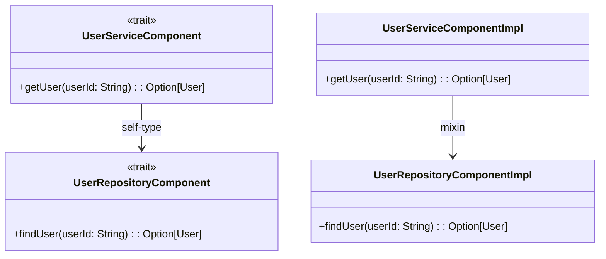

## 12.9 Dependency Injection in Scala

Dependency Injection (DI) is a fundamental design pattern that promotes loose coupling between components by injecting dependencies rather than hardcoding them. In Scala, DI can be approached in various ways, leveraging both object-oriented and functional programming paradigms. This section delves into advanced DI techniques in Scala, including the Cake Pattern, Reader Monad, and Tagless Final Encoding, providing expert insights into their implementation, advantages, and trade-offs.

### Applying Dependency Inversion Principles

Dependency inversion is a core principle of software design that dictates high-level modules should not depend on low-level modules; both should depend on abstractions. In Scala, this principle can be applied using various DI techniques that enhance modularity, testability, and maintainability.

### Functional Dependency Injection Techniques in Depth

Scala's rich type system and functional programming capabilities allow for innovative DI techniques that go beyond traditional object-oriented approaches. Let's explore some of these techniques in detail.

#### The Cake Pattern

The Cake Pattern is a Scala-specific DI technique that leverages self-types and modular design to manage dependencies. It is particularly useful in large applications where components need to be composed flexibly.

##### Understanding Self-Types and Modular Design

Self-types in Scala allow a trait to declare that it must be mixed with another trait, enabling a form of dependency declaration. This is the foundation of the Cake Pattern, which uses self-types to manage dependencies between modules.

```scala
trait UserRepositoryComponent {
  trait UserRepository {
    def findUser(userId: String): Option[User]
  }
}

trait UserServiceComponent { self: UserRepositoryComponent =>
  class UserService {
    def getUser(userId: String): Option[User] = userRepository.findUser(userId)
  }

  val userRepository: UserRepository
}
```

In this example, `UserServiceComponent` declares a self-type dependency on `UserRepositoryComponent`, ensuring that any concrete implementation of `UserServiceComponent` must also provide an implementation of `UserRepository`.

##### Implementing the Cake Pattern

To implement the Cake Pattern, define components as traits with self-types and provide concrete implementations by mixing these traits together.

```scala
trait UserRepositoryComponentImpl extends UserRepositoryComponent {
  class UserRepositoryImpl extends UserRepository {
    def findUser(userId: String): Option[User] = {
      // Implementation here
      None
    }
  }
}

trait UserServiceComponentImpl extends UserServiceComponent with UserRepositoryComponentImpl {
  val userRepository = new UserRepositoryImpl
}
```

Here, `UserServiceComponentImpl` mixes in `UserRepositoryComponentImpl`, providing a concrete implementation of `UserRepository`.

##### Advantages and Drawbacks

**Advantages:**
- **Modularity:** Components are easily composable and can be mixed and matched as needed.
- **Type Safety:** Self-types ensure that dependencies are satisfied at compile time.

**Drawbacks:**
- **Complexity:** The pattern can become complex in large systems with many dependencies.
- **Verbose:** Requires more boilerplate code compared to other DI techniques.

##### Comparison with DI Frameworks

The Cake Pattern offers a compile-time DI approach, contrasting with runtime DI frameworks like Spring or Guice. While it provides type safety and modularity, it lacks the dynamic configuration capabilities of these frameworks.

##### Examples and Best Practices

- **Use the Cake Pattern for compile-time safety** when you need to ensure that all dependencies are satisfied at compile time.
- **Avoid overusing the pattern** in simple applications where its complexity may outweigh its benefits.

#### Reader Monad for Dependency Injection

The Reader Monad is a functional DI pattern that encapsulates dependencies within a monadic structure, allowing for clean and composable dependency management.

##### Using the Reader Monad Pattern

The Reader Monad abstracts over functions that require a shared environment, making it ideal for managing dependencies in a functional way.

```scala
case class Config(dbUrl: String, apiKey: String)

case class Reader[R, A](run: R => A) {
  def map[B](f: A => B): Reader[R, B] = Reader(r => f(run(r)))
  def flatMap[B](f: A => Reader[R, B]): Reader[R, B] = Reader(r => f(run(r)).run(r))
}

def getConfig: Reader[Config, String] = Reader(config => config.dbUrl)

val config = Config("jdbc:mysql://localhost:3306/mydb", "secretApiKey")
val dbUrl = getConfig.run(config)
```

In this example, `Reader` is a monad that encapsulates a function requiring a `Config` environment, allowing dependencies to be injected functionally.

##### Managing Dependencies Functionally

The Reader Monad allows dependencies to be passed implicitly through the monadic context, enabling clean separation of concerns and reducing boilerplate.

##### Composing Functions That Require a Shared Environment

Functions that require a shared environment can be composed using the Reader Monad, allowing for flexible and reusable code.

```scala
def getApiKey: Reader[Config, String] = Reader(config => config.apiKey)

val combinedReader: Reader[Config, (String, String)] = for {
  dbUrl <- getConfig
  apiKey <- getApiKey
} yield (dbUrl, apiKey)

val result = combinedReader.run(config)
```

Here, `getConfig` and `getApiKey` are composed using a for-comprehension, demonstrating how the Reader Monad can manage multiple dependencies.

#### Tagless Final Encoding for DI

Tagless Final Encoding is a powerful technique for abstracting over effects and dependencies, providing high modularity and testability.

##### Abstracting Over Effects and Dependencies

Tagless Final Encoding uses higher-kinded types to abstract over effects, allowing for flexible and reusable code.

```scala
trait Console[F[_]] {
  def putStrLn(line: String): F[Unit]
  def readLn: F[String]
}

def program[F[_]: Console]: F[Unit] = for {
  _ <- implicitly[Console[F]].putStrLn("Enter your name:")
  name <- implicitly[Console[F]].readLn
  _ <- implicitly[Console[F]].putStrLn(s"Hello, $name!")
} yield ()
```

In this example, `Console` is a tagless final encoding that abstracts over the effect type `F`, allowing for different implementations.

##### Achieving Higher Modularity and Testability

By abstracting over effects, Tagless Final Encoding enables high modularity and testability, as different implementations can be swapped easily.

```scala
implicit val consoleIO: Console[IO] = new Console[IO] {
  def putStrLn(line: String): IO[Unit] = IO(println(line))
  def readLn: IO[String] = IO(scala.io.StdIn.readLine())
}

program[IO].unsafeRunSync()
```

Here, `Console[IO]` provides a concrete implementation using the `IO` monad, demonstrating how Tagless Final Encoding allows for different effect implementations.

#### Comparison of DI Approaches

Each DI approach in Scala has its pros and cons, and the choice depends on the specific requirements of your application.

##### Pros and Cons of Different DI Patterns

- **Cake Pattern:**
  - **Pros:** Compile-time safety, modularity.
  - **Cons:** Complexity, verbosity.

- **Reader Monad:**
  - **Pros:** Functional purity, composability.
  - **Cons:** Requires understanding of monadic concepts.

- **Tagless Final:**
  - **Pros:** High modularity, testability.
  - **Cons:** Complexity, requires understanding of higher-kinded types.

##### Selecting the Appropriate Pattern for Your Use Case

Consider the following when selecting a DI pattern:
- **Complexity of the application:** Use simpler patterns for less complex applications.
- **Need for compile-time safety:** Choose the Cake Pattern for strict compile-time checks.
- **Functional purity:** Opt for the Reader Monad or Tagless Final for functional purity and composability.
- **Testability and modularity:** Tagless Final excels in scenarios requiring high modularity and testability.

### Try It Yourself

Experiment with the provided code examples by modifying them to suit your needs. Try implementing a simple application using each DI pattern to understand their strengths and weaknesses.

### Visualizing Dependency Injection in Scala

Let's visualize the relationships and flow of dependencies in the Cake Pattern using a Mermaid.js diagram:



This diagram illustrates how `UserServiceComponent` depends on `UserRepositoryComponent` through a self-type, and how concrete implementations are mixed together.

### References and Links

- [Scala Documentation](https://docs.scala-lang.org/)
- [Functional Programming in Scala](https://www.manning.com/books/functional-programming-in-scala)
- [Cats Library](https://typelevel.org/cats/)
- [ZIO](https://zio.dev/)

### Knowledge Check

- What are the key differences between the Cake Pattern and the Reader Monad?
- How does Tagless Final Encoding enhance testability?
- When would you choose the Cake Pattern over other DI techniques?

### Embrace the Journey

Remember, mastering DI in Scala is a journey. Each pattern has its place, and understanding their nuances will empower you to build robust, maintainable applications. Keep experimenting, stay curious, and enjoy the journey!

## Quiz Time!



### What is the primary advantage of the Cake Pattern in Scala?

- [x] Compile-time safety
- [ ] Runtime flexibility
- [ ] Simplicity
- [ ] Dynamic configuration

> **Explanation:** The Cake Pattern provides compile-time safety by ensuring that all dependencies are satisfied at compile time through self-types.

### Which DI pattern in Scala is best suited for functional purity and composability?

- [ ] Cake Pattern
- [x] Reader Monad
- [ ] Tagless Final
- [ ] Spring Framework

> **Explanation:** The Reader Monad is well-suited for functional purity and composability, as it encapsulates dependencies within a monadic structure.

### What is a key drawback of the Cake Pattern?

- [ ] Lack of modularity
- [x] Complexity and verbosity
- [ ] Lack of type safety
- [ ] Inability to handle dependencies

> **Explanation:** The Cake Pattern can become complex and verbose, especially in large systems with many dependencies.

### How does Tagless Final Encoding achieve high modularity?

- [x] By abstracting over effects using higher-kinded types
- [ ] By using self-types
- [ ] By encapsulating dependencies in a monadic structure
- [ ] By using runtime configuration

> **Explanation:** Tagless Final Encoding achieves high modularity by abstracting over effects using higher-kinded types, allowing for flexible and reusable code.

### Which DI pattern allows for dependencies to be passed implicitly through the monadic context?

- [ ] Cake Pattern
- [x] Reader Monad
- [ ] Tagless Final
- [ ] Guice

> **Explanation:** The Reader Monad allows for dependencies to be passed implicitly through the monadic context, enabling clean separation of concerns.

### What is a common use case for the Cake Pattern?

- [ ] Dynamic configuration
- [x] Compile-time dependency management
- [ ] Functional purity
- [ ] Runtime flexibility

> **Explanation:** The Cake Pattern is commonly used for compile-time dependency management, ensuring that dependencies are satisfied at compile time.

### What is a key benefit of using Tagless Final Encoding?

- [x] High testability and modularity
- [ ] Simplicity
- [ ] Runtime flexibility
- [ ] Dynamic configuration

> **Explanation:** Tagless Final Encoding provides high testability and modularity by abstracting over effects and dependencies.

### Which DI pattern is known for its functional purity?

- [ ] Cake Pattern
- [x] Reader Monad
- [ ] Tagless Final
- [ ] Spring Framework

> **Explanation:** The Reader Monad is known for its functional purity, as it encapsulates dependencies within a monadic structure.

### What is the primary focus of the Reader Monad pattern?

- [ ] Compile-time safety
- [ ] Runtime flexibility
- [x] Functional purity and composability
- [ ] Dynamic configuration

> **Explanation:** The Reader Monad pattern focuses on functional purity and composability by encapsulating dependencies within a monadic structure.

### True or False: Tagless Final Encoding requires understanding of higher-kinded types.

- [x] True
- [ ] False

> **Explanation:** Tagless Final Encoding requires understanding of higher-kinded types to abstract over effects and achieve high modularity and testability.


