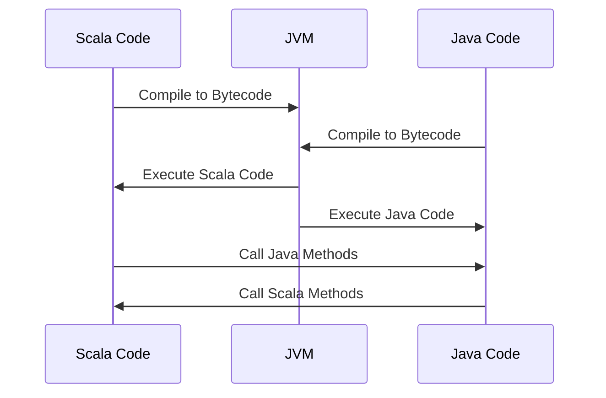

## 13.1 Interoperability with Java

In the world of software development, Scala and Java are two powerful languages that run on the Java Virtual Machine (JVM). Scala, with its expressive syntax and functional programming capabilities, complements Java's robust object-oriented features. This section explores the interoperability between Scala and Java, enabling developers to harness the strengths of both languages within the JVM ecosystem.

### Understanding Scala and Java Interoperability

Scala and Java interoperability refers to the ability to seamlessly integrate and use code written in one language within the other. This capability is crucial for leveraging existing Java libraries, frameworks, and tools while taking advantage of Scala's modern language features. Let's delve into the key concepts and techniques for achieving interoperability between Scala and Java.

### Key Concepts of Interoperability

#### 1. JVM Compatibility

Both Scala and Java compile to bytecode that runs on the JVM. This shared runtime environment ensures that Scala and Java classes can interact with each other without any special configuration. The JVM serves as a common platform, allowing seamless communication between the two languages.

#### 2. Type Compatibility

Scala's type system is designed to be compatible with Java's. This means that Scala can use Java classes, interfaces, and methods directly. Conversely, Java can also call Scala code, although some additional considerations are necessary due to Scala's more advanced type features.

#### 3. Object-Oriented and Functional Paradigms

Scala's interoperability with Java is facilitated by its support for both object-oriented and functional programming paradigms. This dual nature allows Scala to integrate smoothly with Java's object-oriented constructs while offering functional programming capabilities.

### Calling Java Code from Scala

Scala's seamless integration with Java makes it easy to call Java code from Scala. This section explores various techniques and considerations for invoking Java code within a Scala application.

#### Using Java Classes in Scala

Scala can directly use Java classes, methods, and fields. This is possible because Scala's syntax is designed to be compatible with Java's. Here's a simple example:

```scala
// Importing a Java class
import java.util.ArrayList

object ScalaJavaInterop {
  def main(args: Array[String]): Unit = {
    // Creating an instance of a Java class
    val list = new ArrayList[String]()
    list.add("Scala")
    list.add("Java")

    // Iterating over the Java list
    for (i <- 0 until list.size()) {
      println(list.get(i))
    }
  }
}
```

In this example, we import and use `java.util.ArrayList`, a Java class, in Scala. The syntax for creating and manipulating the list is similar to Java, demonstrating Scala's compatibility with Java classes.

#### Handling Java Collections

While Scala can use Java collections directly, it's often beneficial to convert them to Scala's collections for more idiomatic usage. Scala provides utility methods for converting between Java and Scala collections:

```scala
import scala.jdk.CollectionConverters._

object JavaToScalaCollections {
  def main(args: Array[String]): Unit = {
    val javaList = new java.util.ArrayList[String]()
    javaList.add("Scala")
    javaList.add("Java")

    // Converting Java list to Scala list
    val scalaList = javaList.asScala

    // Using Scala's collection methods
    scalaList.foreach(println)
  }
}
```

In this example, we use `asScala` to convert a Java `ArrayList` to a Scala `Seq`, allowing us to use Scala's collection methods like `foreach`.

#### Accessing Java Libraries

Scala can leverage the vast ecosystem of Java libraries and frameworks. This is particularly useful for tasks such as database access, web development, and more. Here's an example of using a Java library in Scala:

```scala
// Importing a Java library
import org.apache.commons.lang3.StringUtils

object JavaLibraryInScala {
  def main(args: Array[String]): Unit = {
    val str = " Hello, Scala! "
    // Using a method from the Java library
    val trimmedStr = StringUtils.trim(str)
    println(trimmedStr)
  }
}
```

In this example, we use the Apache Commons Lang library to trim a string. Scala's interoperability allows us to seamlessly use Java libraries in our Scala code.

### Calling Scala Code from Java

While calling Java code from Scala is straightforward, invoking Scala code from Java requires some additional considerations due to Scala's advanced features. This section explores techniques for calling Scala code from Java.

#### Using Scala Classes in Java

Scala classes can be used in Java, but it's important to understand how Scala's features translate to Java. Here's an example:

```scala
// Scala class
class ScalaGreeter {
  def greet(name: String): String = s"Hello, $name!"
}
```

To use this Scala class in Java, we need to compile the Scala code and include the compiled class in the Java project's classpath. Here's how we can call the Scala class from Java:

```java
// Java code
public class JavaCaller {
    public static void main(String[] args) {
        ScalaGreeter greeter = new ScalaGreeter();
        String greeting = greeter.greet("Java");
        System.out.println(greeting);
    }
}
```

In this example, we create an instance of the `ScalaGreeter` class and call its `greet` method from Java. Note that Scala's string interpolation (`s"Hello, $name!"`) is compiled into Java-compatible code.

#### Handling Scala's Advanced Features

Scala's advanced features, such as traits, case classes, and higher-order functions, require special handling when called from Java. Let's explore some of these features:

##### Traits

Scala traits are similar to Java interfaces but can contain concrete methods. When using traits in Java, Scala generates additional classes to represent them. Here's an example:

```scala
// Scala trait
trait Greeter {
  def greet(name: String): String
}

// Scala class implementing the trait
class FriendlyGreeter extends Greeter {
  def greet(name: String): String = s"Hello, $name!"
}
```

To use the `Greeter` trait in Java, we need to interact with the generated interface:

```java
// Java code
public class JavaTraitCaller {
    public static void main(String[] args) {
        Greeter greeter = new FriendlyGreeter();
        String greeting = greeter.greet("Java");
        System.out.println(greeting);
    }
}
```

In this example, the `Greeter` trait is compiled into a Java interface, allowing us to use it in Java code.

##### Case Classes

Scala's case classes are a powerful feature for modeling immutable data. When using case classes in Java, Scala generates additional methods for pattern matching and other features. Here's an example:

```scala
// Scala case class
case class Person(name: String, age: Int)
```

To use the `Person` case class in Java, we need to be aware of the generated methods:

```java
// Java code
public class JavaCaseClassCaller {
    public static void main(String[] args) {
        Person person = new Person("Alice", 30);
        String name = person.name();
        int age = person.age();
        System.out.println("Name: " + name + ", Age: " + age);
    }
}
```

In this example, the `Person` case class generates methods like `name()` and `age()`, which we can call from Java.

##### Higher-Order Functions

Scala's support for higher-order functions allows passing functions as parameters. When calling Scala code with higher-order functions from Java, we need to use Java's functional interfaces. Here's an example:

```scala
// Scala function
object MathUtils {
  def applyOperation(x: Int, y: Int, operation: (Int, Int) => Int): Int = {
    operation(x, y)
  }
}
```

To call this function from Java, we use Java's `Function` interface:

```java
// Java code
import java.util.function.BiFunction;

public class JavaHigherOrderCaller {
    public static void main(String[] args) {
        BiFunction<Integer, Integer, Integer> add = (x, y) -> x + y;
        int result = MathUtils.applyOperation(5, 3, add);
        System.out.println("Result: " + result);
    }
}
```

In this example, we define a `BiFunction` in Java and pass it to the Scala function `applyOperation`.

### Handling Null and Option Types

Scala's `Option` type is a safer alternative to Java's `null` for representing optional values. When interoperating between Scala and Java, it's important to handle `Option` types appropriately.

#### Converting Between Option and Null

Scala's `Option` can be converted to and from Java's `null` using utility methods. Here's an example:

```scala
// Scala function returning Option
def findUser(name: String): Option[String] = {
  if (name == "Alice") Some("Alice") else None
}
```

To call this function from Java, we need to handle the `Option` type:

```java
// Java code
import scala.Option;
import scala.Some;
import scala.None;

public class JavaOptionCaller {
    public static void main(String[] args) {
        Option<String> user = ScalaInterop.findUser("Alice");
        if (user instanceof Some) {
            System.out.println("User found: " + ((Some<String>) user).get());
        } else if (user instanceof None) {
            System.out.println("User not found");
        }
    }
}
```

In this example, we check if the `Option` is an instance of `Some` or `None` to handle the result appropriately.

### Exception Handling Across Languages

Exception handling is an important aspect of interoperability between Scala and Java. Both languages have their own exception hierarchies, but they can interoperate seamlessly.

#### Throwing and Catching Exceptions

Scala can throw and catch Java exceptions, and vice versa. Here's an example of throwing a Java exception from Scala:

```scala
// Scala function throwing an exception
def divide(x: Int, y: Int): Int = {
  if (y == 0) throw new IllegalArgumentException("Division by zero")
  x / y
}
```

To catch this exception in Java, we use a try-catch block:

```java
// Java code
public class JavaExceptionCaller {
    public static void main(String[] args) {
        try {
            int result = ScalaInterop.divide(10, 0);
            System.out.println("Result: " + result);
        } catch (IllegalArgumentException e) {
            System.out.println("Exception caught: " + e.getMessage());
        }
    }
}
```

In this example, we catch the `IllegalArgumentException` thrown by the Scala function.

### Best Practices for Interoperability

To ensure smooth interoperability between Scala and Java, consider the following best practices:

#### 1. Use Java Interfaces

When designing Scala code that will be used in Java, prefer using Java interfaces over Scala traits. This ensures compatibility and reduces the need for additional generated classes.

#### 2. Minimize Use of Advanced Scala Features

While Scala offers powerful features like implicits and higher-kinded types, they can complicate interoperability with Java. Minimize their use in code that will be called from Java.

#### 3. Document Interoperability Considerations

Clearly document any interoperability considerations in your codebase. This includes explaining how Scala features translate to Java and any additional steps required for integration.

#### 4. Test Interoperability

Thoroughly test the interoperability between Scala and Java code. Ensure that all edge cases are handled and that the integration works as expected.

### Visualizing Scala and Java Interoperability

To better understand the flow of interoperability between Scala and Java, let's visualize the process using a sequence diagram.



This diagram illustrates the process of compiling Scala and Java code to bytecode, executing it on the JVM, and calling methods across languages.

### Try It Yourself

To gain hands-on experience with Scala and Java interoperability, try modifying the code examples provided in this section. Experiment with different Java libraries, Scala features, and interoperability techniques. This will deepen your understanding of how Scala and Java can work together seamlessly.

### Conclusion

Scala and Java interoperability is a powerful feature that allows developers to leverage the strengths of both languages within the JVM ecosystem. By understanding the key concepts, techniques, and best practices outlined in this section, you can effectively integrate Scala and Java code in your projects. Remember, this is just the beginning. As you progress, you'll discover more advanced techniques and patterns for achieving seamless interoperability. Keep experimenting, stay curious, and enjoy the journey!

## Quiz Time!



### What is the primary reason Scala and Java can interoperate seamlessly?

- [x] They both compile to bytecode that runs on the JVM.
- [ ] Scala is a superset of Java.
- [ ] Java is a superset of Scala.
- [ ] They share the same syntax.

> **Explanation:** Scala and Java both compile to bytecode that runs on the JVM, allowing them to interoperate seamlessly.

### How can you convert a Java collection to a Scala collection?

- [x] Using `scala.jdk.CollectionConverters._` and `asScala`.
- [ ] Using `java.util.Collections`.
- [ ] Using `scala.collection.JavaConversions`.
- [ ] Using `scala.collection.JavaConverters`.

> **Explanation:** `scala.jdk.CollectionConverters._` provides the `asScala` method to convert Java collections to Scala collections.

### Which Scala feature might complicate interoperability with Java?

- [x] Implicits and higher-kinded types.
- [ ] Case classes.
- [ ] Pattern matching.
- [ ] String interpolation.

> **Explanation:** Implicits and higher-kinded types can complicate interoperability with Java due to their advanced nature.

### What is a recommended practice when designing Scala code for Java interoperability?

- [x] Use Java interfaces instead of Scala traits.
- [ ] Use Scala traits instead of Java interfaces.
- [ ] Avoid using any Java libraries.
- [ ] Use Scala's advanced features extensively.

> **Explanation:** Using Java interfaces ensures compatibility and reduces the need for additional generated classes.

### How can you handle Scala's `Option` type in Java?

- [x] Check if the `Option` is an instance of `Some` or `None`.
- [ ] Convert `Option` to `null`.
- [ ] Use Java's `Optional` class.
- [ ] Ignore the `Option` type.

> **Explanation:** In Java, you can check if the `Option` is an instance of `Some` or `None` to handle it appropriately.

### What is the role of the JVM in Scala and Java interoperability?

- [x] It serves as a common platform for executing bytecode.
- [ ] It translates Scala code to Java code.
- [ ] It compiles Java code to Scala code.
- [ ] It provides a shared syntax for both languages.

> **Explanation:** The JVM serves as a common platform for executing bytecode, enabling interoperability between Scala and Java.

### Which of the following is a benefit of Scala and Java interoperability?

- [x] Access to a vast ecosystem of libraries and frameworks.
- [ ] Automatic conversion of all Scala features to Java.
- [ ] Elimination of all runtime errors.
- [ ] Direct execution of Scala code in Java without compilation.

> **Explanation:** Interoperability allows access to a vast ecosystem of Java libraries and frameworks from Scala.

### What should you do to ensure smooth interoperability between Scala and Java?

- [x] Thoroughly test the interoperability between Scala and Java code.
- [ ] Avoid using any Java code in Scala.
- [ ] Use only Scala's advanced features.
- [ ] Rely solely on Java's standard library.

> **Explanation:** Thorough testing ensures that the integration between Scala and Java works as expected.

### Which method is used to convert a Scala `Option` to a Java `Optional`?

- [x] `asJava`
- [ ] `toJava`
- [ ] `convert`
- [ ] `asScala`

> **Explanation:** The `asJava` method is used to convert Scala collections and types to their Java counterparts.

### True or False: Scala's case classes can be directly used in Java without any additional methods.

- [ ] True
- [x] False

> **Explanation:** Scala's case classes generate additional methods for pattern matching and other features, which need to be considered when used in Java.


