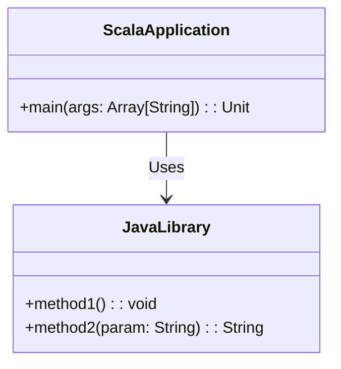

## 13.2 Using Java Libraries in Scala

Scala, a language that elegantly combines object-oriented and functional programming paradigms, runs on the Java Virtual Machine (JVM). This compatibility allows Scala developers to leverage the vast array of Java libraries, frameworks, and tools, thereby enhancing the functionality and performance of Scala applications. In this section, we will explore how to seamlessly integrate Java libraries into Scala projects, discuss best practices, and provide practical examples to illustrate the process.

### Introduction to Java-Scala Interoperability

Scala's interoperability with Java is one of its most compelling features. This interoperability allows Scala developers to utilize Java libraries without any special configuration, making it possible to access a wealth of pre-existing Java code and libraries. This capability is particularly beneficial for projects that require specific functionalities already implemented in Java or for teams transitioning from Java to Scala.

#### Key Advantages of Using Java Libraries in Scala

- **Rich Ecosystem**: Java has a mature ecosystem with a vast number of libraries and frameworks that can be directly used in Scala projects.
- **Performance**: Java libraries are often highly optimized, providing performance benefits.
- **Community Support**: Java libraries have extensive community support, documentation, and resources.
- **Compatibility**: Scala's seamless integration with Java ensures that you can use Java libraries without any significant overhead.

### Setting Up Your Scala Project to Use Java Libraries

To use Java libraries in your Scala project, you need to configure your build tool to include the Java dependencies. The most common build tools for Scala are SBT (Scala Build Tool) and Maven. Let's explore how to set up these tools to use Java libraries.

#### Using SBT

SBT is the de facto build tool for Scala projects. To include a Java library in your Scala project using SBT, you need to add the library as a dependency in your `build.sbt` file.

```scala
// build.sbt
name := "ScalaJavaIntegration"

version := "0.1"

scalaVersion := "2.13.8"

// Add the Java library dependency
libraryDependencies += "org.apache.commons" % "commons-lang3" % "3.12.0"
```

In this example, we are adding the Apache Commons Lang library, a popular Java library, to our Scala project.

#### Using Maven

Maven is another popular build tool used in Java and Scala projects. To include a Java library in your Scala project using Maven, you need to add the library as a dependency in your `pom.xml` file.

```xml
<!-- pom.xml -->
<project xmlns="http://maven.apache.org/POM/4.0.0"
         xmlns:xsi="http://www.w3.org/2001/XMLSchema-instance"
         xsi:schemaLocation="http://maven.apache.org/POM/4.0.0 http://maven.apache.org/xsd/maven-4.0.0.xsd">
    <modelVersion>4.0.0</modelVersion>
    <groupId>com.example</groupId>
    <artifactId>ScalaJavaIntegration</artifactId>
    <version>0.1</version>
    <properties>
        <scala.version>2.13.8</scala.version>
    </properties>
    <dependencies>
        <!-- Add the Java library dependency -->
        <dependency>
            <groupId>org.apache.commons</groupId>
            <artifactId>commons-lang3</artifactId>
            <version>3.12.0</version>
        </dependency>
    </dependencies>
</project>
```

### Accessing Java Libraries in Scala Code

Once you have configured your build tool to include the Java library, you can start using it in your Scala code. Scala's syntax and type system allow you to call Java methods and use Java classes seamlessly.

#### Example: Using Apache Commons Lang in Scala

Let's demonstrate how to use the Apache Commons Lang library in a Scala project. This library provides utility functions for the Java core classes.

```scala
import org.apache.commons.lang3.StringUtils

object StringUtilsExample {
  def main(args: Array[String]): Unit = {
    val str = "Hello, Scala and Java!"
    
    // Use a Java library method to check if the string is empty
    val isEmpty = StringUtils.isEmpty(str)
    println(s"Is the string empty? $isEmpty")
    
    // Use a Java library method to reverse the string
    val reversedStr = StringUtils.reverse(str)
    println(s"Reversed string: $reversedStr")
  }
}
```

In this example, we import the `StringUtils` class from the Apache Commons Lang library and use its methods to check if a string is empty and to reverse a string.

### Handling Java Collections in Scala

Java and Scala have different collection frameworks. Java collections are mutable by default, while Scala collections are immutable. When working with Java libraries, you may need to convert between Java and Scala collections.

#### Converting Java Collections to Scala

Scala provides a convenient way to convert Java collections to Scala collections using the `JavaConverters` object.

```scala
import scala.jdk.CollectionConverters._
import java.util.{List => JList, ArrayList}

object CollectionConversionExample {
  def main(args: Array[String]): Unit = {
    // Create a Java list
    val javaList: JList[String] = new ArrayList[String]()
    javaList.add("Scala")
    javaList.add("Java")
    
    // Convert Java list to Scala list
    val scalaList = javaList.asScala.toList
    println(s"Scala List: $scalaList")
  }
}
```

In this example, we create a Java `ArrayList` and convert it to a Scala `List` using the `asScala` method.

#### Converting Scala Collections to Java

Similarly, you can convert Scala collections to Java collections when needed.

```scala
import scala.jdk.CollectionConverters._
import java.util.{List => JList}

object ScalaToJavaConversionExample {
  def main(args: Array[String]): Unit = {
    // Create a Scala list
    val scalaList = List("Scala", "Java")
    
    // Convert Scala list to Java list
    val javaList: JList[String] = scalaList.asJava
    println(s"Java List: $javaList")
  }
}
```

In this example, we convert a Scala `List` to a Java `List` using the `asJava` method.

### Exception Handling Across Java and Scala

When integrating Java libraries, you may encounter Java exceptions. Scala provides a way to handle these exceptions using its own exception handling mechanisms.

#### Handling Java Exceptions in Scala

Scala's `try-catch` block can be used to handle Java exceptions. You can catch specific Java exceptions and handle them appropriately in your Scala code.

```scala
import java.io.{File, FileInputStream, FileNotFoundException, IOException}

object ExceptionHandlingExample {
  def main(args: Array[String]): Unit = {
    try {
      val file = new File("nonexistent.txt")
      val fis = new FileInputStream(file)
    } catch {
      case e: FileNotFoundException => println(s"File not found: ${e.getMessage}")
      case e: IOException => println(s"I/O error: ${e.getMessage}")
    }
  }
}
```

In this example, we attempt to open a non-existent file and handle the `FileNotFoundException` and `IOException` exceptions.

### Java-Scala Type Compatibility

Scala's type system is compatible with Java's, but there are some differences to be aware of when using Java libraries.

#### Primitive Types

Scala's primitive types correspond directly to Java's primitive types, so you can use them interchangeably.

#### Nullability

Java methods can return `null`, which is not idiomatic in Scala. You can handle `null` values using Scala's `Option` type.

```scala
import org.apache.commons.lang3.StringUtils

object NullHandlingExample {
  def main(args: Array[String]): Unit = {
    val str: String = null
    
    // Handle null using Option
    val optionStr = Option(str)
    println(s"Option value: $optionStr")
    
    // Use a Java library method with null
    val isEmpty = StringUtils.isEmpty(str)
    println(s"Is the string empty? $isEmpty")
  }
}
```

In this example, we use `Option` to handle a potential `null` value returned by a Java method.

### Best Practices for Using Java Libraries in Scala

When integrating Java libraries into your Scala projects, consider the following best practices to ensure a smooth and efficient development process.

#### Understand the Library's API

Before using a Java library, familiarize yourself with its API and documentation. This understanding will help you use the library effectively and avoid common pitfalls.

#### Handle Null Values

Java libraries may return `null` values, which are not idiomatic in Scala. Use Scala's `Option` type to handle potential `null` values and avoid `NullPointerException`.

#### Convert Collections Appropriately

When working with collections, convert Java collections to Scala collections and vice versa as needed. Use the `JavaConverters` object to facilitate these conversions.

#### Manage Dependencies

Keep your dependencies up-to-date and manage them using your build tool. Regularly check for updates to the Java libraries you are using to benefit from bug fixes and new features.

#### Test Thoroughly

Test your Scala code thoroughly when integrating Java libraries. Ensure that the Java methods are being called correctly and that the expected results are obtained.

### Try It Yourself

Now that we've covered the basics of using Java libraries in Scala, it's time to experiment with your own projects. Try integrating a Java library that interests you into a Scala project. Modify the code examples provided in this section to suit your needs and explore the rich Java ecosystem.

### Visualizing Java-Scala Interoperability

To better understand how Scala interacts with Java libraries, let's visualize the process using a class diagram.



**Diagram Description**: This class diagram illustrates the relationship between a Scala application and a Java library. The Scala application uses methods from the Java library, demonstrating the interoperability between Scala and Java.

### Knowledge Check

Let's reinforce what we've learned with a few questions:

- What are the key advantages of using Java libraries in Scala?
- How do you add a Java library dependency in an SBT project?
- How can you handle `null` values returned by Java methods in Scala?
- What is the purpose of the `JavaConverters` object in Scala?
- How can you convert a Scala collection to a Java collection?

### Conclusion

Integrating Java libraries into Scala projects opens up a world of possibilities, allowing you to leverage the rich Java ecosystem while enjoying the benefits of Scala's expressive syntax and powerful type system. By following best practices and understanding the nuances of Java-Scala interoperability, you can create robust and efficient applications that take advantage of the best features of both languages.

Remember, this is just the beginning. As you progress, you'll discover more ways to enhance your Scala projects with Java libraries. Keep experimenting, stay curious, and enjoy the journey!

## Quiz Time!



### What is one of the key advantages of using Java libraries in Scala?

- [x] Access to a mature ecosystem with extensive libraries
- [ ] Scala's syntax is more concise than Java's
- [ ] Java libraries are written in a functional style
- [ ] Scala has better performance than Java

> **Explanation:** One of the key advantages of using Java libraries in Scala is access to a mature ecosystem with extensive libraries, which can enhance functionality and performance.

### How do you add a Java library dependency in an SBT project?

- [x] By adding the library to the `libraryDependencies` in the `build.sbt` file
- [ ] By importing the library directly in the Scala code
- [ ] By configuring the library in the `pom.xml` file
- [ ] By downloading the library manually and placing it in the project folder

> **Explanation:** In an SBT project, you add a Java library dependency by including it in the `libraryDependencies` section of the `build.sbt` file.

### What is the purpose of the `JavaConverters` object in Scala?

- [x] To facilitate conversions between Java and Scala collections
- [ ] To convert Java code into Scala code
- [ ] To improve the performance of Java libraries in Scala
- [ ] To handle exceptions thrown by Java libraries

> **Explanation:** The `JavaConverters` object in Scala is used to facilitate conversions between Java and Scala collections, making it easier to work with both types of collections.

### How can you handle `null` values returned by Java methods in Scala?

- [x] By using Scala's `Option` type
- [ ] By using a `try-catch` block
- [ ] By converting them to `None`
- [ ] By ignoring them

> **Explanation:** In Scala, you can handle `null` values returned by Java methods using Scala's `Option` type, which provides a safe way to deal with optional values.

### What is a common practice when integrating Java libraries into Scala projects?

- [x] Testing thoroughly to ensure correct integration
- [ ] Avoiding the use of Java collections
- [ ] Using only libraries that are written in a functional style
- [ ] Manually converting all Java code to Scala

> **Explanation:** A common practice when integrating Java libraries into Scala projects is to test thoroughly to ensure that the integration is correct and that the expected results are obtained.

### How do you convert a Scala collection to a Java collection?

- [x] Using the `asJava` method from `JavaConverters`
- [ ] By directly casting the Scala collection
- [ ] By writing a custom conversion function
- [ ] By using a third-party library

> **Explanation:** You can convert a Scala collection to a Java collection using the `asJava` method from the `JavaConverters` object.

### Which build tool is commonly used for Scala projects?

- [x] SBT (Scala Build Tool)
- [ ] Gradle
- [ ] Ant
- [ ] Make

> **Explanation:** SBT (Scala Build Tool) is the de facto build tool for Scala projects, providing a simple way to manage dependencies and build configurations.

### What should you do before using a Java library in Scala?

- [x] Familiarize yourself with the library's API and documentation
- [ ] Rewrite the library in Scala
- [ ] Ensure the library is open-source
- [ ] Convert the library to a functional style

> **Explanation:** Before using a Java library in Scala, it's important to familiarize yourself with the library's API and documentation to use it effectively and avoid common pitfalls.

### What is a potential issue when using Java libraries in Scala?

- [x] Handling `null` values returned by Java methods
- [ ] Java libraries are not compatible with Scala
- [ ] Java libraries are slower than Scala libraries
- [ ] Java libraries cannot be used in SBT projects

> **Explanation:** A potential issue when using Java libraries in Scala is handling `null` values returned by Java methods, as `null` is not idiomatic in Scala.

### True or False: Scala's type system is incompatible with Java's type system.

- [ ] True
- [x] False

> **Explanation:** False. Scala's type system is compatible with Java's type system, allowing seamless integration and use of Java libraries in Scala projects.


