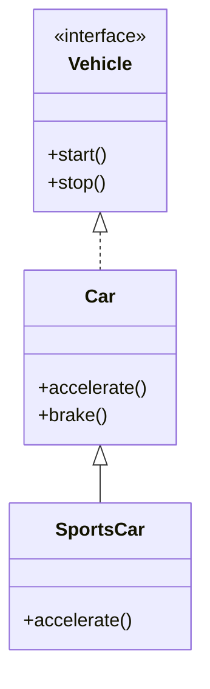

## 13.3 Implementing Interfaces and Abstract Classes

In the realm of software development, Scala stands out as a versatile language that bridges the gap between functional and object-oriented programming paradigms. One of its most powerful features is its seamless interoperability with Java, which allows developers to leverage existing Java libraries and frameworks while enjoying the expressive power of Scala. In this section, we will delve into how Scala can implement Java interfaces and abstract classes, a crucial aspect for integrating with Java's object-oriented constructs.

### Understanding Interfaces and Abstract Classes

Before we dive into Scala's capabilities, let's briefly recap what interfaces and abstract classes are in Java.

#### Interfaces

An interface in Java is a reference type, similar to a class, that can contain only constants, method signatures, default methods, static methods, and nested types. Interfaces cannot contain instance fields or constructors. They are used to achieve abstraction and multiple inheritance in Java.

```java
public interface Vehicle {
    void start();
    void stop();
}
```

#### Abstract Classes

An abstract class in Java is a class that cannot be instantiated on its own and may contain abstract methods (methods without a body) as well as concrete methods. Abstract classes are used to provide a common base for subclasses.

```java
public abstract class Car {
    abstract void accelerate();
    
    void brake() {
        System.out.println("Car is slowing down.");
    }
}
```

### Implementing Java Interfaces in Scala

Scala provides a straightforward way to implement Java interfaces. Since Scala classes can extend Java interfaces directly, you can define a Scala class that implements all the methods declared in a Java interface.

#### Example: Implementing a Java Interface

Let's consider a simple Java interface `Vehicle` and implement it in Scala.

```java
// Java Interface
public interface Vehicle {
    void start();
    void stop();
}
```

```scala
// Scala Implementation
class Car extends Vehicle {
  def start(): Unit = {
    println("Car started.")
  }
  
  def stop(): Unit = {
    println("Car stopped.")
  }
}
```

In this example, the Scala class `Car` implements the `Vehicle` interface by providing concrete implementations for the `start` and `stop` methods.

### Implementing Java Abstract Classes in Scala

Scala also allows you to extend Java abstract classes. When extending an abstract class, you must provide implementations for all its abstract methods.

#### Example: Extending a Java Abstract Class

Consider the following Java abstract class:

```java
// Java Abstract Class
public abstract class Car {
    abstract void accelerate();
    
    void brake() {
        System.out.println("Car is slowing down.");
    }
}
```

Here's how you can extend this abstract class in Scala:

```scala
// Scala Implementation
class SportsCar extends Car {
  def accelerate(): Unit = {
    println("SportsCar is accelerating.")
  }
  
  // The brake method is inherited and can be used as is
}
```

In this example, the Scala class `SportsCar` extends the Java abstract class `Car` and provides an implementation for the `accelerate` method. The `brake` method is inherited and can be used without modification.

### Key Differences Between Interfaces and Abstract Classes

Understanding the differences between interfaces and abstract classes is crucial when deciding which to use.

- **Multiple Inheritance**: Interfaces allow multiple inheritance, meaning a class can implement multiple interfaces. Abstract classes do not support multiple inheritance.
- **Default Methods**: Interfaces can have default methods with implementations, while abstract classes can have both abstract and concrete methods.
- **State**: Abstract classes can have instance variables, whereas interfaces cannot.

### Scala Traits vs. Java Interfaces

Scala introduces traits, which are similar to Java interfaces but more powerful. Traits can have both abstract and concrete methods, and they support multiple inheritance. This makes them a flexible tool for code reuse.

#### Example: Using Traits in Scala

```scala
trait Vehicle {
  def start(): Unit
  def stop(): Unit
}

class Car extends Vehicle {
  def start(): Unit = println("Car started.")
  def stop(): Unit = println("Car stopped.")
}
```

Traits can be mixed into classes using the `with` keyword, allowing for a form of multiple inheritance.

### Integrating Scala with Java: Best Practices

When integrating Scala with Java, consider the following best practices:

- **Use Traits for Flexibility**: Leverage Scala traits for code reuse and flexibility. They can be mixed into classes to provide additional functionality.
- **Favor Composition Over Inheritance**: While Scala supports inheritance, favor composition to enhance code modularity and maintainability.
- **Leverage Scala's Type System**: Utilize Scala's powerful type system to enforce constraints and ensure type safety.
- **Consider Performance Implications**: Be aware of performance implications when mixing Scala and Java code, especially regarding method dispatch and type conversions.

### Visualizing Class Hierarchies

To better understand the relationship between Scala classes, traits, and Java interfaces or abstract classes, let's visualize a simple class hierarchy using Mermaid.js.



This diagram illustrates how the `Car` class implements the `Vehicle` interface and how `SportsCar` extends `Car`.

### Try It Yourself

To deepen your understanding, try modifying the code examples:

- **Add a New Method**: Introduce a new method in the `Vehicle` interface and implement it in the `Car` class.
- **Create a New Trait**: Define a new trait with a default method and mix it into the `Car` class.
- **Experiment with Abstract Classes**: Create a new abstract class with multiple abstract methods and extend it in Scala.

### References and Further Reading

- [Scala Documentation](https://docs.scala-lang.org/)
- [Java Documentation](https://docs.oracle.com/en/java/)
- [Scala and Java Interoperability](https://docs.scala-lang.org/tutorials/scala-for-java-programmers.html)

### Knowledge Check

- **What is the primary difference between a Java interface and an abstract class?**
- **How can Scala traits be used to achieve multiple inheritance?**
- **What are some best practices for integrating Scala with Java?**

### Embrace the Journey

Remember, integrating Scala with Java's object-oriented constructs is just the beginning. As you progress, you'll discover more powerful ways to leverage both languages' strengths. Keep experimenting, stay curious, and enjoy the journey!

## Quiz Time!



### What is a primary feature of Java interfaces?

- [x] They allow multiple inheritance.
- [ ] They can have instance variables.
- [ ] They can be instantiated.
- [ ] They must contain only abstract methods.

> **Explanation:** Java interfaces allow multiple inheritance, meaning a class can implement multiple interfaces.

### How does Scala implement Java interfaces?

- [x] By extending the interface and providing implementations for its methods.
- [ ] By using the `with` keyword.
- [ ] By creating a companion object.
- [ ] By using implicit conversions.

> **Explanation:** Scala classes can extend Java interfaces directly and must provide implementations for all the interface methods.

### What is a key difference between Scala traits and Java interfaces?

- [x] Traits can have concrete methods.
- [ ] Traits cannot be mixed into classes.
- [ ] Traits must be instantiated.
- [ ] Traits do not support multiple inheritance.

> **Explanation:** Scala traits can have both abstract and concrete methods, unlike Java interfaces which traditionally only had abstract methods.

### What is a benefit of using Scala traits?

- [x] They provide a flexible way to achieve code reuse.
- [ ] They enforce strict type constraints.
- [ ] They improve runtime performance.
- [ ] They eliminate the need for interfaces.

> **Explanation:** Scala traits provide a flexible way to achieve code reuse and can be mixed into classes to provide additional functionality.

### How can you visualize class hierarchies in Scala?

- [x] Using Mermaid.js diagrams.
- [ ] Using UML diagrams only.
- [ ] By writing pseudocode.
- [ ] By using only textual descriptions.

> **Explanation:** Mermaid.js diagrams can be used to visually represent class hierarchies and relationships.

### What is a best practice when integrating Scala with Java?

- [x] Favor composition over inheritance.
- [ ] Use inheritance extensively.
- [ ] Avoid using Scala's type system.
- [ ] Ignore performance implications.

> **Explanation:** Favoring composition over inheritance enhances code modularity and maintainability.

### What is a common use of abstract classes in Java?

- [x] To provide a common base for subclasses with shared behavior.
- [ ] To implement multiple inheritance.
- [ ] To define constants.
- [ ] To create instance variables.

> **Explanation:** Abstract classes are used to provide a common base for subclasses with shared behavior and can include both abstract and concrete methods.

### How can Scala traits be mixed into classes?

- [x] Using the `with` keyword.
- [ ] Using the `extends` keyword.
- [ ] By creating a companion object.
- [ ] By using implicit conversions.

> **Explanation:** Scala traits can be mixed into classes using the `with` keyword, allowing for multiple inheritance.

### What is a key consideration when using Scala and Java together?

- [x] Be aware of performance implications.
- [ ] Avoid using Java libraries.
- [ ] Use only Scala's functional features.
- [ ] Ignore Java's object-oriented constructs.

> **Explanation:** When using Scala and Java together, it's important to be aware of performance implications, especially regarding method dispatch and type conversions.

### Scala traits support multiple inheritance.

- [x] True
- [ ] False

> **Explanation:** Scala traits support multiple inheritance, allowing them to be mixed into classes to provide additional functionality.


