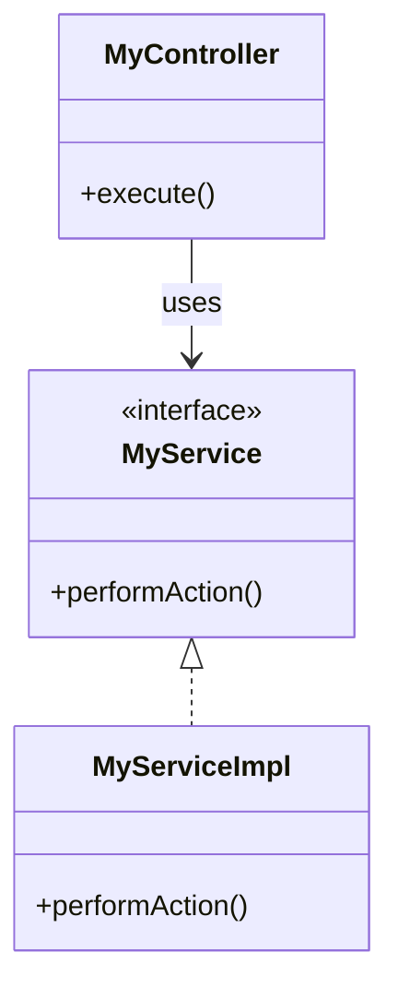

## 13.4 Dependency Injection in Java Applications

Dependency Injection (DI) is a powerful design pattern that helps in creating loosely coupled and easily testable software components. In this section, we will delve into the intricacies of Dependency Injection in Java applications and explore how Scala can be leveraged to utilize DI frameworks effectively. This comprehensive guide will provide expert software engineers and architects with the knowledge needed to integrate DI frameworks with Scala seamlessly.

### Understanding Dependency Injection

**Dependency Injection** is a design pattern used to implement Inversion of Control (IoC) for resolving dependencies. It involves providing a component with its dependencies from an external source rather than the component creating them itself. This approach leads to more modular, testable, and maintainable code.

#### Key Concepts of Dependency Injection

- **Inversion of Control (IoC):** A principle where the control of object creation and management is transferred from the component to an external entity.
- **Dependencies:** Components or services that a class requires to function.
- **Injection:** The process of providing dependencies to a class, typically through constructors, setters, or interfaces.

### Benefits of Dependency Injection

1. **Loose Coupling:** DI promotes loose coupling between components, making it easier to change or replace components without affecting others.
2. **Testability:** By injecting dependencies, it becomes easier to mock or stub them during testing, leading to more effective unit tests.
3. **Maintainability:** With clear separation of concerns, DI enhances the maintainability of the codebase.
4. **Configuration Management:** DI frameworks often provide configuration management capabilities, allowing for easy management of component lifecycles and configurations.

### DI Frameworks in the Java Ecosystem

Java offers several DI frameworks that facilitate the implementation of Dependency Injection. Some of the most popular frameworks include:

- **Spring Framework:** A comprehensive framework that provides a wide range of features, including DI, aspect-oriented programming, and transaction management.
- **Google Guice:** A lightweight DI framework that emphasizes simplicity and ease of use.
- **CDI (Contexts and Dependency Injection):** A standard for DI in Java EE applications, providing a set of services for managing dependencies.

### Integrating Scala with Java DI Frameworks

Scala, being a JVM language, can seamlessly integrate with Java DI frameworks. This integration allows Scala developers to leverage the robust DI capabilities of Java frameworks while benefiting from Scala's expressive syntax and functional programming features.

#### Using Spring Framework with Scala

The Spring Framework is one of the most widely used DI frameworks in the Java ecosystem. It provides comprehensive support for DI and can be easily integrated with Scala applications.

##### Setting Up Spring with Scala

To use Spring with Scala, you need to include the necessary Spring dependencies in your Scala project. This can be done using a build tool like SBT (Simple Build Tool).

```scala
// build.sbt
libraryDependencies ++= Seq(
  "org.springframework" % "spring-context" % "5.3.10",
  "org.springframework" % "spring-beans" % "5.3.10"
)
```

##### Defining Beans in Scala

In Spring, beans are the objects that form the backbone of your application. You can define beans in Scala using annotations or XML configuration.

###### Using Annotations

```scala
import org.springframework.context.annotation.{Bean, Configuration}

@Configuration
class AppConfig {

  @Bean
  def myService(): MyService = {
    new MyServiceImpl()
  }
}
```

###### Using XML Configuration

```xml
<beans xmlns="http://www.springframework.org/schema/beans"
       xmlns:xsi="http://www.w3.org/2001/XMLSchema-instance"
       xsi:schemaLocation="http://www.springframework.org/schema/beans
       http://www.springframework.org/schema/beans/spring-beans.xsd">

    <bean id="myService" class="com.example.MyServiceImpl"/>
</beans>
```

##### Injecting Dependencies

Spring provides various ways to inject dependencies into your Scala components, such as constructor injection, setter injection, and field injection.

###### Constructor Injection

```scala
class MyController @Autowired()(myService: MyService) {
  def execute(): Unit = {
    myService.performAction()
  }
}
```

###### Setter Injection

```scala
class MyController {

  private var myService: MyService = _

  @Autowired
  def setMyService(service: MyService): Unit = {
    this.myService = service
  }

  def execute(): Unit = {
    myService.performAction()
  }
}
```

###### Field Injection

```scala
class MyController {

  @Autowired
  private var myService: MyService = _

  def execute(): Unit = {
    myService.performAction()
  }
}
```

#### Using Google Guice with Scala

Google Guice is a lightweight DI framework that focuses on simplicity and ease of use. It can be easily integrated with Scala applications.

##### Setting Up Guice with Scala

To use Guice with Scala, include the Guice dependency in your SBT project.

```scala
// build.sbt
libraryDependencies += "com.google.inject" % "guice" % "5.0.1"
```

##### Defining Modules and Injecting Dependencies

In Guice, you define modules to configure bindings between interfaces and their implementations.

```scala
import com.google.inject.{AbstractModule, Guice, Inject}

trait MyService {
  def performAction(): Unit
}

class MyServiceImpl extends MyService {
  override def performAction(): Unit = println("Action performed!")
}

class MyModule extends AbstractModule {
  override def configure(): Unit = {
    bind(classOf[MyService]).to(classOf[MyServiceImpl])
  }
}

class MyController @Inject()(myService: MyService) {
  def execute(): Unit = {
    myService.performAction()
  }
}

object Main extends App {
  val injector = Guice.createInjector(new MyModule())
  val controller = injector.getInstance(classOf[MyController])
  controller.execute()
}
```

### Visualizing Dependency Injection

To better understand the flow of Dependency Injection, let's visualize the process using a class diagram.



**Caption:** The diagram illustrates the relationship between `MyController`, `MyService`, and `MyServiceImpl`. `MyController` depends on `MyService`, which is implemented by `MyServiceImpl`.

### Design Considerations for Dependency Injection

When implementing Dependency Injection in Scala applications using Java frameworks, consider the following:

1. **Lifecycle Management:** Ensure that the DI framework manages the lifecycle of your components appropriately.
2. **Configuration Complexity:** Be mindful of the complexity introduced by DI configurations, especially in large applications.
3. **Performance Overhead:** While DI provides numerous benefits, it may introduce some performance overhead due to reflection and proxying.
4. **Scala-Specific Features:** Leverage Scala's features, such as traits and case classes, to enhance the flexibility and expressiveness of your DI configurations.

### Differences and Similarities with Other Patterns

Dependency Injection is often compared with other design patterns, such as:

- **Service Locator Pattern:** Unlike DI, the Service Locator pattern involves a component actively looking up its dependencies from a central registry. DI is generally preferred for its testability and loose coupling.
- **Factory Pattern:** While both patterns deal with object creation, DI focuses on providing dependencies, whereas the Factory pattern focuses on creating objects based on specific criteria.

### Try It Yourself

To deepen your understanding of Dependency Injection, try modifying the code examples provided:

1. **Experiment with Different Injection Methods:** Try using constructor, setter, and field injection in the Spring example.
2. **Create a New Service:** Define a new service interface and implementation, and inject it into the `MyController` class.
3. **Use XML Configuration in Guice:** Explore how you can use XML configuration to define bindings in Guice.

### Knowledge Check

1. **What is the primary benefit of using Dependency Injection?**
2. **How does Spring Framework facilitate Dependency Injection in Scala applications?**
3. **What are the key differences between constructor injection and setter injection?**
4. **How can Google Guice be integrated with Scala applications?**
5. **What are some design considerations when using Dependency Injection?**

### Conclusion

Dependency Injection is a crucial design pattern that enhances the modularity, testability, and maintainability of software applications. By integrating DI frameworks with Scala, developers can leverage the strengths of both Java and Scala to build robust and scalable applications. Remember, this is just the beginning. As you progress, you'll build more complex and interactive applications. Keep experimenting, stay curious, and enjoy the journey!

## Quiz Time!



### What is Dependency Injection?

- [x] A design pattern used to implement Inversion of Control for resolving dependencies.
- [ ] A method for creating objects in a factory pattern.
- [ ] A way to manage database connections.
- [ ] A technique for optimizing performance.

> **Explanation:** Dependency Injection is a design pattern that provides a way to implement Inversion of Control, allowing for the resolution of dependencies from an external source.

### Which of the following is a benefit of Dependency Injection?

- [x] Loose Coupling
- [x] Testability
- [x] Maintainability
- [ ] Increased complexity

> **Explanation:** Dependency Injection promotes loose coupling, enhances testability, and improves maintainability by separating concerns and managing dependencies externally.

### How does Spring Framework support Dependency Injection?

- [x] Through annotations and XML configuration
- [ ] By providing a centralized service locator
- [ ] By using only constructor injection
- [ ] By enforcing singleton patterns

> **Explanation:** Spring Framework supports Dependency Injection through annotations and XML configuration, allowing for flexible and configurable dependency management.

### What is the primary focus of the Factory Pattern?

- [ ] Providing dependencies
- [x] Creating objects based on specific criteria
- [ ] Managing application configuration
- [ ] Enhancing testability

> **Explanation:** The Factory Pattern focuses on creating objects based on specific criteria, whereas Dependency Injection focuses on providing dependencies.

### What is a key difference between constructor injection and setter injection?

- [x] Constructor injection requires dependencies to be provided at object creation.
- [ ] Setter injection requires dependencies to be provided at object creation.
- [ ] Constructor injection allows for optional dependencies.
- [ ] Setter injection does not allow for optional dependencies.

> **Explanation:** Constructor injection requires dependencies to be provided at the time of object creation, ensuring that the object is fully initialized with its dependencies.

### How can Google Guice be integrated with Scala applications?

- [x] By including the Guice dependency in the SBT project
- [ ] By using XML configuration exclusively
- [ ] By implementing a service locator pattern
- [ ] By using only field injection

> **Explanation:** Google Guice can be integrated with Scala applications by including the Guice dependency in the SBT project, allowing for the use of Guice's DI capabilities.

### What is the role of a module in Google Guice?

- [x] To configure bindings between interfaces and their implementations
- [ ] To manage database connections
- [ ] To provide a centralized service locator
- [ ] To enforce singleton patterns

> **Explanation:** In Google Guice, a module is used to configure bindings between interfaces and their implementations, defining how dependencies are resolved.

### What is the Service Locator Pattern?

- [ ] A pattern for managing database connections
- [x] A pattern where a component actively looks up its dependencies from a central registry
- [ ] A pattern for creating objects based on specific criteria
- [ ] A pattern for optimizing performance

> **Explanation:** The Service Locator Pattern involves a component actively looking up its dependencies from a central registry, contrasting with Dependency Injection's external provision of dependencies.

### What is a potential drawback of Dependency Injection?

- [ ] Improved testability
- [ ] Enhanced maintainability
- [x] Performance overhead
- [ ] Loose coupling

> **Explanation:** While Dependency Injection offers many benefits, it may introduce some performance overhead due to reflection and proxying.

### True or False: Dependency Injection can only be implemented using constructor injection.

- [ ] True
- [x] False

> **Explanation:** Dependency Injection can be implemented using various methods, including constructor injection, setter injection, and field injection, providing flexibility in how dependencies are provided.


