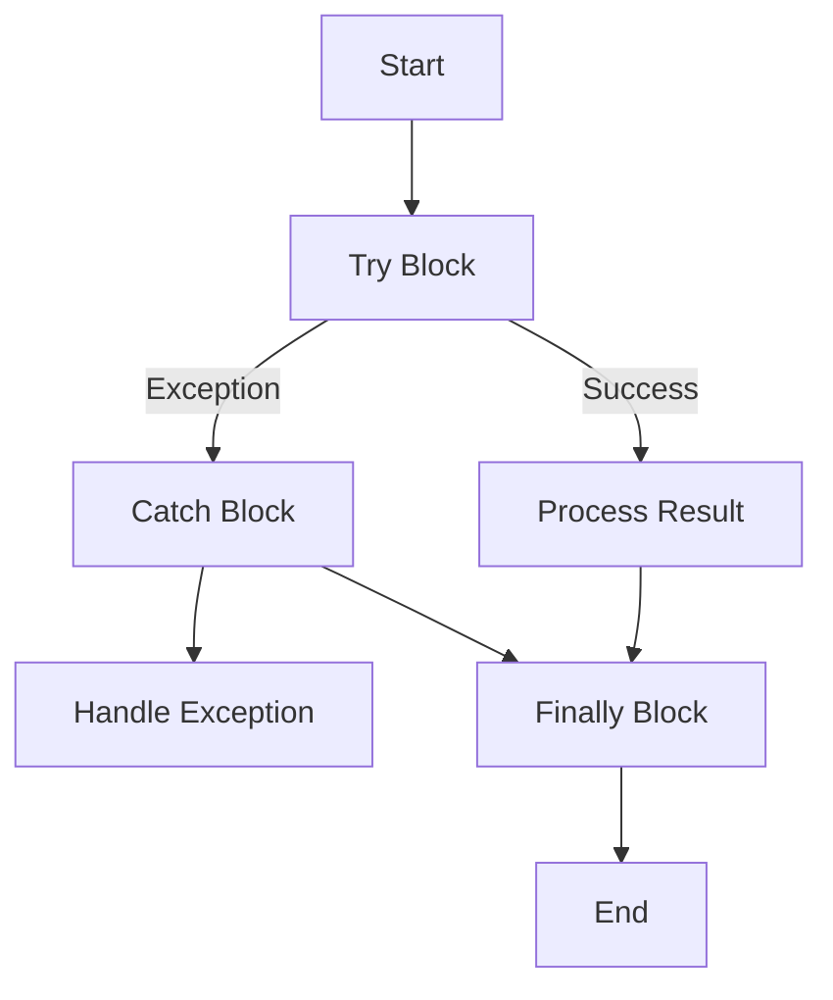

## 13.5 Exception Handling and Java Exceptions

In the realm of software development, exception handling is a critical aspect that ensures robustness and reliability. When working with Scala, a language that seamlessly interoperates with Java, understanding how to handle exceptions across these language boundaries becomes paramount. This section delves into the intricacies of exception handling in Scala, focusing on managing Java exceptions and ensuring seamless interoperability between Scala and Java.

### Introduction to Exception Handling

Exception handling is a mechanism to handle runtime errors, ensuring that the normal flow of the application is not disrupted. In Scala, exception handling is influenced by its functional programming paradigm, which emphasizes immutability and pure functions. However, since Scala runs on the Java Virtual Machine (JVM), it inherits Java's exception handling model, which is based on try-catch-finally blocks.

#### Key Concepts

- **Exceptions**: Unforeseen events that disrupt the normal flow of a program.
- **Error Handling**: Techniques to manage exceptions and ensure program stability.
- **Interoperability**: The ability of Scala to work seamlessly with Java, including handling Java exceptions.

### Scala's Approach to Exception Handling

Scala provides a robust mechanism for exception handling, combining Java's traditional try-catch-finally blocks with functional constructs like `Try`, `Option`, and `Either`. This hybrid approach allows developers to choose the most suitable method for their specific use case.

#### Try-Catch-Finally

Scala's try-catch-finally construct is similar to Java's, allowing developers to catch exceptions and execute cleanup code. Here's a basic example:

```scala
try {
  // Code that may throw an exception
  val result = riskyOperation()
} catch {
  case e: ArithmeticException => println("Arithmetic error: " + e.getMessage)
  case e: Exception => println("General error: " + e.getMessage)
} finally {
  // Cleanup code
  println("Cleanup completed.")
}
```

#### Functional Error Handling

Scala's functional programming paradigm introduces constructs like `Try`, `Option`, and `Either` for handling errors in a more declarative manner.

- **Try**: Represents a computation that may result in an exception. It can be either `Success` or `Failure`.

```scala
import scala.util.{Try, Success, Failure}

val result = Try(riskyOperation())

result match {
  case Success(value) => println("Success: " + value)
  case Failure(exception) => println("Failed with exception: " + exception.getMessage)
}
```

- **Option**: Represents a value that may or may not be present, avoiding null references.

```scala
val result: Option[Int] = Some(42) // or None
result match {
  case Some(value) => println("Value: " + value)
  case None => println("No value present")
}
```

- **Either**: Represents a value of one of two possible types, often used for error handling.

```scala
val result: Either[String, Int] = Right(42) // or Left("Error message")
result match {
  case Right(value) => println("Value: " + value)
  case Left(error) => println("Error: " + error)
}
```

### Java Exceptions in Scala

Scala's interoperability with Java extends to exception handling. When calling Java code from Scala, Java exceptions can be caught and handled using Scala's try-catch-finally construct.

#### Handling Java Exceptions

When invoking Java methods that throw exceptions, Scala can catch these exceptions just like Java. Here's an example:

```scala
try {
  val file = new java.io.FileInputStream("nonexistentfile.txt")
} catch {
  case e: java.io.FileNotFoundException => println("File not found: " + e.getMessage)
  case e: java.io.IOException => println("IO error: " + e.getMessage)
}
```

#### Converting Java Exceptions to Scala Constructs

Scala's functional constructs can be used to handle Java exceptions more idiomatically. For instance, converting a Java exception to a `Try`:

```scala
import scala.util.{Try, Success, Failure}

def readFile(fileName: String): Try[String] = Try {
  val source = scala.io.Source.fromFile(fileName)
  try source.mkString finally source.close()
}

val result = readFile("nonexistentfile.txt")

result match {
  case Success(content) => println("File content: " + content)
  case Failure(exception) => println("Error reading file: " + exception.getMessage)
}
```

### Best Practices for Exception Handling in Scala

1. **Use Functional Constructs**: Prefer `Try`, `Option`, and `Either` for error handling to leverage Scala's functional programming capabilities.
2. **Handle Specific Exceptions**: Catch specific exceptions rather than using a generic `Exception` to provide more meaningful error handling.
3. **Avoid Side Effects**: Keep exception handling logic pure and free from side effects.
4. **Use Finally for Cleanup**: Ensure resources are released by using the finally block for cleanup operations.
5. **Convert Java Exceptions**: Convert Java exceptions to Scala's functional constructs for more idiomatic handling.

### Visualizing Exception Handling Flow

To better understand the flow of exception handling in Scala, let's visualize the process using a flowchart.



**Figure 1**: Exception Handling Flow in Scala

### Interoperability Challenges

While Scala's interoperability with Java is seamless, there are challenges when handling exceptions across these languages:

- **Checked vs. Unchecked Exceptions**: Java distinguishes between checked and unchecked exceptions, while Scala treats all exceptions as unchecked. This can lead to differences in how exceptions are propagated and handled.
- **Null Handling**: Java's use of null can lead to `NullPointerException` in Scala. It's essential to use `Option` to handle potential null values.
- **Performance Overhead**: Converting Java exceptions to Scala's functional constructs may introduce performance overhead. It's crucial to balance idiomatic Scala code with performance considerations.

### Advanced Exception Handling Techniques

#### Custom Exception Types

In Scala, you can define custom exception types to represent specific error conditions. This is particularly useful for domain-specific errors.

```scala
class CustomException(message: String) extends Exception(message)

def riskyOperation(): Int = {
  throw new CustomException("Custom error occurred")
}

try {
  riskyOperation()
} catch {
  case e: CustomException => println("Caught custom exception: " + e.getMessage)
}
```

#### Using Monad Transformers

Monad transformers can be used to combine multiple monadic effects, such as handling exceptions within a computation that returns an `Option`.

```scala
import cats.data.OptionT
import cats.implicits._

def safeDivide(a: Int, b: Int): OptionT[Try, Int] = OptionT {
  Try {
    if (b == 0) None else Some(a / b)
  }
}

val result = safeDivide(10, 0).value

result match {
  case Success(Some(value)) => println("Result: " + value)
  case Success(None) => println("Division by zero")
  case Failure(exception) => println("Error: " + exception.getMessage)
}
```

### Try It Yourself

To deepen your understanding, try modifying the code examples provided. For instance, change the exception types or use different functional constructs like `Either` instead of `Try`. Experiment with handling multiple exceptions and observe how Scala's type system helps in managing these scenarios.

### References and Further Reading

- [Scala Documentation on Exception Handling](https://docs.scala-lang.org/overviews/scala-book/handling-errors.html)
- [Java Exception Handling](https://docs.oracle.com/javase/tutorial/essential/exceptions/)
- [Functional Programming in Scala](https://www.manning.com/books/functional-programming-in-scala)

### Knowledge Check

1. Explain the difference between `Try` and `Either` in Scala.
2. How does Scala handle Java's checked exceptions?
3. What are the benefits of using `Option` over null in Scala?
4. Describe a scenario where you would use a custom exception type in Scala.
5. How can monad transformers be used in exception handling?

### Embrace the Journey

Remember, mastering exception handling in Scala, especially when dealing with Java exceptions, is a journey. As you progress, you'll build more robust and resilient applications. Keep experimenting, stay curious, and enjoy the journey!

## Quiz Time!



### What is the primary purpose of exception handling in Scala?

- [x] To manage runtime errors and ensure program stability.
- [ ] To enhance code readability.
- [ ] To improve performance.
- [ ] To simplify syntax.

> **Explanation:** Exception handling is primarily used to manage runtime errors and ensure that the program continues to run smoothly.

### How does Scala's `Try` differ from Java's try-catch?

- [x] `Try` is a functional construct that represents a computation that may fail, while try-catch is a procedural construct.
- [ ] `Try` is used for asynchronous operations, while try-catch is for synchronous ones.
- [ ] `Try` can only handle checked exceptions, while try-catch can handle both checked and unchecked exceptions.
- [ ] `Try` is a Scala 3 feature, while try-catch is available in Scala 2.

> **Explanation:** `Try` is a functional construct that encapsulates a computation that may fail, providing a more declarative way to handle exceptions compared to the procedural try-catch block.

### What is the advantage of using `Option` in Scala?

- [x] It avoids null references and potential `NullPointerException`.
- [ ] It improves performance by reducing memory usage.
- [ ] It simplifies exception handling by eliminating the need for try-catch blocks.
- [ ] It is only used for asynchronous operations.

> **Explanation:** `Option` is used to represent values that may or may not be present, avoiding null references and potential `NullPointerException`.

### How can you convert a Java exception to a Scala `Try`?

- [x] By wrapping the Java method call in a `Try` block.
- [ ] By using a special Scala library for Java exceptions.
- [ ] By manually catching the exception and returning a `Try`.
- [ ] By using a Scala macro.

> **Explanation:** You can convert a Java exception to a Scala `Try` by wrapping the Java method call in a `Try` block, which will capture any exceptions as `Failure`.

### What is a common challenge when handling exceptions across Scala and Java?

- [x] Managing checked vs. unchecked exceptions.
- [ ] Handling asynchronous exceptions.
- [ ] Converting exceptions to strings.
- [ ] Using exceptions for control flow.

> **Explanation:** A common challenge is managing the differences between Java's checked and unchecked exceptions, as Scala treats all exceptions as unchecked.

### Why might you define a custom exception type in Scala?

- [x] To represent specific domain-specific error conditions.
- [ ] To improve performance.
- [ ] To simplify syntax.
- [ ] To handle asynchronous operations.

> **Explanation:** Custom exception types are useful for representing specific domain-specific error conditions, providing more meaningful error handling.

### What is a benefit of using monad transformers in exception handling?

- [x] They allow combining multiple monadic effects, such as handling exceptions within an `Option`.
- [ ] They improve performance by reducing memory usage.
- [ ] They simplify syntax by eliminating the need for try-catch blocks.
- [ ] They are only used for asynchronous operations.

> **Explanation:** Monad transformers allow combining multiple monadic effects, such as handling exceptions within an `Option`, providing a more expressive way to manage complex computations.

### What is the role of the `finally` block in exception handling?

- [x] To execute cleanup code regardless of whether an exception was thrown.
- [ ] To catch exceptions that were not handled in the `catch` block.
- [ ] To improve performance by reducing memory usage.
- [ ] To simplify syntax by eliminating the need for try-catch blocks.

> **Explanation:** The `finally` block is used to execute cleanup code, ensuring that resources are released regardless of whether an exception was thrown.

### How does Scala handle Java's null values?

- [x] By using `Option` to represent values that may or may not be present.
- [ ] By throwing a `NullPointerException` immediately.
- [ ] By converting null values to empty strings.
- [ ] By ignoring null values.

> **Explanation:** Scala uses `Option` to represent values that may or may not be present, avoiding null references and potential `NullPointerException`.

### True or False: Scala treats all exceptions as unchecked.

- [x] True
- [ ] False

> **Explanation:** Scala treats all exceptions as unchecked, meaning that they do not need to be declared or caught explicitly.




