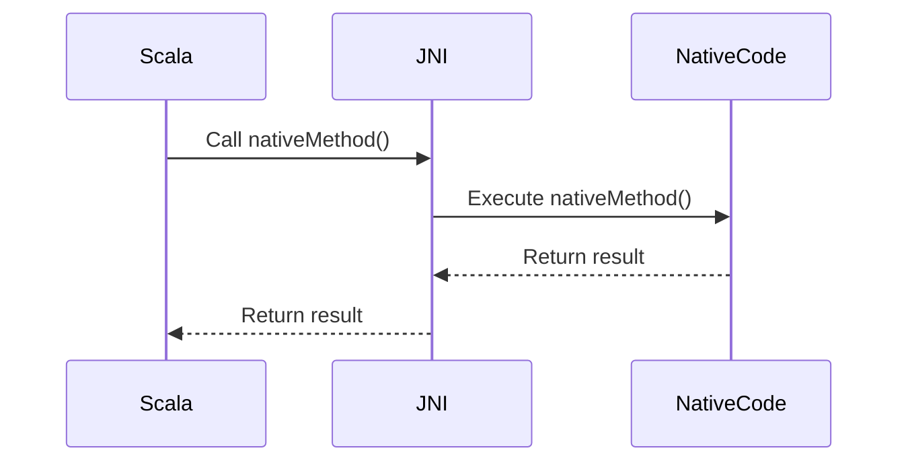

## 13.6 Interoperability with Native Code

In the world of software development, there are times when you need to interact with native code to leverage existing libraries, optimize performance, or access system-level resources. Scala, being a JVM-based language, provides robust mechanisms to interface with native code through Java Native Interface (JNI) and Foreign Function Interface (FFI). This section will guide you through the intricacies of using these interfaces effectively, ensuring memory management and safety.

### Understanding the Need for Native Code Interoperability

Before diving into the technical details, let's explore why you might need to interact with native code:

- **Performance Optimization**: Native code, often written in C or C++, can offer performance benefits for compute-intensive tasks.
- **Access to System Resources**: Some system-level operations are only accessible through native APIs.
- **Leverage Existing Libraries**: Many mature libraries are available in native languages, and re-implementing them in Scala might not be feasible.

### Java Native Interface (JNI)

JNI is a framework that allows Java code running in the JVM to call and be called by native applications and libraries written in other languages like C and C++. Scala, being a JVM language, can utilize JNI to interact with native code.

#### Key Concepts of JNI

1. **JNI Environment**: The interface through which Java code interacts with native methods. It provides functions to convert data types, call methods, and handle exceptions.
2. **Native Methods**: Methods declared in Java (or Scala) that are implemented in a native language.
3. **JNI Header Files**: Generated by the `javah` tool, these files provide the necessary declarations for implementing native methods.

#### Steps to Use JNI in Scala

1. **Declare Native Methods**: Define the native methods in your Scala class.

   ```scala
   class NativeExample {
     @native def nativeMethod(x: Int): Int
   }
   ```

2. **Generate Header Files**: Use the `javah` tool to generate C/C++ header files from your compiled Scala classes.

   ```bash
   javah -jni NativeExample
   ```

3. **Implement Native Methods**: Implement the native methods in C/C++ using the generated header files.

   ```c
   #include <jni.h>
   #include "NativeExample.h"

   JNIEXPORT jint JNICALL Java_NativeExample_nativeMethod(JNIEnv *env, jobject obj, jint x) {
     return x * 2;
   }
   ```

4. **Load Native Library**: Load the compiled native library in your Scala code.

   ```scala
   object NativeExample {
     System.loadLibrary("NativeExample")
   }
   ```

5. **Invoke Native Methods**: Call the native methods from your Scala code.

   ```scala
   val example = new NativeExample()
   println(example.nativeMethod(5)) // Outputs: 10
   ```

#### Best Practices for Using JNI

- **Error Handling**: Always check for exceptions in native code and handle them appropriately.
- **Memory Management**: Manage memory manually in native code to prevent leaks.
- **Thread Safety**: Ensure that native methods are thread-safe, especially when accessed from multiple threads.

### Foreign Function Interface (FFI)

FFI is another mechanism to call functions written in other languages. While JNI is specific to Java, FFI is a more general concept and can be used in various programming environments.

#### Using FFI in Scala

Scala can use FFI through libraries like JNR (Java Native Runtime) and JNA (Java Native Access). These libraries provide a higher-level abstraction over JNI, making it easier to work with native code.

#### JNA Example

JNA allows you to call native functions without writing any JNI code. Here's a simple example:

1. **Define an Interface**: Create a Java interface that extends `com.sun.jna.Library`.

   ```java
   import com.sun.jna.Library;
   import com.sun.jna.Native;

   public interface CLibrary extends Library {
     CLibrary INSTANCE = (CLibrary) Native.load("c", CLibrary.class);
     void printf(String format, Object... args);
   }
   ```

2. **Call Native Functions**: Use the interface to call native functions.

   ```scala
   object JNAExample extends App {
     CLibrary.INSTANCE.printf("Hello, %s!\n", "World")
   }
   ```

#### JNR Example

JNR provides a more modern approach to FFI with better performance characteristics:

1. **Define a Library Interface**: Use annotations to define the native library interface.

   ```java
   import jnr.ffi.LibraryLoader;

   public interface CLibrary {
     void printf(String format, Object... args);
   }
   ```

2. **Load and Use the Library**: Load the library and call its functions.

   ```scala
   object JNRExample extends App {
     val clib = LibraryLoader.create(classOf[CLibrary]).load("c")
     clib.printf("Hello, %s!\n", "World")
   }
   ```

### Memory Management and Safety

Interacting with native code introduces challenges related to memory management and safety. Here are some best practices:

- **Avoid Memory Leaks**: Always free allocated memory in native code. Use tools like Valgrind to detect leaks.
- **Use Safe Data Types**: Prefer using primitive data types and avoid complex structures unless necessary.
- **Validate Inputs**: Always validate inputs to native methods to prevent buffer overflows and other vulnerabilities.
- **Handle Exceptions**: Properly handle exceptions in both Scala and native code to prevent crashes.

### Visualizing JNI and FFI Interactions

To better understand the flow of data and control between Scala and native code, let's visualize the process using a sequence diagram.



**Diagram Description**: This sequence diagram illustrates how a method call from Scala is passed through JNI to native code and how the result is returned back to Scala.

### Try It Yourself

To deepen your understanding, try modifying the code examples:

- **Experiment with Different Data Types**: Modify the `nativeMethod` to accept and return different data types.
- **Implement Additional Native Functions**: Add more functions to the native library and call them from Scala.
- **Use JNR/JNA for Complex Libraries**: Try using JNR or JNA to interface with a more complex native library.

### References and Further Reading

- [JNI Documentation](https://docs.oracle.com/javase/8/docs/technotes/guides/jni/)
- [JNA Project](https://github.com/java-native-access/jna)
- [JNR Project](https://github.com/jnr/jnr-ffi)

### Knowledge Check

- **What are the key differences between JNI and FFI?**
- **How can you ensure thread safety when using native methods?**
- **What tools can help detect memory leaks in native code?**

### Embrace the Journey

Interfacing with native code can be challenging, but it opens up a world of possibilities for performance optimization and system-level programming. Remember, this is just the beginning. As you progress, you'll build more complex integrations. Keep experimenting, stay curious, and enjoy the journey!

## Quiz Time!



### What is the primary purpose of JNI in Scala?

- [x] To enable Scala code to call and be called by native applications and libraries.
- [ ] To compile Scala code into native executables.
- [ ] To provide a graphical user interface for Scala applications.
- [ ] To manage memory automatically in Scala applications.

> **Explanation:** JNI (Java Native Interface) allows Scala code to interact with native applications and libraries, enabling cross-language functionality.

### Which tool is used to generate JNI header files?

- [x] javah
- [ ] scalac
- [ ] javadoc
- [ ] jlink

> **Explanation:** The `javah` tool is used to generate C/C++ header files from compiled Java or Scala classes for JNI integration.

### What is a key advantage of using JNA over JNI?

- [x] JNA allows calling native functions without writing JNI code.
- [ ] JNA provides a graphical interface for native code.
- [ ] JNA automatically manages memory in native code.
- [ ] JNA is faster than JNI in all scenarios.

> **Explanation:** JNA (Java Native Access) simplifies calling native functions by eliminating the need to write JNI code, providing a higher-level abstraction.

### What should you always do to prevent memory leaks in native code?

- [x] Free allocated memory manually.
- [ ] Use automatic garbage collection.
- [ ] Avoid using pointers.
- [ ] Use only primitive data types.

> **Explanation:** In native code, memory management is manual, so it's crucial to free allocated memory to prevent leaks.

### Which library provides a modern approach to FFI with better performance?

- [x] JNR
- [ ] JNA
- [ ] JNI
- [ ] JDK

> **Explanation:** JNR (Java Native Runtime) offers a modern approach to FFI with improved performance characteristics compared to JNA.

### What is the role of the JNI Environment?

- [x] It acts as the interface for Java code to interact with native methods.
- [ ] It compiles Scala code into native binaries.
- [ ] It provides a user interface for native applications.
- [ ] It manages memory in Scala applications.

> **Explanation:** The JNI Environment provides the necessary functions for Java code to interact with native methods, including data type conversion and exception handling.

### How can you ensure thread safety when using native methods?

- [x] Implement synchronization mechanisms in native code.
- [ ] Use only single-threaded applications.
- [ ] Avoid using native methods in multithreaded contexts.
- [ ] Use automatic locking features of JNI.

> **Explanation:** To ensure thread safety, implement synchronization mechanisms in native code, as JNI does not provide automatic locking.

### What is a common use case for interfacing Scala with native code?

- [x] Performance optimization for compute-intensive tasks.
- [ ] Creating graphical user interfaces.
- [ ] Managing Scala application dependencies.
- [ ] Automating Scala code compilation.

> **Explanation:** Interfacing with native code is often used for performance optimization, especially for compute-intensive tasks where native languages like C/C++ can offer speed advantages.

### Which of the following is NOT a best practice for memory management in native code?

- [ ] Avoid memory leaks by freeing allocated memory.
- [ ] Use safe data types and validate inputs.
- [ ] Handle exceptions properly.
- [x] Rely on automatic garbage collection.

> **Explanation:** Native code does not have automatic garbage collection, so manual memory management is necessary to avoid leaks.

### True or False: JNR and JNA are both used for FFI in Scala.

- [x] True
- [ ] False

> **Explanation:** Both JNR (Java Native Runtime) and JNA (Java Native Access) are libraries used for Foreign Function Interface (FFI) in Scala, providing mechanisms to call native functions.


