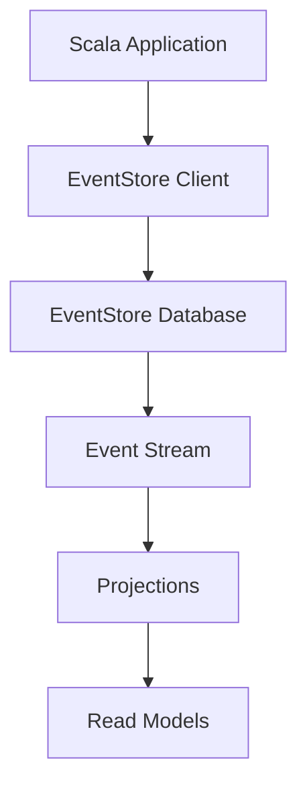

## 13.7 Functional-First Databases

In the realm of modern software development, the paradigm of functional programming has gained significant traction, particularly in languages like Scala. One of the core tenets of functional programming is immutability, which brings about a new perspective on how we interact with databases. Functional-first databases are designed to align with these principles, offering a seamless integration with functional programming languages. In this section, we will delve into the concept of functional-first databases, their benefits, and how they can be integrated with Scala, with a particular focus on EventStore.

### Understanding Functional-First Databases

Functional-first databases are designed with immutability at their core. Unlike traditional databases that often rely on mutable state, functional-first databases treat data as immutable, meaning that once data is written, it cannot be changed. This approach aligns perfectly with the principles of functional programming, where immutability is a key concept.

#### Key Characteristics of Functional-First Databases

1. **Immutability**: Data is never altered once written. Instead, new data is appended, preserving the history of changes.
2. **Event Sourcing**: A common pattern where all changes to the application state are stored as a sequence of events.
3. **Time Travel**: The ability to query the database at any point in time, thanks to the immutable nature of data.
4. **Scalability**: Designed to handle large volumes of data efficiently due to their append-only nature.

### Benefits of Using Functional-First Databases

- **Consistency and Reliability**: Immutability ensures that data remains consistent and reliable over time, reducing the risk of data corruption.
- **Auditability**: With a complete history of changes, auditing becomes straightforward.
- **Simplified Concurrency**: Since data is immutable, concurrent access and modifications are simplified, reducing the need for complex locking mechanisms.
- **Enhanced Debugging**: The ability to "time travel" through data allows developers to easily debug and understand the evolution of data over time.

### Integrating Functional-First Databases with Scala

Scala, with its strong support for functional programming, is an ideal candidate for integrating with functional-first databases. The language's features, such as immutability, pattern matching, and powerful type system, complement the principles of functional-first databases.

#### EventStore: A Case Study

EventStore is a prominent example of a functional-first database that is designed around the concept of event sourcing. It stores data as a series of events, allowing developers to reconstruct the state of an application at any point in time.

##### Key Features of EventStore

- **Event Sourcing**: Stores all changes to application state as a sequence of events.
- **Projections**: Allows for the creation of views or read models from the event stream.
- **Scalability**: Built to handle high throughput and large volumes of data.
- **Open Source**: EventStore is open source, providing flexibility and community support.

##### Integrating EventStore with Scala

To integrate EventStore with Scala, we can leverage libraries and tools that facilitate communication with the EventStore database. Here's a step-by-step guide on how to get started:

1. **Setup EventStore**: Install and configure EventStore on your local machine or server. You can download it from the [EventStore website](https://eventstore.com/).

2. **Connect to EventStore**: Use a Scala client library to connect to EventStore. One popular choice is the `EventStore.JVM` client, which provides a Scala-friendly API for interacting with EventStore.

3. **Define Events**: In Scala, define case classes to represent the events you want to store. For example:

   ```scala
   case class UserCreated(id: String, name: String, email: String)
   case class UserUpdated(id: String, name: Option[String], email: Option[String])
   ```

4. **Write Events**: Use the client library to write events to EventStore. Here's an example of how to write an event:

   ```scala
   import eventstore.j.EsConnection
   import eventstore.j.WriteEvents
   import eventstore.j.EventData

   val connection: EsConnection = // Initialize connection
   val event = EventData("UserCreated", data = UserCreated("1", "Alice", "alice@example.com"))
   val writeEvents = WriteEvents(streamId = "user-stream", events = List(event))

   connection.writeEvents(writeEvents).await
   ```

5. **Read Events**: Retrieve events from EventStore to reconstruct application state:

   ```scala
   import eventstore.j.ReadStreamEvents
   import eventstore.j.StreamId

   val readEvents = ReadStreamEvents(streamId = StreamId("user-stream"))
   val events = connection.readStreamEvents(readEvents).await
   events.foreach(println)
   ```

6. **Handle Projections**: Use EventStore's projections feature to create read models or views from the event stream.

### Visualizing EventStore Integration

To better understand how EventStore integrates with Scala, let's visualize the architecture using a Mermaid.js diagram:



**Description**: This diagram illustrates the flow of data from a Scala application to the EventStore database. The application uses an EventStore client to write events to the database. These events form an event stream, which can be used to create projections and read models.

### Exploring Other Functional-First Databases

While EventStore is a popular choice, there are other functional-first databases that can be integrated with Scala:

#### Datomic

Datomic is a distributed database designed to enable scalable, flexible, and intelligent applications, with a focus on immutability and time-based queries.

- **Immutability**: Data is never overwritten; instead, new data is added.
- **Time-Based Queries**: Allows querying data as of any point in time.
- **Schema Flexibility**: Supports evolving schemas without downtime.

#### Crux

Crux is an open-source, bitemporal database that supports SQL and Datalog queries, designed for immutability and temporal queries.

- **Bitemporal Queries**: Supports both valid time and transaction time queries.
- **Immutable Data**: Data is stored immutably, allowing for historical queries.
- **Flexible Query Language**: Supports both SQL and Datalog.

### Sample Code Snippet: Integrating with Crux

Let's explore how to integrate Crux with a Scala application:

1. **Setup Crux**: Install Crux and configure it on your local machine or server.

2. **Connect to Crux**: Use a Scala client library to connect to Crux.

3. **Define Entities**: Define case classes to represent the entities you want to store.

   ```scala
   case class Person(id: String, name: String, birthDate: LocalDate)
   ```

4. **Write Entities**: Use the client library to write entities to Crux.

   ```scala
   import crux.api.CruxNode
   import crux.api.CruxDocument

   val cruxNode: CruxNode = // Initialize Crux node
   val person = CruxDocument.create("id", "person-1", "name", "Alice", "birthDate", LocalDate.of(1990, 1, 1))
   cruxNode.submitTx(List(CruxDocument.put(person)))
   ```

5. **Query Entities**: Retrieve entities from Crux using Datalog queries.

   ```scala
   val query = """[:find ?name
                  :where [?e :name ?name]]"""
   val results = cruxNode.db().query(query)
   results.forEach(println)
   ```

### Design Considerations

When integrating functional-first databases with Scala, consider the following:

- **Schema Design**: Design your schema to accommodate immutability and event sourcing.
- **Performance**: Evaluate the performance implications of using an append-only database.
- **Tooling**: Choose the right tools and libraries that complement your Scala application.
- **Consistency**: Ensure that your application logic aligns with the principles of immutability and event sourcing.

### Differences and Similarities

Functional-first databases share similarities with traditional databases in terms of providing data storage and retrieval capabilities. However, they differ significantly in their approach to data mutability and time-based queries. While traditional databases often rely on mutable state, functional-first databases embrace immutability, offering unique benefits such as auditability and simplified concurrency.

### Try It Yourself

To deepen your understanding, try modifying the code examples provided. Experiment with different event types, projections, and queries. Consider integrating another functional-first database like Datomic or Crux into your Scala application and observe how it changes your approach to data management.

### Conclusion

Functional-first databases offer a compelling alternative to traditional databases, particularly for applications built on functional programming principles. By embracing immutability and event sourcing, these databases provide a robust foundation for building scalable, reliable, and auditable applications. As you continue your journey with Scala and functional programming, consider exploring the integration of functional-first databases to unlock new possibilities in your software architecture.

## Quiz Time!



### What is a key characteristic of functional-first databases?

- [x] Immutability
- [ ] Mutable state
- [ ] Lack of scalability
- [ ] Complex concurrency

> **Explanation:** Functional-first databases are characterized by immutability, meaning data is never altered once written.

### Which of the following is a benefit of using functional-first databases?

- [x] Simplified concurrency
- [ ] Increased data corruption
- [ ] Complex locking mechanisms
- [ ] Reduced auditability

> **Explanation:** Functional-first databases simplify concurrency by eliminating the need for complex locking mechanisms due to their immutable nature.

### What is EventStore primarily designed for?

- [x] Event sourcing
- [ ] SQL queries
- [ ] Mutable data storage
- [ ] Relational data modeling

> **Explanation:** EventStore is designed around the concept of event sourcing, storing all changes to application state as a sequence of events.

### How does EventStore handle data?

- [x] As a sequence of events
- [ ] By overwriting existing data
- [ ] By deleting old data
- [ ] By using mutable state

> **Explanation:** EventStore handles data as a sequence of events, preserving the history of changes.

### Which of the following is a feature of Crux?

- [x] Bitemporal queries
- [ ] Mutable data
- [ ] Lack of schema flexibility
- [ ] Limited query language support

> **Explanation:** Crux supports bitemporal queries, allowing for both valid time and transaction time queries.

### What is a common pattern used in functional-first databases?

- [x] Event sourcing
- [ ] Mutable state
- [ ] Complex locking
- [ ] Overwriting data

> **Explanation:** Event sourcing is a common pattern in functional-first databases, storing all changes as events.

### Which language feature of Scala complements functional-first databases?

- [x] Immutability
- [ ] Mutable variables
- [ ] Complex inheritance
- [ ] Lack of type safety

> **Explanation:** Scala's support for immutability complements the principles of functional-first databases.

### What is a benefit of using time travel in functional-first databases?

- [x] Enhanced debugging
- [ ] Increased data corruption
- [ ] Complex concurrency
- [ ] Reduced auditability

> **Explanation:** Time travel allows developers to query the database at any point in time, enhancing debugging capabilities.

### Which of the following is a functional-first database?

- [x] Datomic
- [ ] MySQL
- [ ] PostgreSQL
- [ ] Oracle

> **Explanation:** Datomic is a functional-first database designed for immutability and time-based queries.

### True or False: Functional-first databases often rely on mutable state.

- [ ] True
- [x] False

> **Explanation:** Functional-first databases do not rely on mutable state; they embrace immutability.


