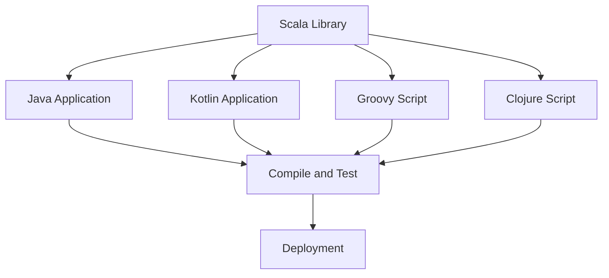

## 13.8 Exposing Scala Libraries to Other JVM Languages

In the diverse ecosystem of the Java Virtual Machine (JVM), Scala stands out as a powerful language that combines object-oriented and functional programming paradigms. However, the true strength of Scala lies in its ability to seamlessly interoperate with other JVM languages, such as Java, Kotlin, Groovy, and Clojure. This section will guide you through the process of exposing Scala libraries to these languages, ensuring that your Scala code can be leveraged across the entire JVM ecosystem.

### Introduction to JVM Interoperability

The JVM is a versatile platform that supports multiple programming languages. This interoperability allows developers to choose the best language for a particular task while still being able to integrate with code written in other JVM languages. Scala, with its rich type system and expressive syntax, is often used to write libraries that can be consumed by other languages running on the JVM.

#### Why Expose Scala Libraries?

1. **Maximize Reusability**: By exposing Scala libraries, you can maximize the reusability of your code across different projects and teams, regardless of the language they use.
2. **Leverage Scala's Strengths**: Scala's powerful features, such as pattern matching and higher-order functions, can be utilized in languages that may not natively support them.
3. **Enhance Collaboration**: Teams using different JVM languages can collaborate more effectively by sharing common libraries.
4. **Facilitate Migration**: Gradually migrating a codebase from one language to another becomes easier when libraries are interoperable.

### Key Considerations for Interoperability

Before diving into the technical aspects, it's important to consider the following:

- **API Design**: Ensure that the API of your Scala library is designed with interoperability in mind. This includes using Java-friendly types and avoiding Scala-specific constructs that may not be easily accessible from other languages.
- **Documentation**: Provide comprehensive documentation that explains how to use the library from different languages.
- **Testing**: Test the library in the context of each target language to ensure compatibility and identify any potential issues.

### Exposing Scala Libraries to Java

Java is the most widely used language on the JVM, and ensuring that your Scala libraries can be used from Java is often a top priority.

#### Java-Friendly API Design

To make your Scala library accessible from Java, follow these guidelines:

- **Use Java-Friendly Types**: Prefer using Java collections (`java.util.List`, `java.util.Map`) over Scala collections (`List`, `Map`) in your public API.
- **Avoid Implicit Conversions**: Implicit conversions in Scala are not visible to Java, so avoid using them in your API.
- **Annotate with `@BeanProperty`**: Use the `@BeanProperty` annotation to generate Java-style getter and setter methods for Scala fields.

#### Example: A Simple Scala Library

Let's create a simple Scala library that can be used from Java. We'll define a `Calculator` class with basic arithmetic operations.

```scala
// src/main/scala/com/example/Calculator.scala
package com.example

import scala.beans.BeanProperty

class Calculator {
  @BeanProperty var result: Int = 0

  def add(a: Int, b: Int): Int = {
    result = a + b
    result
  }

  def subtract(a: Int, b: Int): Int = {
    result = a - b
    result
  }
}
```

#### Using the Scala Library from Java

Now, let's see how we can use this Scala library from a Java application.

```java
// src/main/java/com/example/Main.java
package com.example;

public class Main {
    public static void main(String[] args) {
        Calculator calculator = new Calculator();
        int sum = calculator.add(5, 3);
        System.out.println("Sum: " + sum);

        int difference = calculator.subtract(5, 3);
        System.out.println("Difference: " + difference);

        System.out.println("Result: " + calculator.getResult());
    }
}
```

### Exposing Scala Libraries to Kotlin

Kotlin is another popular JVM language known for its concise syntax and interoperability with Java. Scala libraries can be used in Kotlin with minimal effort.

#### Kotlin-Friendly API Design

When designing a Scala library for Kotlin, consider the following:

- **Null Safety**: Kotlin has built-in null safety, so ensure your Scala library handles nulls appropriately.
- **Use Kotlin-Friendly Types**: While Kotlin can work with Java types, using Kotlin-friendly types can enhance the developer experience.

#### Example: Using Scala Library in Kotlin

Let's use the same `Calculator` class in a Kotlin application.

```kotlin
// src/main/kotlin/com/example/Main.kt
package com.example

fun main() {
    val calculator = Calculator()
    val sum = calculator.add(5, 3)
    println("Sum: $sum")

    val difference = calculator.subtract(5, 3)
    println("Difference: $difference")

    println("Result: ${calculator.result}")
}
```

### Exposing Scala Libraries to Groovy

Groovy is a dynamic language for the JVM that integrates seamlessly with Java. Scala libraries can be used in Groovy with some considerations.

#### Groovy-Friendly API Design

- **Dynamic Typing**: Groovy is dynamically typed, so ensure your Scala library can handle dynamic method calls.
- **Groovy Beans**: Use `@BeanProperty` in Scala to make fields accessible as Groovy properties.

#### Example: Using Scala Library in Groovy

Here's how you can use the `Calculator` class in a Groovy script.

```groovy
// src/main/groovy/com/example/Main.groovy
package com.example

def calculator = new Calculator()
def sum = calculator.add(5, 3)
println "Sum: $sum"

def difference = calculator.subtract(5, 3)
println "Difference: $difference"

println "Result: ${calculator.result}"
```

### Exposing Scala Libraries to Clojure

Clojure is a functional language for the JVM with a focus on immutability and concurrency. Using Scala libraries in Clojure requires some additional steps.

#### Clojure-Friendly API Design

- **Immutable Data Structures**: Clojure emphasizes immutability, so ensure your Scala library provides immutable data structures.
- **Interop with Java**: Clojure's Java interop capabilities can be leveraged to use Scala libraries.

#### Example: Using Scala Library in Clojure

Here's how you can use the `Calculator` class in a Clojure script.

```clojure
;; src/main/clojure/com/example/main.clj
(ns com.example.main
  (:import [com.example Calculator]))

(def calculator (Calculator.))
(def sum (.add calculator 5 3))
(println "Sum:" sum)

(def difference (.subtract calculator 5 3))
(println "Difference:" difference)

(println "Result:" (.getResult calculator))
```

### Advanced Techniques for Interoperability

#### Using Scala Traits and Mixins

Scala traits can be used to define interfaces that are easily implementable in other JVM languages. However, be cautious with Scala-specific features like mixins, as they may not be directly supported in other languages.

#### Handling Scala-Specific Constructs

Some Scala-specific constructs, such as implicit parameters and higher-kinded types, may not have direct equivalents in other JVM languages. Consider providing alternative methods or wrappers that avoid these constructs.

#### Leveraging Scala's Type System

Scala's advanced type system can be a double-edged sword when it comes to interoperability. While it allows for expressive APIs, it can also introduce complexity. Aim for a balance that maximizes usability without sacrificing the benefits of Scala's type system.

### Testing and Validation

To ensure your Scala library works seamlessly with other JVM languages, consider the following testing strategies:

- **Cross-Language Testing**: Write tests in each target language to validate the library's functionality.
- **Continuous Integration**: Use CI tools to automate testing across multiple languages and environments.
- **User Feedback**: Encourage users of your library to provide feedback on any interoperability issues they encounter.

### Visualizing the Interoperability Process

To better understand the process of exposing Scala libraries to other JVM languages, let's visualize the workflow using a Mermaid.js diagram.



**Diagram Description**: This diagram illustrates the process of exposing a Scala library to various JVM languages. The Scala library is integrated into applications written in Java, Kotlin, Groovy, and Clojure. Each integration is followed by compilation and testing, leading to deployment.

### Try It Yourself

Experiment with the provided code examples by modifying the `Calculator` class to include additional operations, such as multiplication and division. Test the updated library in each of the target languages to ensure compatibility.

### References and Further Reading

- [Scala Documentation](https://docs.scala-lang.org/)
- [Java Interoperability with Scala](https://docs.scala-lang.org/tutorials/scala-for-java-programmers.html)
- [Kotlin Documentation](https://kotlinlang.org/docs/reference/)
- [Groovy Documentation](https://groovy-lang.org/documentation.html)
- [Clojure Documentation](https://clojure.org/reference)

### Knowledge Check

- What are the key considerations when designing a Scala library for interoperability with other JVM languages?
- How can you ensure that a Scala library is Java-friendly?
- What are some common challenges when exposing Scala libraries to dynamically typed languages like Groovy?
- Why is it important to test a Scala library in the context of each target language?
- How can Scala's type system both help and hinder interoperability?

### Embrace the Journey

Remember, exposing Scala libraries to other JVM languages is a journey that enhances collaboration and maximizes the potential of your code. As you progress, you'll gain a deeper understanding of the intricacies of each language and how they can work together harmoniously. Keep experimenting, stay curious, and enjoy the journey!

## Quiz Time!



### What is a primary reason to expose Scala libraries to other JVM languages?

- [x] To maximize code reusability across different projects and teams.
- [ ] To make Scala code more complex.
- [ ] To limit the use of Scala to only Scala developers.
- [ ] To ensure Scala libraries are only used in Scala applications.

> **Explanation:** Exposing Scala libraries to other JVM languages allows for code reusability across different projects and teams, enhancing collaboration and maximizing the potential of the code.

### Which annotation can be used in Scala to generate Java-style getter and setter methods?

- [x] `@BeanProperty`
- [ ] `@JavaGetter`
- [ ] `@ScalaProperty`
- [ ] `@Property`

> **Explanation:** The `@BeanProperty` annotation in Scala generates Java-style getter and setter methods, making the Scala code more accessible from Java.

### What is a key consideration when designing a Scala library for Kotlin?

- [x] Null safety
- [ ] Use of Java-specific types
- [ ] Avoiding all functional programming constructs
- [ ] Using only mutable data structures

> **Explanation:** Kotlin has built-in null safety, so ensuring that the Scala library handles nulls appropriately is a key consideration.

### How can you make a Scala library accessible as Groovy properties?

- [x] Use `@BeanProperty` in Scala.
- [ ] Use `@GroovyProperty` in Scala.
- [ ] Avoid using any annotations.
- [ ] Use `@DynamicProperty` in Scala.

> **Explanation:** Using `@BeanProperty` in Scala makes fields accessible as Groovy properties, facilitating interoperability.

### What is a challenge when using Scala libraries in Clojure?

- [x] Ensuring the library provides immutable data structures.
- [ ] Handling mutable data structures.
- [ ] Using dynamic typing.
- [ ] Avoiding the use of Java interop capabilities.

> **Explanation:** Clojure emphasizes immutability, so ensuring that the Scala library provides immutable data structures is a challenge.

### What is a benefit of testing Scala libraries in each target language?

- [x] It ensures compatibility and identifies potential issues.
- [ ] It makes the library more complex.
- [ ] It limits the use of the library to only one language.
- [ ] It reduces the need for documentation.

> **Explanation:** Testing Scala libraries in each target language ensures compatibility and helps identify potential issues, improving the library's reliability.

### Which JVM language is known for its concise syntax and interoperability with Java?

- [x] Kotlin
- [ ] Groovy
- [ ] Clojure
- [ ] Scala

> **Explanation:** Kotlin is known for its concise syntax and strong interoperability with Java, making it a popular choice for JVM developers.

### What is a common challenge when exposing Scala libraries to dynamically typed languages?

- [x] Handling dynamic method calls.
- [ ] Ensuring strict type safety.
- [ ] Avoiding the use of functional programming constructs.
- [ ] Using only Java collections.

> **Explanation:** Handling dynamic method calls is a common challenge when exposing Scala libraries to dynamically typed languages like Groovy.

### What is a key feature of Clojure that affects how Scala libraries should be designed?

- [x] Emphasis on immutability
- [ ] Preference for mutable data structures
- [ ] Use of Java-style getters and setters
- [ ] Avoidance of functional programming

> **Explanation:** Clojure's emphasis on immutability affects how Scala libraries should be designed, ensuring they provide immutable data structures.

### True or False: Scala's advanced type system can introduce complexity when exposing libraries to other JVM languages.

- [x] True
- [ ] False

> **Explanation:** Scala's advanced type system can indeed introduce complexity when exposing libraries to other JVM languages, requiring careful API design to balance usability and expressiveness.


