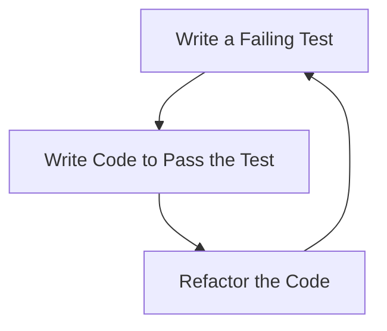

## 14.1 Test-Driven Development (TDD) in Scala

Test-Driven Development (TDD) is a software development process that relies on the repetition of a very short development cycle: first, the developer writes an (initially failing) automated test case that defines a desired improvement or new function, then produces the minimum amount of code to pass that test, and finally refactors the new code to acceptable standards. In Scala, TDD is not only about testing but also about designing software that is robust, maintainable, and scalable. This guide will delve into TDD in Scala, focusing on its integration with functional programming principles.

### Understanding TDD: A Brief Overview

TDD is often summarized by the mantra: "Red, Green, Refactor." This refers to the cycle of writing a failing test (Red), writing code to make the test pass (Green), and then refactoring the code while keeping the tests passing (Refactor).

#### Red: Writing the Test

The first step in TDD is to write a test for the functionality you want to implement. This test should fail initially because the functionality does not yet exist. Writing the test first helps clarify the requirements and design of the feature.

#### Green: Making the Test Pass

Once you have a failing test, the next step is to write the minimal amount of code necessary to make the test pass. This encourages simple design and avoids unnecessary complexity.

#### Refactor: Improving the Code

With the test passing, you can now refactor the code to improve its structure and readability without changing its behavior. The tests ensure that the refactoring does not introduce any new bugs.

### Why TDD in Scala?

Scala, with its strong type system and functional programming capabilities, is well-suited for TDD. The language's features, such as immutability, higher-order functions, and pattern matching, allow developers to write concise and expressive tests.

#### Benefits of TDD in Scala

- **Improved Code Quality**: TDD encourages writing clean, modular code that is easy to understand and maintain.
- **Faster Debugging**: With tests written before the code, bugs are caught early in the development process.
- **Better Design**: TDD forces you to think about the design of your code before you write it, leading to better-architected software.
- **Documentation**: Tests serve as documentation for the code, explaining how it is supposed to work.

### Incorporating TDD into Functional Development

Functional programming (FP) emphasizes immutability, pure functions, and higher-order functions. These principles align well with TDD, as they lead to code that is easier to test and reason about.

#### Immutability and TDD

Immutability means that once a data structure is created, it cannot be changed. This makes testing easier because you don't have to worry about the state of an object changing unexpectedly.

```scala
// Example of immutable data structure in Scala
case class User(name: String, age: Int)

val user = User("Alice", 30)
// user.copy creates a new instance with the updated age
val updatedUser = user.copy(age = 31)
```

#### Pure Functions and TDD

A pure function is a function where the output value is determined only by its input values, without observable side effects. Pure functions are easier to test because they don't depend on or modify the state outside their scope.

```scala
// Example of a pure function in Scala
def add(a: Int, b: Int): Int = a + b

assert(add(2, 3) == 5) // Test for the pure function
```

#### Higher-Order Functions and TDD

Higher-order functions take other functions as parameters or return them as results. They enable a high level of abstraction, making it easier to write reusable and testable code.

```scala
// Example of a higher-order function in Scala
def applyFunction(f: Int => Int, x: Int): Int = f(x)

val increment = (x: Int) => x + 1
assert(applyFunction(increment, 5) == 6) // Test for the higher-order function
```

### TDD Workflow in Scala

Let's walk through a typical TDD workflow in Scala using a simple example: implementing a stack.

#### Step 1: Write a Failing Test

First, write a test for the stack's `push` operation.

```scala
import org.scalatest.funsuite.AnyFunSuite

class StackTest extends AnyFunSuite {
  test("push should add an element to the stack") {
    val stack = new Stack[Int]()
    stack.push(1)
    assert(stack.top == 1)
  }
}
```

This test will fail because the `Stack` class and its `push` method do not exist yet.

#### Step 2: Implement the Code

Next, implement the minimal code to make the test pass.

```scala
class Stack[T] {
  private var elements: List[T] = Nil

  def push(x: T): Unit = {
    elements = x :: elements
  }

  def top: T = elements.head
}
```

#### Step 3: Refactor

With the test passing, refactor the code to improve its design. For example, you might want to make the `elements` list immutable.

```scala
class Stack[T] {
  private var elements: List[T] = Nil

  def push(x: T): Stack[T] = {
    new Stack[T] {
      override val elements = x :: Stack.this.elements
    }
  }

  def top: T = elements.head
}
```

### Tools for TDD in Scala

Several tools and libraries can help you implement TDD in Scala effectively.

#### ScalaTest

ScalaTest is a popular testing framework for Scala. It supports a wide range of testing styles and integrates well with build tools like sbt.

```scala
// Example of a ScalaTest suite
import org.scalatest.funsuite.AnyFunSuite

class ExampleTest extends AnyFunSuite {
  test("example test") {
    assert(1 + 1 == 2)
  }
}
```

#### Specs2

Specs2 is another testing framework that is more focused on behavior-driven development (BDD). It allows you to write tests in a more descriptive and readable way.

```scala
// Example of a Specs2 specification
import org.specs2.mutable.Specification

class ExampleSpec extends Specification {
  "An example" should {
    "add numbers correctly" in {
      1 + 1 mustEqual 2
    }
  }
}
```

#### sbt

sbt is the de facto build tool for Scala projects. It provides built-in support for running tests and integrating with testing frameworks.

```shell
sbt test
```

### Advanced TDD Techniques in Scala

As you become more comfortable with TDD in Scala, you can explore advanced techniques to enhance your testing strategy.

#### Property-Based Testing

Property-based testing involves defining properties that your code should satisfy for a wide range of inputs. ScalaCheck is a library that supports property-based testing in Scala.

```scala
// Example of a property-based test using ScalaCheck
import org.scalacheck.Properties
import org.scalacheck.Prop.forAll

object StringSpecification extends Properties("String") {
  property("concatenation") = forAll { (a: String, b: String) =>
    (a + b).length == a.length + b.length
  }
}
```

#### Mocking and Stubbing

Mocking and stubbing are techniques used to isolate the unit of code being tested by replacing its dependencies with mock objects. ScalaMock is a library that provides support for mocking in Scala.

```scala
// Example of mocking with ScalaMock
import org.scalamock.scalatest.MockFactory
import org.scalatest.funsuite.AnyFunSuite

class ExampleTest extends AnyFunSuite with MockFactory {
  test("example with mock") {
    val mockService = mock[Service]
    (mockService.doSomething _).expects().returning("mocked result")

    assert(mockService.doSomething() == "mocked result")
  }
}
```

### Visualizing the TDD Cycle

To better understand the TDD process, let's visualize the TDD cycle using a flowchart.



This diagram illustrates the iterative nature of TDD, where each cycle results in a small increment of functionality.

### Common Challenges and Solutions in TDD

While TDD offers many benefits, it also presents some challenges. Here are common challenges and solutions:

#### Challenge: Writing Tests for Legacy Code

**Solution**: When dealing with legacy code, start by writing tests for the most critical parts of the system. Gradually increase test coverage as you refactor the code.

#### Challenge: Slow Test Suites

**Solution**: Identify and optimize slow tests. Consider using test doubles or running tests in parallel to speed up the test suite.

#### Challenge: Testing Asynchronous Code

**Solution**: Use Scala's `Future` and `Promise` to handle asynchronous operations. Libraries like ScalaTest and Specs2 provide support for testing asynchronous code.

```scala
// Example of testing asynchronous code with ScalaTest
import org.scalatest.concurrent.ScalaFutures
import org.scalatest.funsuite.AnyFunSuite
import scala.concurrent.Future
import scala.concurrent.ExecutionContext.Implicits.global

class AsyncTest extends AnyFunSuite with ScalaFutures {
  test("asynchronous test") {
    val futureResult = Future { 1 + 1 }
    whenReady(futureResult) { result =>
      assert(result == 2)
    }
  }
}
```

### Try It Yourself

To solidify your understanding of TDD in Scala, try modifying the stack example to include additional operations such as `pop` and `isEmpty`. Write tests for these operations first and then implement them.

### Knowledge Check

- **Question**: What are the three main steps of the TDD cycle?
- **Exercise**: Write a TDD test suite for a simple calculator application that supports addition, subtraction, multiplication, and division.

### Conclusion

Test-Driven Development in Scala, when combined with functional programming principles, provides a powerful approach to building robust and maintainable software. By writing tests first, you ensure that your code meets the requirements and is easy to refactor. As you continue to practice TDD, you'll find that it leads to better-designed software and a more enjoyable development experience.

Remember, this is just the beginning. As you progress, you'll build more complex and interactive applications. Keep experimenting, stay curious, and enjoy the journey!

## Quiz Time!



### What is the first step in the TDD cycle?

- [x] Write a failing test
- [ ] Write code to pass the test
- [ ] Refactor the code
- [ ] Deploy the application

> **Explanation:** The first step in TDD is to write a failing test that defines the desired functionality.

### Which Scala feature makes testing easier due to its immutability?

- [x] Case classes
- [ ] Mutable collections
- [ ] Null references
- [ ] Dynamic typing

> **Explanation:** Case classes in Scala are immutable by default, making them easier to test.

### What is a pure function?

- [x] A function whose output is determined only by its input values
- [ ] A function that modifies global state
- [ ] A function that relies on external input
- [ ] A function that throws exceptions

> **Explanation:** A pure function's output is determined solely by its input values, with no side effects.

### Which library is used for property-based testing in Scala?

- [x] ScalaCheck
- [ ] ScalaTest
- [ ] Specs2
- [ ] JUnit

> **Explanation:** ScalaCheck is a library for property-based testing in Scala.

### What is the purpose of refactoring in the TDD cycle?

- [x] To improve code structure and readability
- [ ] To add more features
- [ ] To deploy the application
- [ ] To remove tests

> **Explanation:** Refactoring aims to improve the code's structure and readability without changing its behavior.

### Which tool is the de facto build tool for Scala projects?

- [x] sbt
- [ ] Maven
- [ ] Gradle
- [ ] Ant

> **Explanation:** sbt is the de facto build tool for Scala projects.

### How can you test asynchronous code in Scala?

- [x] Using ScalaTest with ScalaFutures
- [ ] Using only synchronous tests
- [ ] Ignoring asynchronous code
- [ ] Using println statements

> **Explanation:** ScalaTest with ScalaFutures provides support for testing asynchronous code.

### What is the main advantage of using higher-order functions in TDD?

- [x] They enable a high level of abstraction
- [ ] They make code slower
- [ ] They increase code complexity
- [ ] They are not useful in TDD

> **Explanation:** Higher-order functions enable a high level of abstraction, making code more reusable and testable.

### Which of the following is a challenge in TDD?

- [x] Writing tests for legacy code
- [ ] Writing code without tests
- [ ] Ignoring test failures
- [ ] Deploying without testing

> **Explanation:** Writing tests for legacy code can be challenging in TDD.

### TDD encourages writing tests after the code is written.

- [ ] True
- [x] False

> **Explanation:** TDD encourages writing tests before the code is written to ensure the code meets the requirements.


