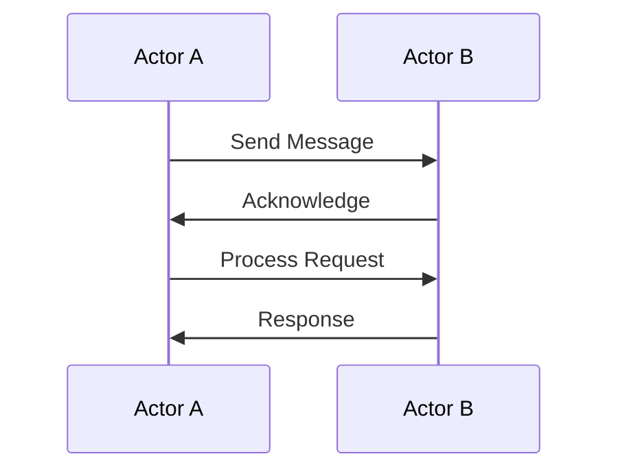

## 14.10 Testing Asynchronous and Concurrent Code

Testing asynchronous and concurrent code is a critical aspect of software development, especially in a language like Scala, which provides robust support for both paradigms. In this section, we will explore strategies for reliably testing asynchronous operations, focusing on Scala's unique features and best practices. We'll delve into concepts such as futures, promises, and actors, and provide practical examples to illustrate effective testing techniques.

### Understanding Asynchronous and Concurrent Code

Before diving into testing strategies, let's clarify what we mean by asynchronous and concurrent code:

- **Asynchronous Code**: This refers to code that executes independently of the main program flow, allowing the program to continue executing other tasks while waiting for an operation to complete. In Scala, this is often achieved using `Future` and `Promise`.

- **Concurrent Code**: This involves multiple computations happening simultaneously, potentially interacting with each other. Scala's `Akka` framework provides a powerful model for writing concurrent applications using actors.

### Challenges in Testing Asynchronous and Concurrent Code

Testing asynchronous and concurrent code presents unique challenges:

- **Non-determinism**: The order and timing of operations can vary, making it difficult to reproduce bugs.
- **State Management**: Concurrent code often involves shared state, which can lead to race conditions if not handled properly.
- **Complexity**: Asynchronous and concurrent code can be more complex to understand and debug compared to synchronous code.

### Strategies for Testing Asynchronous Code

#### 1. Using Futures and Promises

Scala's `Future` and `Promise` are fundamental tools for handling asynchronous computations. Let's explore how to test code that uses these constructs.

##### Example: Testing with Futures

Consider a simple asynchronous function that fetches data from a remote service:

```scala
import scala.concurrent.Future
import scala.concurrent.ExecutionContext.Implicits.global

def fetchData(url: String): Future[String] = Future {
  // Simulate a network call
  Thread.sleep(1000)
  s"Data from $url"
}
```

To test this function, we need to handle the asynchronous nature of `Future`. We can use ScalaTest, a popular testing framework, which provides support for testing futures.

```scala
import org.scalatest.flatspec.AsyncFlatSpec
import org.scalatest.matchers.should.Matchers

class FetchDataSpec extends AsyncFlatSpec with Matchers {

  "fetchData" should "return data from the given URL" in {
    val url = "http://example.com"
    fetchData(url).map { result =>
      result should include ("Data from")
    }
  }
}
```

In this example, `AsyncFlatSpec` allows us to write asynchronous tests. The `map` function is used to assert the result of the future once it completes.

##### Key Points

- **Avoid Blocking**: Use non-blocking assertions to test futures. Blocking the main thread defeats the purpose of asynchronous programming.
- **Timeouts**: Set reasonable timeouts for asynchronous operations to avoid indefinite waits.

#### 2. Testing with Promises

A `Promise` is a writable, single-assignment container that completes a `Future`. It is useful for testing scenarios where you need to control the completion of a future.

```scala
import scala.concurrent.Promise

val promise = Promise[String]()
val future = promise.future

// Complete the promise
promise.success("Test data")

future.map { result =>
  assert(result == "Test data")
}
```

In this example, we manually complete the promise, allowing us to test how the future behaves upon completion.

### Strategies for Testing Concurrent Code

#### 1. Using Akka Actors

Akka provides a powerful model for building concurrent applications. Testing actors involves verifying their behavior in response to messages.

##### Example: Testing Akka Actors

Consider an actor that processes messages and updates a counter:

```scala
import akka.actor.{Actor, ActorSystem, Props}

class CounterActor extends Actor {
  var count = 0

  def receive: Receive = {
    case "increment" => count += 1
    case "get" => sender() ! count
  }
}

object CounterActor {
  def props: Props = Props[CounterActor]
}
```

To test this actor, we can use Akka TestKit, which provides utilities for testing actors.

```scala
import akka.testkit.{TestKit, TestProbe}
import org.scalatest.wordspec.AnyWordSpecLike
import org.scalatest.matchers.should.Matchers

class CounterActorSpec extends TestKit(ActorSystem("testSystem"))
  with AnyWordSpecLike with Matchers {

  "A CounterActor" should {
    "increment the counter" in {
      val probe = TestProbe()
      val counter = system.actorOf(CounterActor.props)

      counter.tell("increment", probe.ref)
      counter.tell("get", probe.ref)

      probe.expectMsg(1)
    }
  }
}
```

In this test, we use `TestProbe` to interact with the actor and verify its behavior.

##### Key Points

- **Isolation**: Test actors in isolation to ensure they behave correctly without external interference.
- **Message Passing**: Use `TestProbe` to simulate message passing and verify actor responses.

#### 2. Handling State and Race Conditions

Concurrent code often involves shared state, which can lead to race conditions. Testing for race conditions requires careful design and tooling.

##### Example: Testing for Race Conditions

Consider a scenario where multiple threads update a shared counter:

```scala
import scala.concurrent.ExecutionContext.Implicits.global
import scala.concurrent.Future

var counter = 0

def incrementCounter(): Future[Unit] = Future {
  counter += 1
}
```

To test this, we need to simulate concurrent updates and verify the final state.

```scala
import org.scalatest.flatspec.AnyFlatSpec
import org.scalatest.matchers.should.Matchers

class RaceConditionSpec extends AnyFlatSpec with Matchers {

  "incrementCounter" should "handle concurrent updates" in {
    val futures = (1 to 100).map(_ => incrementCounter())
    Future.sequence(futures).map { _ =>
      counter shouldEqual 100
    }
  }
}
```

In this test, we launch multiple futures to increment the counter concurrently and verify the final value.

##### Key Points

- **Synchronization**: Use synchronization mechanisms like locks or atomic variables to prevent race conditions.
- **Tools**: Consider using tools like `ScalaCheck` for property-based testing to explore edge cases.

### Visualizing Concurrency

To better understand concurrency, let's visualize a simple actor system using Mermaid.js.



This diagram illustrates a basic interaction between two actors, highlighting message passing and response handling.

### Try It Yourself

Experiment with the code examples provided in this section. Try modifying the `fetchData` function to simulate different network conditions, or adjust the `CounterActor` to handle more complex message types. By experimenting with these examples, you'll gain a deeper understanding of testing asynchronous and concurrent code in Scala.

### References and Further Reading

- [Scala Futures and Promises](https://docs.scala-lang.org/overviews/core/futures.html)
- [Akka Documentation](https://doc.akka.io/docs/akka/current/)
- [ScalaTest Documentation](https://www.scalatest.org/)

### Knowledge Check

- Explain the difference between asynchronous and concurrent code.
- Describe how to test a future in Scala.
- What is a race condition, and how can it be tested?
- How does Akka TestKit facilitate actor testing?

### Summary

Testing asynchronous and concurrent code in Scala requires a solid understanding of the language's concurrency model and tools. By leveraging futures, promises, and actors, we can write reliable tests that ensure our code behaves correctly under various conditions. Remember, this is just the beginning. As you progress, you'll build more complex and interactive systems. Keep experimenting, stay curious, and enjoy the journey!

## Quiz Time!



### What is the primary challenge in testing asynchronous code?

- [x] Non-determinism
- [ ] Lack of libraries
- [ ] Excessive memory usage
- [ ] High CPU consumption

> **Explanation:** Non-determinism is a primary challenge because the order and timing of operations can vary, making it difficult to reproduce bugs.

### How can you test a future in Scala?

- [x] Use ScalaTest's AsyncFlatSpec
- [ ] Use blocking assertions
- [ ] Use Java's Thread.sleep
- [ ] Use global variables

> **Explanation:** ScalaTest's AsyncFlatSpec provides support for testing futures with non-blocking assertions.

### What tool can be used to test Akka actors?

- [x] Akka TestKit
- [ ] JUnit
- [ ] Mockito
- [ ] Selenium

> **Explanation:** Akka TestKit provides utilities specifically for testing Akka actors.

### What is a race condition?

- [x] A situation where the outcome depends on the sequence of events
- [ ] A condition that causes a program to run slowly
- [ ] An error in a racing game
- [ ] A type of exception in Scala

> **Explanation:** A race condition occurs when the outcome of a program depends on the sequence or timing of uncontrollable events.

### How can race conditions be prevented?

- [x] Using synchronization mechanisms
- [ ] Using more threads
- [x] Using atomic variables
- [ ] Ignoring them

> **Explanation:** Synchronization mechanisms and atomic variables help prevent race conditions by controlling access to shared resources.

### What is the role of a `Promise` in Scala?

- [x] To complete a `Future`
- [ ] To block a thread
- [ ] To handle exceptions
- [ ] To create threads

> **Explanation:** A `Promise` is used to complete a `Future` by providing a value or an exception.

### What is the benefit of using Akka for concurrency?

- [x] Message passing model
- [ ] Direct thread manipulation
- [x] Actor-based concurrency
- [ ] Global state management

> **Explanation:** Akka provides an actor-based concurrency model that uses message passing, which simplifies concurrent programming.

### How can you simulate message passing in actor tests?

- [x] Use TestProbe
- [ ] Use global variables
- [ ] Use Thread.sleep
- [ ] Use println statements

> **Explanation:** TestProbe is used to simulate message passing and verify actor responses in tests.

### What is the purpose of setting timeouts in asynchronous tests?

- [x] To avoid indefinite waits
- [ ] To increase test coverage
- [ ] To reduce memory usage
- [ ] To improve performance

> **Explanation:** Setting timeouts ensures that tests do not wait indefinitely for asynchronous operations to complete.

### Is it true that Akka TestKit can be used to test both synchronous and asynchronous actors?

- [x] True
- [ ] False

> **Explanation:** Akka TestKit is designed to test actors, which can be either synchronous or asynchronous, by simulating message passing and verifying behavior.


