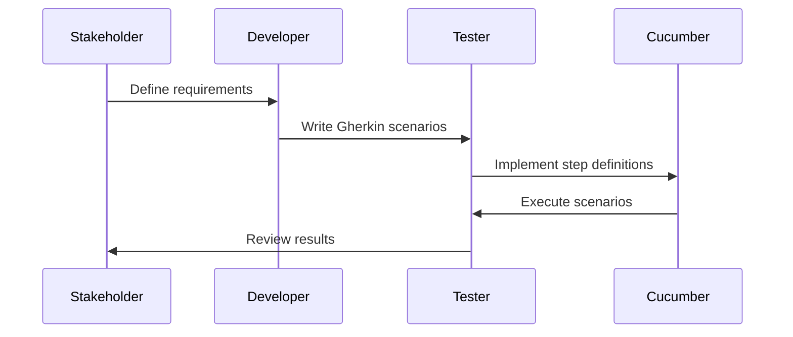

## 14.11 Behavior-Driven Development (BDD)

Behavior-Driven Development (BDD) is a software development approach that enhances collaboration between developers, testers, and non-technical stakeholders. By using a common language to describe the behavior of an application, BDD ensures that all team members have a shared understanding of the requirements. In this section, we will delve into BDD in Scala, focusing on the use of Cucumber and Gherkin for writing expressive specifications.

### Understanding Behavior-Driven Development (BDD)

BDD extends Test-Driven Development (TDD) by emphasizing the behavior of an application rather than its implementation. It encourages writing tests in a natural language that non-developers can understand, bridging the gap between technical and non-technical team members.

#### Key Concepts of BDD

- **Ubiquitous Language**: BDD promotes the use of a common language that all stakeholders understand, reducing ambiguity and miscommunication.
- **Executable Specifications**: Specifications are written in a format that can be executed as tests, ensuring that the application behaves as expected.
- **Collaboration**: BDD fosters collaboration between developers, testers, and business stakeholders, aligning everyone towards a common goal.

### Introducing Cucumber and Gherkin

Cucumber is a popular BDD tool that allows you to write specifications in a human-readable format using Gherkin syntax. Gherkin is a domain-specific language that describes the behavior of an application in plain text.

#### Gherkin Syntax

Gherkin uses a simple syntax to define features and scenarios. Each scenario consists of steps, which are written in a Given-When-Then format:

- **Given**: Describes the initial context or state.
- **When**: Specifies the action or event.
- **Then**: Defines the expected outcome or result.

Here's an example of a Gherkin scenario:

```gherkin
Feature: User login

  Scenario: Successful login
    Given the user is on the login page
    When the user enters valid credentials
    Then the user should be redirected to the dashboard
```

### Setting Up Cucumber with Scala

To use Cucumber with Scala, you need to set up your project with the necessary dependencies. We'll guide you through the setup process and demonstrate how to integrate Cucumber into your Scala project.

#### Step 1: Add Dependencies

Add the following dependencies to your `build.sbt` file:

```scala
libraryDependencies ++= Seq(
  "io.cucumber" %% "cucumber-scala" % "6.10.4",
  "io.cucumber" % "cucumber-junit" % "6.10.4" % Test,
  "junit" % "junit" % "4.13.2" % Test
)
```

#### Step 2: Create Feature Files

Feature files contain your Gherkin scenarios. Create a `.feature` file in the `src/test/resources` directory:

```gherkin
Feature: User login

  Scenario: Successful login
    Given the user is on the login page
    When the user enters valid credentials
    Then the user should be redirected to the dashboard
```

#### Step 3: Implement Step Definitions

Step definitions map Gherkin steps to code. Create a Scala class in the `src/test/scala` directory to implement the step definitions:

```scala
import io.cucumber.scala.{EN, ScalaDsl}
import org.junit.Assert._

class LoginSteps extends ScalaDsl with EN {

  Given("""^the user is on the login page$""") { () =>
    // Code to navigate to the login page
  }

  When("""^the user enters valid credentials$""") { () =>
    // Code to enter credentials
  }

  Then("""^the user should be redirected to the dashboard$""") { () =>
    // Code to verify redirection
    assertTrue("User is not on the dashboard", true) // Replace with actual check
  }
}
```

#### Step 4: Run Cucumber Tests

To run your Cucumber tests, use the following command:

```bash
sbt test
```

### Writing Effective BDD Scenarios

Writing effective BDD scenarios requires a clear understanding of the application's behavior and the ability to express it in a way that is both precise and understandable.

#### Tips for Writing Scenarios

1. **Focus on Behavior**: Describe what the application should do, not how it should do it.
2. **Use Concrete Examples**: Provide specific examples to clarify the behavior.
3. **Keep Scenarios Simple**: Each scenario should test a single behavior or feature.
4. **Avoid Technical Jargon**: Use language that non-technical stakeholders can understand.

### Integrating BDD with Continuous Integration

Integrating BDD into your continuous integration (CI) pipeline ensures that your specifications are always up-to-date and that your application behaves as expected.

#### Steps for Integration

1. **Automate Test Execution**: Configure your CI server to run Cucumber tests automatically.
2. **Monitor Test Results**: Use CI dashboards to monitor test results and identify failures.
3. **Maintain Test Suites**: Regularly update and refactor your test suites to keep them relevant.

### Advanced BDD Techniques

As you become more comfortable with BDD, you can explore advanced techniques to enhance your testing strategy.

#### Data-Driven Testing

Data-driven testing allows you to run the same scenario with different sets of data. Cucumber supports data tables to achieve this:

```gherkin
Scenario Outline: Login with multiple users
  Given the user is on the login page
  When the user enters <username> and <password>
  Then the user should be redirected to the dashboard

  Examples:
    | username | password |
    | user1    | pass1    |
    | user2    | pass2    |
```

#### Hooks and Tags

Cucumber provides hooks and tags to manage test execution. Hooks allow you to run code before or after scenarios, while tags let you categorize and filter scenarios.

```scala
Before { scenario =>
  // Code to run before each scenario
}

After { scenario =>
  // Code to run after each scenario
}
```

### Visualizing BDD Workflow

To better understand the BDD workflow, let's visualize the process using a sequence diagram.



### Challenges and Best Practices

Implementing BDD can present challenges, but following best practices can help you overcome them.

#### Common Challenges

- **Ambiguous Requirements**: Ensure that requirements are clear and unambiguous.
- **Maintenance Overhead**: Regularly update scenarios to reflect changes in requirements.
- **Collaboration Barriers**: Foster open communication between all stakeholders.

#### Best Practices

- **Involve Stakeholders Early**: Engage stakeholders in the scenario-writing process.
- **Keep Scenarios Independent**: Avoid dependencies between scenarios to simplify maintenance.
- **Review and Refactor**: Continuously review and refactor scenarios to improve clarity and relevance.

### Try It Yourself

To solidify your understanding of BDD in Scala, try modifying the provided code examples. Experiment with different scenarios and step definitions to see how they affect the test outcomes.

### Conclusion

Behavior-Driven Development (BDD) is a powerful approach that aligns technical and non-technical stakeholders by using a common language to describe application behavior. By leveraging tools like Cucumber and Gherkin, Scala developers can write expressive specifications that enhance collaboration and ensure that the application meets its requirements.

Remember, BDD is not just about writing tests; it's about fostering collaboration and understanding. As you continue to explore BDD, keep experimenting, stay curious, and enjoy the journey!

## Quiz Time!



### What is the primary goal of Behavior-Driven Development (BDD)?

- [x] To enhance collaboration between developers, testers, and non-technical stakeholders
- [ ] To focus solely on the technical implementation of features
- [ ] To replace Test-Driven Development (TDD) entirely
- [ ] To automate all testing processes

> **Explanation:** The primary goal of BDD is to enhance collaboration between developers, testers, and non-technical stakeholders by using a common language to describe the behavior of an application.

### Which tool is commonly used for BDD in Scala?

- [x] Cucumber
- [ ] JUnit
- [ ] ScalaTest
- [ ] Mockito

> **Explanation:** Cucumber is a popular tool used for BDD in Scala, allowing developers to write specifications in a human-readable format using Gherkin syntax.

### What is the purpose of Gherkin syntax in BDD?

- [x] To describe the behavior of an application in plain text
- [ ] To compile Scala code into bytecode
- [ ] To optimize the performance of Scala applications
- [ ] To manage dependencies in a Scala project

> **Explanation:** Gherkin syntax is used in BDD to describe the behavior of an application in plain text, making it accessible to non-technical stakeholders.

### In Gherkin, what does the "Given" keyword represent?

- [x] The initial context or state
- [ ] The action or event
- [ ] The expected outcome or result
- [ ] The conclusion of a scenario

> **Explanation:** In Gherkin, the "Given" keyword is used to describe the initial context or state before an action is performed.

### How can you run Cucumber tests in a Scala project?

- [x] By using the sbt test command
- [ ] By compiling the project with scalac
- [ ] By executing the main method in the application
- [ ] By running the project with java

> **Explanation:** Cucumber tests in a Scala project can be run using the `sbt test` command, which executes the tests defined in the project.

### What is a common challenge when implementing BDD?

- [x] Ambiguous requirements
- [ ] Lack of available testing tools
- [ ] Inability to write unit tests
- [ ] Difficulty in compiling Scala code

> **Explanation:** A common challenge when implementing BDD is dealing with ambiguous requirements, which can lead to misunderstandings and incorrect implementations.

### What is the benefit of using data-driven testing in BDD?

- [x] It allows running the same scenario with different sets of data
- [ ] It eliminates the need for writing step definitions
- [ ] It automatically generates Gherkin scenarios
- [ ] It improves the performance of test execution

> **Explanation:** Data-driven testing in BDD allows running the same scenario with different sets of data, making it easier to test various input combinations.

### What is the role of hooks in Cucumber?

- [x] To run code before or after scenarios
- [ ] To define Gherkin syntax
- [ ] To compile Scala code
- [ ] To manage dependencies

> **Explanation:** Hooks in Cucumber are used to run code before or after scenarios, allowing for setup and teardown operations.

### Which of the following is a best practice for writing BDD scenarios?

- [x] Focus on behavior, not implementation
- [ ] Use technical jargon for precision
- [ ] Test multiple behaviors in a single scenario
- [ ] Avoid involving stakeholders in the process

> **Explanation:** A best practice for writing BDD scenarios is to focus on behavior, not implementation, and to use language that non-technical stakeholders can understand.

### True or False: BDD is solely about writing tests.

- [ ] True
- [x] False

> **Explanation:** False. BDD is not solely about writing tests; it's about fostering collaboration and understanding between all stakeholders by using a common language to describe application behavior.


