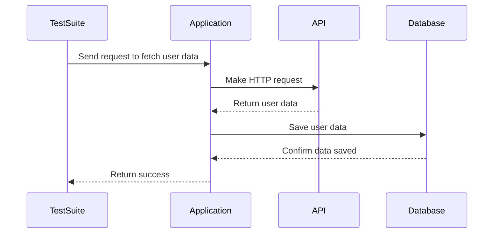

## 14.12 Integration Testing

Integration testing is a critical phase in the software development lifecycle, ensuring that different components or systems work together as expected. In Scala, with its blend of functional and object-oriented paradigms, integration testing can be both powerful and complex. This section will guide you through the intricacies of integration testing in Scala, offering insights, strategies, and practical examples to help you master this essential skill.

### Understanding Integration Testing

Integration testing involves testing the interfaces and interaction between integrated components or systems. Unlike unit testing, which focuses on individual components, integration testing ensures that these components work together correctly. This type of testing is crucial for identifying issues that may arise when components interact, such as data format mismatches, incorrect API calls, or unexpected behavior due to state changes.

#### Key Objectives of Integration Testing

1. **Verify Component Interactions**: Ensure that components communicate and interact as expected.
2. **Detect Interface Defects**: Identify issues in the interfaces between components.
3. **Validate Data Flow**: Confirm that data is correctly passed and transformed between components.
4. **Assess System Behavior**: Evaluate the system's behavior as a whole, rather than in isolation.

### Integration Testing Strategies

There are several strategies for performing integration testing, each with its own strengths and weaknesses. Choosing the right strategy depends on the architecture of your application and the specific requirements of your project.

#### Big Bang Integration Testing

In the Big Bang approach, all components are integrated simultaneously, and the entire system is tested as a whole. This method is straightforward but can make it difficult to isolate the cause of any issues that arise.

#### Incremental Integration Testing

Incremental integration testing involves integrating components one at a time and testing each integration step. This approach can be further divided into:

- **Top-Down Integration**: Start with the top-level components and integrate downwards.
- **Bottom-Up Integration**: Begin with the lower-level components and integrate upwards.
- **Sandwich Integration**: A combination of top-down and bottom-up approaches.

#### Continuous Integration Testing

Continuous integration testing is a modern approach that involves integrating and testing components frequently, often as part of a continuous integration/continuous deployment (CI/CD) pipeline. This strategy helps catch integration issues early and ensures that the system remains stable as new changes are introduced.

### Tools for Integration Testing in Scala

Scala developers have access to a variety of tools and libraries that facilitate integration testing. Some of the most popular ones include:

- **ScalaTest**: A versatile testing library that supports integration testing with features like fixtures and shared state.
- **Specs2**: A testing framework that offers powerful DSLs for writing integration tests.
- **Mockito**: A mocking framework that can be used to simulate interactions with external components.
- **Akka TestKit**: Useful for testing applications built with Akka, particularly for actor-based systems.
- **WireMock**: A tool for mocking HTTP services, ideal for testing integrations with external APIs.

### Writing Integration Tests in Scala

Let's explore how to write effective integration tests in Scala using ScalaTest and other tools. We'll start with a simple example and gradually introduce more complex scenarios.

#### Example: Testing a REST API Integration

Suppose we have a Scala application that interacts with a REST API to fetch user data. We'll write an integration test to ensure that our application correctly handles the API response.

```scala
import org.scalatest.flatspec.AnyFlatSpec
import org.scalatest.matchers.should.Matchers
import sttp.client3._
import sttp.client3.testing._

class UserApiIntegrationTest extends AnyFlatSpec with Matchers {

  // Define a mock backend to simulate the API response
  val backend = SttpBackendStub.synchronous
    .whenRequestMatches(_.uri.path.endsWith(List("users", "123")))
    .thenRespond("""{"id": "123", "name": "John Doe"}""")

  "UserService" should "fetch user data correctly from the API" in {
    // Use the mock backend in the HTTP client
    val client = basicRequest
      .get(uri"https://api.example.com/users/123")
      .send(backend)

    // Assert that the response contains the expected data
    client.body shouldBe Right("""{"id": "123", "name": "John Doe"}""")
  }
}
```

In this example, we use the `SttpBackendStub` to simulate the API response, allowing us to test our application's integration with the API without making actual network calls.

#### Example: Testing Database Integration

Integration tests often involve testing interactions with databases. Let's write a test to verify that our application can correctly save and retrieve data from a database.

```scala
import org.scalatest.flatspec.AnyFlatSpec
import org.scalatest.matchers.should.Matchers
import slick.jdbc.H2Profile.api._

class DatabaseIntegrationTest extends AnyFlatSpec with Matchers {

  // Define a simple table schema
  class Users(tag: Tag) extends Table[(Int, String)](tag, "USERS") {
    def id = column[Int]("ID", O.PrimaryKey, O.AutoInc)
    def name = column[String]("NAME")
    def * = (id, name)
  }

  val users = TableQuery[Users]

  "Database" should "save and retrieve user data correctly" in {
    // Setup an in-memory database
    val db = Database.forConfig("h2mem1")

    val setup = DBIO.seq(
      users.schema.create,
      users += (0, "John Doe")
    )

    val result = db.run(setup.andThen(users.result))

    // Assert that the data is saved and retrieved correctly
    result.map { users =>
      users should contain((1, "John Doe"))
    }
  }
}
```

In this example, we use Slick to interact with an in-memory H2 database, allowing us to test database interactions without affecting a production database.

### Best Practices for Integration Testing

To ensure that your integration tests are effective and maintainable, consider the following best practices:

1. **Isolate External Dependencies**: Use mocking frameworks to simulate interactions with external systems, such as APIs or databases, to avoid flaky tests.
2. **Use Realistic Test Data**: Ensure that the data used in your tests closely resembles real-world data to catch potential issues.
3. **Automate Tests**: Integrate your tests into a CI/CD pipeline to run them automatically on every code change.
4. **Keep Tests Fast**: Minimize the time it takes to run your tests by using in-memory databases or stubs where possible.
5. **Focus on Critical Paths**: Prioritize testing the most critical interactions and data flows in your application.

### Visualizing Integration Testing Workflows

To better understand the integration testing process, let's visualize a typical workflow using a sequence diagram. This diagram illustrates the interactions between components during an integration test.



**Diagram Description**: This sequence diagram shows the flow of an integration test where the test suite sends a request to the application, which then interacts with an external API and a database. The test verifies that the application correctly handles the API response and saves the data to the database.

### Challenges in Integration Testing

Integration testing can present several challenges, especially in complex systems. Here are some common challenges and strategies to address them:

#### Managing Test Environments

Setting up and maintaining test environments that closely resemble production can be challenging. Use containerization tools like Docker to create consistent and reproducible test environments.

#### Handling Flaky Tests

Flaky tests, which pass or fail unpredictably, can undermine confidence in your test suite. Identify and isolate flaky tests, and use mocking or stubbing to eliminate external dependencies that may cause instability.

#### Ensuring Test Coverage

Achieving comprehensive test coverage in integration tests can be difficult. Focus on covering critical paths and interactions, and use code coverage tools to identify gaps in your test suite.

### Try It Yourself

To deepen your understanding of integration testing in Scala, try modifying the provided examples:

1. **Extend the REST API Test**: Add additional test cases to handle different API responses, such as error codes or unexpected data formats.
2. **Enhance the Database Test**: Introduce more complex database interactions, such as transactions or joins, and write tests to verify their correctness.
3. **Experiment with Mocking**: Use a mocking framework like Mockito to simulate interactions with other components, such as message queues or external services.

### Conclusion

Integration testing is a vital part of ensuring that your Scala applications function correctly as a whole. By understanding the strategies, tools, and best practices outlined in this guide, you can confidently write integration tests that validate the interactions between your application's components. Remember, integration testing is an ongoing process that evolves with your application, so continue to refine your tests as your system grows and changes.

## Quiz Time!



### What is the primary goal of integration testing?

- [x] To verify that different components work together correctly.
- [ ] To test individual components in isolation.
- [ ] To ensure code coverage is maximized.
- [ ] To test the user interface of an application.

> **Explanation:** The primary goal of integration testing is to verify that different components or systems work together correctly.

### Which integration testing strategy involves integrating all components simultaneously?

- [ ] Incremental Integration Testing
- [x] Big Bang Integration Testing
- [ ] Continuous Integration Testing
- [ ] Top-Down Integration Testing

> **Explanation:** Big Bang Integration Testing involves integrating all components simultaneously and testing the entire system as a whole.

### What tool can be used to mock HTTP services in Scala integration tests?

- [ ] ScalaTest
- [ ] Specs2
- [x] WireMock
- [ ] Akka TestKit

> **Explanation:** WireMock is a tool used for mocking HTTP services, making it ideal for testing integrations with external APIs.

### In the context of integration testing, what is a flaky test?

- [x] A test that passes or fails unpredictably.
- [ ] A test that always passes.
- [ ] A test that always fails.
- [ ] A test that is not automated.

> **Explanation:** A flaky test is one that passes or fails unpredictably, often due to external dependencies or timing issues.

### Which of the following is a best practice for integration testing?

- [x] Isolate external dependencies using mocks or stubs.
- [ ] Use production databases for testing.
- [ ] Avoid automating integration tests.
- [ ] Focus only on unit tests for critical paths.

> **Explanation:** Isolating external dependencies using mocks or stubs is a best practice to ensure integration tests are reliable and not dependent on external systems.

### What is the benefit of using in-memory databases for integration testing?

- [x] They help keep tests fast and isolated.
- [ ] They are identical to production databases.
- [ ] They require complex setup and teardown.
- [ ] They are only suitable for unit testing.

> **Explanation:** In-memory databases help keep tests fast and isolated, making them ideal for integration testing without affecting production data.

### Which tool is specifically useful for testing actor-based systems in Scala?

- [ ] WireMock
- [ ] Specs2
- [ ] Mockito
- [x] Akka TestKit

> **Explanation:** Akka TestKit is specifically useful for testing actor-based systems built with Akka in Scala.

### What is a common challenge in integration testing?

- [x] Managing test environments that resemble production.
- [ ] Writing unit tests for every function.
- [ ] Ensuring the user interface is responsive.
- [ ] Maximizing code coverage.

> **Explanation:** Managing test environments that closely resemble production is a common challenge in integration testing, as it ensures realistic testing conditions.

### True or False: Continuous integration testing involves integrating and testing components frequently.

- [x] True
- [ ] False

> **Explanation:** Continuous integration testing involves integrating and testing components frequently, often as part of a CI/CD pipeline, to catch issues early.

### Which integration testing strategy combines top-down and bottom-up approaches?

- [ ] Big Bang Integration Testing
- [ ] Continuous Integration Testing
- [x] Sandwich Integration Testing
- [ ] Incremental Integration Testing

> **Explanation:** Sandwich Integration Testing combines top-down and bottom-up approaches to integrate components incrementally.


