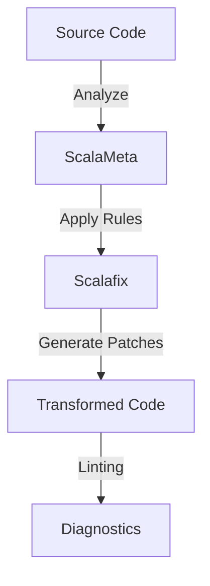
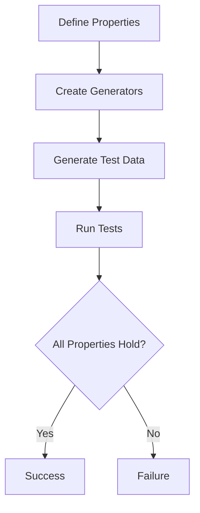
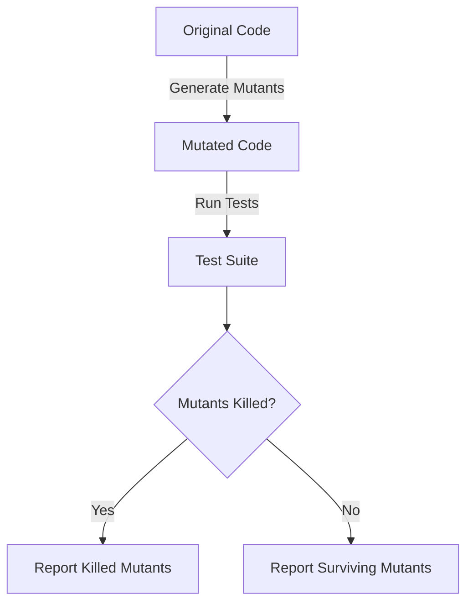
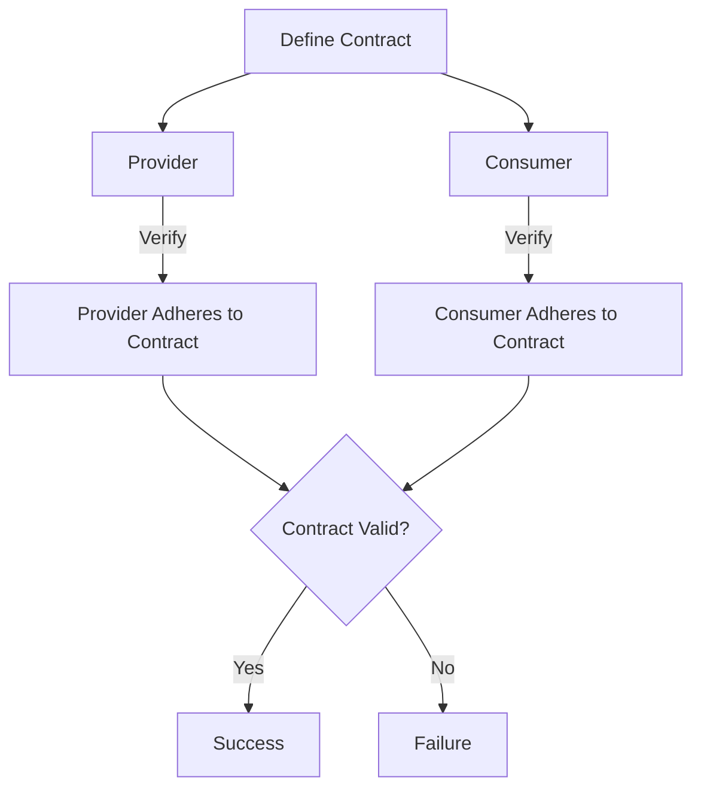

## 14.13 Advanced Testing Techniques

In the ever-evolving landscape of software development, ensuring the reliability and robustness of your code is paramount. As expert software engineers and architects, we must leverage advanced testing techniques to maintain high code quality. This section delves into four sophisticated testing methodologies in Scala: using ScalaMeta for code analysis, property-based testing with Hedgehog, mutation testing with Stryker4s, and detailed contract testing with Scala Pact.

### Using ScalaMeta for Code Analysis

ScalaMeta is a powerful library for metaprogramming in Scala, enabling developers to perform code analysis and transformations. One of its prominent applications is in writing custom linters with Scalafix, a tool that enforces code styles and best practices.

#### Writing Custom Linters with Scalafix

Scalafix is a refactoring and linting tool built on top of ScalaMeta. It allows us to define custom rules to enforce coding standards and detect potential issues in our codebase.

**Example: Creating a Custom Linter Rule**

Let's create a simple Scalafix rule to enforce a naming convention for variables.

```scala
// Import necessary Scalafix libraries
import scalafix.v1._
import scala.meta._

class VariableNamingConvention extends SyntacticRule("VariableNamingConvention") {
  override def fix(implicit doc: SyntacticDocument): Patch = {
    doc.tree.collect {
      case defn @ Defn.Val(_, List(Pat.Var(name)), _, _) if !name.value.matches("^[a-z][A-Za-z0-9]*$") =>
        Patch.lint(Diagnostic("VariableNamingConvention", s"Variable '${name.value}' should be camelCase", defn.pos))
    }.asPatch
  }
}
```

In this example, we define a rule that checks if variable names follow the camelCase convention. If a variable name doesn't match the pattern, a diagnostic message is generated.

#### Enforcing Code Styles and Best Practices

Scalafix can be integrated into your build process to automatically apply code transformations and enforce best practices. By doing so, you can ensure consistency across your codebase and catch potential issues early in the development cycle.

**Try It Yourself**

Experiment with creating different Scalafix rules to enforce other coding standards, such as method naming conventions or import organization. Modify the example above to check for method names starting with a lowercase letter.

### Property-Based Testing with Hedgehog

Property-based testing is a powerful technique that allows us to define properties that our code should satisfy for a wide range of inputs. Hedgehog is a property-based testing library for Scala that offers improved ergonomics over ScalaCheck.

#### Defining Generators and Properties

In Hedgehog, we define generators to produce random test data and properties that assert certain conditions hold for all generated data.

**Example: Testing a Sorting Function**

Let's test a simple sorting function using Hedgehog.

```scala
import hedgehog._
import hedgehog.runner._

object SortingProperties extends Properties {
  def tests: List[Test] = List(
    property("sorted list should have the same elements", testSortedElements)
  )

  def testSortedElements: Property = for {
    list <- Gen.list(Range.linear(0, 100), Gen.int(Range.linear(-1000, 1000))).log("list")
  } yield {
    val sortedList = list.sorted
    Result.assert(sortedList == list.sorted)
  }
}
```

In this example, we define a property that checks if the sorted list contains the same elements as the original list. Hedgehog's `Gen` provides a convenient way to generate random lists of integers.

#### Improved Ergonomics

Hedgehog offers a more intuitive API and better error reporting compared to ScalaCheck, making it easier to write and debug property-based tests.

**Try It Yourself**

Extend the example by adding more properties, such as checking if the sorted list is in non-decreasing order. Experiment with different data types and generators to test other functions in your codebase.

### Mutation Testing with Stryker4s

Mutation testing is a technique that evaluates the effectiveness of your test suite by introducing small changes (mutations) to your code and checking if the tests detect them. Stryker4s is a mutation testing framework for Scala that automates this process.

#### Automating Mutation Testing in Scala

Stryker4s generates mutants by applying transformations to your code, such as changing arithmetic operators or replacing constants. It then runs your test suite to see if any tests fail.

**Example: Running Stryker4s**

To use Stryker4s, add it to your project and configure it in your `build.sbt` file.

```sbt
libraryDependencies += "io.stryker-mutator" %% "stryker4s-core" % "0.8.0"
```

Run Stryker4s with the following command:

```bash
sbt stryker
```

Stryker4s will generate a report showing which mutants were killed (detected by tests) and which survived.

#### Improving Test Suite Robustness

By identifying surviving mutants, Stryker4s helps you pinpoint weaknesses in your test suite. You can then enhance your tests to cover these cases, improving overall robustness.

**Try It Yourself**

Run Stryker4s on your project and analyze the results. Identify surviving mutants and modify your tests to detect them. Experiment with different configurations to optimize mutation testing for your codebase.

### Detailed Contract Testing with Scala Pact

Contract testing ensures that services communicate correctly by verifying that they adhere to agreed-upon contracts. Scala Pact is a tool for implementing contract tests in Scala, particularly useful for microservices.

#### Implementing Contract Tests for Microservices

Scala Pact allows you to define contracts as JSON files and verify that both providers and consumers adhere to them.

**Example: Defining a Contract**

Let's define a simple contract for a service that provides user information.

```json
{
  "provider": {
    "name": "UserService"
  },
  "consumer": {
    "name": "UserClient"
  },
  "interactions": [
    {
      "description": "a request for user details",
      "request": {
        "method": "GET",
        "path": "/user/123"
      },
      "response": {
        "status": 200,
        "body": {
          "id": 123,
          "name": "John Doe"
        }
      }
    }
  ]
}
```

This contract specifies that the `UserService` should return user details when the `UserClient` makes a GET request to `/user/123`.

#### Advanced Techniques and Best Practices

Scala Pact supports advanced features such as matching rules and provider state setup, allowing you to create comprehensive contract tests.

**Try It Yourself**

Create contracts for different interactions between your services. Use Scala Pact to verify that both providers and consumers adhere to these contracts. Experiment with matching rules to handle dynamic data.

#### Integration Strategies

Integrate Scala Pact into your CI/CD pipeline to automatically verify contracts during the build process. This ensures that changes to services do not break existing contracts, maintaining compatibility between components.

**Try It Yourself**

Set up a CI/CD pipeline that runs Scala Pact tests as part of the build process. Experiment with different configurations to optimize contract testing for your project.

### Visualizing Advanced Testing Techniques

To better understand the relationships and workflows involved in these advanced testing techniques, let's visualize them using Mermaid.js diagrams.

#### Visualizing ScalaMeta and Scalafix Workflow



This diagram illustrates the workflow of using ScalaMeta and Scalafix to analyze source code, apply custom rules, and generate diagnostics.

#### Visualizing Property-Based Testing with Hedgehog



This diagram shows the process of defining properties, creating generators, and running tests in Hedgehog.

#### Visualizing Mutation Testing with Stryker4s



This diagram depicts the mutation testing process with Stryker4s, highlighting the generation of mutants and the evaluation of test suite effectiveness.

#### Visualizing Contract Testing with Scala Pact



This diagram illustrates the contract testing process with Scala Pact, showing the verification of provider and consumer adherence to contracts.

### Knowledge Check

Before we conclude, let's reinforce our understanding with a few questions:

- What is the primary purpose of using ScalaMeta and Scalafix in code analysis?
- How does Hedgehog improve upon ScalaCheck for property-based testing?
- What are the benefits of mutation testing with Stryker4s?
- How does contract testing with Scala Pact ensure compatibility between microservices?

### Embrace the Journey

Remember, mastering these advanced testing techniques is a journey. As you continue to explore and experiment, you'll gain deeper insights into ensuring the quality and reliability of your Scala applications. Keep pushing the boundaries, stay curious, and embrace the challenges along the way!

## Quiz Time!



### What is the primary purpose of using ScalaMeta and Scalafix in code analysis?

- [x] To enforce coding standards and detect potential issues
- [ ] To generate random test data
- [ ] To automate mutation testing
- [ ] To define contracts for microservices

> **Explanation:** ScalaMeta and Scalafix are used to enforce coding standards and detect potential issues by analyzing and transforming code.

### How does Hedgehog improve upon ScalaCheck for property-based testing?

- [x] By offering a more intuitive API and better error reporting
- [ ] By generating mutants for testing
- [ ] By defining contracts for microservices
- [ ] By automating code transformations

> **Explanation:** Hedgehog provides a more intuitive API and better error reporting, making it easier to write and debug property-based tests compared to ScalaCheck.

### What are the benefits of mutation testing with Stryker4s?

- [x] It helps identify weaknesses in the test suite
- [ ] It generates random test data
- [ ] It defines contracts for microservices
- [ ] It enforces coding standards

> **Explanation:** Mutation testing with Stryker4s helps identify weaknesses in the test suite by introducing mutations and checking if tests detect them.

### How does contract testing with Scala Pact ensure compatibility between microservices?

- [x] By verifying that services adhere to agreed-upon contracts
- [ ] By generating random test data
- [ ] By automating mutation testing
- [ ] By enforcing coding standards

> **Explanation:** Contract testing with Scala Pact ensures compatibility by verifying that both providers and consumers adhere to agreed-upon contracts.

### Which tool is used for writing custom linters in Scala?

- [x] Scalafix
- [ ] Hedgehog
- [ ] Stryker4s
- [ ] Scala Pact

> **Explanation:** Scalafix is used for writing custom linters in Scala, allowing developers to enforce coding standards and best practices.

### What is the role of generators in property-based testing?

- [x] To produce random test data
- [ ] To define contracts for microservices
- [ ] To automate mutation testing
- [ ] To enforce coding standards

> **Explanation:** Generators in property-based testing are used to produce random test data, which is then used to verify that properties hold for a wide range of inputs.

### What does Stryker4s do with the mutants it generates?

- [x] Runs the test suite to see if any tests fail
- [ ] Defines contracts for microservices
- [ ] Enforces coding standards
- [ ] Generates random test data

> **Explanation:** Stryker4s runs the test suite on the mutants it generates to see if any tests fail, helping to identify weaknesses in the test suite.

### What is the purpose of defining contracts in Scala Pact?

- [x] To ensure services communicate correctly
- [ ] To produce random test data
- [ ] To automate mutation testing
- [ ] To enforce coding standards

> **Explanation:** Defining contracts in Scala Pact ensures that services communicate correctly by verifying adherence to agreed-upon contracts.

### What is a key feature of Hedgehog that enhances its usability?

- [x] Intuitive API and better error reporting
- [ ] Mutation generation
- [ ] Contract definition
- [ ] Code transformation

> **Explanation:** Hedgehog's intuitive API and better error reporting enhance its usability, making it easier to write and debug property-based tests.

### True or False: Mutation testing with Stryker4s can help improve test suite robustness.

- [x] True
- [ ] False

> **Explanation:** True. Mutation testing with Stryker4s can help improve test suite robustness by identifying weaknesses and prompting enhancements.


