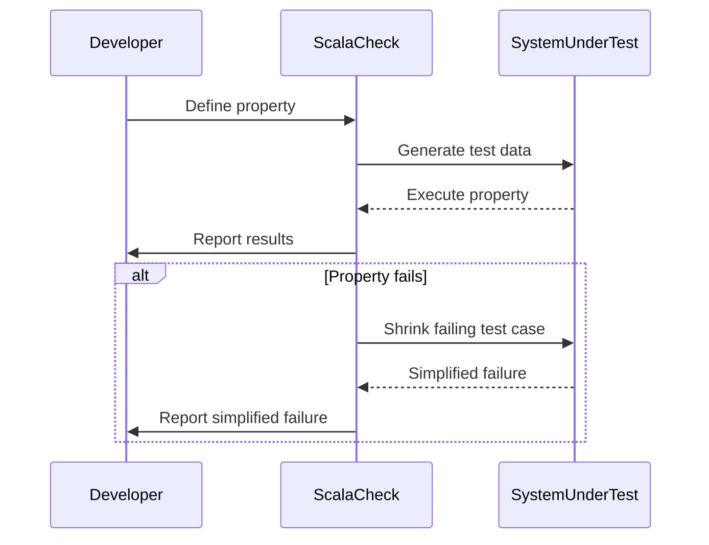

## 14.2 Property-Based Testing with ScalaCheck

Property-based testing is a powerful testing paradigm that allows developers to define properties that should hold true for a wide range of inputs, rather than writing individual test cases for specific scenarios. ScalaCheck is a library for Scala that facilitates property-based testing by automatically generating test cases based on these properties. In this section, we will explore how to leverage ScalaCheck to generate comprehensive test cases, ensuring robust and reliable Scala applications.

### Introduction to Property-Based Testing

Property-based testing focuses on defining the properties or invariants of a system rather than specific example-based test cases. This approach can uncover edge cases and bugs that might be missed by traditional testing methods. The core idea is to specify the expected behavior of a function or system in terms of properties, and then use a tool like ScalaCheck to automatically generate a wide variety of test inputs to validate these properties.

#### Key Concepts

- **Properties**: Statements about the expected behavior of a system that should hold true for all inputs.
- **Generators**: Tools that produce random test data to validate properties.
- **Shrinking**: The process of simplifying failing test cases to the smallest possible input that still causes the failure.

### Why Use ScalaCheck?

ScalaCheck provides several benefits for Scala developers:

- **Automation**: Automatically generates a wide range of test inputs, reducing the need for manual test case creation.
- **Coverage**: Increases test coverage by exploring a vast input space.
- **Edge Case Discovery**: Helps uncover edge cases and unexpected behaviors.
- **Integration**: Seamlessly integrates with popular Scala testing frameworks like ScalaTest and Specs2.

### Getting Started with ScalaCheck

To begin using ScalaCheck, you'll need to add it as a dependency to your Scala project. You can do this by adding the following to your `build.sbt` file:

```scala
libraryDependencies += "org.scalacheck" %% "scalacheck" % "1.15.4" % Test
```

Once ScalaCheck is included in your project, you can start defining properties and writing tests.

### Defining Properties

Properties in ScalaCheck are defined using the `Prop` class. A property is essentially a function that returns a `Prop` object, which ScalaCheck can then evaluate against a range of inputs.

#### Example: Testing a Simple Function

Let's consider a simple function that reverses a list:

```scala
def reverseList[A](list: List[A]): List[A] = list.reverse
```

We can define a property to test that reversing a list twice should yield the original list:

```scala
import org.scalacheck.Prop.forAll

val reverseTwiceProperty = forAll { (list: List[Int]) =>
  reverseList(reverseList(list)) == list
}
```

This property states that for any list of integers, reversing it twice should result in the original list.

### Running Properties with ScalaCheck

To run properties, you can use the `check` method provided by ScalaCheck. This method will generate a series of test cases and evaluate the property against them:

```scala
import org.scalacheck.Prop._

object ReverseListSpecification extends Properties("ReverseList") {
  property("reverseTwice") = forAll { (list: List[Int]) =>
    reverseList(reverseList(list)) == list
  }
}

ReverseListSpecification.check
```

### Generating Test Data

ScalaCheck provides a rich set of generators for creating test data. Generators are defined using the `Gen` class, and ScalaCheck includes many built-in generators for common data types.

#### Built-in Generators

Some of the built-in generators include:

- `Gen.choose(min, max)`: Generates a random integer between `min` and `max`.
- `Gen.alphaStr`: Generates a random string of alphabetic characters.
- `Gen.listOf(gen)`: Generates a list of elements using the specified generator.

#### Custom Generators

You can also create custom generators by combining existing ones or defining new ones:

```scala
val evenNumberGen: Gen[Int] = Gen.choose(0, 100).suchThat(_ % 2 == 0)
```

This generator produces even numbers between 0 and 100.

### Shrinking Failing Test Cases

When a property fails, ScalaCheck attempts to simplify the failing test case to the smallest possible input that still causes the failure. This process is known as shrinking. Shrinking helps identify the root cause of a failure by reducing the complexity of the test case.

### Integrating ScalaCheck with Testing Frameworks

ScalaCheck can be integrated with popular Scala testing frameworks like ScalaTest and Specs2, allowing you to use property-based testing alongside traditional unit tests.

#### Integration with ScalaTest

To use ScalaCheck with ScalaTest, you can extend the `ScalaCheckPropertyChecks` trait:

```scala
import org.scalatest._
import org.scalatestplus.scalacheck.ScalaCheckPropertyChecks

class ReverseListSpec extends AnyFlatSpec with ScalaCheckPropertyChecks {
  "reverseList" should "return the original list when reversed twice" in {
    forAll { (list: List[Int]) =>
      assert(reverseList(reverseList(list)) == list)
    }
  }
}
```

#### Integration with Specs2

For Specs2, you can use the `ScalaCheck` trait:

```scala
import org.specs2._
import org.specs2.ScalaCheck

class ReverseListSpec extends Specification with ScalaCheck {
  def is = s2"""
    reverseList should return the original list when reversed twice $reverseTwice
  """

  def reverseTwice = prop { list: List[Int] =>
    reverseList(reverseList(list)) mustEqual list
  }
}
```

### Advanced ScalaCheck Features

ScalaCheck offers several advanced features for more complex testing scenarios.

#### Conditional Properties

You can define properties that only apply under certain conditions using the `==>` operator:

```scala
val nonEmptyListProperty = forAll { (list: List[Int]) =>
  (list.nonEmpty) ==> (reverseList(list).head == list.last)
}
```

This property only applies to non-empty lists and checks that the first element of the reversed list is the same as the last element of the original list.

#### Combining Properties

ScalaCheck allows you to combine multiple properties using logical operators:

```scala
val combinedProperty = reverseTwiceProperty && nonEmptyListProperty
```

#### Labeling Properties

You can label properties to make test reports more informative:

```scala
val labeledProperty = forAll { (list: List[Int]) =>
  (list.nonEmpty) ==> (reverseList(list).head == list.last)
}.label("Reverse head equals original last")
```

### Visualizing Property-Based Testing

To better understand the flow of property-based testing with ScalaCheck, let's visualize the process using a sequence diagram.



This diagram illustrates how ScalaCheck generates test data, executes the property, and reports the results back to the developer. If a property fails, ScalaCheck attempts to shrink the failing test case.

### Try It Yourself

To get hands-on experience with ScalaCheck, try modifying the code examples provided in this guide. Experiment with different properties, generators, and test scenarios to see how ScalaCheck can help you uncover edge cases and improve your test coverage.

### Knowledge Check

- Explain the concept of property-based testing and how it differs from example-based testing.
- Demonstrate how to define a property in ScalaCheck.
- Provide an example of a custom generator in ScalaCheck.
- Explain the process of shrinking in ScalaCheck and its benefits.
- Describe how to integrate ScalaCheck with ScalaTest and Specs2.

### Conclusion

Property-based testing with ScalaCheck is a powerful technique for generating comprehensive test cases and ensuring the reliability of your Scala applications. By defining properties and leveraging ScalaCheck's automatic test data generation, you can uncover edge cases and improve your test coverage. As you continue to explore ScalaCheck, remember to experiment with different properties and generators to fully harness the power of property-based testing.

## Quiz Time!



### What is the main advantage of property-based testing over example-based testing?

- [x] It explores a wider range of inputs automatically.
- [ ] It requires less initial setup.
- [ ] It is easier to understand.
- [ ] It is faster to execute.

> **Explanation:** Property-based testing automatically generates a wide range of inputs, increasing test coverage and uncovering edge cases that might be missed with example-based testing.

### How do you define a property in ScalaCheck?

- [x] Using the `Prop` class and the `forAll` method.
- [ ] By writing a traditional test case.
- [ ] Using the `Test` class and the `check` method.
- [ ] By defining a `Property` object.

> **Explanation:** In ScalaCheck, properties are defined using the `Prop` class and the `forAll` method, which specifies the expected behavior for a range of inputs.

### What is the purpose of shrinking in ScalaCheck?

- [x] To simplify failing test cases to the smallest possible input.
- [ ] To increase the number of test cases.
- [ ] To optimize the performance of tests.
- [ ] To generate more complex test data.

> **Explanation:** Shrinking simplifies failing test cases to the smallest input that still causes the failure, helping identify the root cause of the issue.

### Which Scala testing framework can ScalaCheck be integrated with?

- [x] ScalaTest
- [x] Specs2
- [ ] JUnit
- [ ] TestNG

> **Explanation:** ScalaCheck can be integrated with ScalaTest and Specs2, allowing property-based testing to be used alongside traditional unit tests.

### What is a generator in ScalaCheck?

- [x] A tool that produces random test data.
- [ ] A method for defining properties.
- [ ] A class for running tests.
- [ ] A type of test case.

> **Explanation:** Generators in ScalaCheck produce random test data to validate properties, allowing for a wide range of inputs to be tested.

### How can you create a custom generator in ScalaCheck?

- [x] By combining existing generators or defining new ones.
- [ ] By writing a custom test case.
- [ ] By using the `Prop` class.
- [ ] By extending the `Test` class.

> **Explanation:** Custom generators can be created by combining existing generators or defining new ones to produce specific types of test data.

### What does the `==>` operator do in ScalaCheck?

- [x] It defines a conditional property.
- [ ] It combines two properties.
- [ ] It labels a property.
- [ ] It runs a property.

> **Explanation:** The `==>` operator is used to define conditional properties in ScalaCheck, specifying that a property should only be tested under certain conditions.

### What is the benefit of labeling properties in ScalaCheck?

- [x] It makes test reports more informative.
- [ ] It increases test coverage.
- [ ] It simplifies test cases.
- [ ] It speeds up test execution.

> **Explanation:** Labeling properties in ScalaCheck provides more informative test reports, helping developers understand the context of each test case.

### What is the role of the `check` method in ScalaCheck?

- [x] It runs the defined properties against generated test data.
- [ ] It defines a new property.
- [ ] It creates a custom generator.
- [ ] It shrinks failing test cases.

> **Explanation:** The `check` method in ScalaCheck runs the defined properties against generated test data, evaluating their validity.

### True or False: ScalaCheck can only be used with ScalaTest.

- [ ] True
- [x] False

> **Explanation:** ScalaCheck can be used with multiple Scala testing frameworks, including ScalaTest and Specs2, providing flexibility in testing approaches.


