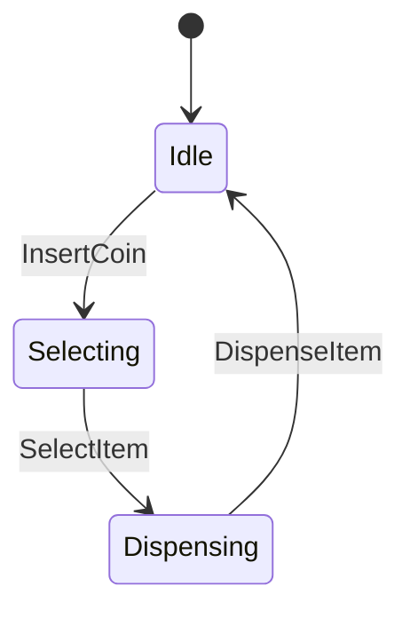

## 14.3 Model-Based Testing

Model-Based Testing (MBT) is a powerful technique that leverages models to represent the desired behavior of a system under test. By using models, we can automatically generate test cases that ensure comprehensive coverage of the system's functionality. This approach is particularly beneficial in complex systems where manual test case generation is impractical. In this section, we will explore how to implement Model-Based Testing in Scala, a language that offers both functional and object-oriented paradigms, making it an excellent choice for sophisticated testing strategies.

### Understanding Model-Based Testing

Model-Based Testing involves creating abstract representations (models) of the system's behavior. These models can be used to generate test cases automatically, ensuring that the system behaves as expected under various conditions. The primary goal of MBT is to improve the efficiency and effectiveness of the testing process by:

- **Automating Test Case Generation**: Reducing the manual effort required to create test cases.
- **Ensuring Comprehensive Coverage**: Covering all possible states and transitions in the system.
- **Detecting Defects Early**: Identifying inconsistencies and errors in the early stages of development.

#### Key Concepts in Model-Based Testing

1. **Model**: A simplified representation of the system's behavior, often expressed as state machines, decision tables, or flowcharts.

2. **Test Generation**: The process of deriving test cases from the model to verify that the system behaves as expected.

3. **Test Execution**: Running the generated test cases against the system to validate its behavior.

4. **Test Evaluation**: Analyzing the results of test execution to identify defects and areas for improvement.

### Implementing Model-Based Testing in Scala

Scala's rich type system and functional programming capabilities make it an ideal language for implementing Model-Based Testing. Let's delve into the steps involved in setting up MBT in Scala.

#### Step 1: Define the Model

The first step in Model-Based Testing is to define a model that accurately represents the system's behavior. This model can be represented using various formalisms, such as finite state machines (FSMs), which are particularly useful for systems with well-defined states and transitions.

```scala
// Define a simple state machine for a vending machine
sealed trait State
case object Idle extends State
case object Selecting extends State
case object Dispensing extends State

sealed trait Event
case object InsertCoin extends Event
case object SelectItem extends Event
case object DispenseItem extends Event

case class Transition(from: State, event: Event, to: State)

val transitions: Set[Transition] = Set(
  Transition(Idle, InsertCoin, Selecting),
  Transition(Selecting, SelectItem, Dispensing),
  Transition(Dispensing, DispenseItem, Idle)
)
```

In this example, we define a simple state machine for a vending machine with three states: `Idle`, `Selecting`, and `Dispensing`. The transitions between these states are triggered by events such as `InsertCoin`, `SelectItem`, and `DispenseItem`.

#### Step 2: Generate Test Cases

Once the model is defined, the next step is to generate test cases that cover all possible states and transitions. This can be achieved using Scala's functional programming features to traverse the state machine and generate test scenarios.

```scala
def generateTestCases(transitions: Set[Transition]): List[List[Event]] = {
  def explore(state: State, path: List[Event]): List[List[Event]] = {
    if (state == Idle && path.nonEmpty) List(path)
    else {
      transitions.filter(_.from == state).flatMap { transition =>
        explore(transition.to, path :+ transition.event)
      }.toList
    }
  }
  explore(Idle, List.empty)
}

val testCases = generateTestCases(transitions)
testCases.foreach(tc => println(s"Test Case: ${tc.mkString(" -> ")}"))
```

This function recursively explores all possible paths through the state machine, generating a list of test cases that cover each path.

#### Step 3: Execute Test Cases

With the test cases generated, the next step is to execute them against the system. This involves simulating the events and verifying that the system transitions through the expected states.

```scala
def executeTestCase(testCase: List[Event]): Boolean = {
  var currentState: State = Idle
  testCase.forall { event =>
    transitions.find(t => t.from == currentState && t.event == event) match {
      case Some(transition) =>
        currentState = transition.to
        true
      case None =>
        false
    }
  }
}

val results = testCases.map(tc => (tc, executeTestCase(tc)))
results.foreach { case (tc, result) =>
  println(s"Test Case: ${tc.mkString(" -> ")} Result: ${if (result) "Pass" else "Fail"}")
}
```

This code executes each test case by simulating the events and checking if the system transitions through the expected states. The results are then printed, indicating whether each test case passed or failed.

### Visualizing Model-Based Testing

To better understand the flow of Model-Based Testing, let's visualize the state transitions using a state diagram.



This diagram represents the state transitions of the vending machine, showing how the system moves from one state to another based on the events.

### Advantages of Model-Based Testing

Model-Based Testing offers several advantages that make it a valuable approach for testing complex systems:

- **Automated Test Generation**: Reduces the time and effort required to create test cases manually.
- **Comprehensive Coverage**: Ensures that all possible states and transitions are tested.
- **Early Defect Detection**: Identifies defects early in the development process, reducing the cost of fixing them.
- **Improved Test Maintenance**: Changes to the system can be easily reflected in the model, simplifying test maintenance.

### Challenges and Considerations

While Model-Based Testing offers significant benefits, it also presents some challenges:

- **Model Complexity**: Creating an accurate model can be complex and time-consuming, especially for large systems.
- **Tooling and Integration**: Integrating MBT tools with existing development workflows can be challenging.
- **Scalability**: As the system grows, the model may become difficult to manage and maintain.

### Best Practices for Model-Based Testing in Scala

To effectively implement Model-Based Testing in Scala, consider the following best practices:

1. **Start Simple**: Begin with a simple model and gradually increase its complexity as you gain confidence.

2. **Use Functional Programming**: Leverage Scala's functional programming features to create concise and expressive models.

3. **Automate Test Execution**: Use automated tools to execute test cases and analyze results.

4. **Iterate and Refine**: Continuously refine the model and test cases based on feedback and test results.

5. **Integrate with CI/CD**: Incorporate Model-Based Testing into your continuous integration and delivery pipeline to ensure ongoing quality assurance.

### Try It Yourself

Experiment with the provided code examples by modifying the state machine and transitions. Try adding new states and events to see how the test case generation and execution adapt to changes in the model.

### Conclusion

Model-Based Testing is a powerful technique that can significantly enhance the quality and reliability of software systems. By leveraging Scala's functional programming capabilities, we can create expressive models that automate test case generation and execution. While there are challenges to overcome, the benefits of improved test coverage and early defect detection make MBT a valuable addition to any testing strategy.

## Quiz Time!



### What is the primary goal of Model-Based Testing?

- [x] To automate test case generation and ensure comprehensive coverage.
- [ ] To replace manual testing entirely.
- [ ] To simplify the development process.
- [ ] To eliminate the need for test execution.

> **Explanation:** The primary goal of Model-Based Testing is to automate test case generation and ensure comprehensive coverage of the system's functionality.

### Which Scala feature is particularly useful for implementing Model-Based Testing?

- [x] Functional programming capabilities.
- [ ] Object-oriented inheritance.
- [ ] Dynamic typing.
- [ ] Reflection.

> **Explanation:** Scala's functional programming capabilities are particularly useful for implementing Model-Based Testing due to their expressiveness and conciseness.

### What is a key advantage of using Model-Based Testing?

- [x] Early defect detection.
- [ ] Reduced system complexity.
- [ ] Elimination of all bugs.
- [ ] Faster development cycles.

> **Explanation:** One of the key advantages of Model-Based Testing is early defect detection, which helps reduce the cost of fixing defects.

### What challenge might you face when implementing Model-Based Testing?

- [x] Model complexity.
- [ ] Lack of test cases.
- [ ] Inability to automate tests.
- [ ] Limited test coverage.

> **Explanation:** Creating an accurate model can be complex and time-consuming, especially for large systems.

### How can you visualize the state transitions in Model-Based Testing?

- [x] Using state diagrams.
- [ ] Writing detailed documentation.
- [ ] Creating flowcharts.
- [ ] Drawing sequence diagrams.

> **Explanation:** State diagrams are an effective way to visualize the state transitions in Model-Based Testing.

### What is a best practice for starting with Model-Based Testing?

- [x] Start with a simple model and gradually increase complexity.
- [ ] Implement the most complex model first.
- [ ] Avoid using automation tools.
- [ ] Focus solely on manual testing.

> **Explanation:** Starting with a simple model and gradually increasing its complexity is a best practice for implementing Model-Based Testing effectively.

### What is a common use case for Model-Based Testing?

- [x] Testing complex systems with numerous states and transitions.
- [ ] Testing simple, static web pages.
- [ ] Testing small scripts with limited functionality.
- [ ] Testing systems with no user interaction.

> **Explanation:** Model-Based Testing is particularly useful for testing complex systems with numerous states and transitions.

### What is the role of test evaluation in Model-Based Testing?

- [x] Analyzing test results to identify defects and areas for improvement.
- [ ] Generating test cases from the model.
- [ ] Executing test cases against the system.
- [ ] Simplifying the model.

> **Explanation:** Test evaluation involves analyzing test results to identify defects and areas for improvement.

### What is a potential benefit of integrating Model-Based Testing with CI/CD?

- [x] Ongoing quality assurance.
- [ ] Reduced need for testing.
- [ ] Faster code compilation.
- [ ] Simplified deployment processes.

> **Explanation:** Integrating Model-Based Testing with CI/CD can provide ongoing quality assurance by continuously testing the system.

### True or False: Model-Based Testing can completely replace manual testing.

- [ ] True
- [x] False

> **Explanation:** Model-Based Testing cannot completely replace manual testing, as manual testing may still be required for exploratory testing and scenarios not covered by the model.


