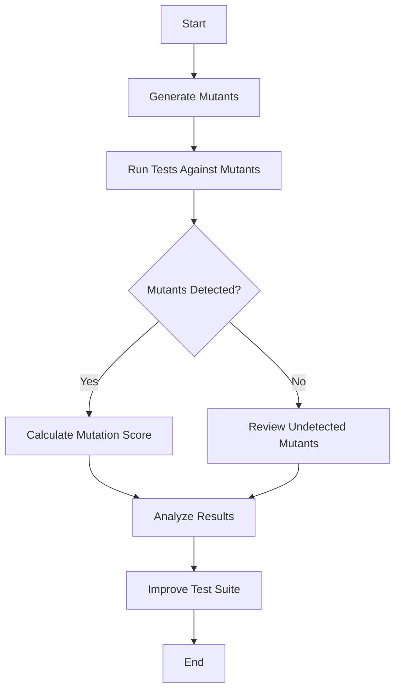

## 14.4 Mutation Testing

Mutation testing is a powerful technique used to assess the effectiveness of a test suite by introducing small changes, or "mutations," to the code and checking if the existing tests can detect these changes. This process helps identify weaknesses in the test suite and ensures that it is robust enough to catch potential bugs in the software.

### Understanding Mutation Testing

#### What is Mutation Testing?

Mutation testing involves modifying a program's source code in small ways to create a set of "mutants." Each mutant represents a version of the program with a slight change, such as altering a conditional operator or changing a constant value. The goal is to determine whether the existing test suite can detect and fail these mutants, thus ensuring that the tests are effective in catching errors.

#### Why Use Mutation Testing?

The primary purpose of mutation testing is to evaluate the quality of a test suite. By identifying tests that fail to detect mutants, developers can improve their test cases, making them more comprehensive and reliable. This leads to higher software quality and reduces the likelihood of bugs slipping through to production.

### Key Concepts in Mutation Testing

#### Mutants and Mutation Operators

- **Mutants**: These are the modified versions of the original program. Each mutant contains a small change introduced by a mutation operator.
- **Mutation Operators**: These are the rules or techniques used to create mutants. Common mutation operators include:
  - **Arithmetic Operator Replacement**: Changing `+` to `-`, `*` to `/`, etc.
  - **Logical Operator Replacement**: Changing `&&` to `||`, `==` to `!=`, etc.
  - **Constant Replacement**: Altering constant values within the code.
  - **Statement Deletion**: Removing a line of code.

#### Mutation Score

The mutation score is a metric used to evaluate the effectiveness of a test suite. It is calculated as the percentage of mutants detected by the test suite out of the total number of mutants created. A higher mutation score indicates a more effective test suite.

### Tools for Mutation Testing in Scala

Several tools are available for performing mutation testing in Scala. These tools automate the process of generating mutants and running tests against them. Here are some popular options:

#### 1. Stryker4s

Stryker4s is a mutation testing framework specifically designed for Scala. It integrates seamlessly with Scala projects and provides detailed reports on the effectiveness of your test suite.

- **Installation**: Stryker4s can be added to your project using sbt, Scala's build tool.
- **Features**: It supports multiple mutation operators, customizable configurations, and generates comprehensive reports.

#### 2. Pitest

Pitest is another mutation testing tool that supports Java and Scala. It is known for its speed and efficiency in generating mutants and running tests.

- **Integration**: Pitest can be integrated with Scala projects through plugins or command-line tools.
- **Advantages**: It offers a wide range of mutation operators and provides detailed insights into test coverage and effectiveness.

### Implementing Mutation Testing in Scala

Let's walk through the process of implementing mutation testing in a Scala project using Stryker4s.

#### Step 1: Setting Up Stryker4s

To get started with Stryker4s, add the following configuration to your `build.sbt` file:

```scala
// Add Stryker4s plugin
addSbtPlugin("io.stryker-mutator" % "sbt-stryker4s" % "0.8.0")
```

#### Step 2: Configuring Stryker4s

Create a `stryker4s.conf` file in the root of your project to configure the mutation testing process:

```hocon
stryker4s {
  base-dir = "src/main/scala"
  test-runner = "sbt"
  reporters = ["html", "console"]
  thresholds {
    high = 80
    low = 60
  }
}
```

- **base-dir**: Specifies the directory containing the source code to mutate.
- **test-runner**: Defines the test runner to use (e.g., sbt).
- **reporters**: Lists the reporters for output (e.g., HTML, console).
- **thresholds**: Sets the mutation score thresholds for reporting.

#### Step 3: Running Mutation Tests

Execute the following command to run mutation tests with Stryker4s:

```bash
sbt stryker
```

Stryker4s will generate mutants, run your test suite against them, and provide a report on the mutation score and any undetected mutants.

### Analyzing Mutation Test Results

After running mutation tests, it's crucial to analyze the results to identify areas for improvement in your test suite. Here are some key points to consider:

#### Reviewing Undetected Mutants

- **Identify Weak Tests**: Look for tests that failed to detect mutants and consider enhancing them to cover more scenarios.
- **Refactor Code**: In some cases, undetected mutants may indicate areas of code that are difficult to test. Consider refactoring these sections to improve testability.

#### Improving Test Coverage

- **Add New Tests**: Based on the undetected mutants, add new test cases to cover edge cases and improve overall test coverage.
- **Enhance Assertions**: Strengthen existing tests by adding more assertions to verify expected behavior thoroughly.

### Best Practices for Mutation Testing

To maximize the benefits of mutation testing, consider the following best practices:

#### Start Small

Begin with a small set of mutation operators and gradually expand as you become more comfortable with the process. This approach helps manage complexity and ensures a smooth integration into your development workflow.

#### Regularly Run Mutation Tests

Incorporate mutation testing into your continuous integration (CI) pipeline to ensure that your test suite remains effective as the codebase evolves. Regular testing helps catch regressions and maintain high software quality.

#### Focus on Critical Code Paths

Prioritize mutation testing for critical code paths and components that are essential to the application's functionality. This focus ensures that the most important parts of the code are thoroughly tested.

### Visualizing Mutation Testing Process

To better understand the mutation testing process, let's visualize the workflow using a Mermaid.js flowchart:



This flowchart illustrates the key steps in mutation testing, from generating mutants to improving the test suite based on the results.

### Challenges and Considerations

While mutation testing offers significant benefits, it also presents some challenges:

#### Performance Overhead

Generating and testing mutants can be resource-intensive, especially for large codebases. Consider running mutation tests during off-peak hours or on dedicated testing environments to minimize impact on development.

#### False Positives

In some cases, mutation testing may produce false positives, where a mutant is detected as a failure due to an unrelated issue. Carefully review test results to distinguish between genuine and false positives.

#### Tool Limitations

Different mutation testing tools have varying levels of support for Scala features and libraries. Evaluate multiple tools to find the one that best fits your project's needs.

### Conclusion

Mutation testing is a valuable technique for assessing and improving the effectiveness of your test suite. By identifying weaknesses and enhancing test coverage, you can ensure that your Scala applications are robust, reliable, and ready for production. As you integrate mutation testing into your development workflow, remember to start small, focus on critical code paths, and regularly run tests to maintain high software quality.

## Quiz Time!



### What is the primary purpose of mutation testing?

- [x] To evaluate the quality of a test suite by introducing small changes to the code.
- [ ] To improve the performance of the software application.
- [ ] To refactor the codebase for better readability.
- [ ] To automate the deployment process.

> **Explanation:** Mutation testing is used to assess the effectiveness of a test suite by introducing small changes, or "mutations," to the code and checking if the existing tests can detect these changes.

### Which of the following is a common mutation operator?

- [x] Arithmetic Operator Replacement
- [ ] Code Refactoring
- [ ] Dependency Injection
- [ ] Continuous Integration

> **Explanation:** Arithmetic Operator Replacement is a common mutation operator that involves changing operators like `+` to `-` or `*` to `/`.

### What is the mutation score?

- [x] A metric used to evaluate the effectiveness of a test suite by calculating the percentage of mutants detected.
- [ ] A measure of the code's performance efficiency.
- [ ] The number of lines of code covered by tests.
- [ ] The total number of test cases in a suite.

> **Explanation:** The mutation score is calculated as the percentage of mutants detected by the test suite out of the total number of mutants created.

### Which tool is specifically designed for mutation testing in Scala?

- [x] Stryker4s
- [ ] JUnit
- [ ] Mockito
- [ ] Jenkins

> **Explanation:** Stryker4s is a mutation testing framework specifically designed for Scala.

### What should you do if a mutant is not detected by the test suite?

- [x] Review and enhance the test cases to cover more scenarios.
- [ ] Ignore the mutant as it is not important.
- [ ] Remove the test cases that failed to detect the mutant.
- [ ] Refactor the entire codebase.

> **Explanation:** If a mutant is not detected, it's important to review and enhance the test cases to cover more scenarios and improve test coverage.

### What is a potential challenge of mutation testing?

- [x] Performance overhead due to generating and testing mutants.
- [ ] Lack of support for object-oriented programming.
- [ ] Difficulty in integrating with version control systems.
- [ ] Incompatibility with functional programming languages.

> **Explanation:** Mutation testing can be resource-intensive, especially for large codebases, leading to performance overhead.

### How can mutation testing be integrated into the development workflow?

- [x] By incorporating it into the continuous integration (CI) pipeline.
- [ ] By running it only once before the final release.
- [ ] By using it exclusively for performance testing.
- [ ] By applying it only to non-critical code paths.

> **Explanation:** Incorporating mutation testing into the CI pipeline ensures that the test suite remains effective as the codebase evolves.

### What is a false positive in mutation testing?

- [x] A mutant detected as a failure due to an unrelated issue.
- [ ] A test case that passes unexpectedly.
- [ ] A code change that improves performance.
- [ ] A successful deployment without errors.

> **Explanation:** A false positive occurs when a mutant is detected as a failure due to an unrelated issue, not because of a genuine problem in the code.

### Which configuration file is used to set up Stryker4s in a Scala project?

- [x] stryker4s.conf
- [ ] application.conf
- [ ] build.sbt
- [ ] pom.xml

> **Explanation:** The `stryker4s.conf` file is used to configure the mutation testing process in a Scala project using Stryker4s.

### True or False: Mutation testing can help identify weaknesses in a test suite.

- [x] True
- [ ] False

> **Explanation:** True. Mutation testing helps identify weaknesses in a test suite by revealing tests that fail to detect mutants, allowing developers to improve their test cases.


