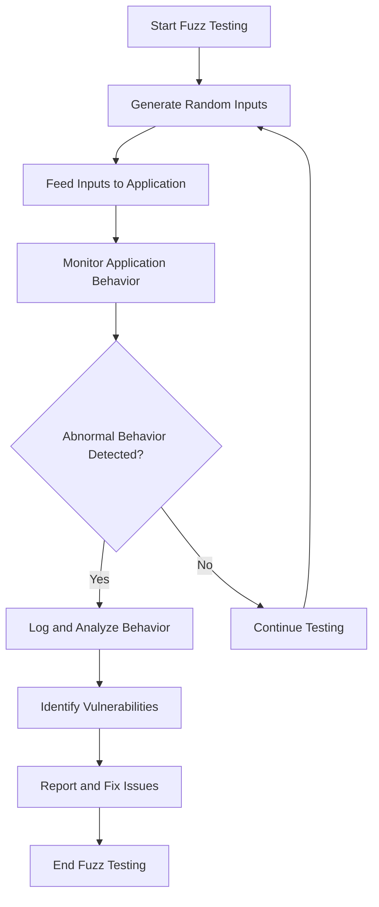

## 14.5 Fuzz Testing

In the ever-evolving landscape of software development, ensuring the robustness and reliability of applications is paramount. Fuzz testing, a dynamic and automated testing technique, plays a crucial role in uncovering vulnerabilities and unexpected behaviors in software systems. This section delves into the world of fuzz testing within the Scala ecosystem, providing expert software engineers and architects with a comprehensive understanding of its concepts, tools, and integration strategies.

### Introduction to Fuzz Testing

Fuzz testing, or fuzzing, is a software testing technique that involves providing invalid, unexpected, or random data inputs to a program. The primary goal is to identify potential vulnerabilities, crashes, and unexpected behaviors that could compromise the software's stability and security. Unlike traditional testing methods that rely on predefined test cases, fuzz testing explores the application's behavior under a wide range of inputs, often revealing edge cases that are otherwise overlooked.

#### The Importance of Fuzz Testing

Fuzz testing is particularly valuable in uncovering security vulnerabilities, such as buffer overflows, memory leaks, and input validation errors. By simulating real-world scenarios where malicious or malformed data might be introduced, fuzz testing helps developers identify and address weaknesses before they can be exploited.

#### How Fuzz Testing Works

At its core, fuzz testing involves generating a large volume of random inputs and feeding them into the application. The application is then monitored for any abnormal behavior, such as crashes, hangs, or incorrect outputs. Fuzz testing tools often include mechanisms to log and analyze these behaviors, providing insights into potential vulnerabilities.

### Tools and Frameworks for Fuzz Testing in Scala

Scala, with its strong type system and functional programming paradigms, offers a unique environment for implementing fuzz testing. Several tools and frameworks are available to facilitate fuzz testing in Scala applications, each offering distinct features and capabilities.

#### ScalaCheck

ScalaCheck is a popular property-based testing library for Scala that can be leveraged for fuzz testing. It allows developers to define properties that should hold true for a wide range of inputs. ScalaCheck then generates random test data to verify these properties, effectively serving as a form of fuzz testing.

```scala
import org.scalacheck.Prop.forAll
import org.scalacheck.Properties

object StringSpecification extends Properties("String") {
  property("concatenate") = forAll { (a: String, b: String) =>
    (a + b).length >= a.length && (a + b).length >= b.length
  }
}
```

In this example, ScalaCheck generates random strings `a` and `b` to test the property that concatenating two strings results in a string whose length is at least as long as each of the original strings.

#### Fuzz Testing with ScalaTest

ScalaTest, a versatile testing framework, can also be used for fuzz testing by integrating with ScalaCheck. This combination allows for the execution of property-based tests alongside traditional unit tests, providing a comprehensive testing strategy.

```scala
import org.scalatest._
import org.scalatestplus.scalacheck.ScalaCheckPropertyChecks

class StringTest extends AnyFlatSpec with ScalaCheckPropertyChecks {
  "String concatenation" should "have a length at least as long as the original strings" in {
    forAll { (a: String, b: String) =>
      assert((a + b).length >= a.length)
      assert((a + b).length >= b.length)
    }
  }
}
```

This integration enables developers to define properties and leverage ScalaCheck's random data generation capabilities within the ScalaTest framework.

#### Other Fuzz Testing Tools

While ScalaCheck and ScalaTest are widely used, other tools can complement fuzz testing efforts in Scala:

- **AFL (American Fuzzy Lop):** A powerful fuzzing tool that can be used with Scala applications by compiling them with AFL instrumentation. It is particularly effective for finding security vulnerabilities.
  
- **Jazzer:** A fuzzer for the JVM ecosystem that supports Scala. It integrates with the LLVM libFuzzer and provides coverage-guided fuzzing for Java and Scala applications.

- **Zest:** A feedback-driven fuzzing framework that can be used with Scala applications. It focuses on maximizing code coverage and finding edge cases.

### Integrating Fuzz Testing into the Development Cycle

To maximize the benefits of fuzz testing, it is essential to integrate it seamlessly into the software development lifecycle. This involves incorporating fuzz testing into various stages of development, from initial design to deployment and maintenance.

#### Early Integration

Integrate fuzz testing early in the development process to identify potential vulnerabilities during the design and implementation phases. This proactive approach helps prevent costly fixes later in the development cycle.

#### Continuous Integration and Deployment

Incorporate fuzz testing into continuous integration (CI) and continuous deployment (CD) pipelines. Automated fuzz tests can run alongside unit and integration tests, ensuring that new code changes do not introduce vulnerabilities.

```yaml
stages:
  - build
  - test

test:
  stage: test
  script:
    - sbt test
    - sbt "testOnly *FuzzTest"
```

This CI configuration runs fuzz tests as part of the testing stage, ensuring that any issues are caught early in the development process.

#### Monitoring and Feedback

Implement monitoring and feedback mechanisms to track the results of fuzz tests. Analyze logs and reports generated by fuzz testing tools to identify patterns and areas that require further investigation.

#### Collaboration and Communication

Encourage collaboration between developers, testers, and security teams to address vulnerabilities identified through fuzz testing. Effective communication ensures that issues are prioritized and resolved promptly.

### Challenges and Considerations

While fuzz testing offers significant benefits, it also presents challenges that must be addressed to ensure its effectiveness.

#### Handling Large Input Spaces

Fuzz testing can generate a vast number of inputs, making it challenging to cover all possible scenarios. Prioritize areas of the application that are most critical or vulnerable to maximize testing efficiency.

#### Managing False Positives

Fuzz testing may produce false positives, where inputs trigger unexpected behavior that is not indicative of a real vulnerability. Implement mechanisms to filter and analyze results to distinguish between genuine issues and false alarms.

#### Resource Constraints

Fuzz testing can be resource-intensive, requiring significant computational power and time. Optimize testing strategies to balance thoroughness with available resources.

### Visualizing Fuzz Testing Workflow

To better understand the fuzz testing process, let's visualize the workflow using a Mermaid.js flowchart:



This flowchart illustrates the iterative nature of fuzz testing, where random inputs are continuously generated and fed into the application. The application is monitored for abnormal behavior, and any identified vulnerabilities are logged and analyzed for resolution.

### Try It Yourself

To gain hands-on experience with fuzz testing in Scala, try modifying the provided code examples. Experiment with different properties in ScalaCheck or integrate fuzz testing into your existing ScalaTest suite. Observe how fuzz testing can uncover unexpected behaviors and enhance the robustness of your applications.

### Knowledge Check

- Explain the primary goal of fuzz testing.
- Describe how ScalaCheck can be used for fuzz testing.
- Discuss the benefits of integrating fuzz testing into CI/CD pipelines.
- Identify challenges associated with fuzz testing and propose solutions.

### Conclusion

Fuzz testing is a powerful technique for enhancing the robustness and security of Scala applications. By leveraging tools like ScalaCheck and integrating fuzz testing into the development cycle, developers can proactively identify and address vulnerabilities. As you continue your journey in software engineering, embrace fuzz testing as a valuable tool in your testing arsenal, ensuring the reliability and security of your applications.

## Quiz Time!



### What is the primary goal of fuzz testing?

- [x] To identify potential vulnerabilities and unexpected behaviors in software.
- [ ] To improve code readability and maintainability.
- [ ] To optimize application performance.
- [ ] To enhance user interface design.

> **Explanation:** The primary goal of fuzz testing is to identify potential vulnerabilities and unexpected behaviors by providing invalid, unexpected, or random data inputs to a program.

### Which Scala library is commonly used for property-based testing and can be leveraged for fuzz testing?

- [x] ScalaCheck
- [ ] Akka
- [ ] Play Framework
- [ ] Slick

> **Explanation:** ScalaCheck is a popular property-based testing library in Scala that can be used for fuzz testing by generating random test data to verify properties.

### How can fuzz testing be integrated into the development cycle?

- [x] By incorporating it into CI/CD pipelines.
- [ ] By running it only after deployment.
- [ ] By using it exclusively for performance testing.
- [ ] By applying it only to user interface components.

> **Explanation:** Fuzz testing can be integrated into the development cycle by incorporating it into CI/CD pipelines, allowing automated fuzz tests to run alongside unit and integration tests.

### What challenge does fuzz testing face when generating a vast number of inputs?

- [x] Handling large input spaces.
- [ ] Improving code readability.
- [ ] Enhancing user experience.
- [ ] Reducing code complexity.

> **Explanation:** Fuzz testing faces the challenge of handling large input spaces, making it difficult to cover all possible scenarios.

### What is a potential downside of fuzz testing?

- [x] It can produce false positives.
- [ ] It always improves application performance.
- [ ] It guarantees complete code coverage.
- [ ] It simplifies the codebase.

> **Explanation:** A potential downside of fuzz testing is that it can produce false positives, where inputs trigger unexpected behavior that is not indicative of a real vulnerability.

### Which tool is known for coverage-guided fuzzing in the JVM ecosystem?

- [x] Jazzer
- [ ] ScalaTest
- [ ] Play Framework
- [ ] Slick

> **Explanation:** Jazzer is a fuzzer for the JVM ecosystem that supports Scala and provides coverage-guided fuzzing.

### What is a common use case for fuzz testing?

- [x] Identifying security vulnerabilities.
- [ ] Enhancing user interface design.
- [ ] Improving database performance.
- [ ] Simplifying code logic.

> **Explanation:** A common use case for fuzz testing is identifying security vulnerabilities, such as buffer overflows and input validation errors.

### How does fuzz testing differ from traditional testing methods?

- [x] It uses random data inputs instead of predefined test cases.
- [ ] It focuses solely on performance optimization.
- [ ] It is only applicable to web applications.
- [ ] It requires manual test case creation.

> **Explanation:** Fuzz testing differs from traditional testing methods by using random data inputs instead of predefined test cases to explore the application's behavior under a wide range of inputs.

### What is a benefit of early integration of fuzz testing in the development process?

- [x] Identifying potential vulnerabilities during the design phase.
- [ ] Reducing the need for unit tests.
- [ ] Eliminating the need for code reviews.
- [ ] Simplifying the deployment process.

> **Explanation:** Early integration of fuzz testing in the development process helps identify potential vulnerabilities during the design and implementation phases, preventing costly fixes later.

### True or False: Fuzz testing can only be applied to security-critical applications.

- [ ] True
- [x] False

> **Explanation:** False. Fuzz testing can be applied to any application to uncover vulnerabilities and unexpected behaviors, not just security-critical ones.


