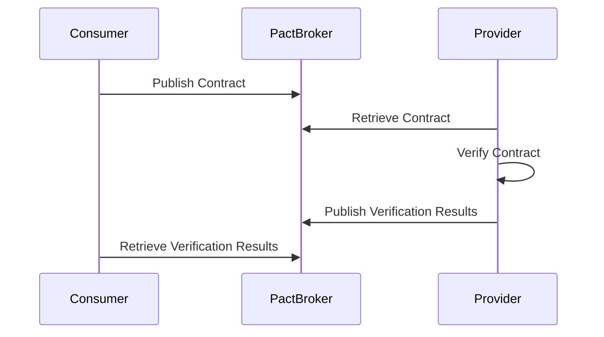

## 14.6 Contract Testing for Microservices

In the world of microservices, where applications are composed of numerous independent services communicating over the network, ensuring compatibility between service providers and consumers is paramount. Contract testing emerges as a vital practice to guarantee that these services can interact seamlessly without unexpected failures. In this section, we will delve into the principles of contract testing, explore tools like Pact, and demonstrate how to implement contract testing in Scala microservices.

### Understanding Contract Testing

Contract testing is a testing methodology that focuses on the interactions between service providers and consumers. Unlike traditional integration testing, which tests the entire system end-to-end, contract testing isolates the interactions between individual services. This approach ensures that a service provider adheres to the expectations of its consumers, and vice versa.

#### Key Concepts

1. **Consumer-Driven Contracts (CDC):** In contract testing, the consumer defines the contract. This contract specifies the expected interactions with the provider, including request formats and expected responses.

2. **Provider Verification:** Once a contract is defined by the consumer, the provider must verify that it can fulfill the contract. This involves running tests to ensure that the provider's implementation matches the consumer's expectations.

3. **Decoupling:** Contract testing allows services to be tested independently, promoting decoupling and enabling parallel development and deployment.

4. **Continuous Integration:** Contracts can be integrated into CI/CD pipelines, ensuring that any changes to a service are automatically verified against existing contracts.

### Benefits of Contract Testing

- **Early Detection of Issues:** By testing interactions in isolation, issues can be identified early in the development process, reducing the risk of integration failures.
  
- **Faster Feedback:** Contract tests run quickly compared to full integration tests, providing rapid feedback to developers.

- **Improved Collaboration:** Contract testing fosters better communication between teams by clearly defining expectations and responsibilities.

- **Reduced Integration Complexity:** By focusing on interactions, contract testing reduces the complexity and overhead associated with full integration testing.

### Tools for Contract Testing

Several tools facilitate contract testing, with Pact being one of the most popular choices. Let's explore how Pact works and how it can be used in Scala microservices.

#### Overview of Pact

Pact is an open-source tool that enables consumer-driven contract testing. It allows consumers to define their expectations in a contract, which is then verified by the provider. Pact supports multiple languages, including Scala, making it a versatile choice for microservices architectures.

##### Key Features of Pact

- **Language Agnostic:** Pact supports a wide range of languages, allowing for cross-language testing.
- **Pact Broker:** A central repository for storing and sharing contracts, enabling collaboration between teams.
- **Verification:** Automated verification of contracts against provider implementations.
- **Integration with CI/CD:** Seamless integration with continuous integration and deployment pipelines.

### Implementing Contract Testing with Pact in Scala

Let's walk through the process of implementing contract testing in a Scala microservices environment using Pact.

#### Step 1: Define the Consumer Contract

The first step in contract testing is to define the consumer's expectations. This involves specifying the requests the consumer will make and the responses it expects from the provider.

```scala
import au.com.dius.pact.consumer.dsl.PactDslWithProvider
import au.com.dius.pact.consumer.{PactConsumerConfig, PactProviderRuleMk2}
import au.com.dius.pact.consumer.dsl.PactDslJsonBody
import org.junit.Rule
import org.junit.Test
import org.junit.Assert._

class ConsumerPactTest {

  @Rule
  val provider: PactProviderRuleMk2 = new PactProviderRuleMk2("ProviderService", PactConsumerConfig.LOCALHOST, 8080, this)

  @Test
  def testConsumerPact(): Unit = {
    val pact = new PactDslWithProvider("ConsumerService", "ProviderService")
      .uponReceiving("a request for user data")
      .path("/user")
      .method("GET")
      .willRespondWith()
      .status(200)
      .body(new PactDslJsonBody()
        .stringType("name", "John Doe")
        .integerType("age", 30)
      )
      .toPact()

    provider.verify(pact, () => {
      val response = scala.io.Source.fromURL("http://localhost:8080/user").mkString
      assertTrue(response.contains("John Doe"))
      assertTrue(response.contains("30"))
    })
  }
}
```

In this example, we define a contract for a consumer service that expects to receive user data from a provider service. The contract specifies that a GET request to `/user` should return a JSON response with a `name` and `age`.

#### Step 2: Verify the Provider

Once the consumer contract is defined, the provider must verify that it can fulfill the contract. This involves running the provider's implementation against the contract to ensure compatibility.

```scala
import au.com.dius.pact.provider.junit.{PactRunner, Provider}
import au.com.dius.pact.provider.junit.loader.PactFolder
import au.com.dius.pact.provider.junit.target.HttpTarget
import au.com.dius.pact.provider.junit.target.Target
import org.junit.runner.RunWith

@RunWith(classOf[PactRunner])
@Provider("ProviderService")
@PactFolder("pacts")
class ProviderPactTest {

  @Target
  val target: Target = new HttpTarget(8080)

  // Provider implementation goes here
}
```

In this provider test, we use Pact's `PactRunner` to verify the provider against the contracts stored in the `pacts` folder. The provider implementation must be running on the specified port for the verification to succeed.

#### Step 3: Integrate with CI/CD

To ensure continuous compatibility, integrate contract testing into your CI/CD pipeline. This involves running consumer and provider tests automatically whenever changes are made to the services.

### Visualizing Contract Testing Workflow

To better understand the contract testing workflow, let's visualize the process using a sequence diagram.



**Diagram Description:** This sequence diagram illustrates the workflow of contract testing with Pact. The consumer publishes a contract to the Pact Broker, which the provider retrieves to verify against its implementation. The provider then publishes the verification results back to the Pact Broker, allowing the consumer to retrieve and review them.

### Best Practices for Contract Testing

- **Keep Contracts Small and Focused:** Contracts should be concise and focused on specific interactions to ensure clarity and maintainability.
  
- **Version Contracts:** Use versioning to manage changes to contracts over time, ensuring backward compatibility.

- **Automate Verification:** Integrate contract verification into your CI/CD pipeline to catch issues early and ensure continuous compatibility.

- **Collaborate Across Teams:** Encourage collaboration between consumer and provider teams to ensure mutual understanding and agreement on contracts.

- **Monitor Contract Changes:** Use tools like the Pact Broker to track changes to contracts and their impact on services.

### Challenges and Considerations

While contract testing offers numerous benefits, it also presents challenges that must be addressed:

- **Complexity in Large Systems:** In large systems with many services, managing contracts can become complex. Use automation and tooling to simplify this process.

- **Versioning and Compatibility:** Ensure that changes to contracts are backward compatible or properly versioned to avoid breaking existing consumers.

- **Tooling and Infrastructure:** Setting up and maintaining the necessary infrastructure, such as a Pact Broker, requires effort and resources.

### Try It Yourself

To get hands-on experience with contract testing in Scala, try modifying the provided code examples. Experiment with different request and response formats, or add new interactions to the contract. Observe how changes impact the provider verification process and explore how to handle versioning and compatibility.

### References and Further Reading

- [Pact Documentation](https://docs.pact.io/)
- [Consumer-Driven Contracts: A Service Evolution Pattern](https://martinfowler.com/articles/consumerDrivenContracts.html)
- [Microservices Patterns: With examples in Java](https://www.amazon.com/Microservices-Patterns-examples-Chris-Richardson/dp/1617294543)

### Knowledge Check

Before we wrap up, let's review some key takeaways:

- Contract testing focuses on the interactions between service providers and consumers, ensuring compatibility and reliability.
- Tools like Pact facilitate consumer-driven contract testing, enabling automated verification and integration with CI/CD pipelines.
- Best practices include keeping contracts small, automating verification, and fostering collaboration between teams.

Remember, contract testing is a powerful tool in the microservices toolkit, helping to ensure that services can evolve independently without breaking their interactions.

## Quiz Time!



### What is the primary goal of contract testing in microservices?

- [x] To ensure compatibility between service providers and consumers
- [ ] To test the entire system end-to-end
- [ ] To replace integration testing completely
- [ ] To focus solely on performance testing

> **Explanation:** The primary goal of contract testing is to ensure compatibility between service providers and consumers by verifying that their interactions adhere to defined contracts.

### Which tool is commonly used for contract testing in microservices?

- [x] Pact
- [ ] JUnit
- [ ] Selenium
- [ ] Mockito

> **Explanation:** Pact is a popular tool for contract testing in microservices, enabling consumer-driven contract testing and automated verification.

### What is a Consumer-Driven Contract (CDC)?

- [x] A contract defined by the consumer specifying expected interactions with the provider
- [ ] A contract defined by the provider specifying expected interactions with the consumer
- [ ] A contract that replaces all other testing methods
- [ ] A contract that focuses on performance metrics

> **Explanation:** A Consumer-Driven Contract (CDC) is defined by the consumer and specifies the expected interactions with the provider, including request formats and expected responses.

### What is the role of the Pact Broker in contract testing?

- [x] To store and share contracts between consumers and providers
- [ ] To execute performance tests
- [ ] To replace unit testing frameworks
- [ ] To manage database migrations

> **Explanation:** The Pact Broker is a central repository for storing and sharing contracts, facilitating collaboration and ensuring that providers can retrieve and verify contracts.

### Why is it important to integrate contract testing into CI/CD pipelines?

- [x] To catch issues early and ensure continuous compatibility
- [ ] To replace all other testing methods
- [ ] To focus solely on performance optimization
- [ ] To manage database migrations

> **Explanation:** Integrating contract testing into CI/CD pipelines allows for early detection of issues and ensures continuous compatibility between services.

### What is a key benefit of contract testing over traditional integration testing?

- [x] Faster feedback and reduced complexity
- [ ] Complete system coverage
- [ ] Focus on performance metrics
- [ ] Replacement of all other testing methods

> **Explanation:** Contract testing provides faster feedback and reduces complexity by focusing on specific interactions between services, unlike traditional integration testing.

### How can contract testing improve collaboration between teams?

- [x] By clearly defining expectations and responsibilities
- [ ] By eliminating the need for communication
- [ ] By focusing solely on performance metrics
- [ ] By replacing all other testing methods

> **Explanation:** Contract testing improves collaboration by clearly defining expectations and responsibilities, fostering better communication between consumer and provider teams.

### What challenge might arise when managing contracts in large systems?

- [x] Complexity in managing numerous contracts
- [ ] Lack of performance metrics
- [ ] Inability to replace unit tests
- [ ] Difficulty in writing code

> **Explanation:** In large systems with many services, managing numerous contracts can become complex, requiring automation and tooling to simplify the process.

### True or False: Contract testing can completely replace integration testing.

- [ ] True
- [x] False

> **Explanation:** False. Contract testing complements integration testing by focusing on specific interactions, but it does not replace the need for full integration testing.

### What is a best practice for managing changes to contracts over time?

- [x] Use versioning to ensure backward compatibility
- [ ] Ignore changes and focus on performance
- [ ] Replace all contracts with new ones
- [ ] Eliminate contracts altogether

> **Explanation:** Using versioning to manage changes to contracts ensures backward compatibility and prevents breaking existing consumers.


