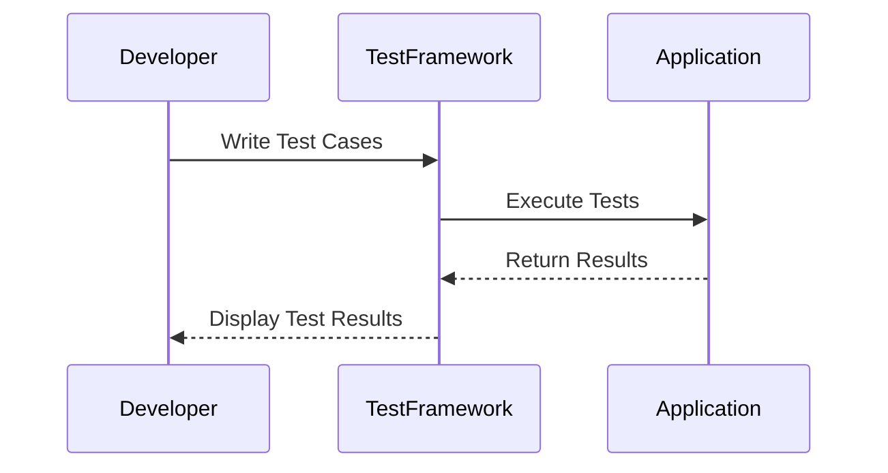

## 14.7 Unit Testing Frameworks

Unit testing is a critical aspect of software development, ensuring that individual components of a program function as expected. In Scala, several frameworks facilitate unit testing, each offering unique features and capabilities. This section delves into three prominent Scala unit testing frameworks: ScalaTest, Specs2, and MUnit. We will explore their features, provide code examples, and discuss best practices for using these frameworks effectively.

### Introduction to Unit Testing in Scala

Unit testing involves testing the smallest parts of an application, such as functions or methods, in isolation from the rest of the application. The primary goal is to validate that each unit of the software performs as designed. Scala, being a language that supports both object-oriented and functional programming paradigms, requires flexible testing frameworks that can cater to its diverse features.

### Why Unit Testing is Essential

- **Ensures Code Quality**: By catching bugs early, unit testing helps maintain high code quality.
- **Facilitates Refactoring**: With a comprehensive suite of unit tests, developers can refactor code with confidence.
- **Documentation**: Unit tests serve as documentation for the code, helping new developers understand the intended functionality.
- **Reduces Debugging Time**: Early detection of issues reduces the time spent debugging.

### Overview of Scala's Unit Testing Frameworks

Scala offers several frameworks for unit testing, each with its strengths and use cases. The most popular ones are:

- **ScalaTest**: Known for its versatility and ease of use.
- **Specs2**: Offers a behavior-driven development (BDD) style.
- **MUnit**: A lightweight and modern testing framework.

Let's explore each of these frameworks in detail.

## ScalaTest

### Introduction to ScalaTest

ScalaTest is one of the most widely used testing frameworks in the Scala ecosystem. It provides a rich set of testing styles and integrates seamlessly with popular build tools like sbt and Maven.

#### Key Features

- **Flexible Testing Styles**: Supports various styles such as FunSuite, FlatSpec, WordSpec, and more.
- **Matchers**: Offers a comprehensive set of matchers for assertions.
- **Integration**: Easily integrates with sbt, Maven, and other build tools.
- **Parallel Execution**: Supports parallel test execution to speed up the testing process.
- **Mocking Support**: Integrates with mocking frameworks like Mockito.

### Getting Started with ScalaTest

To start using ScalaTest, add the following dependency to your `build.sbt` file:

```scala
libraryDependencies += "org.scalatest" %% "scalatest" % "3.2.9" % Test
```

#### Writing Your First Test

Let's write a simple test using ScalaTest's `FunSuite` style.

```scala
import org.scalatest.funsuite.AnyFunSuite

class CalculatorTest extends AnyFunSuite {

  test("addition of two numbers") {
    val sum = 2 + 3
    assert(sum == 5)
  }

  test("subtraction of two numbers") {
    val difference = 5 - 3
    assert(difference == 2)
  }
}
```

In this example, we define a `CalculatorTest` class extending `AnyFunSuite`. Each test case is defined using the `test` method, which takes a string description and a block of code to execute.

### Advanced Features of ScalaTest

#### Matchers

ScalaTest provides a rich set of matchers for more expressive assertions.

```scala
import org.scalatest.matchers.should.Matchers

class StringTest extends AnyFunSuite with Matchers {

  test("string length") {
    val str = "Scala"
    str.length should be (5)
  }

  test("string content") {
    val str = "ScalaTest"
    str should startWith ("Scala")
    str should endWith ("Test")
  }
}
```

#### Testing Asynchronous Code

ScalaTest supports testing asynchronous code using `Futures`.

```scala
import org.scalatest.futures.ScalaFutures
import scala.concurrent.Future
import scala.concurrent.ExecutionContext.Implicits.global

class AsyncTest extends AnyFunSuite with ScalaFutures {

  test("future result") {
    val futureResult = Future { 42 }
    whenReady(futureResult) { result =>
      result should be (42)
    }
  }
}
```

### Best Practices with ScalaTest

- **Use Descriptive Test Names**: Ensure test names clearly describe the test's purpose.
- **Organize Tests Logically**: Group related tests together for better readability.
- **Leverage Matchers**: Use matchers for more expressive and readable assertions.

## Specs2

### Introduction to Specs2

Specs2 is a testing framework that emphasizes behavior-driven development (BDD). It provides a concise syntax for writing tests and specifications.

#### Key Features

- **BDD Style**: Encourages writing tests in a behavior-driven style.
- **Matchers**: Offers a wide range of matchers for assertions.
- **Integration**: Works well with sbt and other build tools.
- **Concurrent Execution**: Supports concurrent test execution.
- **Mocking Support**: Integrates with mocking frameworks.

### Getting Started with Specs2

To use Specs2, add the following dependency to your `build.sbt` file:

```scala
libraryDependencies += "org.specs2" %% "specs2-core" % "4.10.6" % Test
```

#### Writing Your First Test

Here's a simple example using Specs2:

```scala
import org.specs2.mutable.Specification

class CalculatorSpec extends Specification {

  "Calculator" should {

    "add two numbers" in {
      val sum = 2 + 3
      sum must beEqualTo(5)
    }

    "subtract two numbers" in {
      val difference = 5 - 3
      difference must beEqualTo(2)
    }
  }
}
```

In this example, we use `Specification` to define a suite of tests. The `should` keyword introduces a behavior, and `in` specifies the test case.

### Advanced Features of Specs2

#### Matchers

Specs2 provides a variety of matchers for assertions.

```scala
import org.specs2.matcher._

class StringSpec extends Specification {

  "A String" should {

    "have the correct length" in {
      val str = "Scala"
      str must haveSize(5)
    }

    "start and end with specific substrings" in {
      val str = "ScalaTest"
      str must startWith("Scala")
      str must endWith("Test")
    }
  }
}
```

#### Testing Asynchronous Code

Specs2 supports testing asynchronous operations using `Future`.

```scala
import scala.concurrent.Future
import scala.concurrent.ExecutionContext.Implicits.global

class AsyncSpec extends Specification {

  "A Future" should {

    "return the correct result" in {
      val futureResult = Future { 42 }
      futureResult must beEqualTo(42).await
    }
  }
}
```

### Best Practices with Specs2

- **Use Descriptive Descriptions**: Clearly describe the behavior being tested.
- **Organize Specifications**: Group related behaviors for clarity.
- **Leverage Matchers**: Use matchers for concise and expressive assertions.

## MUnit

### Introduction to MUnit

MUnit is a modern, lightweight testing framework for Scala. It is designed to be simple and fast, with minimal dependencies.

#### Key Features

- **Simplicity**: Focuses on simplicity and ease of use.
- **Integration**: Easily integrates with sbt.
- **Assertions**: Provides a straightforward API for assertions.
- **Compatibility**: Works well with Scala 3.

### Getting Started with MUnit

To use MUnit, add the following dependency to your `build.sbt` file:

```scala
libraryDependencies += "org.scalameta" %% "munit" % "0.7.29" % Test
```

#### Writing Your First Test

Here's a basic example using MUnit:

```scala
import munit.FunSuite

class CalculatorSuite extends FunSuite {

  test("addition of two numbers") {
    val sum = 2 + 3
    assertEquals(sum, 5)
  }

  test("subtraction of two numbers") {
    val difference = 5 - 3
    assertEquals(difference, 2)
  }
}
```

In this example, we extend `FunSuite` and use the `test` method to define test cases.

### Advanced Features of MUnit

#### Assertions

MUnit provides a simple API for assertions.

```scala
class StringSuite extends FunSuite {

  test("string length") {
    val str = "Scala"
    assertEquals(str.length, 5)
  }

  test("string content") {
    val str = "ScalaTest"
    assert(str.startsWith("Scala"))
    assert(str.endsWith("Test"))
  }
}
```

#### Testing Asynchronous Code

MUnit supports testing asynchronous code using `Future`.

```scala
import scala.concurrent.Future
import scala.concurrent.ExecutionContext.Implicits.global

class AsyncSuite extends FunSuite {

  test("future result") {
    val futureResult = Future { 42 }
    futureResult.map { result =>
      assertEquals(result, 42)
    }
  }
}
```

### Best Practices with MUnit

- **Keep Tests Simple**: Focus on simplicity and readability.
- **Use Assertions Effectively**: Leverage the straightforward API for clear assertions.
- **Organize Tests**: Group related tests for better structure.

## Visualizing Unit Testing Frameworks

To better understand the relationship between different components of a unit testing framework, let's visualize a typical testing workflow using a sequence diagram.



**Diagram Description**: This sequence diagram illustrates the interaction between a developer, a test framework, and the application being tested. The developer writes test cases, which the test framework executes against the application. The application returns results to the test framework, which then displays the results to the developer.

## Try It Yourself

To gain hands-on experience with these frameworks, try modifying the provided code examples. For instance, add more test cases to cover edge cases, or experiment with different matchers and assertions. This practice will help solidify your understanding of each framework's capabilities.

## Knowledge Check

- **What are the key differences between ScalaTest, Specs2, and MUnit?**
- **How does ScalaTest support asynchronous testing?**
- **What is the primary advantage of using Specs2 for BDD?**
- **How can MUnit be beneficial for Scala 3 projects?**

## Quiz Time!



### Which Scala testing framework is known for its flexibility and support for multiple testing styles?

- [x] ScalaTest
- [ ] Specs2
- [ ] MUnit
- [ ] JUnit

> **Explanation:** ScalaTest is known for its flexibility and support for multiple testing styles, such as FunSuite, FlatSpec, and WordSpec.

### What is the primary focus of Specs2 as a testing framework?

- [ ] Performance
- [x] Behavior-driven development (BDD)
- [ ] Integration testing
- [ ] Load testing

> **Explanation:** Specs2 focuses on behavior-driven development (BDD), encouraging tests to be written in a behavior-driven style.

### Which framework is designed to be lightweight and simple, with minimal dependencies?

- [ ] ScalaTest
- [ ] Specs2
- [x] MUnit
- [ ] JUnit

> **Explanation:** MUnit is designed to be lightweight and simple, with minimal dependencies, making it a modern choice for Scala testing.

### How does ScalaTest support testing asynchronous code?

- [ ] By using threads
- [ ] By using callbacks
- [x] By using Futures and ScalaFutures
- [ ] By using coroutines

> **Explanation:** ScalaTest supports testing asynchronous code by using Futures and ScalaFutures, allowing tests to wait for future results.

### Which of the following is a key feature of MUnit?

- [ ] Complex matchers
- [x] Simplicity and ease of use
- [ ] Extensive mocking support
- [ ] Built-in database testing

> **Explanation:** MUnit focuses on simplicity and ease of use, providing a straightforward API for assertions.

### In Specs2, what keyword is used to introduce a behavior in a test specification?

- [ ] test
- [ ] check
- [x] should
- [ ] must

> **Explanation:** In Specs2, the `should` keyword is used to introduce a behavior in a test specification.

### Which testing framework integrates well with Scala 3?

- [ ] ScalaTest
- [ ] Specs2
- [x] MUnit
- [ ] JUnit

> **Explanation:** MUnit integrates well with Scala 3, making it a suitable choice for projects using the latest Scala version.

### What is a common practice when writing unit tests?

- [x] Use descriptive test names
- [ ] Write tests after deployment
- [ ] Avoid using assertions
- [ ] Test only the main function

> **Explanation:** Using descriptive test names is a common practice to ensure that the purpose of each test is clear.

### Which framework provides a rich set of matchers for expressive assertions?

- [x] ScalaTest
- [ ] Specs2
- [ ] MUnit
- [ ] JUnit

> **Explanation:** ScalaTest provides a rich set of matchers for expressive assertions, enhancing test readability.

### True or False: Unit tests can serve as documentation for the code.

- [x] True
- [ ] False

> **Explanation:** True. Unit tests can serve as documentation for the code, helping new developers understand the intended functionality.



Remember, mastering unit testing frameworks in Scala is a journey. As you continue to explore and experiment with these tools, you'll gain deeper insights into writing robust, maintainable tests. Keep testing, stay curious, and enjoy the process!
