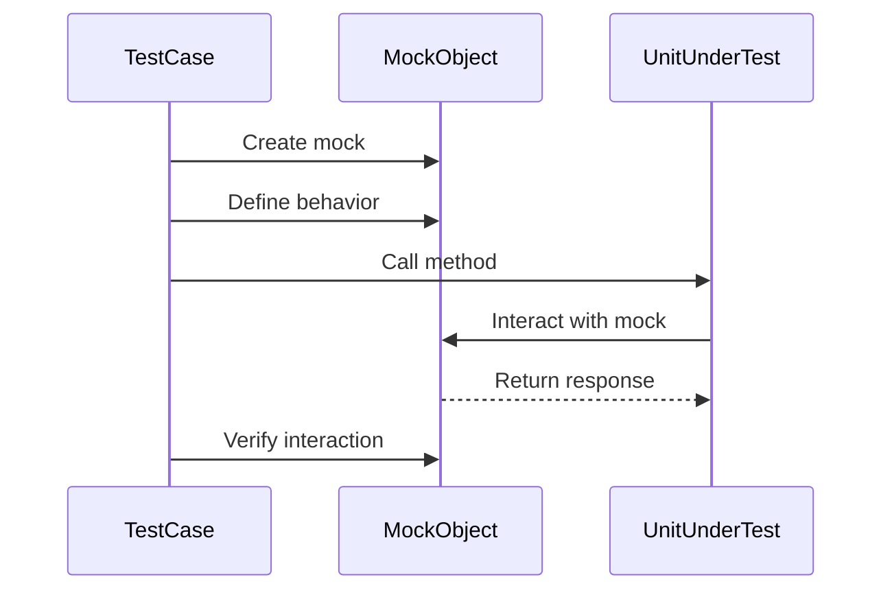

## 14.8 Mocking and Fakes in Scala

In the realm of software development, testing is a crucial component that ensures the reliability and robustness of applications. Scala, with its functional and object-oriented paradigms, offers a unique landscape for testing. In this section, we will delve into the concepts of mocking and fakes, focusing on how they can be effectively used in Scala to isolate code for unit tests. We will explore popular libraries like Mockito and ScalaMock, providing practical examples and insights into their usage.

### Understanding Mocking and Fakes

Before diving into the specifics of Scala, let's clarify the concepts of mocking and fakes:

- **Mocking**: This involves creating objects that simulate the behavior of real objects. Mocks are used to verify interactions and ensure that certain methods are called with expected parameters. They are particularly useful in unit testing to isolate the unit under test and control its environment.

- **Fakes**: These are simpler implementations of interfaces or classes that provide predictable behavior. Unlike mocks, fakes are not used to verify interactions but to provide a controlled environment for testing.

### The Role of Mocking in Testing

Mocking plays a pivotal role in unit testing by allowing developers to:

- **Isolate the Unit Under Test**: By replacing dependencies with mocks, you can focus on testing the specific unit without interference from external components.

- **Control the Test Environment**: Mocks allow you to simulate various scenarios, such as exceptions or specific return values, to test how the unit handles different conditions.

- **Verify Interactions**: Mocks can be used to verify that certain methods are called with expected parameters, ensuring that the unit behaves as expected.

### Introduction to Mockito and ScalaMock

Mockito and ScalaMock are two popular libraries used for mocking in Scala. Let's explore each of them in detail.

#### Mockito

Mockito is a widely-used mocking framework for Java and Scala. It provides a simple API for creating mocks and verifying interactions. Here are some key features of Mockito:

- **Ease of Use**: Mockito's API is intuitive and easy to use, making it a popular choice for developers.

- **Verification**: Mockito allows you to verify interactions with mocks, ensuring that methods are called with expected parameters.

- **Stubbing**: You can define the behavior of mocked methods, specifying return values or exceptions.

#### ScalaMock

ScalaMock is a native Scala mocking library that leverages Scala's features to provide a more idiomatic API. Some of its key features include:

- **Type Safety**: ScalaMock provides type-safe mocking, ensuring that your mocks adhere to the expected types.

- **Support for Scala Features**: ScalaMock supports Scala-specific features like traits, case classes, and higher-order functions.

- **Flexible API**: ScalaMock offers a flexible API for creating mocks and stubs, allowing you to define behavior and verify interactions.

### Using Mockito in Scala

Let's start by exploring how to use Mockito in Scala. We'll cover the basics of creating mocks, stubbing methods, and verifying interactions.

#### Setting Up Mockito

To use Mockito in a Scala project, you need to add the following dependency to your `build.sbt` file:

```scala
libraryDependencies += "org.mockito" %% "mockito-scala" % "1.16.42" % Test
```

This dependency includes the Scala bindings for Mockito, allowing you to use it seamlessly in your Scala tests.

#### Creating Mocks

Creating a mock in Mockito is straightforward. You can use the `mock` method to create a mock instance of a class or trait. Here's an example:

```scala
import org.mockito.Mockito._
import org.scalatest.flatspec.AnyFlatSpec

class UserServiceTest extends AnyFlatSpec {

  trait UserRepository {
    def findUser(id: String): Option[User]
  }

  case class User(id: String, name: String)

  "UserService" should "find a user by ID" in {
    // Create a mock of UserRepository
    val mockRepo = mock(classOf[UserRepository])

    // Define the behavior of the mock
    when(mockRepo.findUser("123")).thenReturn(Some(User("123", "Alice")))

    // Use the mock in your test
    val userService = new UserService(mockRepo)
    val user = userService.findUser("123")

    assert(user.contains(User("123", "Alice")))
  }
}
```

In this example, we create a mock of the `UserRepository` trait and define its behavior using the `when` method. We then use the mock in our test to verify that the `UserService` behaves as expected.

#### Stubbing Methods

Stubbing methods in Mockito allows you to define the behavior of mocked methods. You can specify return values or exceptions for specific method calls. Here's an example:

```scala
// Define the behavior of the mock
when(mockRepo.findUser("123")).thenReturn(Some(User("123", "Alice")))
when(mockRepo.findUser("456")).thenThrow(new RuntimeException("User not found"))
```

In this example, we define two behaviors for the `findUser` method: returning a user for ID "123" and throwing an exception for ID "456".

#### Verifying Interactions

Mockito allows you to verify interactions with mocks, ensuring that methods are called with expected parameters. Here's how you can do it:

```scala
// Verify that the findUser method was called with the expected parameter
verify(mockRepo).findUser("123")
```

This verification step ensures that the `findUser` method was called with the parameter "123" during the test.

### Using ScalaMock

Now, let's explore ScalaMock, a native Scala mocking library that provides a more idiomatic API for Scala developers.

#### Setting Up ScalaMock

To use ScalaMock in your Scala project, add the following dependency to your `build.sbt` file:

```scala
libraryDependencies += "org.scalamock" %% "scalamock" % "5.1.0" % Test
```

This dependency includes ScalaMock, allowing you to create mocks and stubs in your Scala tests.

#### Creating Mocks with ScalaMock

ScalaMock provides a type-safe API for creating mocks. Here's an example of how to create a mock using ScalaMock:

```scala
import org.scalamock.scalatest.MockFactory
import org.scalatest.flatspec.AnyFlatSpec

class UserServiceTest extends AnyFlatSpec with MockFactory {

  trait UserRepository {
    def findUser(id: String): Option[User]
  }

  case class User(id: String, name: String)

  "UserService" should "find a user by ID" in {
    // Create a mock of UserRepository
    val mockRepo = mock[UserRepository]

    // Define the behavior of the mock
    (mockRepo.findUser _).expects("123").returning(Some(User("123", "Alice")))

    // Use the mock in your test
    val userService = new UserService(mockRepo)
    val user = userService.findUser("123")

    assert(user.contains(User("123", "Alice")))
  }
}
```

In this example, we use ScalaMock's `mock` method to create a mock of the `UserRepository` trait. We then define the behavior of the mock using the `expects` method.

#### Stubbing Methods with ScalaMock

ScalaMock allows you to stub methods and define their behavior. Here's how you can do it:

```scala
// Define the behavior of the mock
(mockRepo.findUser _).expects("123").returning(Some(User("123", "Alice")))
(mockRepo.findUser _).expects("456").throwing(new RuntimeException("User not found"))
```

In this example, we define two behaviors for the `findUser` method: returning a user for ID "123" and throwing an exception for ID "456".

#### Verifying Interactions with ScalaMock

ScalaMock provides a flexible API for verifying interactions with mocks. Here's an example:

```scala
// Verify that the findUser method was called with the expected parameter
(mockRepo.findUser _).expects("123")
```

This verification step ensures that the `findUser` method was called with the parameter "123" during the test.

### Design Considerations for Mocking

When using mocking in Scala, it's important to consider the following design considerations:

- **Test Isolation**: Mocks should be used to isolate the unit under test, ensuring that external dependencies do not interfere with the test.

- **Behavior Verification**: Use mocks to verify that methods are called with expected parameters, ensuring that the unit behaves as expected.

- **Avoid Over-Mocking**: Avoid excessive use of mocks, as it can lead to brittle tests that are tightly coupled to the implementation.

- **Use Fakes for Simplicity**: Consider using fakes for simpler scenarios where behavior verification is not required.

### Differences and Similarities

Mockito and ScalaMock are both powerful tools for mocking in Scala, but they have some differences and similarities:

- **Mockito**: Provides a simple API for creating mocks and verifying interactions. It is widely used and has a large community.

- **ScalaMock**: Offers a more idiomatic API for Scala developers, leveraging Scala's type system for type-safe mocking.

Both libraries allow you to create mocks, stub methods, and verify interactions, but ScalaMock provides additional support for Scala-specific features like traits and higher-order functions.

### Try It Yourself

To deepen your understanding of mocking and fakes in Scala, try modifying the code examples provided in this section. Experiment with different scenarios, such as:

- Creating additional mocks and defining their behavior.
- Verifying interactions with different parameters.
- Using fakes to provide predictable behavior in your tests.

### Visualizing Mocking and Fakes

To better understand the concept of mocking and fakes, let's visualize the process using a sequence diagram. This diagram illustrates the interaction between a test case, a mock object, and the unit under test.



In this diagram, the test case creates a mock object and defines its behavior. The unit under test interacts with the mock, and the test case verifies the interaction.

### Knowledge Check

To reinforce your understanding of mocking and fakes in Scala, consider the following questions:

- What is the primary purpose of using mocks in unit testing?
- How do fakes differ from mocks in terms of behavior verification?
- What are some design considerations to keep in mind when using mocking in Scala?
- How does ScalaMock leverage Scala's type system for type-safe mocking?

### Conclusion

Mocking and fakes are powerful tools for isolating code in unit tests, allowing developers to focus on testing specific units without interference from external dependencies. By using libraries like Mockito and ScalaMock, Scala developers can create robust and reliable tests that ensure the correctness of their applications. Remember, this is just the beginning. As you progress, you'll build more complex and interactive test suites. Keep experimenting, stay curious, and enjoy the journey!

## Quiz Time!



### What is the primary purpose of using mocks in unit testing?

- [x] To isolate the unit under test and control its environment.
- [ ] To replace the entire application with mock objects.
- [ ] To ensure that all code paths are executed.
- [ ] To improve the performance of the application.

> **Explanation:** Mocks are used to isolate the unit under test and control its environment, allowing for focused and reliable testing.

### How do fakes differ from mocks in terms of behavior verification?

- [x] Fakes provide predictable behavior without verifying interactions.
- [ ] Fakes are used to verify interactions with expected parameters.
- [ ] Fakes are more complex than mocks.
- [ ] Fakes are only used in integration testing.

> **Explanation:** Fakes provide predictable behavior and are not used to verify interactions, unlike mocks which are used for interaction verification.

### Which library provides a more idiomatic API for Scala developers?

- [x] ScalaMock
- [ ] Mockito
- [ ] JUnit
- [ ] TestNG

> **Explanation:** ScalaMock provides a more idiomatic API for Scala developers, leveraging Scala's type system for type-safe mocking.

### What is a key feature of Mockito?

- [x] It allows verification of interactions with mocks.
- [ ] It provides built-in support for Scala's type system.
- [ ] It automatically generates test cases.
- [ ] It is only used for integration testing.

> **Explanation:** Mockito allows verification of interactions with mocks, ensuring that methods are called with expected parameters.

### What should be avoided to prevent brittle tests?

- [x] Over-mocking
- [ ] Using fakes
- [ ] Writing unit tests
- [ ] Using ScalaMock

> **Explanation:** Over-mocking can lead to brittle tests that are tightly coupled to the implementation, making them difficult to maintain.

### What is the benefit of using fakes over mocks?

- [x] Simplicity in providing predictable behavior.
- [ ] Ability to verify interactions.
- [ ] Support for higher-order functions.
- [ ] Automatic test generation.

> **Explanation:** Fakes provide simplicity by offering predictable behavior without the need for interaction verification, making them suitable for simpler scenarios.

### How does ScalaMock support Scala-specific features?

- [x] By providing type-safe mocking and support for traits.
- [ ] By automatically generating mock objects.
- [ ] By integrating with Java libraries.
- [ ] By providing a graphical user interface.

> **Explanation:** ScalaMock supports Scala-specific features by offering type-safe mocking and support for traits, making it more idiomatic for Scala developers.

### What is a common use case for using mocks in testing?

- [x] To simulate external dependencies and control test scenarios.
- [ ] To replace the entire application with mock objects.
- [ ] To ensure that all code paths are executed.
- [ ] To improve the performance of the application.

> **Explanation:** Mocks are commonly used to simulate external dependencies and control test scenarios, allowing for focused and reliable testing.

### What is the primary focus of mocking in unit testing?

- [x] Isolating the unit under test from external dependencies.
- [ ] Replacing the entire application with mock objects.
- [ ] Ensuring that all code paths are executed.
- [ ] Improving the performance of the application.

> **Explanation:** The primary focus of mocking in unit testing is to isolate the unit under test from external dependencies, allowing for focused and reliable testing.

### True or False: ScalaMock provides built-in support for Scala's type system.

- [x] True
- [ ] False

> **Explanation:** True. ScalaMock provides built-in support for Scala's type system, offering type-safe mocking and support for Scala-specific features.


