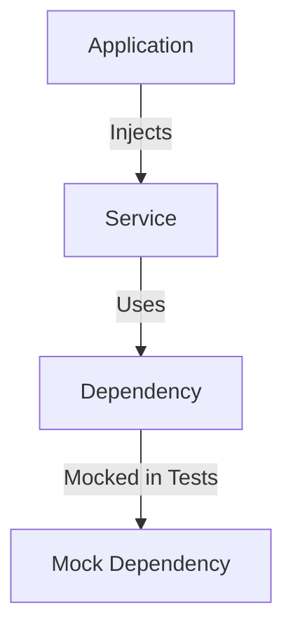
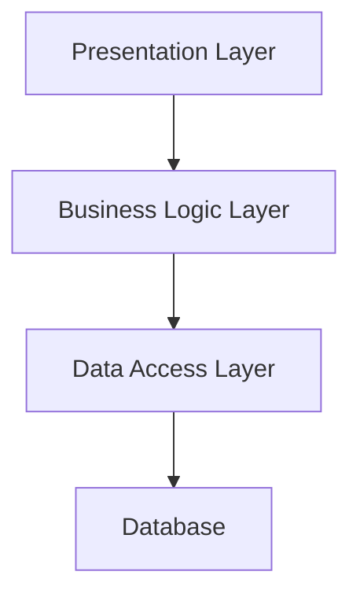

## 14.9 Designing for Testability

Designing software for testability is a critical aspect of software engineering that ensures your code is robust, maintainable, and easy to verify. In the Scala ecosystem, testability can be enhanced by leveraging functional programming principles, design patterns, and best practices. In this section, we will explore how to design Scala applications for testability, focusing on techniques and patterns that facilitate effective testing.

### Introduction to Testability

Testability refers to the ease with which software can be tested to ensure it behaves as expected. High testability allows for more efficient and effective testing, leading to higher quality software. In Scala, designing for testability involves using language features and design patterns that promote modularity, immutability, and clear separation of concerns.

#### Key Concepts of Testability

1. **Modularity**: Breaking down code into small, independent units that can be tested in isolation.
2. **Separation of Concerns**: Ensuring that different parts of the codebase have distinct responsibilities, making it easier to test each part.
3. **Immutability**: Using immutable data structures to avoid side effects and make code more predictable and easier to test.
4. **Dependency Injection**: Injecting dependencies rather than hardcoding them, allowing for easier substitution of mock objects during testing.
5. **Functional Programming**: Leveraging pure functions and higher-order functions to create predictable and testable code.

### Principles of Designing for Testability

#### 1. Modularity and Encapsulation

- **Encapsulate Behavior**: Use classes and objects to encapsulate behavior and state. This makes it easier to test individual components without affecting others.
- **Use Traits for Abstraction**: Traits in Scala can be used to define interfaces and abstract behavior, allowing for flexible implementations that can be easily mocked or stubbed in tests.

#### 2. Separation of Concerns

- **Single Responsibility Principle (SRP)**: Ensure each class or module has a single responsibility, making it easier to test and maintain.
- **Layered Architecture**: Design your application in layers (e.g., presentation, business logic, data access) to isolate and test each layer independently.

#### 3. Immutability

- **Immutable Data Structures**: Use Scala's immutable collections to prevent unintended side effects and make your code more predictable.
- **Pure Functions**: Write functions that do not depend on external state and always produce the same output for the same input, making them easier to test.

#### 4. Dependency Injection

- **Constructor Injection**: Pass dependencies through constructors to make it easier to substitute real implementations with mocks during testing.
- **Using the Reader Monad**: Implement dependency injection functionally using the Reader Monad, which allows for more flexible and testable code.

#### 5. Functional Programming

- **Higher-Order Functions**: Use functions as first-class citizens to create flexible and reusable code.
- **Pattern Matching**: Leverage Scala's pattern matching to simplify complex logic and make it more testable.

### Design Patterns for Testability

Design patterns can play a crucial role in enhancing the testability of your Scala applications. Here, we will explore several patterns that are particularly useful for designing testable code.

#### 1. Dependency Injection Pattern

The Dependency Injection (DI) pattern is essential for testability as it allows you to replace real dependencies with mocks or stubs during testing. In Scala, you can implement DI using various techniques, including constructor injection, the Cake Pattern, and the Reader Monad.

```scala
// Example of Dependency Injection using Constructor Injection
class UserService(userRepository: UserRepository) {
  def getUser(id: String): Option[User] = userRepository.findById(id)
}

// During testing, you can inject a mock UserRepository
val mockUserRepository = mock[UserRepository]
val userService = new UserService(mockUserRepository)
```

#### 2. Strategy Pattern

The Strategy Pattern allows you to define a family of algorithms, encapsulate each one, and make them interchangeable. This pattern is useful for testability as it enables you to test each strategy independently.

```scala
// Strategy Pattern Example
trait SortingStrategy {
  def sort(data: List[Int]): List[Int]
}

class QuickSort extends SortingStrategy {
  def sort(data: List[Int]): List[Int] = {
    // QuickSort implementation
    data.sorted
  }
}

class BubbleSort extends SortingStrategy {
  def sort(data: List[Int]): List[Int] = {
    // BubbleSort implementation
    data.sorted
  }
}

class Sorter(strategy: SortingStrategy) {
  def sort(data: List[Int]): List[Int] = strategy.sort(data)
}

// Test different strategies
val quickSorter = new Sorter(new QuickSort)
val bubbleSorter = new Sorter(new BubbleSort)
```

#### 3. Factory Pattern

The Factory Pattern provides an interface for creating objects, allowing you to encapsulate the instantiation logic. This pattern is useful for testability as it allows you to control the creation of objects and substitute them with mock implementations during testing.

```scala
// Factory Pattern Example
trait Connection {
  def connect(): Unit
}

class DatabaseConnection extends Connection {
  def connect(): Unit = println("Connected to the database")
}

object ConnectionFactory {
  def createConnection(): Connection = new DatabaseConnection
}

// During testing, you can override the factory method
object TestConnectionFactory {
  def createConnection(): Connection = new MockConnection
}
```

#### 4. Observer Pattern

The Observer Pattern is useful for implementing event-driven systems. It allows you to define a subscription mechanism to notify multiple objects about any events that happen to the object they are observing. This pattern enhances testability by allowing you to test the notification mechanism independently.

```scala
// Observer Pattern Example
trait Observer {
  def update(event: String): Unit
}

class EventSource {
  private var observers: List[Observer] = List()

  def addObserver(observer: Observer): Unit = {
    observers = observer :: observers
  }

  def notifyObservers(event: String): Unit = {
    observers.foreach(_.update(event))
  }
}

// Test the observer mechanism
val observer = new Observer {
  def update(event: String): Unit = println(s"Received event: $event")
}

val eventSource = new EventSource
eventSource.addObserver(observer)
eventSource.notifyObservers("Test Event")
```

### Code Examples and Best Practices

Let's dive deeper into some code examples and best practices for designing testable Scala applications.

#### Example 1: Using Traits for Testability

Traits in Scala provide a powerful way to define reusable and testable interfaces. By using traits, you can create flexible and interchangeable implementations that can be easily mocked during testing.

```scala
trait Logger {
  def log(message: String): Unit
}

class ConsoleLogger extends Logger {
  def log(message: String): Unit = println(message)
}

class FileLogger extends Logger {
  def log(message: String): Unit = {
    // Write to a file
  }
}

class Application(logger: Logger) {
  def run(): Unit = {
    logger.log("Application started")
  }
}

// Test with a mock logger
val mockLogger = new Logger {
  def log(message: String): Unit = println(s"Mock log: $message")
}

val app = new Application(mockLogger)
app.run()
```

#### Example 2: Leveraging Immutability

Immutability is a cornerstone of functional programming and a key factor in testability. By using immutable data structures, you can ensure that your code is free from side effects, making it easier to test.

```scala
case class User(id: String, name: String)

class UserService(users: List[User]) {
  def findUserById(id: String): Option[User] = users.find(_.id == id)
}

// Test with an immutable list of users
val users = List(User("1", "Alice"), User("2", "Bob"))
val userService = new UserService(users)
assert(userService.findUserById("1").isDefined)
```

#### Example 3: Functional Dependency Injection with Reader Monad

The Reader Monad is a functional programming pattern that allows for dependency injection in a purely functional way. It provides a way to pass dependencies implicitly through function composition, enhancing testability.

```scala
import cats.data.Reader

case class Config(dbUrl: String)

class DatabaseService {
  def connect(config: Config): String = s"Connected to ${config.dbUrl}"
}

val dbServiceReader: Reader[Config, DatabaseService] = Reader(config => new DatabaseService)

val connectReader: Reader[Config, String] = for {
  dbService <- dbServiceReader
  connection <- Reader((config: Config) => dbService.connect(config))
} yield connection

// Test with a mock configuration
val testConfig = Config("jdbc:testdb")
val result = connectReader.run(testConfig)
assert(result == "Connected to jdbc:testdb")
```

### Visualizing Testability Concepts

To better understand the relationships and flow of designing for testability, let's visualize some key concepts using Mermaid.js diagrams.

#### Diagram: Dependency Injection Flow



*Description*: This diagram illustrates how dependency injection allows for substituting real dependencies with mocks during testing, enhancing testability.

#### Diagram: Layered Architecture



*Description*: This diagram shows a layered architecture where each layer can be tested independently, promoting separation of concerns and testability.

### Try It Yourself

To solidify your understanding of designing for testability in Scala, try modifying the code examples provided:

1. **Modify the Logger Trait**: Add a new implementation of the `Logger` trait that writes logs to a network service. Test this new implementation using a mock network service.

2. **Enhance the UserService**: Extend the `UserService` to include methods for adding and removing users. Ensure these methods maintain immutability and test them thoroughly.

3. **Experiment with the Reader Monad**: Create a new service that depends on multiple configurations. Use the Reader Monad to inject these configurations and test the service with different configurations.

### References and Further Reading

- [ScalaTest Documentation](https://www.scalatest.org/)
- [Functional Programming in Scala](https://www.manning.com/books/functional-programming-in-scala)
- [Design Patterns: Elements of Reusable Object-Oriented Software](https://en.wikipedia.org/wiki/Design_Patterns)

### Knowledge Check

- What are the key principles of designing for testability?
- How can the Dependency Injection pattern enhance testability in Scala?
- Why is immutability important for testability?
- How does the Reader Monad facilitate functional dependency injection?

### Embrace the Journey

Designing for testability is an ongoing journey that requires continuous learning and adaptation. As you progress, you'll discover new techniques and patterns that enhance the testability of your Scala applications. Remember, the goal is to create code that is not only functional but also maintainable and easy to verify. Keep experimenting, stay curious, and enjoy the journey!

## Quiz Time!



### What is a key benefit of using immutable data structures in Scala?

- [x] They prevent unintended side effects, making code more predictable and easier to test.
- [ ] They allow for dynamic changes to the data structure during runtime.
- [ ] They enable faster execution of algorithms.
- [ ] They simplify the implementation of complex algorithms.

> **Explanation:** Immutable data structures prevent side effects, making code more predictable and easier to test.

### Which pattern is particularly useful for substituting real dependencies with mocks during testing?

- [x] Dependency Injection
- [ ] Singleton Pattern
- [ ] Observer Pattern
- [ ] Factory Pattern

> **Explanation:** Dependency Injection allows for substituting real dependencies with mocks during testing.

### How does the Strategy Pattern enhance testability?

- [x] It allows different algorithms to be tested independently.
- [ ] It ensures that only one instance of a class is created.
- [ ] It provides a way to encapsulate object creation logic.
- [ ] It simplifies the implementation of event-driven systems.

> **Explanation:** The Strategy Pattern allows different algorithms to be tested independently.

### What is the role of the Reader Monad in Scala?

- [x] It facilitates functional dependency injection.
- [ ] It provides a way to handle asynchronous computations.
- [ ] It simplifies error handling in functional programming.
- [ ] It enables pattern matching on complex data structures.

> **Explanation:** The Reader Monad facilitates functional dependency injection by passing dependencies implicitly through function composition.

### What is a benefit of using traits in Scala for testability?

- [x] They allow for flexible and interchangeable implementations that can be easily mocked.
- [ ] They enforce strict type constraints on data structures.
- [ ] They simplify the implementation of recursive algorithms.
- [ ] They provide a way to encapsulate object creation logic.

> **Explanation:** Traits allow for flexible and interchangeable implementations that can be easily mocked during testing.

### Which principle is crucial for ensuring that each class or module has a single responsibility?

- [x] Single Responsibility Principle (SRP)
- [ ] Dependency Inversion Principle (DIP)
- [ ] Open/Closed Principle (OCP)
- [ ] Liskov Substitution Principle (LSP)

> **Explanation:** The Single Responsibility Principle (SRP) ensures that each class or module has a single responsibility, making it easier to test and maintain.

### How does the Factory Pattern contribute to testability?

- [x] It allows for control over object creation, enabling substitution with mock implementations.
- [ ] It ensures that only one instance of a class is created.
- [ ] It provides a way to encapsulate event-driven systems.
- [ ] It simplifies the implementation of complex algorithms.

> **Explanation:** The Factory Pattern allows for control over object creation, enabling substitution with mock implementations during testing.

### What is a benefit of using a layered architecture for testability?

- [x] Each layer can be tested independently, promoting separation of concerns.
- [ ] It simplifies the implementation of complex algorithms.
- [ ] It ensures that only one instance of a class is created.
- [ ] It provides a way to handle asynchronous computations.

> **Explanation:** A layered architecture allows each layer to be tested independently, promoting separation of concerns and enhancing testability.

### Which of the following is a key concept of testability?

- [x] Modularity
- [ ] Inheritance
- [ ] Dynamic Typing
- [ ] Global State

> **Explanation:** Modularity is a key concept of testability, as it involves breaking down code into small, independent units that can be tested in isolation.

### True or False: Immutability is not important for testability in Scala.

- [ ] True
- [x] False

> **Explanation:** False. Immutability is crucial for testability in Scala as it prevents side effects and makes code more predictable and easier to test.


