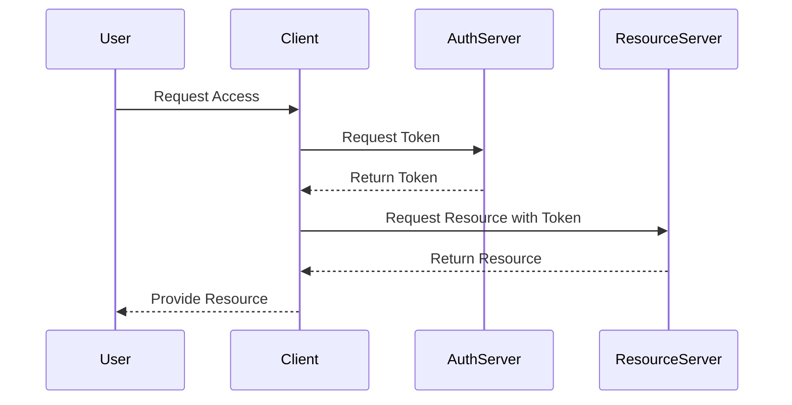

## 15.1 Authentication and Authorization Patterns

In the digital age, securing access to resources is paramount. Authentication and authorization are two critical components of security architecture that ensure only legitimate users gain access to the appropriate resources. In this guide, we will delve into various authentication and authorization patterns, particularly within the Scala ecosystem, to provide expert software engineers and architects with robust solutions for securing applications.

### Understanding Authentication and Authorization

Before diving into patterns, let's clarify these two concepts:

- **Authentication** is the process of verifying the identity of a user or system. It answers the question, "Who are you?"
- **Authorization** determines what an authenticated user is allowed to do. It answers the question, "What can you do?"

### Key Participants

- **User**: The entity trying to access the system.
- **Identity Provider (IdP)**: A service that authenticates users and provides identity information.
- **Resource Server**: The server hosting the resources that need protection.
- **Authorization Server**: Manages authorization and issues tokens.

### Common Authentication Patterns

#### 1. Basic Authentication

**Intent**: Use a simple username and password for authentication.

**Applicability**: Suitable for simple applications or internal systems where security requirements are minimal.

**Sample Code Snippet**:

```scala
import java.util.Base64

object BasicAuth {
  def encodeCredentials(username: String, password: String): String = {
    val credentials = s"$username:$password"
    Base64.getEncoder.encodeToString(credentials.getBytes)
  }

  def decodeCredentials(encoded: String): Option[(String, String)] = {
    val decoded = new String(Base64.getDecoder.decode(encoded))
    val parts = decoded.split(":")
    if (parts.length == 2) Some((parts(0), parts(1))) else None
  }
}

// Usage
val encoded = BasicAuth.encodeCredentials("user", "pass")
val decoded = BasicAuth.decodeCredentials(encoded)
println(decoded) // Some((user, pass))
```

**Design Considerations**: Basic Authentication is not secure over plain HTTP. Always use HTTPS to encrypt credentials.

#### 2. Token-Based Authentication

**Intent**: Use tokens to authenticate users instead of credentials.

**Applicability**: Ideal for stateless applications and APIs.

**Sample Code Snippet**:

```scala
import java.util.UUID

object TokenAuth {
  def generateToken(userId: String): String = {
    UUID.randomUUID().toString + userId
  }

  def validateToken(token: String): Boolean = {
    // Implement token validation logic
    true
  }
}

// Usage
val token = TokenAuth.generateToken("user123")
val isValid = TokenAuth.validateToken(token)
println(isValid) // true
```

**Design Considerations**: Ensure tokens are securely stored and transmitted. Consider token expiration and renewal strategies.

#### 3. OAuth2

**Intent**: Delegate user authentication to a third-party service.

**Applicability**: Suitable for applications that require integration with external identity providers.

**Sample Code Snippet**:

```scala
import akka.http.scaladsl.server.Directives._
import akka.http.scaladsl.server.Route

object OAuth2Example {
  val route: Route =
    path("login") {
      get {
        // Redirect to OAuth2 provider
        redirect("https://oauth.provider.com/auth", akka.http.scaladsl.model.StatusCodes.Found)
      }
    } ~
    path("callback") {
      get {
        // Handle OAuth2 callback
        complete("Logged in with OAuth2")
      }
    }
}
```

**Design Considerations**: Understand OAuth2 flows (e.g., Authorization Code, Implicit) and choose the right one for your application.

### Common Authorization Patterns

#### 1. Role-Based Access Control (RBAC)

**Intent**: Assign permissions to roles instead of individual users.

**Applicability**: Suitable for systems with well-defined roles and permissions.

**Sample Code Snippet**:

```scala
object RBAC {
  case class Role(name: String, permissions: Set[String])
  case class User(name: String, roles: Set[Role])

  def hasPermission(user: User, permission: String): Boolean = {
    user.roles.exists(role => role.permissions.contains(permission))
  }

  // Usage
  val adminRole = Role("admin", Set("read", "write", "delete"))
  val user = User("Alice", Set(adminRole))

  println(hasPermission(user, "write")) // true
}
```

**Design Considerations**: Ensure roles are well-defined and permissions are granular enough to meet security requirements.

#### 2. Attribute-Based Access Control (ABAC)

**Intent**: Use attributes (e.g., user, resource, environment) to determine access.

**Applicability**: Suitable for complex systems with dynamic access control requirements.

**Sample Code Snippet**:

```scala
object ABAC {
  case class Attribute(key: String, value: String)
  case class Policy(attributes: Set[Attribute], action: String)

  def isAuthorized(attributes: Set[Attribute], policy: Policy): Boolean = {
    policy.attributes.subsetOf(attributes)
  }

  // Usage
  val userAttributes = Set(Attribute("role", "admin"), Attribute("department", "IT"))
  val policy = Policy(Set(Attribute("role", "admin")), "access")

  println(isAuthorized(userAttributes, policy)) // true
}
```

**Design Considerations**: ABAC offers flexibility but can be complex to implement and manage.

### Visualizing Authentication and Authorization Flow

To better understand the flow of authentication and authorization, let's visualize the process using a sequence diagram.



**Diagram Description**: This sequence diagram illustrates the flow of a typical token-based authentication process. The user requests access, the client obtains a token from the authentication server, and then uses that token to access resources on the resource server.

### Implementing Secure Authentication and Authorization in Scala

#### Using Akka HTTP for Secure APIs

Akka HTTP is a powerful toolkit for building HTTP-based applications in Scala. Let's explore how to implement secure authentication and authorization using Akka HTTP.

**Sample Code Snippet**:

```scala
import akka.http.scaladsl.server.Directives._
import akka.http.scaladsl.server.Route

object SecureApi {
  def authenticate(token: String): Boolean = {
    // Implement token validation logic
    token == "valid-token"
  }

  val route: Route =
    path("secure-resource") {
      get {
        headerValueByName("Authorization") { token =>
          if (authenticate(token)) {
            complete("Access Granted")
          } else {
            complete("Access Denied")
          }
        }
      }
    }
}
```

**Design Considerations**: Always validate tokens and ensure secure transmission (e.g., HTTPS).

#### Integrating with OAuth2 Providers

Integrating with OAuth2 providers can enhance security by leveraging third-party identity services. Here's how you can set up OAuth2 integration in a Scala application.

**Sample Code Snippet**:

```scala
import akka.http.scaladsl.server.Directives._
import akka.http.scaladsl.server.Route

object OAuth2Integration {
  val route: Route =
    path("login") {
      get {
        // Redirect to OAuth2 provider
        redirect("https://oauth.provider.com/auth", akka.http.scaladsl.model.StatusCodes.Found)
      }
    } ~
    path("callback") {
      get {
        parameters("code") { code =>
          // Exchange code for token
          val token = exchangeCodeForToken(code)
          complete(s"Logged in with token: $token")
        }
      }
    }

  def exchangeCodeForToken(code: String): String = {
    // Implement token exchange logic
    "access-token"
  }
}
```

**Design Considerations**: Ensure secure handling of OAuth2 tokens and understand the implications of different OAuth2 flows.

### Advanced Topics in Authentication and Authorization

#### Multi-Factor Authentication (MFA)

**Intent**: Enhance security by requiring multiple forms of verification.

**Applicability**: Suitable for applications with high-security requirements.

**Sample Code Snippet**:

```scala
object MFA {
  def sendOtp(user: String): String = {
    // Send OTP to user
    "123456"
  }

  def verifyOtp(user: String, otp: String): Boolean = {
    // Verify OTP
    otp == "123456"
  }

  // Usage
  val user = "Alice"
  val otp = sendOtp(user)
  println(verifyOtp(user, otp)) // true
}
```

**Design Considerations**: Ensure OTPs are securely generated and transmitted.

#### Single Sign-On (SSO)

**Intent**: Allow users to access multiple applications with a single set of credentials.

**Applicability**: Suitable for organizations with multiple interconnected applications.

**Sample Code Snippet**:

```scala
object SSO {
  def authenticateWithSSO(token: String): Boolean = {
    // Implement SSO authentication logic
    token == "sso-token"
  }

  // Usage
  val token = "sso-token"
  println(authenticateWithSSO(token)) // true
}
```

**Design Considerations**: Ensure secure token handling and understand the implications of SSO on user experience and security.

### Try It Yourself

To deepen your understanding of authentication and authorization patterns, try modifying the code examples provided:

1. **Enhance the Basic Authentication example** to hash passwords before encoding.
2. **Implement token expiration** in the Token-Based Authentication example.
3. **Experiment with different OAuth2 flows** in the OAuth2 example.
4. **Add role-based access control** to the Secure API example using the RBAC pattern.

### Knowledge Check

- Explain the difference between authentication and authorization.
- What are the key benefits of using token-based authentication?
- How does OAuth2 enhance security in applications?
- Describe a scenario where ABAC would be more suitable than RBAC.
- What are the advantages of using MFA in an application?

### Conclusion

Authentication and authorization are critical components of any secure application. By understanding and implementing the patterns discussed in this guide, you can build robust security architectures in your Scala applications. Remember, security is an ongoing process, and staying informed about the latest best practices and technologies is essential.

## Quiz Time!



### What is the primary purpose of authentication?

- [x] To verify the identity of a user or system
- [ ] To determine what a user is allowed to do
- [ ] To encrypt data
- [ ] To manage user sessions

> **Explanation:** Authentication is the process of verifying the identity of a user or system.

### Which pattern is ideal for stateless applications and APIs?

- [x] Token-Based Authentication
- [ ] Basic Authentication
- [ ] OAuth2
- [ ] Multi-Factor Authentication

> **Explanation:** Token-Based Authentication is ideal for stateless applications and APIs because it allows for easy management of user sessions without storing state on the server.

### What does RBAC stand for?

- [x] Role-Based Access Control
- [ ] Resource-Based Access Control
- [ ] Role-Based Authentication Control
- [ ] Resource-Based Authentication Control

> **Explanation:** RBAC stands for Role-Based Access Control, which assigns permissions to roles instead of individual users.

### Which of the following is a benefit of using OAuth2?

- [x] Delegating user authentication to a third-party service
- [ ] Simplifying password management
- [ ] Encrypting user data
- [ ] Managing user sessions

> **Explanation:** OAuth2 allows applications to delegate user authentication to a third-party service, enhancing security and user experience.

### What is a key consideration when implementing Multi-Factor Authentication (MFA)?

- [x] Securely generating and transmitting OTPs
- [ ] Simplifying user registration
- [ ] Encrypting user passwords
- [ ] Managing user sessions

> **Explanation:** When implementing MFA, it's crucial to securely generate and transmit OTPs to ensure the security of the authentication process.

### What is the main advantage of using Single Sign-On (SSO)?

- [x] Allowing users to access multiple applications with a single set of credentials
- [ ] Encrypting user data
- [ ] Simplifying password management
- [ ] Managing user sessions

> **Explanation:** SSO allows users to access multiple applications with a single set of credentials, improving user experience and security.

### Which pattern uses attributes to determine access?

- [x] Attribute-Based Access Control (ABAC)
- [ ] Role-Based Access Control (RBAC)
- [ ] Token-Based Authentication
- [ ] Basic Authentication

> **Explanation:** ABAC uses attributes (e.g., user, resource, environment) to determine access, offering flexibility in access control.

### What is a common use case for Basic Authentication?

- [x] Simple applications or internal systems with minimal security requirements
- [ ] Stateless applications and APIs
- [ ] Applications requiring integration with external identity providers
- [ ] Applications with high-security requirements

> **Explanation:** Basic Authentication is suitable for simple applications or internal systems where security requirements are minimal.

### Which of the following is a key benefit of using token-based authentication?

- [x] Statelessness
- [ ] Simplifying password management
- [ ] Encrypting user data
- [ ] Managing user sessions

> **Explanation:** Token-based authentication allows for statelessness, making it ideal for APIs and distributed systems.

### True or False: OAuth2 is primarily used for encrypting user data.

- [ ] True
- [x] False

> **Explanation:** OAuth2 is primarily used for delegating user authentication to a third-party service, not for encrypting user data.


