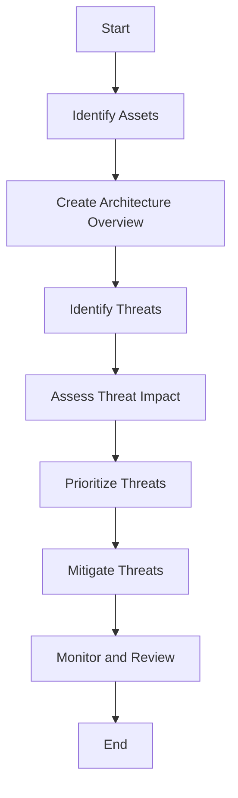

## 15.10 Security by Design

In today's digital landscape, security is not just an afterthought but a fundamental aspect of software development. The concept of "Security by Design" emphasizes integrating security measures at every stage of the software development lifecycle. This approach ensures that applications are resilient against threats and vulnerabilities from the ground up. In this section, we will delve into the principles of Security by Design, focusing on threat modeling, risk assessment, and secure coding practices specific to Scala.

### Introduction to Security by Design

Security by Design is a proactive approach to software security. Instead of reacting to security breaches after they occur, this methodology embeds security considerations into the design and development processes. By doing so, it aims to minimize vulnerabilities and enhance the overall security posture of applications.

#### Key Principles of Security by Design

1. **Proactive Security**: Anticipate potential threats and incorporate defenses early in the development process.
2. **Comprehensive Risk Assessment**: Continuously evaluate and address security risks throughout the software lifecycle.
3. **Secure Coding Practices**: Implement coding standards and practices that prevent common vulnerabilities.
4. **Continuous Monitoring and Improvement**: Regularly update and refine security measures in response to new threats.

### Threat Modeling and Risk Assessment

Threat modeling and risk assessment are crucial components of Security by Design. They involve identifying potential threats to the system, assessing the risks they pose, and implementing measures to mitigate those risks.

#### Threat Modeling

Threat modeling is a structured approach to identifying and evaluating potential security threats. It involves understanding the system architecture, identifying potential attack vectors, and assessing the impact of different threats.

**Steps in Threat Modeling:**

1. **Identify Assets**: Determine what needs protection, such as data, services, and infrastructure.
2. **Create an Architecture Overview**: Develop a high-level view of the system architecture, including data flows and interactions.
3. **Identify Threats**: Use frameworks like STRIDE (Spoofing, Tampering, Repudiation, Information Disclosure, Denial of Service, Elevation of Privilege) to identify potential threats.
4. **Assess Threat Impact**: Evaluate the potential impact of each threat on the system.
5. **Prioritize Threats**: Rank threats based on their likelihood and impact to focus on the most critical ones.
6. **Mitigate Threats**: Develop strategies to mitigate identified threats, such as implementing security controls or redesigning vulnerable components.

#### Risk Assessment

Risk assessment involves evaluating the likelihood and impact of potential threats and determining the appropriate level of response.

**Risk Assessment Process:**

1. **Identify Risks**: List potential risks based on threat modeling.
2. **Analyze Risks**: Evaluate the likelihood and impact of each risk.
3. **Prioritize Risks**: Rank risks to focus on those with the highest potential impact.
4. **Develop Mitigation Strategies**: Plan and implement measures to reduce or eliminate risks.
5. **Monitor and Review**: Continuously monitor risks and adjust strategies as needed.

### Secure Coding Practices in Scala

Secure coding practices are essential for preventing vulnerabilities in software applications. In Scala, these practices leverage the language's features to enhance security.

#### Key Secure Coding Practices

1. **Input Validation and Sanitization**: Always validate and sanitize user inputs to prevent injection attacks such as SQL injection and cross-site scripting (XSS).

   ```scala
   def sanitizeInput(input: String): String = {
     // Use a library or custom logic to escape special characters
     input.replaceAll("[<>]", "")
   }
   ```

2. **Use Immutable Data Structures**: Scala's emphasis on immutability helps prevent unintended side effects and data corruption.

   ```scala
   case class User(name: String, email: String)
   val user = User("Alice", "alice@example.com")
   ```

3. **Leverage Scala's Type System**: Use Scala's strong type system to enforce constraints and prevent invalid states.

   ```scala
   sealed trait PaymentMethod
   case object CreditCard extends PaymentMethod
   case object PayPal extends PaymentMethod

   def processPayment(method: PaymentMethod): Unit = method match {
     case CreditCard => println("Processing credit card payment")
     case PayPal => println("Processing PayPal payment")
   }
   ```

4. **Avoid Using `null`**: Scala provides `Option` and other constructs to handle the absence of values safely.

   ```scala
   def findUser(id: Int): Option[User] = {
     // Return Some(user) if found, None otherwise
     database.find(_.id == id)
   }

   findUser(1) match {
     case Some(user) => println(s"User found: ${user.name}")
     case None => println("User not found")
   }
   ```

5. **Implement Error Handling with `Try`, `Either`, and `Option`**: Use these constructs to handle errors and exceptions gracefully.

   ```scala
   import scala.util.{Try, Success, Failure}

   def parseNumber(input: String): Try[Int] = Try(input.toInt)

   parseNumber("123") match {
     case Success(number) => println(s"Parsed number: $number")
     case Failure(exception) => println(s"Failed to parse number: ${exception.getMessage}")
   }
   ```

6. **Use Libraries for Cryptography**: Rely on well-established libraries for cryptographic operations instead of implementing your own.

   ```scala
   import javax.crypto.Cipher
   import javax.crypto.spec.SecretKeySpec

   def encrypt(data: String, key: String): Array[Byte] = {
     val cipher = Cipher.getInstance("AES")
     val secretKey = new SecretKeySpec(key.getBytes, "AES")
     cipher.init(Cipher.ENCRYPT_MODE, secretKey)
     cipher.doFinal(data.getBytes)
   }
   ```

### Visualizing Security by Design

To better understand the flow of Security by Design, let's visualize the process using a flowchart. This diagram illustrates the steps involved in integrating security into the software development lifecycle.



**Diagram Description**: This flowchart represents the Security by Design process, starting with identifying assets and ending with continuous monitoring and review. Each step builds upon the previous one, ensuring a comprehensive security strategy.

### Try It Yourself

To solidify your understanding of Security by Design, try modifying the code examples provided. For instance, experiment with different threat modeling frameworks or implement additional secure coding practices in Scala. By doing so, you'll gain hands-on experience and a deeper appreciation for the importance of security in software development.

### Knowledge Check

Let's pause for a moment to reflect on what we've covered. Consider the following questions:

- What are the key principles of Security by Design?
- How does threat modeling contribute to a secure software development lifecycle?
- Why is it important to use Scala's type system for security purposes?
- How can you leverage Scala's features to prevent common vulnerabilities?

### Conclusion

Security by Design is an essential approach for building secure and resilient software applications. By embedding security considerations into every stage of development, we can proactively address potential threats and vulnerabilities. Scala's features, such as its strong type system and emphasis on immutability, provide powerful tools for implementing secure coding practices. As we continue to develop software in an increasingly complex digital landscape, adopting Security by Design principles will be crucial for ensuring the safety and integrity of our applications.

## Quiz Time!



### What is the primary goal of Security by Design?

- [x] To integrate security measures at every stage of the software development lifecycle.
- [ ] To react to security breaches after they occur.
- [ ] To focus solely on post-deployment security.
- [ ] To prioritize performance over security.

> **Explanation:** Security by Design aims to integrate security measures throughout the development process to proactively address potential threats.

### Which of the following is NOT a step in threat modeling?

- [ ] Identify Assets
- [ ] Create an Architecture Overview
- [ ] Identify Threats
- [x] Implement Encryption

> **Explanation:** Implementing encryption is a security measure, not a step in the threat modeling process.

### How does Scala's type system enhance security?

- [x] By enforcing constraints and preventing invalid states.
- [ ] By allowing the use of `null` for absent values.
- [ ] By simplifying error handling with exceptions.
- [ ] By enabling dynamic typing.

> **Explanation:** Scala's strong type system helps enforce constraints and prevent invalid states, enhancing security.

### What is the purpose of input validation and sanitization?

- [x] To prevent injection attacks such as SQL injection and XSS.
- [ ] To improve application performance.
- [ ] To simplify code readability.
- [ ] To enhance user experience.

> **Explanation:** Input validation and sanitization are crucial for preventing injection attacks and ensuring data integrity.

### Which Scala construct is recommended for handling absent values?

- [x] Option
- [ ] null
- [ ] Either
- [ ] Try

> **Explanation:** `Option` is recommended for safely handling absent values in Scala.

### What is the benefit of using immutable data structures in Scala?

- [x] They prevent unintended side effects and data corruption.
- [ ] They improve code readability.
- [ ] They enhance runtime performance.
- [ ] They simplify error handling.

> **Explanation:** Immutable data structures help prevent unintended side effects and data corruption, contributing to secure coding practices.

### Which library should be used for cryptographic operations in Scala?

- [x] Well-established libraries like Java's `javax.crypto`
- [ ] Custom implementations
- [ ] Basic string manipulation
- [ ] Dynamic typing

> **Explanation:** It's recommended to use well-established libraries for cryptographic operations to ensure security and reliability.

### What is the role of continuous monitoring in Security by Design?

- [x] To regularly update and refine security measures in response to new threats.
- [ ] To focus solely on performance optimization.
- [ ] To eliminate the need for threat modeling.
- [ ] To simplify code readability.

> **Explanation:** Continuous monitoring ensures that security measures are regularly updated and refined in response to new threats.

### How can threat modeling contribute to a secure software development lifecycle?

- [x] By identifying potential threats and assessing their impact.
- [ ] By focusing solely on post-deployment security.
- [ ] By prioritizing performance over security.
- [ ] By eliminating the need for secure coding practices.

> **Explanation:** Threat modeling helps identify potential threats and assess their impact, contributing to a secure software development lifecycle.

### Security by Design is primarily focused on post-deployment security measures.

- [ ] True
- [x] False

> **Explanation:** Security by Design focuses on integrating security measures throughout the development process, not just post-deployment.


