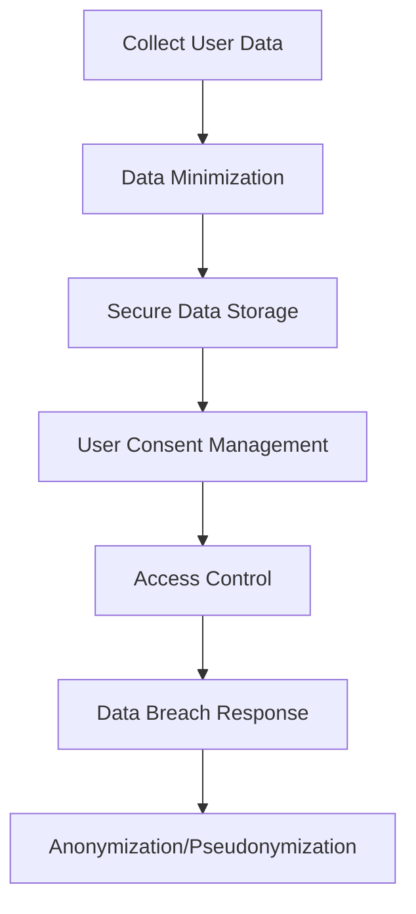

## 15.11 Data Privacy and Compliance

In today's digital age, data privacy and compliance have become critical components of software development. With regulations like the General Data Protection Regulation (GDPR) and other data protection laws, software engineers and architects must design systems that prioritize user privacy and ensure compliance. In this section, we will explore how to implement privacy by design in Scala applications, along with techniques for data anonymization and pseudonymization.

### Understanding GDPR and Other Data Protection Laws

The GDPR is a comprehensive data protection law that governs how personal data of individuals within the European Union (EU) is collected, processed, and stored. It emphasizes user consent, data minimization, and the right to access and delete personal data. Non-compliance can result in hefty fines, making it crucial for developers to understand and implement its requirements.

#### Key Principles of GDPR

1. **Lawfulness, Fairness, and Transparency**: Data processing must be lawful, fair, and transparent to the data subject.
2. **Purpose Limitation**: Data should be collected for specified, explicit, and legitimate purposes and not further processed in a manner incompatible with those purposes.
3. **Data Minimization**: Only data necessary for the intended purpose should be collected.
4. **Accuracy**: Personal data must be accurate and kept up to date.
5. **Storage Limitation**: Data should be kept in a form that permits identification of data subjects for no longer than necessary.
6. **Integrity and Confidentiality**: Data must be processed securely to protect against unauthorized processing and accidental loss.

#### Other Data Protection Laws

While GDPR is a prominent regulation, other regions have their own data protection laws, such as the California Consumer Privacy Act (CCPA) in the United States and the Personal Information Protection and Electronic Documents Act (PIPEDA) in Canada. Understanding these laws is crucial for global applications.

### Implementing Privacy by Design in Scala Applications

Privacy by design is a proactive approach to data protection, ensuring privacy is considered throughout the software development lifecycle. Here are some strategies to implement privacy by design in Scala applications:

#### 1. Data Minimization

Ensure that your application collects only the necessary data. Use Scala's strong typing system to enforce data constraints and prevent unnecessary data collection.

```scala
case class UserData(name: String, email: String, age: Option[Int])

def collectUserData(input: Map[String, String]): UserData = {
  UserData(
    name = input.getOrElse("name", ""),
    email = input.getOrElse("email", ""),
    age = input.get("age").flatMap(s => Try(s.toInt).toOption)
  )
}
```

#### 2. Secure Data Storage

Use encryption to protect sensitive data. Scala libraries like `Bouncy Castle` provide robust encryption mechanisms.

```scala
import org.bouncycastle.jce.provider.BouncyCastleProvider
import java.security.Security
import javax.crypto.Cipher
import javax.crypto.spec.SecretKeySpec

Security.addProvider(new BouncyCastleProvider())

def encryptData(data: String, key: String): Array[Byte] = {
  val cipher = Cipher.getInstance("AES/ECB/PKCS5Padding", "BC")
  val secretKey = new SecretKeySpec(key.getBytes("UTF-8"), "AES")
  cipher.init(Cipher.ENCRYPT_MODE, secretKey)
  cipher.doFinal(data.getBytes("UTF-8"))
}
```

#### 3. User Consent Management

Implement mechanisms to obtain and manage user consent. Use Scala's functional programming features to handle consent workflows.

```scala
sealed trait Consent
case object Granted extends Consent
case object Denied extends Consent

def requestConsent(userId: String): Consent = {
  // Logic to request and record user consent
  Granted // Example response
}
```

#### 4. Access Control and Auditing

Implement role-based access control (RBAC) to ensure only authorized users can access sensitive data. Use Scala's case classes and pattern matching for efficient access control logic.

```scala
sealed trait Role
case object Admin extends Role
case object User extends Role

case class User(id: String, role: Role)

def hasAccess(user: User, resource: String): Boolean = user.role match {
  case Admin => true
  case User => resource != "adminResource"
}
```

#### 5. Data Breach Response

Prepare a response plan for data breaches. Use Scala's `Try` and `Either` types for error handling and logging.

```scala
import scala.util.{Try, Success, Failure}

def handleDataBreach(): Try[Unit] = {
  // Logic to handle data breach
  Success(println("Data breach handled"))
}

handleDataBreach() match {
  case Success(_) => println("Breach handled successfully")
  case Failure(exception) => println(s"Error handling breach: ${exception.getMessage}")
}
```

### Techniques for Data Anonymization and Pseudonymization

Data anonymization and pseudonymization are techniques to protect personal data by making it less identifiable. These techniques are crucial for compliance with data protection laws.

#### Data Anonymization

Anonymization involves removing or altering data so that individuals cannot be identified. This process is irreversible.

##### Example: Removing Identifiers

```scala
case class UserRecord(id: String, name: String, email: String)

def anonymizeData(records: List[UserRecord]): List[UserRecord] = {
  records.map(record => record.copy(id = "", name = "Anonymous", email = ""))
}
```

#### Data Pseudonymization

Pseudonymization replaces private identifiers with fake identifiers or pseudonyms. This process is reversible under certain conditions.

##### Example: Hashing Identifiers

```scala
import java.security.MessageDigest

def hashIdentifier(identifier: String): String = {
  val md = MessageDigest.getInstance("SHA-256")
  md.digest(identifier.getBytes("UTF-8")).map("%02x".format(_)).mkString
}

val pseudonymizedId = hashIdentifier("user123")
```

### Visualizing Data Privacy and Compliance

To better understand the flow of data privacy and compliance, let's visualize the process using a flowchart.



**Figure 1: Data Privacy and Compliance Workflow**

### References and Links

- [GDPR Official Website](https://gdpr.eu/)
- [California Consumer Privacy Act (CCPA)](https://oag.ca.gov/privacy/ccpa)
- [Bouncy Castle Cryptography Library](https://www.bouncycastle.org/)
- [Scala Documentation](https://docs.scala-lang.org/)

### Knowledge Check

- Explain the key principles of GDPR.
- Demonstrate how to implement data minimization in Scala.
- Provide an example of secure data storage using encryption.
- Describe how to manage user consent in a Scala application.
- Illustrate the difference between data anonymization and pseudonymization.

### Embrace the Journey

Remember, data privacy and compliance are ongoing processes. As regulations evolve, so must our strategies. Keep learning, stay compliant, and prioritize user privacy in all your Scala applications.

## Quiz Time!



### What is the primary goal of GDPR?

- [x] To protect personal data and privacy of individuals within the EU.
- [ ] To promote data sharing among companies.
- [ ] To regulate data storage costs.
- [ ] To encourage the use of cloud services.

> **Explanation:** GDPR aims to protect personal data and privacy of individuals within the EU, ensuring data is collected and processed lawfully.

### Which Scala feature can help enforce data minimization?

- [x] Strong typing system.
- [ ] Dynamic typing.
- [ ] Implicit conversions.
- [ ] Reflection.

> **Explanation:** Scala's strong typing system helps enforce data constraints, ensuring only necessary data is collected.

### What is the difference between anonymization and pseudonymization?

- [x] Anonymization is irreversible; pseudonymization is reversible.
- [ ] Anonymization is reversible; pseudonymization is irreversible.
- [ ] Both are irreversible.
- [ ] Both are reversible.

> **Explanation:** Anonymization is irreversible, making data unidentifiable, while pseudonymization is reversible under certain conditions.

### Which library is recommended for encryption in Scala?

- [x] Bouncy Castle.
- [ ] Play Framework.
- [ ] Akka HTTP.
- [ ] Circe.

> **Explanation:** Bouncy Castle is a recommended library for implementing encryption in Scala applications.

### What is a key principle of privacy by design?

- [x] Integrating privacy throughout the software development lifecycle.
- [ ] Adding privacy features at the end of development.
- [ ] Ignoring user consent.
- [ ] Collecting as much data as possible.

> **Explanation:** Privacy by design integrates privacy considerations throughout the software development lifecycle.

### How can user consent be managed in Scala?

- [x] Using functional programming features for consent workflows.
- [ ] Ignoring user consent.
- [ ] Using reflection.
- [ ] Implementing dynamic typing.

> **Explanation:** Scala's functional programming features can be used to handle consent workflows effectively.

### What is the purpose of access control in data privacy?

- [x] To ensure only authorized users can access sensitive data.
- [ ] To allow unrestricted data access.
- [ ] To increase data processing speed.
- [ ] To reduce data storage costs.

> **Explanation:** Access control ensures that only authorized users can access sensitive data, protecting privacy.

### How can data breaches be handled in Scala?

- [x] Using Try and Either types for error handling and logging.
- [ ] Ignoring them.
- [ ] Using dynamic typing.
- [ ] Implementing implicit conversions.

> **Explanation:** Scala's Try and Either types provide robust mechanisms for error handling and logging in case of data breaches.

### What is a benefit of using pseudonymization?

- [x] It allows data to be reversible under certain conditions.
- [ ] It makes data completely unidentifiable.
- [ ] It increases data processing speed.
- [ ] It reduces data storage costs.

> **Explanation:** Pseudonymization allows data to be reversible under certain conditions, enabling data analysis while protecting privacy.

### True or False: Data minimization involves collecting as much data as possible.

- [ ] True
- [x] False

> **Explanation:** Data minimization involves collecting only the necessary data for the intended purpose, not as much as possible.




