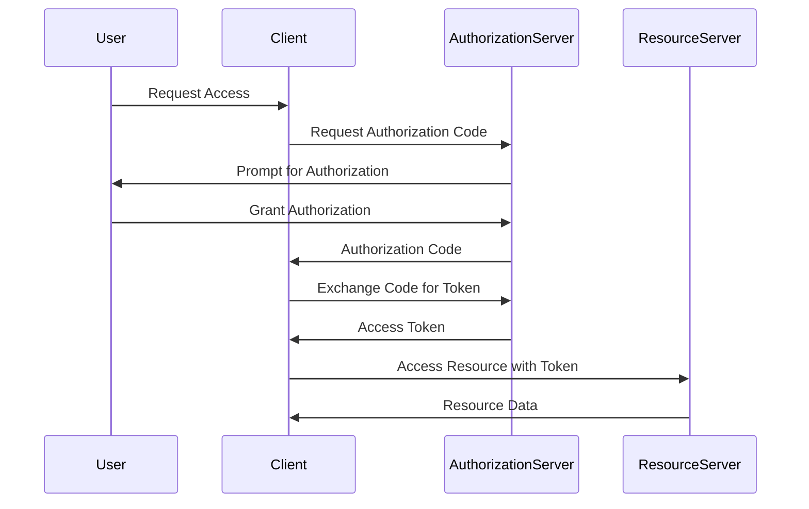
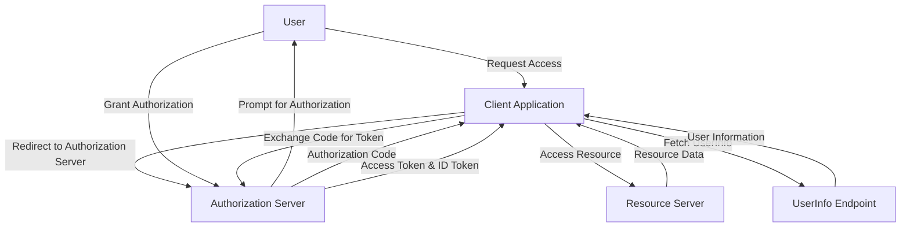

## 15.2 Implementing OAuth2 and OpenID Connect

In today's digital landscape, secure authentication and authorization are paramount. OAuth2 and OpenID Connect have emerged as the industry standards for secure user authentication and authorization. In this section, we will delve into the intricacies of these protocols, focusing on their implementation in Scala applications. We will explore the OAuth2 flows, integrate OpenID Connect for user authentication, and provide practical examples to illustrate these concepts.

### Understanding OAuth2

OAuth2 is an open standard for access delegation commonly used for token-based authentication and authorization. It allows third-party services to exchange user information without exposing user credentials. OAuth2 is widely used by companies like Google, Facebook, and GitHub to allow users to authenticate with their services.

#### Key Concepts of OAuth2

1. **Resource Owner**: The user who authorizes an application to access their account.
2. **Client**: The application requesting access to the user's account.
3. **Resource Server**: The server hosting the protected resources.
4. **Authorization Server**: The server issuing access tokens to the client after successfully authenticating the resource owner.

#### OAuth2 Flows

OAuth2 defines several flows (or "grant types") for different use cases:

- **Authorization Code Grant**: Used by web and mobile apps. It involves exchanging an authorization code for an access token.
- **Implicit Grant**: Used by single-page applications (SPAs) where the access token is returned directly.
- **Resource Owner Password Credentials Grant**: Used when the user trusts the client with their credentials.
- **Client Credentials Grant**: Used for machine-to-machine communication.

Let's visualize the Authorization Code Grant flow, which is the most common and secure flow:



### Integrating OpenID Connect

OpenID Connect (OIDC) is an identity layer built on top of OAuth2. It allows clients to verify the identity of the end-user based on the authentication performed by an authorization server. OIDC provides the following benefits:

- **User Authentication**: Verifies the identity of the user.
- **User Information**: Retrieves basic profile information about the user.
- **Single Sign-On (SSO)**: Allows users to authenticate once and gain access to multiple applications.

#### Key Components of OpenID Connect

1. **ID Token**: A JSON Web Token (JWT) that contains user identity information.
2. **UserInfo Endpoint**: An endpoint to fetch additional user information.
3. **Scopes**: Define the level of access requested by the client.

### Implementing OAuth2 and OpenID Connect in Scala

To implement OAuth2 and OpenID Connect in Scala, we can use libraries like [Silhouette](https://github.com/silhouetteframework/silhouette) or [Pac4j](https://www.pac4j.org/). These libraries provide comprehensive support for authentication and authorization.

#### Setting Up a Scala Project

First, let's set up a basic Scala project using SBT:

```scala
// build.sbt
name := "OAuth2OpenIDConnectExample"
version := "0.1"
scalaVersion := "2.13.8"

libraryDependencies ++= Seq(
  "com.mohiva" %% "play-silhouette" % "7.0.0",
  "com.typesafe.play" %% "play-json" % "2.9.2"
)
```

#### Implementing OAuth2 with Silhouette

Silhouette is a Scala library for authentication and authorization. It supports OAuth2 and OpenID Connect out of the box.

1. **Configure OAuth2 Provider**: Define the OAuth2 provider settings.

```scala
// OAuth2Provider.scala
import com.mohiva.play.silhouette.api.util.Credentials
import com.mohiva.play.silhouette.impl.providers.oauth2.GoogleProvider
import com.mohiva.play.silhouette.impl.providers.oauth2.GoogleProvider._

class OAuth2Provider extends GoogleProvider {
  override val settings = OAuth2Settings(
    authorizationURL = "https://accounts.google.com/o/oauth2/auth",
    accessTokenURL = "https://accounts.google.com/o/oauth2/token",
    redirectURL = "http://localhost:9000/authenticate/google",
    clientID = "your-client-id",
    clientSecret = "your-client-secret",
    scope = Some("openid profile email")
  )
}
```

2. **Handle Authentication**: Implement the authentication logic.

```scala
// AuthController.scala
import com.mohiva.play.silhouette.api.Silhouette
import com.mohiva.play.silhouette.api.util.Credentials
import com.mohiva.play.silhouette.impl.providers.GoogleProvider
import play.api.mvc._

class AuthController @Inject() (silhouette: Silhouette[DefaultEnv]) extends InjectedController {

  def authenticate(provider: String): Action[AnyContent] = Action.async { implicit request =>
    silhouette.env.providers.get(provider) match {
      case Some(p: GoogleProvider) =>
        p.authenticate().map {
          case Left(result) => result
          case Right(authInfo) =>
            // Handle successful authentication
            Ok("Authenticated")
        }
      case _ => Future.successful(NotFound)
    }
  }
}
```

3. **Secure Routes**: Protect routes using Silhouette's authentication mechanism.

```scala
// routes
GET     /authenticate/:provider    controllers.AuthController.authenticate(provider: String)
```

#### Integrating OpenID Connect

To integrate OpenID Connect, we need to extend the OAuth2 implementation to handle ID tokens and user information.

1. **Parse ID Token**: Extract user identity from the ID token.

```scala
// OpenIDConnectProvider.scala
import pdi.jwt.JwtJson
import play.api.libs.json.Json

class OpenIDConnectProvider extends OAuth2Provider {
  def parseIDToken(idToken: String): JsValue = {
    val decoded = JwtJson.decodeJson(idToken, "your-client-secret", Seq(JwtAlgorithm.HS256))
    decoded.getOrElse(Json.obj())
  }
}
```

2. **Fetch UserInfo**: Retrieve additional user information from the UserInfo endpoint.

```scala
// UserInfoService.scala
import play.api.libs.ws._

class UserInfoService @Inject() (ws: WSClient) {
  def fetchUserInfo(accessToken: String): Future[JsValue] = {
    ws.url("https://www.googleapis.com/oauth2/v3/userinfo")
      .addHttpHeaders("Authorization" -> s"Bearer $accessToken")
      .get()
      .map(_.json)
  }
}
```

### Best Practices for OAuth2 and OpenID Connect

1. **Secure Storage**: Store client secrets securely, using environment variables or secure vaults.
2. **Token Expiry**: Implement token expiry and refresh mechanisms to enhance security.
3. **Scopes Management**: Request only the necessary scopes to minimize access.
4. **Error Handling**: Implement robust error handling for authentication failures.
5. **Logging and Monitoring**: Log authentication attempts and monitor for suspicious activities.

### Try It Yourself

To gain hands-on experience, try modifying the code examples to integrate with different OAuth2 providers like Facebook or GitHub. Experiment with different scopes and observe the changes in user information retrieved.

### Visualizing OAuth2 and OpenID Connect Integration

Let's visualize the integration of OAuth2 and OpenID Connect in a typical web application:



### References and Links

- [OAuth2 Specification](https://tools.ietf.org/html/rfc6749)
- [OpenID Connect Specification](https://openid.net/specs/openid-connect-core-1_0.html)
- [Silhouette Framework](https://www.silhouette.rocks/)
- [Pac4j Security Library](https://www.pac4j.org/)

### Knowledge Check

1. What are the key components of OAuth2 and OpenID Connect?
2. How does the Authorization Code Grant flow work?
3. What are the benefits of using OpenID Connect over OAuth2 alone?
4. How can you secure client secrets in a Scala application?
5. What are some best practices for implementing OAuth2 and OpenID Connect?

### Embrace the Journey

Remember, implementing OAuth2 and OpenID Connect is just the beginning. As you progress, you'll build more secure and robust applications. Keep experimenting, stay curious, and enjoy the journey!

## Quiz Time!



### What is the main purpose of OAuth2?

- [x] To provide a secure way for applications to access user data without exposing user credentials.
- [ ] To encrypt data in transit.
- [ ] To provide a user interface for authentication.
- [ ] To store user passwords securely.

> **Explanation:** OAuth2 is primarily used for secure access delegation, allowing applications to access user data without exposing user credentials.

### Which OAuth2 flow is most commonly used by web and mobile applications?

- [x] Authorization Code Grant
- [ ] Implicit Grant
- [ ] Resource Owner Password Credentials Grant
- [ ] Client Credentials Grant

> **Explanation:** The Authorization Code Grant is the most secure and commonly used flow for web and mobile applications.

### What is an ID Token in OpenID Connect?

- [x] A JSON Web Token (JWT) that contains user identity information.
- [ ] A token used to refresh access tokens.
- [ ] A token used to encrypt user data.
- [ ] A token used to authorize API requests.

> **Explanation:** An ID Token is a JWT that contains user identity information, used in OpenID Connect for authentication.

### What is the role of the UserInfo Endpoint in OpenID Connect?

- [x] To provide additional user information.
- [ ] To issue access tokens.
- [ ] To validate client credentials.
- [ ] To encrypt user data.

> **Explanation:** The UserInfo Endpoint provides additional user information in OpenID Connect.

### How can you securely store client secrets in a Scala application?

- [x] Using environment variables
- [ ] Hardcoding in the source code
- [x] Using secure vaults
- [ ] Storing in plain text files

> **Explanation:** Client secrets should be stored securely using environment variables or secure vaults, not hardcoded or stored in plain text files.

### What is a common best practice for managing OAuth2 scopes?

- [x] Request only the necessary scopes to minimize access.
- [ ] Request all available scopes for maximum access.
- [ ] Ignore scopes as they are not important.
- [ ] Use scopes only for debugging purposes.

> **Explanation:** It's a best practice to request only the necessary scopes to minimize access and enhance security.

### What should you implement to handle token expiry in OAuth2?

- [x] Token refresh mechanisms
- [ ] Hardcoded token values
- [x] Token expiry checks
- [ ] Ignore token expiry

> **Explanation:** Implementing token refresh mechanisms and expiry checks are essential for handling token expiry in OAuth2.

### What is a key benefit of using OpenID Connect with OAuth2?

- [x] Provides user authentication and identity verification.
- [ ] Simplifies the user interface.
- [ ] Increases the speed of API requests.
- [ ] Reduces the amount of code needed for authentication.

> **Explanation:** OpenID Connect provides user authentication and identity verification, enhancing OAuth2's capabilities.

### Which library can be used for implementing OAuth2 in Scala?

- [x] Silhouette
- [ ] React
- [ ] Angular
- [ ] Vue.js

> **Explanation:** Silhouette is a Scala library that supports OAuth2 and OpenID Connect implementation.

### True or False: OAuth2 can be used for both authentication and authorization.

- [x] True
- [ ] False

> **Explanation:** OAuth2 is primarily used for authorization, but when combined with OpenID Connect, it can also be used for authentication.


