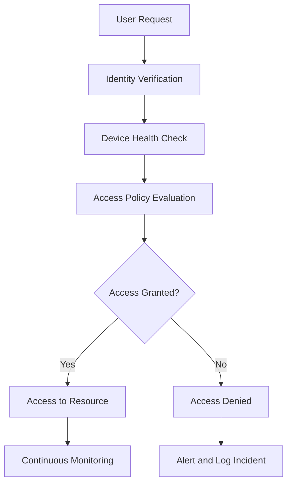

## 15.3 Zero Trust Security Model

In today's rapidly evolving digital landscape, traditional security models that rely on perimeter defenses are no longer sufficient. The Zero Trust Security Model offers a modern approach to cybersecurity that assumes no implicit trust within a network. This section will delve into the principles of Zero Trust architecture, provide guidance on implementing Zero Trust in Scala applications, and offer practical advice through case studies.

### Principles of Zero Trust Architecture

The Zero Trust Security Model is built on the premise that trust should never be assumed, whether inside or outside the network. Here are the core principles:

1. **Verify Explicitly**: Always authenticate and authorize based on all available data points, including user identity, location, device health, service or workload, data classification, and anomalies.

2. **Use Least Privilege Access**: Limit user access with just-in-time and just-enough-access (JIT/JEA), risk-based adaptive policies, and data protection to minimize lateral movement.

3. **Assume Breach**: Minimize the blast radius and segment access. Verify end-to-end encryption and use analytics to gain visibility, drive threat detection, and improve defenses.

#### Visualizing Zero Trust Architecture

To better understand how Zero Trust architecture operates, let's visualize the flow of authentication and authorization in a Zero Trust environment:



**Diagram Description**: This flowchart illustrates the Zero Trust process, starting from a user request, through identity verification, device health checks, and access policy evaluation, leading to either access granted or denied, followed by continuous monitoring or incident logging.

### Implementing Zero Trust in Scala Applications

Implementing Zero Trust in Scala applications involves several steps, from integrating authentication mechanisms to ensuring secure communication and data handling. Let's explore these steps in detail.

#### Step 1: Identity and Access Management (IAM)

**Explain**: Implement robust IAM solutions to ensure that only authenticated and authorized users can access your application. Use OAuth2, OpenID Connect, or SAML for identity verification.

**Code Example**: Integrating OAuth2 in a Scala application using the Play Framework.

```scala
// Import necessary libraries
import play.api.mvc._
import play.api.libs.oauth._

object OAuth2Controller extends Controller {
  // Define OAuth2 configuration
  val oauth2Config = OAuth2Config(
    authorizationUrl = "https://auth.example.com/authorize",
    tokenUrl = "https://auth.example.com/token",
    clientId = "your-client-id",
    clientSecret = "your-client-secret"
  )

  // Redirect user to authorization URL
  def login = Action {
    Redirect(oauth2Config.authorizationUrl)
  }

  // Handle OAuth2 callback
  def callback(code: String) = Action.async { implicit request =>
    oauth2Config.exchangeCodeForToken(code).map { token =>
      // Store token and proceed with authenticated session
      Ok("Authenticated")
    }.recover {
      case ex: Exception => Unauthorized("Authentication failed")
    }
  }
}
```

**Try It Yourself**: Modify the OAuth2 configuration to connect with your identity provider and test the authentication flow.

#### Step 2: Secure Communication

**Explain**: Ensure all communication between components is encrypted using TLS. This prevents eavesdropping and man-in-the-middle attacks.

**Code Example**: Configuring HTTPS in a Scala application using Akka HTTP.

```scala
import akka.actor.ActorSystem
import akka.http.scaladsl.Http
import akka.http.scaladsl.server.Directives._
import akka.http.scaladsl.server.Route
import com.typesafe.sslconfig.akka.AkkaSSLConfig

object SecureServer extends App {
  implicit val system: ActorSystem = ActorSystem("secure-system")

  // Define a simple route
  val route: Route = path("secure") {
    get {
      complete("Secure connection established")
    }
  }

  // Load SSL configuration
  val sslConfig = AkkaSSLConfig()

  // Start HTTPS server
  Http().newServerAt("localhost", 8443)
    .enableHttps(sslConfig)
    .bind(route)
}
```

**Try It Yourself**: Set up a self-signed certificate and configure your server to use it for HTTPS connections.

#### Step 3: Continuous Monitoring and Logging

**Explain**: Implement continuous monitoring and logging to detect and respond to threats in real-time. Use tools like ELK Stack or Splunk for log aggregation and analysis.

**Code Example**: Integrating logging in a Scala application using Logback.

```scala
import org.slf4j.LoggerFactory

object LoggingExample {
  val logger = LoggerFactory.getLogger(this.getClass)

  def main(args: Array[String]): Unit = {
    logger.info("Application started")
    try {
      // Application logic here
    } catch {
      case ex: Exception =>
        logger.error("An error occurred", ex)
    }
  }
}
```

**Try It Yourself**: Configure Logback to send logs to an external monitoring system and analyze the logs for security insights.

### Case Studies and Practical Advice

#### Case Study 1: Securing a Financial Application

**Scenario**: A financial institution wants to secure its online banking application using Zero Trust principles.

**Solution**: Implement multi-factor authentication (MFA) using a combination of password and biometric verification. Use Scala's Akka HTTP for secure communication and integrate with a third-party IAM solution for identity management.

**Practical Advice**: Regularly update security policies and conduct security audits to ensure compliance with industry standards.

#### Case Study 2: Protecting a Healthcare System

**Scenario**: A healthcare provider needs to protect sensitive patient data while allowing access to authorized personnel.

**Solution**: Use role-based access control (RBAC) to ensure only authorized users can access patient records. Implement data encryption both at rest and in transit using Scala's cryptographic libraries.

**Practical Advice**: Train staff on security best practices and conduct regular penetration testing to identify vulnerabilities.

### Key Takeaways

- **Zero Trust is a mindset**: It's about assuming that threats exist both inside and outside the network and taking proactive steps to mitigate them.
- **Scala provides robust tools**: Use Scala's rich ecosystem, including Play Framework and Akka HTTP, to implement Zero Trust principles effectively.
- **Continuous improvement is essential**: Regularly review and update security measures to adapt to evolving threats.

### Knowledge Check

- **Why is Zero Trust important in modern security architecture?**
- **How can OAuth2 be integrated into a Scala application?**
- **What are the benefits of using TLS for secure communication?**

### Embrace the Journey

Remember, implementing Zero Trust is a continuous journey, not a one-time task. Stay curious, keep learning, and adapt to new challenges as they arise. By embracing Zero Trust principles, you can build more secure and resilient Scala applications.

## Quiz Time!



### What is the core principle of Zero Trust architecture?

- [x] Never trust, always verify
- [ ] Trust but verify
- [ ] Trust internal networks
- [ ] Trust external networks

> **Explanation:** The core principle of Zero Trust is "never trust, always verify," meaning that no implicit trust is given to any user or device, whether inside or outside the network.


### Which Scala library is used for secure communication in the provided example?

- [x] Akka HTTP
- [ ] Play Framework
- [ ] Slick
- [ ] Cats

> **Explanation:** Akka HTTP is used in the provided example for setting up secure communication using HTTPS.


### What is the purpose of using OAuth2 in a Scala application?

- [x] To authenticate and authorize users
- [ ] To encrypt data
- [ ] To log application events
- [ ] To manage application state

> **Explanation:** OAuth2 is used for authenticating and authorizing users, ensuring that only authenticated users can access certain resources.


### What is a key benefit of using TLS in applications?

- [x] It encrypts data in transit
- [ ] It speeds up data processing
- [ ] It reduces server load
- [ ] It simplifies code

> **Explanation:** TLS encrypts data in transit, protecting it from eavesdropping and man-in-the-middle attacks.


### Which tool is suggested for log aggregation and analysis?

- [x] ELK Stack
- [ ] JUnit
- [ ] ScalaTest
- [ ] SBT

> **Explanation:** ELK Stack is suggested for log aggregation and analysis, providing insights into application behavior and security.


### What is the role of continuous monitoring in Zero Trust?

- [x] To detect and respond to threats in real-time
- [ ] To reduce server costs
- [ ] To simplify code deployment
- [ ] To increase application speed

> **Explanation:** Continuous monitoring helps detect and respond to threats in real-time, ensuring that security measures are effective.


### How can Scala's cryptographic libraries be used in Zero Trust?

- [x] For data encryption
- [ ] For user interface design
- [ ] For database management
- [ ] For logging

> **Explanation:** Scala's cryptographic libraries can be used for data encryption, ensuring that sensitive information is protected.


### What is the significance of role-based access control (RBAC)?

- [x] It ensures only authorized users can access specific resources
- [ ] It speeds up application performance
- [ ] It simplifies code structure
- [ ] It reduces memory usage

> **Explanation:** RBAC ensures that only authorized users can access specific resources, enhancing security by limiting access based on roles.


### What should be regularly updated to maintain Zero Trust security?

- [x] Security policies
- [ ] User interface
- [ ] Database schema
- [ ] Application color scheme

> **Explanation:** Regularly updating security policies is crucial to maintaining Zero Trust security, as it ensures that security measures are up-to-date with current threats.


### True or False: Zero Trust assumes that threats only exist outside the network.

- [ ] True
- [x] False

> **Explanation:** False. Zero Trust assumes that threats can exist both inside and outside the network, and therefore, no implicit trust is given.


