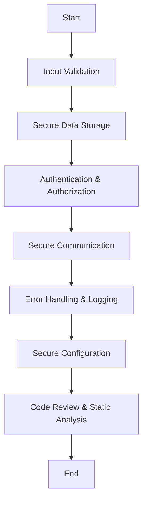

## 15.4 Secure Coding Practices

In today's digital landscape, security is not just a feature; it's a necessity. As expert software engineers and architects, our responsibility extends beyond creating functional and efficient systems to ensuring they are secure from potential threats. This section delves into secure coding practices in Scala, focusing on protecting against common vulnerabilities. We'll explore essential concepts, provide practical code examples, and offer guidance on implementing these practices effectively.

### Understanding Secure Coding

Secure coding involves writing software that is resilient to attacks and minimizes vulnerabilities. It requires a proactive approach to identify potential security risks and implement measures to mitigate them. In Scala, secure coding practices leverage the language's features to enhance security while maintaining performance and functionality.

### Common Vulnerabilities and Threats

Before diving into specific practices, let's identify some common vulnerabilities that can affect Scala applications:

1. **Injection Attacks**: These occur when untrusted data is sent to an interpreter as part of a command or query. SQL injection is a well-known example.
2. **Cross-Site Scripting (XSS)**: This involves injecting malicious scripts into web pages viewed by other users.
3. **Cross-Site Request Forgery (CSRF)**: This attack tricks a user into executing unwanted actions on a web application where they are authenticated.
4. **Insecure Deserialization**: This happens when untrusted data is used to abuse the logic of an application, inflict a denial of service (DoS) attack, or execute arbitrary code.
5. **Sensitive Data Exposure**: This involves the unintended exposure of sensitive information such as passwords, credit card numbers, or personal data.

### Secure Coding Practices in Scala

#### 1. Input Validation and Sanitization

**Intent**: Prevent injection attacks by validating and sanitizing all user inputs.

**Key Participants**:
- **Validators**: Functions or classes that ensure input meets expected criteria.
- **Sanitizers**: Functions that clean input data to remove or escape harmful content.

**Applicability**: Use input validation and sanitization whenever your application accepts data from external sources.

**Sample Code Snippet**:

```scala
object InputValidation {
  def validateEmail(email: String): Boolean = {
    val emailRegex = "^[\\w-\\.]+@([\\w-]+\\.)+[\\w-]{2,4}$"
    email.matches(emailRegex)
  }

  def sanitizeInput(input: String): String = {
    input.replaceAll("[^a-zA-Z0-9]", "")
  }

  def main(args: Array[String]): Unit = {
    val email = "user@example.com"
    if (validateEmail(email)) {
      println("Valid email address.")
    } else {
      println("Invalid email address.")
    }

    val unsafeInput = "<script>alert('XSS')</script>"
    val safeInput = sanitizeInput(unsafeInput)
    println(s"Sanitized input: $safeInput")
  }
}
```

**Design Considerations**: Ensure validators cover all edge cases and sanitizers effectively neutralize harmful content.

**Differences and Similarities**: Unlike encoding, sanitization modifies input to remove harmful elements, while encoding transforms input to a safe format.

#### 2. Secure Data Storage

**Intent**: Protect sensitive data both in transit and at rest.

**Key Participants**:
- **Encryption Algorithms**: Techniques for encoding data to prevent unauthorized access.
- **Secure Storage Solutions**: Tools and libraries that facilitate secure data storage.

**Applicability**: Use secure data storage practices for sensitive information such as passwords, personal data, and financial information.

**Sample Code Snippet**:

```scala
import java.security.MessageDigest
import javax.crypto.Cipher
import javax.crypto.spec.SecretKeySpec
import java.util.Base64

object SecureDataStorage {
  private val secretKey = "mySuperSecretKey"

  def encrypt(data: String): String = {
    val keySpec = new SecretKeySpec(secretKey.getBytes("UTF-8"), "AES")
    val cipher = Cipher.getInstance("AES")
    cipher.init(Cipher.ENCRYPT_MODE, keySpec)
    Base64.getEncoder.encodeToString(cipher.doFinal(data.getBytes("UTF-8")))
  }

  def decrypt(encryptedData: String): String = {
    val keySpec = new SecretKeySpec(secretKey.getBytes("UTF-8"), "AES")
    val cipher = Cipher.getInstance("AES")
    cipher.init(Cipher.DECRYPT_MODE, keySpec)
    new String(cipher.doFinal(Base64.getDecoder.decode(encryptedData)))
  }

  def main(args: Array[String]): Unit = {
    val originalData = "SensitiveInformation"
    val encryptedData = encrypt(originalData)
    println(s"Encrypted Data: $encryptedData")

    val decryptedData = decrypt(encryptedData)
    println(s"Decrypted Data: $decryptedData")
  }
}
```

**Design Considerations**: Choose strong encryption algorithms and manage keys securely. Avoid hardcoding keys in your source code.

**Differences and Similarities**: Encryption differs from hashing in that it is reversible, allowing data to be decrypted.

#### 3. Authentication and Authorization

**Intent**: Ensure only authorized users can access specific resources or perform certain actions.

**Key Participants**:
- **Authentication Mechanisms**: Methods for verifying user identity.
- **Authorization Controls**: Rules that define what authenticated users can do.

**Applicability**: Implement authentication and authorization for any application that requires user access control.

**Sample Code Snippet**:

```scala
import java.util.UUID

object AuthSystem {
  case class User(id: UUID, username: String, passwordHash: String, roles: Set[String])

  def authenticate(username: String, password: String, users: List[User]): Option[User] = {
    users.find(user => user.username == username && user.passwordHash == hashPassword(password))
  }

  def authorize(user: User, requiredRole: String): Boolean = {
    user.roles.contains(requiredRole)
  }

  def hashPassword(password: String): String = {
    // Simple hash function for demonstration purposes
    MessageDigest.getInstance("SHA-256").digest(password.getBytes("UTF-8")).map("%02x".format(_)).mkString
  }

  def main(args: Array[String]): Unit = {
    val users = List(
      User(UUID.randomUUID(), "admin", hashPassword("adminPass"), Set("ADMIN")),
      User(UUID.randomUUID(), "user", hashPassword("userPass"), Set("USER"))
    )

    val username = "admin"
    val password = "adminPass"

    authenticate(username, password, users) match {
      case Some(user) if authorize(user, "ADMIN") =>
        println(s"User $username authenticated and authorized.")
      case Some(_) =>
        println(s"User $username authenticated but not authorized.")
      case None =>
        println("Authentication failed.")
    }
  }
}
```

**Design Considerations**: Use strong password hashing algorithms like bcrypt or Argon2. Implement multi-factor authentication for enhanced security.

**Differences and Similarities**: Authentication verifies identity, while authorization determines access rights.

#### 4. Secure Communication

**Intent**: Protect data in transit using secure communication protocols.

**Key Participants**:
- **TLS/SSL**: Protocols for encrypting data transmitted over networks.
- **Secure APIs**: Interfaces that ensure data integrity and confidentiality.

**Applicability**: Use secure communication practices for any application that transmits sensitive data over networks.

**Sample Code Snippet**:

```scala
import java.net.URL
import javax.net.ssl.HttpsURLConnection

object SecureCommunication {
  def fetchSecureData(url: String): String = {
    val connection = new URL(url).openConnection().asInstanceOf[HttpsURLConnection]
    connection.setRequestMethod("GET")
    connection.setSSLSocketFactory(SSLContext.getDefault.getSocketFactory)
    val responseCode = connection.getResponseCode

    if (responseCode == 200) {
      scala.io.Source.fromInputStream(connection.getInputStream).mkString
    } else {
      throw new RuntimeException(s"Failed to fetch data. Response code: $responseCode")
    }
  }

  def main(args: Array[String]): Unit = {
    val secureUrl = "https://example.com/secure-data"
    try {
      val data = fetchSecureData(secureUrl)
      println(s"Fetched secure data: $data")
    } catch {
      case e: Exception => println(s"Error: ${e.getMessage}")
    }
  }
}
```

**Design Considerations**: Ensure certificates are valid and up-to-date. Use strong cipher suites and disable weak protocols.

**Differences and Similarities**: TLS/SSL provides encryption for data in transit, while encryption algorithms like AES protect data at rest.

#### 5. Error Handling and Logging

**Intent**: Safely handle errors and log events without exposing sensitive information.

**Key Participants**:
- **Error Handlers**: Mechanisms for managing exceptions and errors.
- **Logging Frameworks**: Tools for recording application events and errors.

**Applicability**: Implement error handling and logging for all applications to ensure reliability and traceability.

**Sample Code Snippet**:

```scala
import org.slf4j.LoggerFactory

object ErrorHandling {
  private val logger = LoggerFactory.getLogger(this.getClass)

  def divide(a: Int, b: Int): Int = {
    try {
      a / b
    } catch {
      case e: ArithmeticException =>
        logger.error("Division by zero error", e)
        throw new IllegalArgumentException("Cannot divide by zero")
    }
  }

  def main(args: Array[String]): Unit = {
    try {
      val result = divide(10, 0)
      println(s"Result: $result")
    } catch {
      case e: IllegalArgumentException => println(s"Error: ${e.getMessage}")
    }
  }
}
```

**Design Considerations**: Avoid logging sensitive information. Use structured logging for better analysis and monitoring.

**Differences and Similarities**: Error handling ensures application stability, while logging provides insights into application behavior.

#### 6. Secure Configuration Management

**Intent**: Manage application configurations securely to prevent unauthorized access and modifications.

**Key Participants**:
- **Configuration Files**: Files that store application settings.
- **Environment Variables**: Variables that provide configuration data at runtime.

**Applicability**: Use secure configuration management for applications that require external configuration.

**Sample Code Snippet**:

```scala
import com.typesafe.config.ConfigFactory

object SecureConfig {
  private val config = ConfigFactory.load()

  def getDatabaseConfig: (String, String, String) = {
    val dbUrl = config.getString("db.url")
    val dbUser = config.getString("db.user")
    val dbPassword = config.getString("db.password")
    (dbUrl, dbUser, dbPassword)
  }

  def main(args: Array[String]): Unit = {
    val (url, user, password) = getDatabaseConfig
    println(s"Database URL: $url")
    println(s"Database User: $user")
    // Avoid printing sensitive information like passwords
  }
}
```

**Design Considerations**: Use environment variables for sensitive data. Ensure configuration files have appropriate access controls.

**Differences and Similarities**: Configuration files provide static settings, while environment variables allow dynamic configuration.

#### 7. Code Review and Static Analysis

**Intent**: Identify and fix security vulnerabilities through code review and static analysis.

**Key Participants**:
- **Code Review Tools**: Platforms for collaborative code review.
- **Static Analysis Tools**: Software that analyzes code for potential vulnerabilities.

**Applicability**: Use code review and static analysis for all software development projects to ensure code quality and security.

**Sample Code Snippet**:

```scala
object StaticAnalysisExample {
  def potentiallyUnsafeMethod(input: String): String = {
    // Example of a method that could be flagged by static analysis
    input.toUpperCase
  }

  def main(args: Array[String]): Unit = {
    val result = potentiallyUnsafeMethod("example")
    println(s"Result: $result")
  }
}
```

**Design Considerations**: Integrate static analysis into the development pipeline. Encourage peer reviews to catch issues early.

**Differences and Similarities**: Code review involves human inspection, while static analysis uses automated tools.

### Visualizing Secure Coding Practices

To better understand the flow of secure coding practices, let's visualize the process using a flowchart.



**Diagram Description**: This flowchart represents the sequence of secure coding practices, starting from input validation and ending with code review and static analysis. Each step builds upon the previous one to create a comprehensive security strategy.

### Try It Yourself

To solidify your understanding, try modifying the code examples provided:

- **Input Validation**: Add additional validation rules for different types of input, such as phone numbers or addresses.
- **Secure Data Storage**: Experiment with different encryption algorithms and key management strategies.
- **Authentication and Authorization**: Implement role-based access control for a sample application.
- **Secure Communication**: Set up a secure server-client communication using TLS.
- **Error Handling and Logging**: Integrate a logging framework and experiment with different logging levels and formats.
- **Secure Configuration Management**: Use environment variables to manage sensitive configuration data.

### References and Links

- [OWASP Top Ten](https://owasp.org/www-project-top-ten/): A list of the most critical security risks to web applications.
- [Scala Documentation](https://docs.scala-lang.org/): Official documentation for the Scala programming language.
- [Typesafe Config](https://github.com/lightbend/config): A library for handling configuration files in Scala.
- [SLF4J](http://www.slf4j.org/): A simple logging facade for Java.

### Knowledge Check

Reflect on the following questions to reinforce your learning:

1. What are the key differences between input validation and sanitization?
2. How does encryption differ from hashing, and when should each be used?
3. What are the benefits of using role-based access control in authentication and authorization?
4. Why is it important to use TLS/SSL for secure communication?
5. How can structured logging improve error analysis and monitoring?

### Embrace the Journey

Remember, secure coding is an ongoing process. As threats evolve, so must our strategies to combat them. Keep learning, stay vigilant, and apply these practices to build robust and secure Scala applications. Enjoy the journey of mastering secure coding!

## Quiz Time!



### What is the primary goal of input validation and sanitization?

- [x] To prevent injection attacks by ensuring input meets expected criteria
- [ ] To enhance application performance
- [ ] To improve user interface design
- [ ] To facilitate faster database queries

> **Explanation:** Input validation and sanitization are crucial for preventing injection attacks by ensuring that input data meets expected criteria and is free from harmful content.

### Which encryption algorithm is recommended for secure data storage?

- [ ] MD5
- [ ] SHA-1
- [x] AES
- [ ] Base64

> **Explanation:** AES (Advanced Encryption Standard) is recommended for secure data storage due to its strength and efficiency. MD5 and SHA-1 are not suitable for encryption as they are hashing algorithms.

### What is the difference between authentication and authorization?

- [x] Authentication verifies identity, while authorization determines access rights
- [ ] Authentication determines access rights, while authorization verifies identity
- [ ] Both are the same
- [ ] Neither is related to security

> **Explanation:** Authentication is the process of verifying a user's identity, while authorization determines what actions the authenticated user is allowed to perform.

### Why is TLS/SSL important for secure communication?

- [ ] It improves application speed
- [ ] It reduces server load
- [x] It encrypts data in transit to protect confidentiality and integrity
- [ ] It simplifies application architecture

> **Explanation:** TLS/SSL is important for secure communication because it encrypts data in transit, ensuring its confidentiality and integrity.

### What should be avoided in error handling and logging?

- [ ] Using structured logging
- [x] Logging sensitive information
- [ ] Handling exceptions gracefully
- [ ] Using logging frameworks

> **Explanation:** Logging sensitive information should be avoided to prevent exposure of confidential data. Structured logging and handling exceptions gracefully are recommended practices.

### How can environment variables enhance secure configuration management?

- [x] By providing dynamic configuration data at runtime
- [ ] By hardcoding sensitive information
- [ ] By reducing application performance
- [ ] By increasing code complexity

> **Explanation:** Environment variables enhance secure configuration management by providing dynamic configuration data at runtime, allowing for secure handling of sensitive information.

### What is the role of static analysis in secure coding?

- [ ] To improve application speed
- [x] To identify potential vulnerabilities in code
- [ ] To enhance user experience
- [ ] To simplify code structure

> **Explanation:** Static analysis plays a crucial role in secure coding by identifying potential vulnerabilities in code, allowing developers to address them before deployment.

### What is the benefit of using code review in secure coding?

- [ ] It reduces code complexity
- [ ] It improves application speed
- [x] It helps identify security vulnerabilities through peer inspection
- [ ] It simplifies application architecture

> **Explanation:** Code review helps identify security vulnerabilities through peer inspection, ensuring that potential issues are caught early in the development process.

### How does role-based access control enhance security?

- [ ] By simplifying user interfaces
- [ ] By reducing application performance
- [x] By ensuring users have access only to resources they are authorized to use
- [ ] By increasing code complexity

> **Explanation:** Role-based access control enhances security by ensuring that users have access only to the resources they are authorized to use, preventing unauthorized access.

### True or False: Secure coding is a one-time process.

- [ ] True
- [x] False

> **Explanation:** Secure coding is not a one-time process; it is an ongoing effort that requires continuous learning and adaptation to evolving threats.


