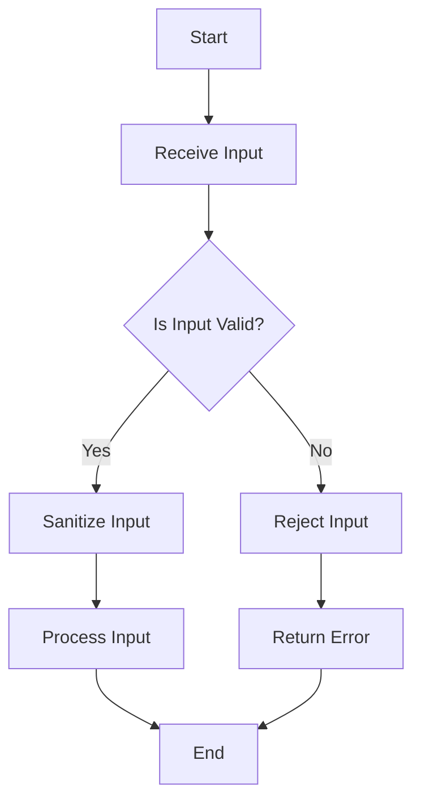

## 15.5 Input Validation and Sanitization

In the realm of software security, input validation and sanitization are crucial practices for preventing injection attacks, which are among the most common and dangerous vulnerabilities in applications. This section delves into the principles, techniques, and patterns for implementing robust input validation and sanitization in Scala, ensuring your applications are secure and resilient against malicious inputs.

### Understanding Input Validation and Sanitization

**Input Validation** is the process of ensuring that user inputs are correct, safe, and expected before they are processed by the application. It involves checking the data against a set of rules or constraints to determine if it is valid.

**Sanitization**, on the other hand, involves cleaning or modifying the input to remove or neutralize any potentially harmful content. This is particularly important when dealing with inputs that will be used in contexts such as SQL queries, HTML content, or command-line arguments.

#### Why Input Validation and Sanitization Matter

Injection attacks, such as SQL injection, cross-site scripting (XSS), and command injection, exploit vulnerabilities in applications that fail to properly validate or sanitize inputs. These attacks can lead to unauthorized data access, data loss, and even complete system compromise.

By implementing effective input validation and sanitization, developers can significantly reduce the risk of these attacks, ensuring that only safe and expected data is processed by the application.

### Principles of Input Validation

1. **Whitelist Over Blacklist**: Always validate inputs against a whitelist of acceptable values rather than trying to filter out known bad inputs. This ensures that only explicitly allowed data is accepted.

2. **Validate as Early as Possible**: Perform validation as soon as data is received, ideally at the point of entry into the system. This minimizes the risk of processing invalid data.

3. **Contextual Validation**: Tailor validation rules to the specific context in which the data will be used. For example, email addresses, phone numbers, and dates each have different validation requirements.

4. **Fail Securely**: If validation fails, handle the error gracefully and securely, providing minimal information to the user to avoid revealing system details.

### Techniques for Input Validation in Scala

Scala offers several tools and libraries that facilitate input validation. Here, we explore some of the most effective techniques and patterns.

#### Using Regular Expressions

Regular expressions are a powerful tool for defining patterns that inputs must match. Scala's `scala.util.matching.Regex` class provides robust support for regex operations.

```scala
import scala.util.matching.Regex

val emailPattern: Regex = "^[\\w.-]+@[\\w.-]+\\.[a-zA-Z]{2,}$".r

def validateEmail(email: String): Boolean = {
  emailPattern.matches(email)
}

// Example usage
val email = "example@example.com"
println(s"Is valid email: ${validateEmail(email)}") // Output: Is valid email: true
```

#### Leveraging Scala's Type System

Scala's strong type system can be used to enforce validation rules at compile time, reducing the risk of runtime errors.

```scala
case class Email private (value: String)

object Email {
  def fromString(email: String): Option[Email] = {
    val emailPattern = "^[\\w.-]+@[\\w.-]+\\.[a-zA-Z]{2,}$".r
    if (emailPattern.matches(email)) Some(new Email(email)) else None
  }
}

// Example usage
Email.fromString("example@example.com") match {
  case Some(email) => println(s"Valid email: $email")
  case None => println("Invalid email format")
}
```

#### Using Validation Libraries

Libraries such as `Cats` and `Scalaz` provide functional validation capabilities, allowing for more expressive and composable validation logic.

```scala
import cats.data.Validated
import cats.implicits._

def validateNonEmpty(input: String): Validated[String, String] =
  if (input.nonEmpty) input.valid else "Input cannot be empty".invalid

def validateEmailFormat(email: String): Validated[String, String] = {
  val emailPattern = "^[\\w.-]+@[\\w.-]+\\.[a-zA-Z]{2,}$".r
  if (emailPattern.matches(email)) email.valid else "Invalid email format".invalid
}

val emailValidation = validateNonEmpty("example@example.com")
  .combine(validateEmailFormat("example@example.com"))

emailValidation match {
  case Validated.Valid(email) => println(s"Valid email: $email")
  case Validated.Invalid(errors) => println(s"Validation errors: $errors")
}
```

### Principles of Input Sanitization

1. **Neutralize Harmful Content**: Modify inputs to remove or escape characters that could be used in injection attacks, such as `<`, `>`, `'`, and `"`.

2. **Use Built-in Libraries**: Leverage existing libraries and frameworks that provide sanitization functions, as they are often more reliable and secure than custom implementations.

3. **Contextual Sanitization**: Apply sanitization appropriate to the context, such as escaping HTML for web pages or parameterizing SQL queries.

### Techniques for Input Sanitization in Scala

Scala provides several methods and libraries for sanitizing inputs, ensuring that they are safe for use in various contexts.

#### HTML Escaping

When displaying user input on a web page, it's essential to escape HTML characters to prevent XSS attacks.

```scala
import org.apache.commons.text.StringEscapeUtils

def sanitizeHtml(input: String): String = {
  StringEscapeUtils.escapeHtml4(input)
}

// Example usage
val userInput = "<script>alert('XSS')</script>"
println(s"Sanitized HTML: ${sanitizeHtml(userInput)}")
```

#### SQL Parameterization

To prevent SQL injection, always use parameterized queries instead of concatenating user inputs into SQL strings.

```scala
import java.sql.{Connection, PreparedStatement}

def getUserById(conn: Connection, userId: Int): Option[String] = {
  val query = "SELECT username FROM users WHERE id = ?"
  val statement: PreparedStatement = conn.prepareStatement(query)
  statement.setInt(1, userId)
  val resultSet = statement.executeQuery()

  if (resultSet.next()) Some(resultSet.getString("username")) else None
}

// Example usage
// Assume `conn` is an established JDBC connection
val userId = 1
val username = getUserById(conn, userId)
println(s"Username: ${username.getOrElse("User not found")}")
```

#### Command-Line Argument Sanitization

When executing system commands, ensure that inputs are properly sanitized or validated to prevent command injection.

```scala
import scala.sys.process._

def executeCommand(command: String, args: Seq[String]): String = {
  val sanitizedArgs = args.map(arg => arg.replaceAll("[^a-zA-Z0-9]", ""))
  val fullCommand = command +: sanitizedArgs
  fullCommand.mkString(" ").!!
}

// Example usage
val output = executeCommand("ls", Seq("-l", "/usr/local/bin"))
println(s"Command output: $output")
```

### Design Patterns for Input Validation and Sanitization

Implementing input validation and sanitization effectively often involves using specific design patterns that enhance code maintainability and security.

#### The Builder Pattern

The Builder Pattern can be used to construct complex validation logic, allowing for a flexible and modular approach to input validation.

```scala
case class UserInput(name: String, email: String, age: Int)

class UserInputBuilder {
  private var name: Option[String] = None
  private var email: Option[String] = None
  private var age: Option[Int] = None

  def setName(name: String): UserInputBuilder = {
    this.name = Some(name)
    this
  }

  def setEmail(email: String): UserInputBuilder = {
    this.email = Some(email)
    this
  }

  def setAge(age: Int): UserInputBuilder = {
    this.age = Some(age)
    this
  }

  def build(): Either[String, UserInput] = {
    for {
      n <- name.toRight("Name is required")
      e <- email.toRight("Email is required")
      a <- age.toRight("Age is required")
    } yield UserInput(n, e, a)
  }
}

// Example usage
val userInput = new UserInputBuilder()
  .setName("John Doe")
  .setEmail("john.doe@example.com")
  .setAge(30)
  .build()

userInput match {
  case Right(user) => println(s"User input: $user")
  case Left(error) => println(s"Error: $error")
}
```

#### The Strategy Pattern

The Strategy Pattern allows for defining a family of algorithms for validation and sanitization, encapsulating each one and making them interchangeable.

```scala
trait ValidationStrategy {
  def validate(input: String): Boolean
}

class EmailValidation extends ValidationStrategy {
  override def validate(input: String): Boolean = {
    val emailPattern = "^[\\w.-]+@[\\w.-]+\\.[a-zA-Z]{2,}$".r
    emailPattern.matches(input)
  }
}

class NonEmptyValidation extends ValidationStrategy {
  override def validate(input: String): Boolean = input.nonEmpty
}

class Validator(strategy: ValidationStrategy) {
  def isValid(input: String): Boolean = strategy.validate(input)
}

// Example usage
val emailValidator = new Validator(new EmailValidation)
println(s"Is valid email: ${emailValidator.isValid("example@example.com")}")

val nonEmptyValidator = new Validator(new NonEmptyValidation)
println(s"Is non-empty: ${nonEmptyValidator.isValid("Hello")}")
```

### Visualizing the Input Validation and Sanitization Process

To better understand the flow of input validation and sanitization, let's visualize the process using a flowchart.



**Description:** This flowchart represents the typical process of input validation and sanitization. Inputs are first validated against predefined rules. If valid, they are sanitized before being processed. Invalid inputs are rejected, and an error is returned.

### Best Practices for Input Validation and Sanitization

1. **Centralize Validation Logic**: Keep validation logic centralized to ensure consistency and ease of maintenance.

2. **Use Frameworks and Libraries**: Leverage existing libraries and frameworks that provide robust validation and sanitization functions.

3. **Regularly Update Validation Rules**: Keep validation rules up-to-date to adapt to new security threats and changes in business requirements.

4. **Test Thoroughly**: Implement comprehensive testing strategies to ensure validation and sanitization logic is effective and secure.

5. **Educate and Train Developers**: Ensure that all team members understand the importance of input validation and sanitization and are familiar with best practices.

### Try It Yourself

To solidify your understanding of input validation and sanitization in Scala, try modifying the code examples provided. Experiment with different validation rules, create custom sanitization functions, and explore the use of different design patterns to enhance your solutions.

### Knowledge Check

- What is the difference between input validation and sanitization?
- Why is it important to validate inputs as early as possible?
- How can Scala's type system be leveraged for input validation?
- What are some common techniques for sanitizing HTML inputs?
- How does parameterized SQL queries help prevent injection attacks?

### Conclusion

Input validation and sanitization are critical components of secure software development. By understanding and implementing these practices effectively, you can protect your applications from a wide range of injection attacks and ensure that they remain secure and reliable.

Remember, this is just the beginning. As you progress, you'll build more complex and secure applications. Keep experimenting, stay curious, and enjoy the journey!

## Quiz Time!



### What is the primary goal of input validation?

- [x] To ensure that user inputs are correct, safe, and expected before processing
- [ ] To modify inputs to remove harmful content
- [ ] To execute system commands safely
- [ ] To concatenate user inputs into SQL strings

> **Explanation:** Input validation ensures that user inputs are correct, safe, and expected before they are processed by the application.

### Which pattern is recommended for input validation: whitelist or blacklist?

- [x] Whitelist
- [ ] Blacklist
- [ ] Both
- [ ] Neither

> **Explanation:** Whitelisting is recommended as it ensures that only explicitly allowed data is accepted, reducing the risk of accepting malicious inputs.

### What is the purpose of input sanitization?

- [x] To clean or modify input to remove or neutralize harmful content
- [ ] To validate inputs against a set of rules
- [ ] To execute SQL queries
- [ ] To perform command-line operations

> **Explanation:** Input sanitization involves cleaning or modifying input to remove or neutralize any potentially harmful content.

### How does parameterized SQL queries prevent SQL injection?

- [x] By separating SQL logic from user inputs
- [ ] By concatenating user inputs into SQL strings
- [ ] By executing SQL commands directly
- [ ] By using regular expressions

> **Explanation:** Parameterized SQL queries prevent SQL injection by separating SQL logic from user inputs, ensuring that inputs are treated as data rather than executable code.

### Which Scala library provides functional validation capabilities?

- [x] Cats
- [ ] Akka
- [ ] Play Framework
- [ ] Spark

> **Explanation:** The Cats library provides functional validation capabilities, allowing for expressive and composable validation logic.

### What is the role of the Builder Pattern in input validation?

- [x] To construct complex validation logic in a flexible and modular way
- [ ] To execute system commands
- [ ] To sanitize HTML inputs
- [ ] To perform SQL queries

> **Explanation:** The Builder Pattern can be used to construct complex validation logic, allowing for a flexible and modular approach to input validation.

### What is the benefit of using Scala's type system for validation?

- [x] It enforces validation rules at compile time
- [ ] It allows for dynamic typing
- [ ] It simplifies SQL queries
- [ ] It enables command execution

> **Explanation:** Scala's strong type system can enforce validation rules at compile time, reducing the risk of runtime errors.

### What is a common technique for sanitizing HTML inputs?

- [x] Escaping HTML characters
- [ ] Concatenating strings
- [ ] Using SQL queries
- [ ] Executing shell commands

> **Explanation:** Escaping HTML characters is a common technique for sanitizing HTML inputs to prevent XSS attacks.

### What is the primary purpose of the Strategy Pattern in input validation?

- [x] To define a family of algorithms for validation and sanitization
- [ ] To execute SQL queries
- [ ] To perform command-line operations
- [ ] To concatenate strings

> **Explanation:** The Strategy Pattern allows for defining a family of algorithms for validation and sanitization, encapsulating each one and making them interchangeable.

### True or False: Input validation should be performed as late as possible in the application flow.

- [ ] True
- [x] False

> **Explanation:** Input validation should be performed as early as possible to minimize the risk of processing invalid data.


