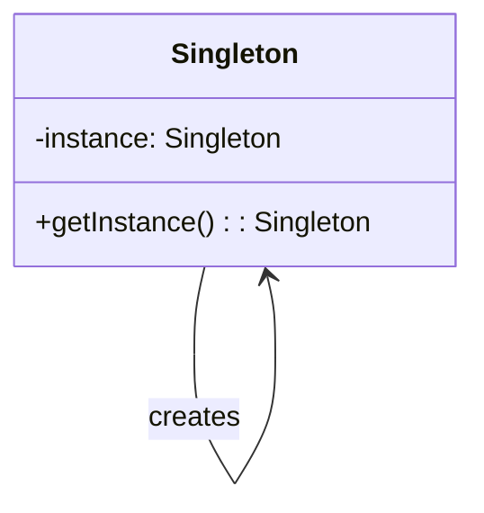
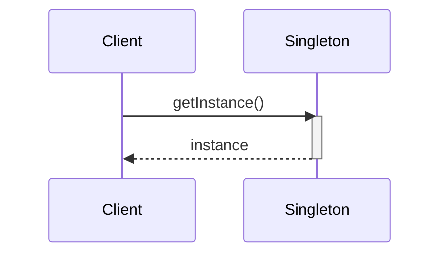
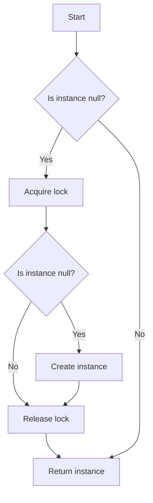

## 15.6 Implementing Secure Singleton

In this section, we delve into the intricacies of implementing the Secure Singleton design pattern in Scala, with a particular focus on ensuring thread safety. The Singleton pattern is a well-known creational pattern that restricts the instantiation of a class to a single object. This pattern is particularly useful when exactly one object is needed to coordinate actions across the system.

### Design Pattern Name

**Secure Singleton**

### Category

Creational Design Pattern

### Intent

The intent of the Singleton pattern is to ensure that a class has only one instance and to provide a global point of access to it. When implementing a Secure Singleton, the focus is on ensuring that the Singleton instance is thread-safe, meaning that it can be safely accessed by multiple threads simultaneously without causing any inconsistent state or data corruption.

### Diagrams

To better understand the Secure Singleton pattern, let's visualize its structure and workflow using a class diagram and a sequence diagram.

#### Class Diagram



*Description*: The class diagram illustrates the Singleton class with a private static instance and a public method to access this instance.

#### Sequence Diagram



*Description*: The sequence diagram shows the interaction between a client and the Singleton class, where the client requests the Singleton instance.

### Key Participants

- **Singleton Class**: The class that is responsible for creating and managing its own unique instance.
- **Client**: The entity that accesses the Singleton instance.

### Applicability

Use the Secure Singleton pattern when:

- There must be exactly one instance of a class, and it must be accessible to clients from a well-known access point.
- The sole instance should be extensible by subclassing, and clients should be able to use an extended instance without modifying their code.
- Thread safety is a concern, and you need to ensure that the Singleton instance can be accessed safely by multiple threads.

### Sample Code Snippet

Let's explore how to implement a Secure Singleton in Scala, ensuring thread safety.

```scala
object SecureSingleton {
  // Private instance of the Singleton
  @volatile private var instance: SecureSingleton = _

  // Method to get the Singleton instance
  def getInstance: SecureSingleton = {
    if (instance == null) {
      synchronized {
        if (instance == null) {
          instance = new SecureSingleton()
        }
      }
    }
    instance
  }
}

class SecureSingleton private() {
  // Singleton class logic here
}
```

*Explanation*:
- The `@volatile` keyword ensures that multiple threads handle the `instance` variable correctly when it is being initialized to the Singleton instance.
- The `synchronized` block ensures that only one thread can execute the instance creation code at a time, preventing multiple instances from being created.

### Design Considerations

When implementing a Secure Singleton in Scala, consider the following:

- **Thread Safety**: Use the `@volatile` keyword and `synchronized` blocks to ensure that the Singleton instance is thread-safe.
- **Lazy Initialization**: The Singleton instance is created only when it is needed, which can save resources if the instance is never requested.
- **Performance**: The use of `synchronized` can introduce a performance overhead. Consider using other concurrency utilities if performance is a critical concern.
- **Scala Specific Features**: Scala's `object` keyword provides a simple way to create a Singleton without explicitly handling thread safety, as the Scala compiler ensures that the object is initialized in a thread-safe manner.

### Differences and Similarities

The Secure Singleton pattern is often confused with other creational patterns such as Factory or Builder. Here are some distinctions:

- **Singleton vs. Factory**: The Singleton pattern ensures a single instance, while the Factory pattern is used to create instances of other classes.
- **Singleton vs. Builder**: The Builder pattern is used to construct a complex object step by step, whereas the Singleton pattern is about ensuring a single instance.

### Advanced Implementation Techniques

#### Double-Checked Locking

Double-checked locking is a technique used to reduce the overhead of acquiring a lock by first checking the locking criterion without actually acquiring the lock. Only if the check indicates that locking is required does the actual lock proceed.

```scala
object DoubleCheckedSingleton {
  @volatile private var instance: DoubleCheckedSingleton = _

  def getInstance: DoubleCheckedSingleton = {
    if (instance == null) {
      synchronized {
        if (instance == null) {
          instance = new DoubleCheckedSingleton()
        }
      }
    }
    instance
  }
}

class DoubleCheckedSingleton private() {
  // Singleton class logic here
}
```

*Explanation*: The `if` checks both before and after the `synchronized` block ensure that the lock is only acquired when necessary, improving performance.

#### Initialization-on-Demand Holder Idiom

This idiom leverages the class loader's mechanism to ensure thread safety without explicit synchronization.

```scala
object HolderSingleton {
  def getInstance: HolderSingleton = Holder.instance

  private object Holder {
    val instance: HolderSingleton = new HolderSingleton()
  }
}

class HolderSingleton private() {
  // Singleton class logic here
}
```

*Explanation*: The `Holder` object is not loaded until the `getInstance` method is called, ensuring lazy initialization and thread safety.

### Try It Yourself

To deepen your understanding, try modifying the code examples:

- **Experiment with Removing Volatile**: Remove the `@volatile` keyword and observe how it affects thread safety.
- **Implement a Non-Lazy Singleton**: Modify the code to create the Singleton instance eagerly and compare the performance.
- **Extend the Singleton**: Create a subclass of the Singleton and ensure that the subclass is also a Singleton.

### Visualizing Thread Safety

Understanding thread safety in Singleton implementation can be complex. Let's visualize the process using a flowchart.



*Description*: This flowchart represents the decision-making process in the double-checked locking mechanism, ensuring that the Singleton instance is created safely.

### References and Links

- [Scala Documentation](https://docs.scala-lang.org/)
- [Java Concurrency in Practice](https://jcip.net/)
- [Effective Java by Joshua Bloch](https://www.oreilly.com/library/view/effective-java/9780134686097/)

### Knowledge Check

- What is the purpose of the `@volatile` keyword in the Singleton pattern?
- How does the `synchronized` block ensure thread safety?
- What are the advantages of using the Initialization-on-Demand Holder Idiom?

### Embrace the Journey

Remember, mastering design patterns like the Secure Singleton is a journey. As you continue to explore and experiment with different patterns, you'll gain a deeper understanding of how to apply them effectively in your projects. Keep experimenting, stay curious, and enjoy the journey!

## Quiz Time!



### What is the primary purpose of the Singleton pattern?

- [x] To ensure a class has only one instance
- [ ] To create multiple instances of a class
- [ ] To provide a factory for creating objects
- [ ] To build complex objects step by step

> **Explanation:** The Singleton pattern ensures that a class has only one instance and provides a global point of access to it.

### How does the `@volatile` keyword contribute to thread safety in a Singleton?

- [x] It ensures visibility of changes to variables across threads
- [ ] It locks the variable for exclusive access
- [ ] It prevents the variable from being changed
- [ ] It initializes the variable eagerly

> **Explanation:** The `@volatile` keyword ensures that changes to a variable are visible to all threads, which is crucial for thread safety.

### What is the main advantage of using the Initialization-on-Demand Holder Idiom?

- [x] It ensures lazy initialization and thread safety without synchronization
- [ ] It eagerly initializes the Singleton instance
- [ ] It requires explicit locking mechanisms
- [ ] It uses the `synchronized` keyword for thread safety

> **Explanation:** The Initialization-on-Demand Holder Idiom leverages the class loader mechanism to ensure lazy initialization and thread safety without explicit synchronization.

### What is a potential drawback of using `synchronized` in Singleton implementation?

- [x] It can introduce performance overhead
- [ ] It prevents lazy initialization
- [ ] It makes the Singleton instance mutable
- [ ] It requires the use of `@volatile`

> **Explanation:** Using `synchronized` can introduce performance overhead due to the cost of acquiring and releasing locks.

### Which of the following is NOT a characteristic of the Singleton pattern?

- [ ] Restricts instantiation of a class to one object
- [ ] Provides a global point of access to the instance
- [x] Allows multiple instances of a class
- [ ] Ensures a single instance is created

> **Explanation:** The Singleton pattern restricts instantiation to one object, not multiple instances.

### How does double-checked locking improve Singleton performance?

- [x] By reducing the overhead of acquiring a lock
- [ ] By using eager initialization
- [ ] By avoiding the use of `@volatile`
- [ ] By creating multiple instances

> **Explanation:** Double-checked locking reduces the overhead of acquiring a lock by checking the locking criterion before acquiring the lock.

### What is the role of the `synchronized` block in the Secure Singleton pattern?

- [x] To ensure that only one thread can execute the instance creation code at a time
- [ ] To eagerly initialize the Singleton instance
- [ ] To make the Singleton instance mutable
- [ ] To remove the need for `@volatile`

> **Explanation:** The `synchronized` block ensures that only one thread can execute the instance creation code at a time, preventing multiple instances from being created.

### Which Scala feature simplifies Singleton implementation without explicit thread safety handling?

- [x] The `object` keyword
- [ ] The `class` keyword
- [ ] The `trait` keyword
- [ ] The `synchronized` keyword

> **Explanation:** Scala's `object` keyword provides a simple way to create a Singleton without explicitly handling thread safety, as the Scala compiler ensures that the object is initialized in a thread-safe manner.

### True or False: The Singleton pattern is only applicable in multi-threaded environments.

- [ ] True
- [x] False

> **Explanation:** The Singleton pattern is applicable in both single-threaded and multi-threaded environments. It ensures a single instance regardless of the threading model.

### What is the primary benefit of using the `@volatile` keyword in a multi-threaded Singleton pattern?

- [x] It ensures that changes to the Singleton instance are visible to all threads
- [ ] It prevents the Singleton instance from being changed
- [ ] It initializes the Singleton instance eagerly
- [ ] It locks the Singleton instance for exclusive access

> **Explanation:** The `@volatile` keyword ensures that changes to the Singleton instance are visible to all threads, which is crucial for maintaining a consistent state in a multi-threaded environment.


