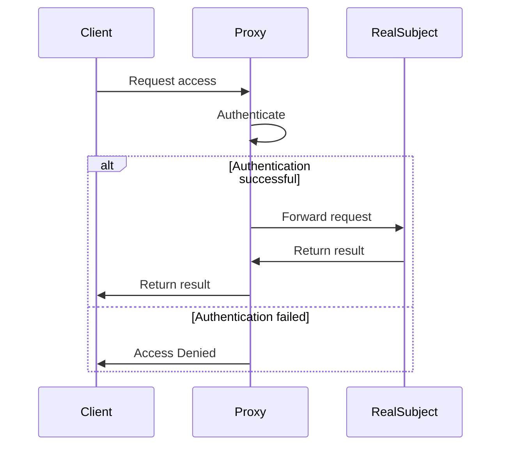

## 15.7 Secure Proxy Pattern

In the realm of software design, ensuring secure access to resources is paramount. The Secure Proxy Pattern is a powerful tool in this regard, providing a mechanism to control and monitor access to objects. This pattern is particularly useful in scenarios where direct access to an object is either too costly or needs to be controlled for security reasons. In this section, we'll delve into the Secure Proxy Pattern, its implementation in Scala, and how it can be leveraged to enhance security in your applications.

### Intent

The primary intent of the Secure Proxy Pattern is to act as an intermediary for another object to control access to it. This pattern can be used to add an additional layer of security, logging, or access control, ensuring that only authorized users can perform certain actions.

### Key Participants

1. **Subject**: Defines the common interface for RealSubject and Proxy so that a Proxy can be used anywhere a RealSubject is expected.
2. **RealSubject**: The actual object that the proxy represents.
3. **Proxy**: Maintains a reference to the RealSubject and provides an interface identical to the Subject. It controls access to the RealSubject and may be responsible for creating and deleting it.

### Applicability

Use the Secure Proxy Pattern when:

- You need to control access to an object.
- You want to add additional functionality, such as logging or access control, without changing the original object's code.
- You want to defer the cost of creating an object until it is needed.

### Sample Code Snippet

Let's explore how the Secure Proxy Pattern can be implemented in Scala. We'll create a simple example where a proxy controls access to a secure document.

```scala
// Define the Subject trait
trait Document {
  def display(): Unit
}

// Implement the RealSubject class
class SecureDocument extends Document {
  override def display(): Unit = {
    println("Displaying the secure document.")
  }
}

// Implement the Proxy class
class DocumentProxy(user: String, password: String) extends Document {
  private val secureDocument = new SecureDocument()

  private def authenticate(): Boolean = {
    // Simulate authentication logic
    user == "admin" && password == "admin123"
  }

  override def display(): Unit = {
    if (authenticate()) {
      secureDocument.display()
    } else {
      println("Access Denied: Invalid credentials.")
    }
  }
}

// Usage
object SecureProxyExample extends App {
  val documentProxy = new DocumentProxy("admin", "admin123")
  documentProxy.display() // Should display the document

  val invalidProxy = new DocumentProxy("user", "wrongpassword")
  invalidProxy.display() // Should deny access
}
```

In this example, the `DocumentProxy` class acts as a proxy for the `SecureDocument`. It controls access by requiring authentication before allowing the `display` method to be called on the `SecureDocument`.

### Design Considerations

When implementing the Secure Proxy Pattern, consider the following:

- **Authentication and Authorization**: Ensure that the proxy performs robust authentication and authorization checks to prevent unauthorized access.
- **Performance Overhead**: Be mindful of the performance overhead introduced by the proxy, especially if it involves complex authentication logic.
- **Scalability**: Ensure that the proxy can handle multiple concurrent requests efficiently.

### Differences and Similarities

The Secure Proxy Pattern is often confused with other proxy patterns such as the Virtual Proxy or Remote Proxy. The key distinction lies in its focus on security and access control. While a Virtual Proxy might defer object creation for performance reasons, a Secure Proxy primarily aims to enforce security policies.

### Visualizing the Secure Proxy Pattern

To better understand the Secure Proxy Pattern, let's visualize the interaction between the components using a sequence diagram.



This diagram illustrates the flow of a request from the client to the proxy, and then to the real subject if authentication is successful.

### Try It Yourself

To deepen your understanding, try modifying the code example:

- Implement a logging mechanism in the proxy to record each access attempt.
- Enhance the authentication logic to include role-based access control.
- Experiment with different authentication methods, such as token-based authentication.

### Knowledge Check

- What are the key responsibilities of a proxy in the Secure Proxy Pattern?
- How does the Secure Proxy Pattern differ from other proxy patterns?
- What are some potential drawbacks of using the Secure Proxy Pattern?

### Embrace the Journey

Remember, mastering design patterns is a journey. As you continue to explore the Secure Proxy Pattern, consider how it can be applied to real-world scenarios in your projects. Keep experimenting, stay curious, and enjoy the journey!

## Quiz Time!



### What is the primary intent of the Secure Proxy Pattern?

- [x] To control and monitor access to objects.
- [ ] To enhance the performance of object creation.
- [ ] To simplify the interface of complex systems.
- [ ] To facilitate communication between remote objects.

> **Explanation:** The Secure Proxy Pattern is primarily used to control and monitor access to objects, ensuring security and access control.

### Which component in the Secure Proxy Pattern is responsible for the actual implementation of the functionality?

- [ ] Proxy
- [x] RealSubject
- [ ] Subject
- [ ] Client

> **Explanation:** The RealSubject is the component responsible for the actual implementation of the functionality in the Secure Proxy Pattern.

### In the provided code example, what is the purpose of the `authenticate` method in the `DocumentProxy` class?

- [x] To verify the user's credentials before granting access.
- [ ] To display the secure document.
- [ ] To log access attempts.
- [ ] To create the SecureDocument instance.

> **Explanation:** The `authenticate` method in the `DocumentProxy` class verifies the user's credentials before granting access to the secure document.

### What is a potential drawback of using the Secure Proxy Pattern?

- [x] Performance overhead due to authentication checks.
- [ ] Increased complexity in the RealSubject.
- [ ] Lack of security in the proxy.
- [ ] Difficulty in implementing the Subject interface.

> **Explanation:** A potential drawback of using the Secure Proxy Pattern is the performance overhead introduced by authentication checks.

### How does the Secure Proxy Pattern differ from the Virtual Proxy Pattern?

- [x] The Secure Proxy Pattern focuses on security and access control, while the Virtual Proxy Pattern focuses on deferring object creation.
- [ ] The Secure Proxy Pattern is used for remote communication, while the Virtual Proxy Pattern is not.
- [ ] The Secure Proxy Pattern simplifies interfaces, while the Virtual Proxy Pattern does not.
- [ ] The Secure Proxy Pattern is used for logging, while the Virtual Proxy Pattern is not.

> **Explanation:** The Secure Proxy Pattern focuses on security and access control, while the Virtual Proxy Pattern focuses on deferring object creation for performance reasons.

### Which of the following is NOT a key participant in the Secure Proxy Pattern?

- [ ] Subject
- [x] Client
- [ ] Proxy
- [ ] RealSubject

> **Explanation:** The Client is not a key participant in the Secure Proxy Pattern; the key participants are the Subject, Proxy, and RealSubject.

### What is the role of the Proxy in the Secure Proxy Pattern?

- [x] To control access to the RealSubject and perform authentication.
- [ ] To implement the actual functionality of the system.
- [ ] To simplify the interface of the RealSubject.
- [ ] To log all access attempts to the RealSubject.

> **Explanation:** The Proxy controls access to the RealSubject and performs authentication checks to ensure security.

### In the sequence diagram, what happens if authentication fails?

- [x] The Proxy returns "Access Denied" to the Client.
- [ ] The Proxy forwards the request to the RealSubject.
- [ ] The Proxy logs the access attempt and retries authentication.
- [ ] The Proxy creates a new instance of the RealSubject.

> **Explanation:** If authentication fails, the Proxy returns "Access Denied" to the Client, preventing access to the RealSubject.

### What is a common use case for the Secure Proxy Pattern?

- [x] Implementing access control and logging for secure resources.
- [ ] Deferring the creation of expensive objects.
- [ ] Simplifying complex system interfaces.
- [ ] Facilitating communication between distributed systems.

> **Explanation:** A common use case for the Secure Proxy Pattern is implementing access control and logging for secure resources.

### True or False: The Secure Proxy Pattern can be used to add logging functionality without modifying the RealSubject.

- [x] True
- [ ] False

> **Explanation:** True. The Secure Proxy Pattern can be used to add logging functionality without modifying the RealSubject by implementing logging in the Proxy.



By understanding and applying the Secure Proxy Pattern, you can enhance the security and robustness of your Scala applications. Keep exploring and experimenting with different patterns to find the best solutions for your projects.
