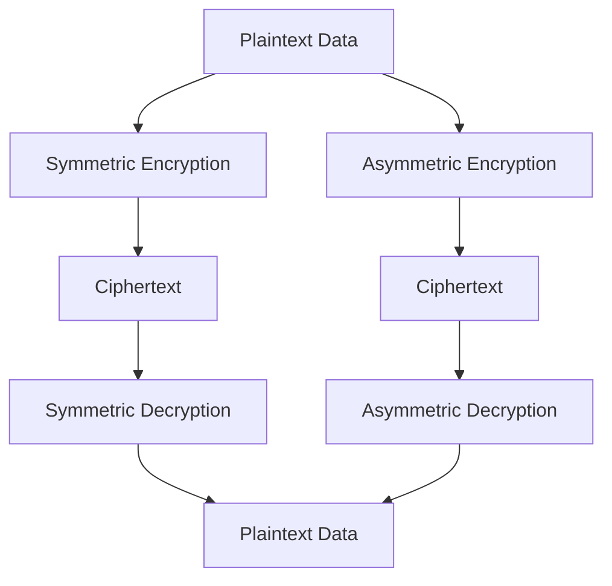

## 15.8 Handling Sensitive Data

Handling sensitive data is a critical aspect of software development, especially in today's world where data breaches and cyber threats are prevalent. In this section, we will explore various strategies and best practices for encrypting and safeguarding sensitive information in Scala applications. We will delve into encryption techniques, key management, secure data storage, and transmission, as well as provide practical code examples to illustrate these concepts.

### Introduction to Data Sensitivity

Sensitive data refers to any information that must be protected from unauthorized access to safeguard the privacy or security of individuals or organizations. This includes personal data (like social security numbers, credit card information), business secrets, and other confidential information.

#### Why Protect Sensitive Data?

1. **Legal Compliance**: Many jurisdictions have laws that mandate the protection of personal data, such as GDPR in Europe and HIPAA in the United States.
2. **Reputation Management**: Data breaches can severely damage an organization's reputation.
3. **Financial Protection**: Preventing unauthorized access can save organizations from financial losses due to fraud or penalties.

### Encryption Basics

Encryption is the process of converting plaintext into ciphertext using an algorithm and an encryption key. Only those with the correct decryption key can convert the ciphertext back into readable plaintext.

#### Types of Encryption

- **Symmetric Encryption**: Uses the same key for both encryption and decryption. It's fast and suitable for encrypting large amounts of data.
- **Asymmetric Encryption**: Uses a pair of keys (public and private). It's more secure for transmitting data but slower than symmetric encryption.

### Implementing Encryption in Scala

Scala, being a JVM language, can leverage Java's extensive cryptography libraries. Let's explore how to implement both symmetric and asymmetric encryption in Scala.

#### Symmetric Encryption with AES

The Advanced Encryption Standard (AES) is a widely used symmetric encryption algorithm. Here's how you can implement AES encryption in Scala:

```scala
import javax.crypto.Cipher
import javax.crypto.KeyGenerator
import javax.crypto.SecretKey
import javax.crypto.spec.SecretKeySpec
import java.util.Base64

object SymmetricEncryption {

  def generateKey(): SecretKey = {
    val keyGen = KeyGenerator.getInstance("AES")
    keyGen.init(128) // for AES-128
    keyGen.generateKey()
  }

  def encrypt(data: String, secretKey: SecretKey): String = {
    val cipher = Cipher.getInstance("AES")
    cipher.init(Cipher.ENCRYPT_MODE, secretKey)
    val encryptedData = cipher.doFinal(data.getBytes("UTF-8"))
    Base64.getEncoder.encodeToString(encryptedData)
  }

  def decrypt(encryptedData: String, secretKey: SecretKey): String = {
    val cipher = Cipher.getInstance("AES")
    cipher.init(Cipher.DECRYPT_MODE, secretKey)
    val decodedData = Base64.getDecoder.decode(encryptedData)
    new String(cipher.doFinal(decodedData), "UTF-8")
  }

  def main(args: Array[String]): Unit = {
    val secretKey = generateKey()
    val originalData = "Sensitive Information"
    val encryptedData = encrypt(originalData, secretKey)
    val decryptedData = decrypt(encryptedData, secretKey)

    println(s"Original Data: $originalData")
    println(s"Encrypted Data: $encryptedData")
    println(s"Decrypted Data: $decryptedData")
  }
}
```

**Key Points:**
- **Key Generation**: We use a `KeyGenerator` to create a new AES key.
- **Encryption and Decryption**: The `Cipher` class handles both processes, using the same key.

#### Asymmetric Encryption with RSA

RSA is a popular asymmetric encryption algorithm. Here's how you can implement RSA encryption in Scala:

```scala
import java.security.{KeyPair, KeyPairGenerator, PrivateKey, PublicKey}
import javax.crypto.Cipher
import java.util.Base64

object AsymmetricEncryption {

  def generateKeyPair(): KeyPair = {
    val keyGen = KeyPairGenerator.getInstance("RSA")
    keyGen.initialize(2048)
    keyGen.generateKeyPair()
  }

  def encrypt(data: String, publicKey: PublicKey): String = {
    val cipher = Cipher.getInstance("RSA")
    cipher.init(Cipher.ENCRYPT_MODE, publicKey)
    val encryptedData = cipher.doFinal(data.getBytes("UTF-8"))
    Base64.getEncoder.encodeToString(encryptedData)
  }

  def decrypt(encryptedData: String, privateKey: PrivateKey): String = {
    val cipher = Cipher.getInstance("RSA")
    cipher.init(Cipher.DECRYPT_MODE, privateKey)
    val decodedData = Base64.getDecoder.decode(encryptedData)
    new String(cipher.doFinal(decodedData), "UTF-8")
  }

  def main(args: Array[String]): Unit = {
    val keyPair = generateKeyPair()
    val originalData = "Sensitive Information"
    val encryptedData = encrypt(originalData, keyPair.getPublic)
    val decryptedData = decrypt(encryptedData, keyPair.getPrivate)

    println(s"Original Data: $originalData")
    println(s"Encrypted Data: $encryptedData")
    println(s"Decrypted Data: $decryptedData")
  }
}
```

**Key Points:**
- **Key Pair Generation**: We generate a pair of keys (public and private) using `KeyPairGenerator`.
- **Encryption and Decryption**: The `Cipher` class is used with the appropriate key for each process.

### Key Management

Effective key management is crucial for ensuring the security of encrypted data. Here are some best practices:

1. **Key Storage**: Store keys securely, separate from the encrypted data. Consider using a dedicated key management system (KMS).
2. **Key Rotation**: Regularly rotate keys to minimize the risk of compromise.
3. **Access Control**: Restrict access to keys to only those who absolutely need it.

### Secure Data Storage

When storing sensitive data, consider the following strategies:

- **Encrypt Data at Rest**: Ensure that data stored in databases or file systems is encrypted.
- **Use Secure Storage Solutions**: Utilize secure storage services that provide built-in encryption, such as AWS S3 with server-side encryption.

### Secure Data Transmission

To protect data in transit, use secure protocols such as HTTPS or TLS. Here's how you can set up a simple HTTPS server in Scala using Akka HTTP:

```scala
import akka.actor.ActorSystem
import akka.http.scaladsl.Http
import akka.http.scaladsl.server.Directives._
import akka.http.scaladsl.server.Route
import akka.http.scaladsl.settings.ServerSettings
import com.typesafe.config.ConfigFactory

object SecureServer {

  def main(args: Array[String]): Unit = {
    implicit val system: ActorSystem = ActorSystem("secure-server")

    val route: Route = path("secure") {
      get {
        complete("Secure Data Transmission")
      }
    }

    val config = ConfigFactory.load()
    val httpsSettings = ServerSettings(config)

    Http().newServerAt("localhost", 8443)
      .enableHttps(httpsSettings)
      .bind(route)
  }
}
```

**Key Points:**
- **HTTPS Setup**: Use Akka HTTP to set up a server with HTTPS enabled.
- **Secure Configuration**: Ensure that your server is configured to use strong ciphers and protocols.

### Try It Yourself

Experiment with the provided code examples by modifying the encryption algorithms or key sizes. Try integrating these techniques into a sample Scala application to see how they fit into a larger system.

### Visualizing Data Encryption Flow

Below is a diagram illustrating the flow of data encryption and decryption using both symmetric and asymmetric methods.



**Diagram Explanation:**
- **Symmetric Encryption**: Data is encrypted and decrypted using the same key.
- **Asymmetric Encryption**: Data is encrypted with a public key and decrypted with a private key.

### References and Further Reading

- [Java Cryptography Architecture](https://docs.oracle.com/javase/8/docs/technotes/guides/security/crypto/CryptoSpec.html)
- [OWASP Cryptographic Storage Cheat Sheet](https://cheatsheetseries.owasp.org/cheatsheets/Cryptographic_Storage_Cheat_Sheet.html)
- [Akka HTTP Documentation](https://doc.akka.io/docs/akka-http/current/index.html)

### Knowledge Check

1. **What is the difference between symmetric and asymmetric encryption?**
2. **Why is key management important in encryption?**
3. **How can you secure data transmission in a Scala application?**

### Embrace the Journey

Remember, handling sensitive data is a continuous journey of learning and adaptation. As you progress, keep exploring new techniques and tools to enhance data security. Stay curious and vigilant, and enjoy the process of building secure applications!

## Quiz Time!



### What is the primary difference between symmetric and asymmetric encryption?

- [x] Symmetric encryption uses the same key for both encryption and decryption, while asymmetric encryption uses a pair of keys.
- [ ] Symmetric encryption is slower than asymmetric encryption.
- [ ] Asymmetric encryption uses the same key for both encryption and decryption.
- [ ] Symmetric encryption is more secure than asymmetric encryption.

> **Explanation:** Symmetric encryption uses a single key for both encryption and decryption, whereas asymmetric encryption uses a public and a private key pair.

### Why is key management crucial in encryption?

- [x] To ensure that keys are stored securely and rotated regularly.
- [ ] To make encryption faster.
- [ ] To avoid using encryption algorithms.
- [ ] To reduce the size of encrypted data.

> **Explanation:** Key management is crucial to protect keys from unauthorized access and to ensure they are rotated regularly to minimize the risk of compromise.

### Which protocol is recommended for secure data transmission?

- [x] HTTPS
- [ ] HTTP
- [ ] FTP
- [ ] SMTP

> **Explanation:** HTTPS is the recommended protocol for secure data transmission as it uses TLS to encrypt data in transit.

### What is the purpose of encrypting data at rest?

- [x] To protect stored data from unauthorized access.
- [ ] To speed up data retrieval.
- [ ] To reduce storage costs.
- [ ] To simplify data management.

> **Explanation:** Encrypting data at rest protects it from unauthorized access, ensuring that even if storage is compromised, the data remains secure.

### What is a key pair in asymmetric encryption?

- [x] A public key and a private key used for encryption and decryption.
- [ ] Two identical keys used for encryption.
- [ ] A single key used for both encryption and decryption.
- [ ] A set of keys used for hashing.

> **Explanation:** In asymmetric encryption, a key pair consists of a public key for encryption and a private key for decryption.

### How can you ensure secure key storage?

- [x] By using a dedicated key management system.
- [ ] By storing keys in the same location as the data.
- [ ] By using weak encryption algorithms.
- [ ] By sharing keys with all team members.

> **Explanation:** Secure key storage can be ensured by using a dedicated key management system that separates keys from the data they encrypt.

### What is the role of the Cipher class in Java's cryptography?

- [x] To perform encryption and decryption operations.
- [ ] To generate random numbers.
- [ ] To manage key pairs.
- [ ] To store encrypted data.

> **Explanation:** The Cipher class in Java is used to perform encryption and decryption operations.

### Which of the following is a best practice for key rotation?

- [x] Regularly updating keys to minimize the risk of compromise.
- [ ] Never changing keys once they are set.
- [ ] Sharing keys with unauthorized users.
- [ ] Using the same key for all encryption tasks.

> **Explanation:** Regularly updating keys is a best practice to minimize the risk of compromise and ensure data security.

### What is the benefit of using HTTPS over HTTP?

- [x] HTTPS encrypts data in transit, providing security against eavesdropping.
- [ ] HTTPS is faster than HTTP.
- [ ] HTTPS uses less bandwidth than HTTP.
- [ ] HTTPS is easier to implement than HTTP.

> **Explanation:** HTTPS encrypts data in transit, providing security against eavesdropping and ensuring data integrity.

### True or False: Asymmetric encryption is generally faster than symmetric encryption.

- [ ] True
- [x] False

> **Explanation:** Asymmetric encryption is generally slower than symmetric encryption due to the complexity of key pair operations.


