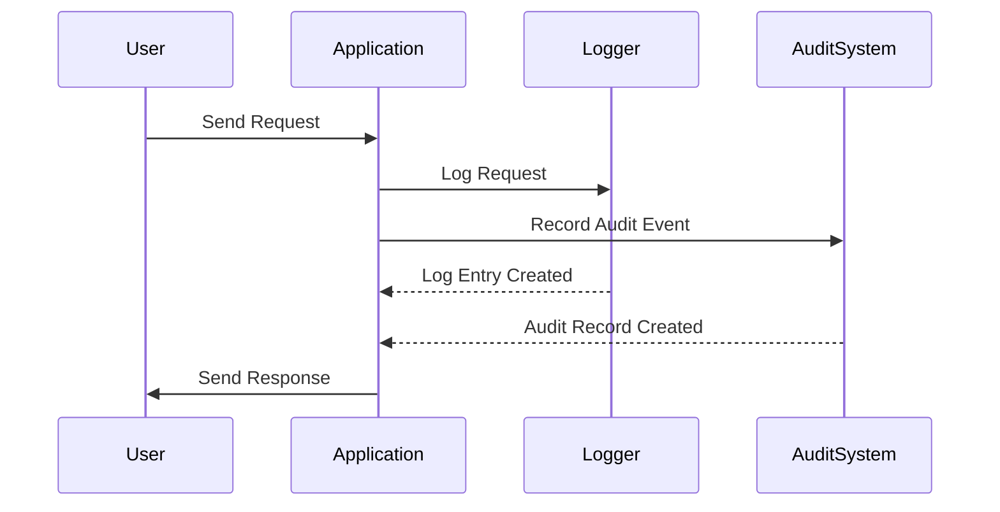

## 15.9 Auditing and Logging

In today's digital landscape, auditing and logging are critical components of software design, especially when it comes to ensuring security compliance. For expert software engineers and architects working with Scala, understanding how to effectively implement these practices can significantly enhance the security and reliability of applications. This section will delve into the concepts, techniques, and best practices for auditing and logging in Scala, providing you with the tools needed to build secure and compliant systems.

### Introduction to Auditing and Logging

Auditing and logging serve as the backbone of security compliance in software systems. They provide a detailed record of system activities, which is essential for detecting security breaches, diagnosing issues, and ensuring accountability.

- **Auditing**: Involves tracking and recording user activities and system events to ensure compliance with security policies and regulations. Auditing helps in verifying that the system is functioning as intended and that users are adhering to security protocols.
- **Logging**: Refers to the process of capturing and storing log messages generated by an application. Logs provide insights into the application's behavior and can be used for debugging, monitoring, and security analysis.

### Importance of Auditing and Logging

1. **Security Compliance**: Many regulations, such as GDPR, HIPAA, and PCI DSS, mandate comprehensive auditing and logging to protect sensitive data and ensure privacy.
2. **Incident Response**: Logs are invaluable during security incidents, helping to identify the root cause and scope of a breach.
3. **System Monitoring**: Continuous logging allows for real-time monitoring of system performance and health.
4. **Forensic Analysis**: Detailed logs enable forensic investigations following security incidents, providing a timeline of events and actions.

### Key Concepts in Auditing and Logging

#### Log Levels

Understanding log levels is crucial for effective logging. Common log levels include:

- **DEBUG**: Detailed information for diagnosing problems.
- **INFO**: General information about application operations.
- **WARN**: Indications of potential issues or unexpected events.
- **ERROR**: Errors that do not halt the application but require attention.
- **FATAL**: Severe errors that may cause the application to terminate.

#### Structured Logging

Structured logging involves capturing logs in a structured format, such as JSON, which makes it easier to parse and analyze logs programmatically.

#### Log Rotation

Log rotation is the process of archiving old log files and creating new ones to prevent log files from consuming excessive disk space.

### Implementing Logging in Scala

Scala offers several libraries and frameworks to facilitate logging. Some popular choices include:

- **Logback**: A flexible logging framework for Java and Scala applications.
- **SLF4J (Simple Logging Facade for Java)**: Provides a simple facade for various logging frameworks.
- **Scala Logging**: A Scala wrapper for SLF4J, offering a more idiomatic Scala interface.

#### Setting Up Logback in Scala

Logback is a popular choice for logging in Scala applications due to its performance and flexibility. Here's how to set it up:

1. **Add Dependencies**: Include Logback and Scala Logging in your `build.sbt` file.

   ```scala
   libraryDependencies ++= Seq(
     "ch.qos.logback" % "logback-classic" % "1.2.10",
     "com.typesafe.scala-logging" %% "scala-logging" % "3.9.4"
   )
   ```

2. **Configure Logback**: Create a `logback.xml` file in the `src/main/resources` directory.

   ```xml
   <configuration>
     <appender name="STDOUT" class="ch.qos.logback.core.ConsoleAppender">
       <encoder>
         <pattern>%d{yyyy-MM-dd HH:mm:ss} %-5level %logger{36} - %msg%n</pattern>
       </encoder>
     </appender>

     <root level="debug">
       <appender-ref ref="STDOUT" />
     </root>
   </configuration>
   ```

3. **Use Scala Logging**: Integrate logging into your Scala code.

   ```scala
   import com.typesafe.scalalogging.LazyLogging

   object MyApp extends LazyLogging {
     def main(args: Array[String]): Unit = {
       logger.info("Application started")
       try {
         // Application logic
       } catch {
         case e: Exception => logger.error("An error occurred", e)
       }
     }
   }
   ```

### Best Practices for Logging

1. **Log at Appropriate Levels**: Use log levels judiciously to avoid cluttering logs with unnecessary information.
2. **Avoid Logging Sensitive Information**: Ensure that logs do not contain sensitive data, such as passwords or personal information.
3. **Use Structured Logging**: Capture logs in a structured format to facilitate automated analysis.
4. **Implement Log Rotation**: Regularly archive and delete old logs to manage disk space effectively.
5. **Monitor Logs**: Use log monitoring tools to detect anomalies and respond to incidents promptly.

### Advanced Logging Techniques

#### Asynchronous Logging

Asynchronous logging improves application performance by offloading log writing to a separate thread. Logback supports asynchronous logging through the `AsyncAppender`.

```xml
<appender name="ASYNC" class="ch.qos.logback.classic.AsyncAppender">
  <appender-ref ref="STDOUT" />
</appender>
```

#### Distributed Logging

In distributed systems, logs from different components need to be centralized for effective monitoring. Tools like ELK Stack (Elasticsearch, Logstash, Kibana) can aggregate and visualize logs from multiple sources.

#### Correlation IDs

Correlation IDs are unique identifiers added to log entries to trace a request across different services in a distributed system.

```scala
import java.util.UUID

object RequestHandler extends LazyLogging {
  def handleRequest(request: Request): Response = {
    val correlationId = UUID.randomUUID().toString
    logger.info(s"Handling request with correlation ID: $correlationId")
    // Process request
  }
}
```

### Auditing in Scala Applications

Auditing involves recording user actions and system events to ensure compliance and accountability. It is crucial for detecting unauthorized access and ensuring that users adhere to security policies.

#### Implementing Auditing

1. **Identify Auditable Events**: Determine which actions and events need to be audited, such as login attempts, data access, and configuration changes.
2. **Use a Centralized Audit Log**: Store audit logs in a centralized location to facilitate analysis and reporting.
3. **Ensure Tamper-Proof Logs**: Protect audit logs from unauthorized modifications to maintain their integrity.

#### Auditing Frameworks

While Scala does not have a dedicated auditing framework, you can leverage existing logging frameworks to implement auditing. Alternatively, consider using third-party tools like Apache Kafka for audit log streaming.

### Security Considerations

1. **Access Control**: Restrict access to logs and audit trails to authorized personnel only.
2. **Encryption**: Encrypt logs containing sensitive information to prevent unauthorized access.
3. **Compliance**: Ensure that your logging and auditing practices comply with relevant regulations and standards.

### Visualizing Logging and Auditing

To better understand the flow of logging and auditing in a distributed system, let's visualize the process using a sequence diagram.



### Try It Yourself

Experiment with the logging setup by modifying the log levels and observing the output. Try implementing asynchronous logging and using correlation IDs to trace requests across different components.

### Knowledge Check

- Explain the difference between auditing and logging.
- Describe how structured logging can benefit your application.
- What are the security considerations when implementing logging and auditing?

### Conclusion

Auditing and logging are essential for maintaining security compliance and ensuring the reliability of Scala applications. By following best practices and leveraging advanced techniques, you can build robust systems that are both secure and efficient.

## Quiz Time!



### What is the primary purpose of auditing in software systems?

- [x] To track and record user activities and system events for compliance
- [ ] To improve application performance
- [ ] To enhance user interface design
- [ ] To manage application memory usage

> **Explanation:** Auditing is primarily used to track and record user activities and system events to ensure compliance with security policies and regulations.

### Which log level is used for detailed information useful for diagnosing problems?

- [ ] INFO
- [x] DEBUG
- [ ] WARN
- [ ] ERROR

> **Explanation:** The DEBUG log level is used for detailed information that is helpful in diagnosing problems.

### What is the benefit of using structured logging?

- [x] It makes logs easier to parse and analyze programmatically
- [ ] It reduces the size of log files
- [ ] It increases the speed of log generation
- [ ] It eliminates the need for log rotation

> **Explanation:** Structured logging captures logs in a structured format, such as JSON, making them easier to parse and analyze programmatically.

### What is the role of correlation IDs in distributed logging?

- [x] To trace a request across different services
- [ ] To encrypt log entries
- [ ] To reduce log file size
- [ ] To improve application performance

> **Explanation:** Correlation IDs are unique identifiers added to log entries to trace a request across different services in a distributed system.

### Which tool is commonly used for aggregating and visualizing logs from multiple sources?

- [x] ELK Stack
- [ ] ScalaTest
- [ ] Play Framework
- [ ] Akka HTTP

> **Explanation:** The ELK Stack (Elasticsearch, Logstash, Kibana) is commonly used for aggregating and visualizing logs from multiple sources.

### Why is it important to avoid logging sensitive information?

- [x] To prevent unauthorized access to sensitive data
- [ ] To reduce the size of log files
- [ ] To improve application performance
- [ ] To comply with all software design patterns

> **Explanation:** Logging sensitive information can lead to unauthorized access to sensitive data, which is a security risk.

### What is a key advantage of asynchronous logging?

- [x] It improves application performance by offloading log writing to a separate thread
- [ ] It encrypts log entries automatically
- [ ] It reduces the need for log rotation
- [ ] It simplifies log configuration

> **Explanation:** Asynchronous logging improves application performance by offloading log writing to a separate thread.

### What is the purpose of log rotation?

- [x] To prevent log files from consuming excessive disk space
- [ ] To encrypt log entries
- [ ] To improve log parsing
- [ ] To enhance log readability

> **Explanation:** Log rotation is the process of archiving old log files and creating new ones to prevent log files from consuming excessive disk space.

### What should be considered when implementing auditing in Scala applications?

- [x] Identifying auditable events and ensuring tamper-proof logs
- [ ] Reducing the size of audit logs
- [ ] Improving application performance
- [ ] Simplifying user interface design

> **Explanation:** When implementing auditing, it's important to identify auditable events and ensure that logs are tamper-proof to maintain their integrity.

### True or False: Logs should be accessible to all users for transparency.

- [ ] True
- [x] False

> **Explanation:** Logs should be restricted to authorized personnel only to prevent unauthorized access to sensitive information.


