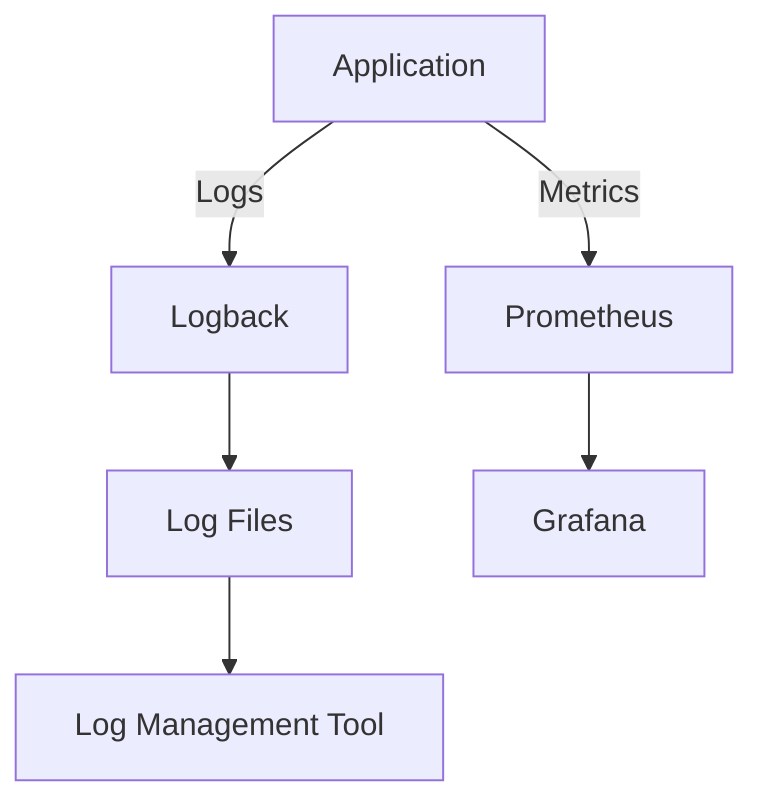

## 16.1 Logging and Monitoring in Functional Applications

In today's fast-paced software development landscape, logging and monitoring are crucial components for maintaining robust and reliable applications. This is especially true for functional applications, where immutability, pure functions, and concurrency are at the forefront. In this section, we will delve into the intricacies of logging and monitoring within the context of functional programming, with a particular focus on Scala.

### Introduction to Logging and Monitoring

Logging and monitoring are essential practices in software development that provide insights into the behavior and performance of applications. Logging involves recording events, errors, and other significant occurrences within an application, while monitoring involves observing and analyzing these logs to ensure the application is functioning correctly.

#### Why Logging and Monitoring Matter

- **Debugging and Troubleshooting**: Logs provide a detailed account of application behavior, making it easier to identify and fix issues.
- **Performance Optimization**: Monitoring helps in identifying bottlenecks and optimizing resource usage.
- **Security and Compliance**: Logs are crucial for auditing and ensuring compliance with security standards.
- **User Experience**: Monitoring ensures that applications meet user expectations in terms of performance and reliability.

### Implementing Structured Logging

Structured logging is a method of logging where log messages are formatted in a structured way, often as key-value pairs. This approach makes it easier to query and analyze logs, especially in distributed systems.

#### Benefits of Structured Logging

- **Enhanced Readability**: Structured logs are easier to read and understand.
- **Improved Searchability**: Key-value pairs allow for more efficient searching and filtering.
- **Better Integration**: Structured logs integrate seamlessly with log management tools.

#### Implementing Structured Logging in Scala

Scala, with its expressive syntax and functional paradigms, provides several libraries for implementing structured logging. Let's explore how to set up structured logging using the popular `Logback` library.

```scala
import org.slf4j.LoggerFactory
import net.logstash.logback.marker.Markers

object StructuredLoggingExample {
  private val logger = LoggerFactory.getLogger(this.getClass)

  def main(args: Array[String]): Unit = {
    val userId = "12345"
    val action = "login"
    logger.info(Markers.append("userId", userId).and(Markers.append("action", action)), "User action logged")
  }
}
```

In this example, we use `Logback` with `SLF4J` to log a structured message. The `Markers` class allows us to append key-value pairs to the log message, making it structured and easily searchable.

#### Try It Yourself

Experiment with adding more key-value pairs to the log message. For example, include the timestamp or the IP address of the user. Observe how these additional fields can enhance the log's usefulness.

### Monitoring Applications with Open-Source Tools

Monitoring is a continuous process of collecting and analyzing data to ensure that applications are running smoothly. Several open-source tools can be integrated with Scala applications to provide comprehensive monitoring capabilities.

#### Prometheus and Grafana

Prometheus is a powerful open-source monitoring and alerting toolkit, while Grafana is used for visualizing time-series data. Together, they form a robust monitoring solution.

##### Setting Up Prometheus with Scala

To integrate Prometheus with a Scala application, we can use the `prometheus-scala-client` library. Here's a basic example:

```scala
import io.prometheus.client.Counter
import io.prometheus.client.exporter.HTTPServer

object PrometheusExample {
  private val requests = Counter.build()
    .name("requests_total")
    .help("Total requests.")
    .register()

  def main(args: Array[String]): Unit = {
    val server = new HTTPServer(1234)
    while (true) {
      requests.inc()
      Thread.sleep(1000)
    }
  }
}
```

This code sets up a simple HTTP server that exposes Prometheus metrics. The `Counter` metric is used to track the total number of requests.

##### Visualizing with Grafana

Once Prometheus is set up, you can visualize the metrics using Grafana. Create a new dashboard and add a graph panel to display the `requests_total` metric.

#### Try It Yourself

Modify the example to include additional metrics, such as response time or error rates. Visualize these metrics in Grafana to gain deeper insights into your application's performance.

### Logging in Asynchronous and Concurrent Contexts

Functional applications often leverage concurrency to improve performance and responsiveness. However, logging in asynchronous and concurrent contexts presents unique challenges.

#### Challenges of Concurrent Logging

- **Log Ordering**: Ensuring logs are recorded in the correct order can be difficult in concurrent environments.
- **Performance Overhead**: Logging can introduce performance overhead, especially in high-throughput systems.

#### Best Practices for Concurrent Logging

- **Asynchronous Logging**: Use asynchronous logging to minimize performance impact. Libraries like `Logback` support asynchronous appenders.
- **Contextual Logging**: Include contextual information, such as thread IDs or request IDs, to make logs more informative.

##### Example: Asynchronous Logging with Logback

```xml
<configuration>
  <appender name="ASYNC" class="ch.qos.logback.classic.AsyncAppender">
    <appender-ref ref="FILE" />
  </appender>
  <appender name="FILE" class="ch.qos.logback.core.FileAppender">
    <file>logs/app.log</file>
    <encoder>
      <pattern>%d{yyyy-MM-dd HH:mm:ss} %-5level %logger{36} - %msg%n</pattern>
    </encoder>
  </appender>
  <root level="info">
    <appender-ref ref="ASYNC" />
  </root>
</configuration>
```

This configuration sets up an asynchronous appender in `Logback`, which helps reduce the performance impact of logging in concurrent applications.

#### Try It Yourself

Experiment with different logging levels and patterns in the `Logback` configuration. Observe how these changes affect the performance and readability of your logs.

### Visualizing Logging and Monitoring Architecture

To better understand the flow of logging and monitoring in a functional application, let's visualize the architecture using a Mermaid.js diagram.



This diagram illustrates how logs and metrics flow from the application to various tools for storage and visualization.

### References and Further Reading

- [Logback Documentation](https://logback.qos.ch/documentation.html)
- [Prometheus Documentation](https://prometheus.io/docs/introduction/overview/)
- [Grafana Documentation](https://grafana.com/docs/grafana/latest/)

### Knowledge Check

- What are the benefits of structured logging?
- How can Prometheus and Grafana be used to monitor Scala applications?
- What challenges arise when logging in concurrent contexts?

### Embrace the Journey

Remember, logging and monitoring are ongoing processes that evolve with your application. As you continue to build and refine your functional applications, keep exploring new tools and techniques to enhance your logging and monitoring capabilities. Stay curious, and enjoy the journey!

## Quiz Time!



### What is the primary benefit of structured logging?

- [x] Enhanced readability and searchability
- [ ] Reduced log file size
- [ ] Increased logging speed
- [ ] Improved security

> **Explanation:** Structured logging formats log messages as key-value pairs, making them easier to read and search.

### Which tool is used for visualizing time-series data in monitoring?

- [ ] Prometheus
- [x] Grafana
- [ ] Logback
- [ ] SLF4J

> **Explanation:** Grafana is used for visualizing time-series data, often in conjunction with Prometheus.

### What is a common challenge of logging in concurrent contexts?

- [x] Log ordering
- [ ] Log file size
- [ ] Log format
- [ ] Log color

> **Explanation:** Ensuring logs are recorded in the correct order is a challenge in concurrent environments.

### What is the role of Prometheus in monitoring?

- [x] Collecting and storing metrics
- [ ] Visualizing metrics
- [ ] Formatting log messages
- [ ] Managing log files

> **Explanation:** Prometheus is used for collecting and storing metrics, which can then be visualized using tools like Grafana.

### How can performance overhead from logging be minimized in high-throughput systems?

- [x] Use asynchronous logging
- [ ] Increase log file size
- [ ] Reduce log message length
- [ ] Use synchronous logging

> **Explanation:** Asynchronous logging helps minimize performance impact by decoupling log writing from the main application flow.

### What is a key feature of Logback that supports concurrent logging?

- [x] Asynchronous appenders
- [ ] Synchronous appenders
- [ ] Log file compression
- [ ] Log message encryption

> **Explanation:** Asynchronous appenders in Logback help reduce the performance impact of logging in concurrent applications.

### What is the purpose of contextual logging?

- [x] Include additional information like thread IDs
- [ ] Reduce log file size
- [ ] Increase logging speed
- [ ] Encrypt log messages

> **Explanation:** Contextual logging includes additional information, such as thread IDs, to make logs more informative.

### Which library is commonly used for structured logging in Scala?

- [x] Logback
- [ ] Prometheus
- [ ] Grafana
- [ ] SLF4J

> **Explanation:** Logback is a popular library for structured logging in Scala, often used with SLF4J.

### True or False: Grafana can be used to collect metrics directly from applications.

- [ ] True
- [x] False

> **Explanation:** Grafana is used for visualizing metrics, not for collecting them. Prometheus is typically used for metric collection.

### What is the main advantage of using key-value pairs in structured logging?

- [x] Improved searchability and filtering
- [ ] Reduced log file size
- [ ] Increased logging speed
- [ ] Enhanced security

> **Explanation:** Key-value pairs in structured logging allow for more efficient searching and filtering of log messages.


