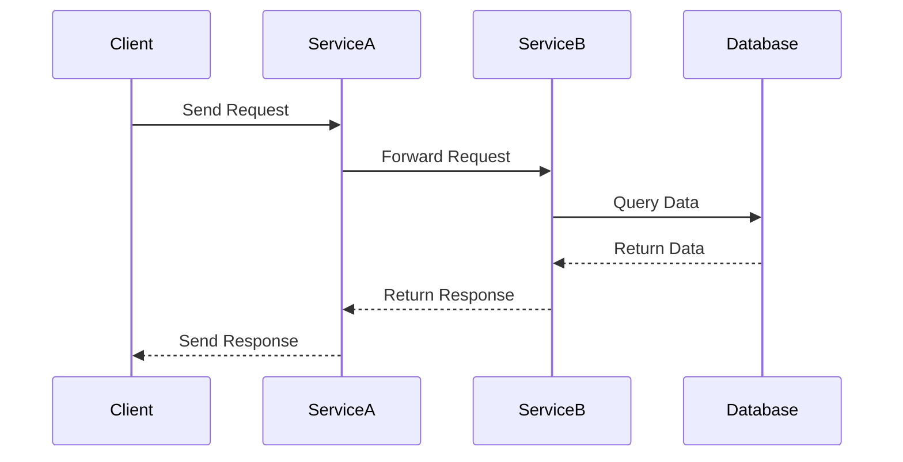

## 16.2 Distributed Tracing and Telemetry

In today's complex distributed systems, understanding the flow of requests through various services is crucial for maintaining performance and reliability. Distributed tracing and telemetry provide the necessary insights to achieve this understanding. In this section, we will delve into the concepts of distributed tracing and telemetry, explore how to implement them using tools like OpenTelemetry, and discuss best practices for correlating logs and traces across services in Scala applications.

### Introduction to Distributed Tracing

Distributed tracing is a method used to track requests as they traverse through a distributed system. It provides a way to visualize the entire journey of a request, from the initial entry point to the final response, across multiple services and components. This is particularly important in microservices architectures, where a single request may interact with numerous services.

#### Key Concepts

- **Trace**: A trace represents the entire journey of a request through a system. It consists of multiple spans.
- **Span**: A span is a single operation within a trace. It includes metadata such as start time, end time, and operation name.
- **Context Propagation**: The mechanism by which trace context is passed along with requests to ensure continuity across services.

### Implementing Distributed Tracing with OpenTelemetry

OpenTelemetry is an open-source observability framework that provides APIs, libraries, agents, and instrumentation to enable distributed tracing and metrics collection. It supports multiple languages, including Scala, and can be integrated with various backends like Jaeger, Zipkin, and Prometheus.

#### Setting Up OpenTelemetry in Scala

To implement distributed tracing in a Scala application using OpenTelemetry, follow these steps:

1. **Add Dependencies**: Include the necessary OpenTelemetry libraries in your Scala project. For example, using sbt:

   ```scala
   libraryDependencies ++= Seq(
     "io.opentelemetry" % "opentelemetry-api" % "1.9.0",
     "io.opentelemetry" % "opentelemetry-sdk" % "1.9.0",
     "io.opentelemetry" % "opentelemetry-exporter-jaeger" % "1.9.0"
   )
   ```

2. **Initialize OpenTelemetry**: Set up the OpenTelemetry SDK and configure the exporter.

   ```scala
   import io.opentelemetry.api.GlobalOpenTelemetry
   import io.opentelemetry.sdk.OpenTelemetrySdk
   import io.opentelemetry.sdk.trace.SdkTracerProvider
   import io.opentelemetry.sdk.trace.export.BatchSpanProcessor
   import io.opentelemetry.exporter.jaeger.JaegerGrpcSpanExporter

   val jaegerExporter = JaegerGrpcSpanExporter.builder()
     .setEndpoint("http://localhost:14250")
     .build()

   val tracerProvider = SdkTracerProvider.builder()
     .addSpanProcessor(BatchSpanProcessor.builder(jaegerExporter).build())
     .build()

   val openTelemetry = OpenTelemetrySdk.builder()
     .setTracerProvider(tracerProvider)
     .build()

   GlobalOpenTelemetry.set(openTelemetry)
   ```

3. **Create Spans**: Use the OpenTelemetry API to create spans around operations you want to trace.

   ```scala
   import io.opentelemetry.api.trace.Span
   import io.opentelemetry.api.trace.Tracer

   val tracer: Tracer = GlobalOpenTelemetry.getTracer("example-tracer")

   def tracedOperation(): Unit = {
     val span = tracer.spanBuilder("operation-name").startSpan()
     try {
       // Your operation logic here
     } finally {
       span.end()
     }
   }
   ```

4. **Propagate Context**: Ensure that the trace context is propagated across service boundaries. This often involves integrating with HTTP clients and servers to automatically inject and extract context headers.

### Correlating Logs and Traces

Correlating logs with traces is essential for gaining a comprehensive view of system behavior. By linking logs to specific traces, you can quickly identify the root cause of issues and understand the context of log entries.

#### Techniques for Correlation

- **Trace ID Injection**: Include the trace ID in log entries to associate logs with specific traces.
- **Structured Logging**: Use structured logging to add trace and span IDs as fields in log messages.
- **Log Aggregation**: Use log aggregation tools like Elasticsearch and Kibana to search and visualize logs based on trace IDs.

### Visualizing and Analyzing Trace Data

Once traces are collected, they can be visualized and analyzed to identify performance bottlenecks, understand request flows, and detect anomalies.

#### Tools for Visualization

- **Jaeger**: An open-source, end-to-end distributed tracing system that provides a UI for visualizing traces.
- **Zipkin**: A distributed tracing system that helps gather timing data needed to troubleshoot latency problems in microservice architectures.
- **Grafana**: A multi-platform open-source analytics and interactive visualization web application that supports OpenTelemetry data sources.

### Best Practices for Distributed Tracing

- **Instrument Key Operations**: Focus on instrumenting critical paths and operations that impact performance and reliability.
- **Automate Context Propagation**: Use libraries and frameworks that support automatic context propagation to reduce manual effort.
- **Monitor Overhead**: Keep an eye on the performance overhead introduced by tracing and adjust sampling rates as necessary.
- **Integrate with CI/CD**: Include tracing in your CI/CD pipeline to ensure that new code is properly instrumented before deployment.

### Try It Yourself

To deepen your understanding of distributed tracing, try modifying the provided code examples to:

- **Add Custom Attributes**: Enhance spans with custom attributes to capture additional context.
- **Experiment with Exporters**: Switch between different exporters (e.g., Zipkin, Prometheus) to see how they impact trace visualization.
- **Simulate Errors**: Introduce errors in your traced operations and observe how they appear in the trace data.

### Visualizing Distributed Tracing

To better understand how distributed tracing works, let's visualize the flow of a request through a system using a sequence diagram.



This diagram illustrates how a request flows through multiple services, with each interaction represented as a span in the trace.

### Knowledge Check

- **What is a trace, and how does it differ from a span?**
- **Why is context propagation important in distributed tracing?**
- **How can structured logging enhance trace correlation?**

### Conclusion

Distributed tracing and telemetry are powerful tools for understanding and optimizing distributed systems. By implementing these practices in your Scala applications, you can gain valuable insights into request flows, identify performance bottlenecks, and improve overall system reliability. Remember, this is just the beginning. As you continue to explore and experiment with distributed tracing, you'll uncover new ways to enhance observability and drive better outcomes for your applications.

## Quiz Time!



### What is a trace in distributed tracing?

- [x] A representation of the entire journey of a request through a system
- [ ] A single operation within a trace
- [ ] The mechanism by which trace context is passed along with requests
- [ ] A tool for visualizing trace data

> **Explanation:** A trace represents the entire journey of a request through a system, consisting of multiple spans.

### What is the purpose of context propagation in distributed tracing?

- [x] To ensure continuity of trace context across services
- [ ] To visualize trace data
- [ ] To reduce performance overhead
- [ ] To automate log correlation

> **Explanation:** Context propagation ensures that trace context is maintained across service boundaries, allowing for a complete trace of a request.

### Which tool is used for visualizing traces in distributed systems?

- [ ] OpenTelemetry
- [x] Jaeger
- [ ] Prometheus
- [ ] Elasticsearch

> **Explanation:** Jaeger is an open-source tool used for visualizing traces in distributed systems.

### How can structured logging enhance trace correlation?

- [x] By adding trace and span IDs as fields in log messages
- [ ] By reducing the amount of log data
- [ ] By automating context propagation
- [ ] By visualizing trace data

> **Explanation:** Structured logging involves adding trace and span IDs as fields in log messages, which helps in correlating logs with specific traces.

### What is a span in distributed tracing?

- [ ] A representation of the entire journey of a request through a system
- [x] A single operation within a trace
- [ ] The mechanism by which trace context is passed along with requests
- [ ] A tool for visualizing trace data

> **Explanation:** A span is a single operation within a trace, including metadata such as start time, end time, and operation name.

### Which of the following is NOT a best practice for distributed tracing?

- [ ] Instrument key operations
- [ ] Automate context propagation
- [ ] Monitor overhead
- [x] Ignore performance overhead

> **Explanation:** Ignoring performance overhead is not a best practice; it's important to monitor and adjust sampling rates to manage overhead.

### What is the role of OpenTelemetry in distributed tracing?

- [x] It provides APIs, libraries, and instrumentation for distributed tracing and metrics collection
- [ ] It visualizes trace data
- [ ] It aggregates logs
- [ ] It reduces performance overhead

> **Explanation:** OpenTelemetry provides the necessary tools and libraries for implementing distributed tracing and metrics collection.

### How can you correlate logs with traces?

- [x] By including the trace ID in log entries
- [ ] By reducing log verbosity
- [ ] By automating context propagation
- [ ] By visualizing trace data

> **Explanation:** Including the trace ID in log entries helps in correlating logs with specific traces.

### Which of the following is a tool for log aggregation?

- [ ] Jaeger
- [ ] Zipkin
- [x] Elasticsearch
- [ ] OpenTelemetry

> **Explanation:** Elasticsearch is a tool used for log aggregation, allowing for searching and visualizing logs based on trace IDs.

### True or False: Distributed tracing can help identify performance bottlenecks in a system.

- [x] True
- [ ] False

> **Explanation:** Distributed tracing provides insights into request flows and can help identify performance bottlenecks in a system.


