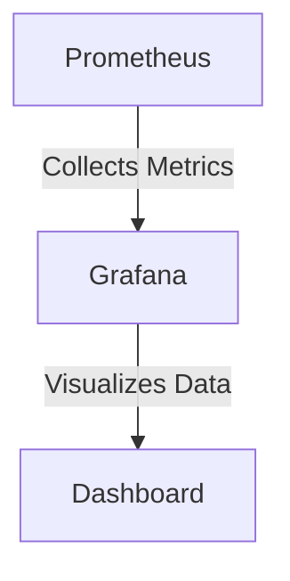
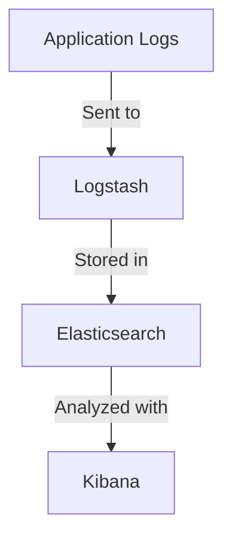

## 16.3 Continuous Observability in Scala Applications

In today's fast-paced software development landscape, ensuring that applications are reliable, performant, and secure is paramount. Continuous observability is a critical practice that allows developers and operators to gain insights into the behavior of their systems in real-time. This section delves into the principles of observability, explores tools and techniques for proactive monitoring, and provides guidance on implementing observability in Scala applications.

### Principles of Observability

Observability is the ability to measure the internal states of a system by examining its outputs. It is a crucial aspect of modern software systems, especially those built using microservices architectures, where understanding the interactions between components is essential for maintaining system health.

#### Key Principles

1. **Instrumentation**: Ensure that your application is instrumented to collect metrics, logs, and traces. This involves embedding code that captures relevant data points throughout the application lifecycle.

2. **Contextual Data**: Collect data that provides context, such as metadata about requests, user sessions, and environment variables. This helps in understanding the circumstances under which certain events occur.

3. **Real-Time Monitoring**: Implement systems that can process and analyze data in real-time, allowing for immediate detection of issues and anomalies.

4. **Correlation and Aggregation**: Enable the correlation of data from different sources to provide a holistic view of the system's state. Aggregating data helps in identifying patterns and trends over time.

5. **Actionable Insights**: The ultimate goal of observability is to provide actionable insights that can lead to improved system performance, reliability, and user experience.

### Tools and Techniques for Proactive Monitoring

To achieve continuous observability, a combination of tools and techniques is employed. These tools help in collecting, processing, and visualizing data, enabling teams to monitor their applications effectively.

#### Monitoring Tools

- **Prometheus**: An open-source monitoring tool that collects and stores metrics as time series data. It is particularly well-suited for monitoring dynamic environments like Kubernetes.

- **Grafana**: A visualization tool that integrates with Prometheus and other data sources to create interactive dashboards. It allows teams to visualize metrics and set up alerts.

- **Elastic Stack (ELK)**: Consists of Elasticsearch, Logstash, and Kibana. It is used for centralized logging and search capabilities, making it easier to analyze logs and detect issues.

- **Jaeger**: A distributed tracing system that helps in monitoring and troubleshooting transactions in complex distributed systems.

- **Zipkin**: Another distributed tracing system that collects timing data needed to troubleshoot latency problems in microservice architectures.

#### Techniques for Proactive Monitoring

- **Alerting**: Set up alerts based on predefined thresholds or anomalies to notify teams of potential issues. Alerts can be configured for various metrics such as CPU usage, memory consumption, and response times.

- **Anomaly Detection**: Use machine learning algorithms to detect anomalies in the data. This can help in identifying unusual patterns that may indicate a problem.

- **Capacity Planning**: Analyze historical data to predict future resource needs. This helps in ensuring that the system can handle expected loads without degradation in performance.

- **Root Cause Analysis**: Implement tools and processes that facilitate quick identification of the root cause of issues. This often involves correlating logs, metrics, and traces.

### Implementing Observability in Scala Applications

Scala, with its strong type system and functional programming capabilities, offers unique advantages for implementing observability. Let's explore how to integrate observability into Scala applications effectively.

#### Instrumentation in Scala

Instrumentation involves adding code to your application to collect metrics, logs, and traces. In Scala, this can be achieved using libraries and frameworks that provide observability capabilities.

##### Example: Using Kamon for Metrics

Kamon is a popular library for monitoring applications in Scala. It provides support for metrics, traces, and context propagation.

```scala
import kamon.Kamon
import kamon.metric.Counter

object MyApp extends App {
  // Initialize Kamon
  Kamon.init()

  // Create a counter metric
  val requestCounter: Counter = Kamon.counter("requests")

  // Increment the counter
  requestCounter.increment()

  // Simulate application logic
  println("Hello, World!")

  // Shutdown Kamon
  Kamon.stop()
}
```

In this example, we initialize Kamon, create a counter metric, and increment it whenever a request is processed. This simple setup allows us to track the number of requests handled by the application.

##### Logging with Logback

Logback is a logging framework that is widely used in Scala applications. It is highly configurable and integrates well with other observability tools.

```scala
import org.slf4j.LoggerFactory

object MyApp extends App {
  val logger = LoggerFactory.getLogger(getClass)

  logger.info("Application started")

  try {
    // Simulate application logic
    println("Hello, World!")
  } catch {
    case e: Exception =>
      logger.error("An error occurred", e)
  }

  logger.info("Application stopped")
}
```

In this example, we use Logback to log messages at different levels (info, error). These logs can be collected and analyzed using tools like the ELK stack.

#### Distributed Tracing in Scala

Distributed tracing is essential for understanding the flow of requests through a distributed system. It helps in identifying bottlenecks and latency issues.

##### Example: Using OpenTelemetry for Tracing

OpenTelemetry is a set of APIs, libraries, and agents that provide observability capabilities, including distributed tracing.

```scala
import io.opentelemetry.api.GlobalOpenTelemetry
import io.opentelemetry.api.trace.Span
import io.opentelemetry.api.trace.Tracer

object MyApp extends App {
  // Obtain a tracer
  val tracer: Tracer = GlobalOpenTelemetry.getTracer("my-app")

  // Start a span
  val span: Span = tracer.spanBuilder("my-operation").startSpan()

  try {
    // Simulate application logic
    println("Hello, World!")
  } finally {
    // End the span
    span.end()
  }
}
```

In this example, we use OpenTelemetry to create a tracer and start a span for a specific operation. This allows us to trace the execution of the operation across different components of the system.

### Visualizing Observability Data

Visualizing observability data is crucial for gaining insights into the system's behavior. Tools like Grafana and Kibana provide powerful visualization capabilities.

#### Creating Dashboards with Grafana

Grafana allows you to create interactive dashboards that display metrics collected by Prometheus or other data sources.



In this diagram, Prometheus collects metrics from the application, and Grafana visualizes these metrics in a dashboard.

#### Analyzing Logs with Kibana

Kibana is part of the Elastic Stack and provides a user-friendly interface for searching and analyzing logs stored in Elasticsearch.



This diagram illustrates how application logs are processed by Logstash, stored in Elasticsearch, and analyzed using Kibana.

### Try It Yourself

To get hands-on experience with continuous observability in Scala applications, try the following exercises:

1. **Modify the Kamon Example**: Add additional metrics such as histograms and gauges to track response times and resource usage.

2. **Enhance the Logback Example**: Configure Logback to send logs to Elasticsearch and visualize them in Kibana.

3. **Experiment with OpenTelemetry**: Integrate OpenTelemetry with a Scala microservices application and trace requests across multiple services.

4. **Create Grafana Dashboards**: Set up a Grafana instance and create dashboards to visualize metrics collected from your Scala application.

### Knowledge Check

- What are the key principles of observability?
- How does distributed tracing help in understanding system behavior?
- What are some common tools used for monitoring and observability?
- How can you instrument a Scala application to collect metrics?
- What role does visualization play in observability?

### Embrace the Journey

Continuous observability is an ongoing process that requires commitment and adaptation. As you implement observability in your Scala applications, remember that the goal is to gain insights that lead to better decision-making and improved system performance. Stay curious, keep experimenting, and enjoy the journey of building more resilient and reliable software systems.

### References and Links

- [Prometheus Documentation](https://prometheus.io/docs/)
- [Grafana Documentation](https://grafana.com/docs/)
- [Elastic Stack Documentation](https://www.elastic.co/guide/index.html)
- [OpenTelemetry Documentation](https://opentelemetry.io/docs/)
- [Kamon Documentation](https://kamon.io/docs/)

---

## Quiz Time!



### What is the primary goal of observability?

- [x] To gain actionable insights into system behavior
- [ ] To increase system complexity
- [ ] To reduce system performance
- [ ] To eliminate all system logs

> **Explanation:** The primary goal of observability is to gain actionable insights into system behavior, which helps in improving performance and reliability.

### Which tool is commonly used for visualizing metrics in dashboards?

- [ ] Prometheus
- [x] Grafana
- [ ] Logstash
- [ ] Jaeger

> **Explanation:** Grafana is commonly used for visualizing metrics in dashboards, often integrating with Prometheus and other data sources.

### What is the role of distributed tracing in observability?

- [x] To understand the flow of requests through a distributed system
- [ ] To eliminate the need for logging
- [ ] To increase system latency
- [ ] To replace metrics collection

> **Explanation:** Distributed tracing helps in understanding the flow of requests through a distributed system, identifying bottlenecks and latency issues.

### Which library is used for monitoring Scala applications?

- [ ] Logback
- [x] Kamon
- [ ] Kibana
- [ ] Elasticsearch

> **Explanation:** Kamon is a library used for monitoring Scala applications, providing support for metrics, traces, and context propagation.

### What is the purpose of alerting in observability?

- [x] To notify teams of potential issues based on predefined thresholds
- [ ] To increase system load
- [ ] To reduce system complexity
- [ ] To eliminate the need for monitoring

> **Explanation:** Alerting is used to notify teams of potential issues based on predefined thresholds, allowing for proactive response to problems.

### How can you enhance logs in a Scala application?

- [x] By configuring Logback to send logs to Elasticsearch
- [ ] By removing all log statements
- [ ] By increasing the log level to debug
- [ ] By disabling logging in production

> **Explanation:** Enhancing logs by configuring Logback to send logs to Elasticsearch allows for centralized logging and analysis using tools like Kibana.

### What is the benefit of using OpenTelemetry in Scala applications?

- [x] It provides observability capabilities, including distributed tracing
- [ ] It eliminates the need for metrics collection
- [ ] It increases system complexity
- [ ] It reduces system performance

> **Explanation:** OpenTelemetry provides observability capabilities, including distributed tracing, which helps in monitoring and troubleshooting distributed systems.

### Which of the following is NOT a principle of observability?

- [ ] Instrumentation
- [ ] Contextual Data
- [ ] Real-Time Monitoring
- [x] System Shutdown

> **Explanation:** System shutdown is not a principle of observability. Observability focuses on instrumentation, contextual data, and real-time monitoring.

### What is the role of Kibana in the Elastic Stack?

- [x] To provide a user-friendly interface for searching and analyzing logs
- [ ] To collect metrics from applications
- [ ] To store logs in a database
- [ ] To replace Logstash

> **Explanation:** Kibana provides a user-friendly interface for searching and analyzing logs stored in Elasticsearch, making it easier to detect issues.

### True or False: Continuous observability requires a one-time setup and does not need ongoing maintenance.

- [ ] True
- [x] False

> **Explanation:** Continuous observability is an ongoing process that requires regular maintenance and adaptation to ensure effective monitoring and insights.


