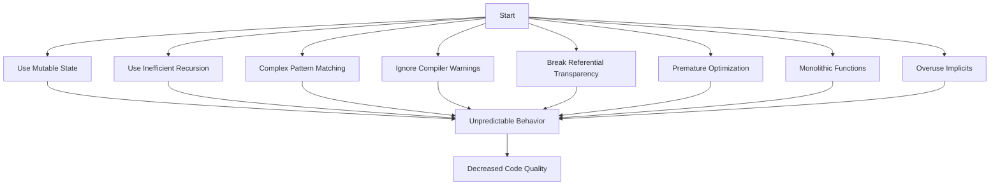

## 17.1 Recognizing Functional Anti-Patterns

In the realm of functional programming, Scala offers a rich set of features that encourage immutability, higher-order functions, and concise code. However, even experienced developers can fall into common pitfalls known as anti-patterns. Recognizing these anti-patterns is crucial for writing efficient, maintainable, and robust Scala code. In this section, we will explore some of the most prevalent functional anti-patterns in Scala and provide strategies to avoid them.

### Overuse of Mutable State

#### The Problem

Functional programming emphasizes immutability, which helps in maintaining predictable and bug-free code. However, overusing mutable state can lead to complex and error-prone code, making it difficult to reason about the program's behavior.

#### Example

Consider the following example where mutable state is used excessively:

```scala
var total = 0
val numbers = List(1, 2, 3, 4, 5)

for (num <- numbers) {
  total += num
}

println(s"Total: $total")
```

In this example, the `total` variable is mutable, which can lead to unintended side effects if accessed concurrently.

#### Solution

Use immutable data structures and functional operations to achieve the same result:

```scala
val numbers = List(1, 2, 3, 4, 5)
val total = numbers.sum

println(s"Total: $total")
```

By using `sum`, we avoid mutable state and make the code more concise and safer.

### Inefficient Recursion

#### The Problem

Recursion is a common functional programming technique, but inefficient recursion can lead to stack overflow errors and performance issues.

#### Example

Here's an example of inefficient recursion:

```scala
def factorial(n: Int): Int = {
  if (n == 0) 1
  else n * factorial(n - 1)
}

println(factorial(5))
```

This implementation is not tail-recursive, meaning it can cause a stack overflow for large values of `n`.

#### Solution

Use tail recursion to optimize recursive functions:

```scala
def factorial(n: Int): Int = {
  @annotation.tailrec
  def loop(acc: Int, n: Int): Int = {
    if (n == 0) acc
    else loop(acc * n, n - 1)
  }
  loop(1, n)
}

println(factorial(5))
```

The `@annotation.tailrec` ensures that the function is optimized for tail recursion, preventing stack overflow.

### Excessive Pattern Matching Complexity

#### The Problem

Pattern matching is a powerful feature in Scala, but overusing it can lead to complex and unreadable code.

#### Example

Consider the following complex pattern matching:

```scala
def process(input: Any): String = input match {
  case (x: Int, y: Int) if x > y => "x is greater"
  case (x: Int, y: Int) if x < y => "y is greater"
  case (x: Int, y: Int) if x == y => "x and y are equal"
  case _ => "unknown"
}
```

This code is difficult to read and maintain due to the multiple conditions.

#### Solution

Simplify pattern matching by breaking it into smaller, more manageable functions:

```scala
def compareInts(x: Int, y: Int): String = {
  if (x > y) "x is greater"
  else if (x < y) "y is greater"
  else "x and y are equal"
}

def process(input: Any): String = input match {
  case (x: Int, y: Int) => compareInts(x, y)
  case _ => "unknown"
}
```

By delegating logic to helper functions, we improve readability and maintainability.

### Ignoring Compiler Warnings

#### The Problem

Compiler warnings are often ignored, but they can indicate potential issues in the code that may lead to bugs or inefficiencies.

#### Example

Consider the following code with a compiler warning:

```scala
val unused = 42
println("Hello, World!")
```

The compiler may warn about the unused variable `unused`.

#### Solution

Address compiler warnings promptly to ensure code quality:

```scala
println("Hello, World!")
```

Remove unused variables or refactor the code to eliminate warnings.

### Breaking Referential Transparency

#### The Problem

Referential transparency is a core principle of functional programming, ensuring that functions produce the same output for the same input. Breaking this principle can lead to unpredictable behavior.

#### Example

Consider a function that breaks referential transparency:

```scala
var counter = 0

def increment(): Int = {
  counter += 1
  counter
}

println(increment()) // Output: 1
println(increment()) // Output: 2
```

The `increment` function produces different outputs for the same call, violating referential transparency.

#### Solution

Ensure functions are pure and maintain referential transparency:

```scala
def increment(counter: Int): Int = counter + 1

val initialCounter = 0
val newCounter = increment(initialCounter)

println(newCounter) // Output: 1
```

By passing the counter as an argument, we maintain purity and predictability.

### Premature Optimization

#### The Problem

Optimizing code before understanding the problem can lead to complex and hard-to-maintain code without significant performance gains.

#### Example

Consider a premature optimization attempt:

```scala
val numbers = List(1, 2, 3, 4, 5)
val result = numbers.map(_ * 2).filter(_ > 5).sum
```

Attempting to optimize this code without profiling can lead to unnecessary complexity.

#### Solution

Focus on writing clear and correct code first, then optimize based on profiling results:

```scala
val numbers = List(1, 2, 3, 4, 5)
val result = numbers.map(_ * 2).filter(_ > 5).sum

println(s"Result: $result")
```

Use profiling tools to identify bottlenecks before optimizing.

### Monolithic Functions

#### The Problem

Monolithic functions are large and do too many things, making them difficult to understand, test, and maintain.

#### Example

Here's an example of a monolithic function:

```scala
def processData(data: List[Int]): String = {
  val filtered = data.filter(_ > 0)
  val sorted = filtered.sorted
  val result = sorted.map(_.toString).mkString(", ")
  s"Processed data: $result"
}

println(processData(List(3, -1, 2, 0, 5)))
```

This function performs multiple tasks, making it hard to test and modify.

#### Solution

Break down monolithic functions into smaller, focused functions:

```scala
def filterPositive(data: List[Int]): List[Int] = data.filter(_ > 0)

def sortData(data: List[Int]): List[Int] = data.sorted

def formatData(data: List[Int]): String = data.map(_.toString).mkString(", ")

def processData(data: List[Int]): String = {
  val filtered = filterPositive(data)
  val sorted = sortData(filtered)
  val result = formatData(sorted)
  s"Processed data: $result"
}

println(processData(List(3, -1, 2, 0, 5)))
```

By decomposing the function, we improve readability and testability.

### Overusing Implicits and Type Annotations

#### The Problem

Implicits and type annotations are powerful features in Scala, but overusing them can lead to obscure and hard-to-understand code.

#### Example

Consider the following code with excessive implicits:

```scala
implicit val multiplier: Int = 2

def multiply(value: Int)(implicit factor: Int): Int = value * factor

println(multiply(5))
```

The implicit parameter can make the code less transparent.

#### Solution

Use implicits judiciously and prefer explicit parameters when clarity is more important:

```scala
def multiply(value: Int, factor: Int): Int = value * factor

println(multiply(5, 2))
```

By making parameters explicit, we enhance code readability and maintainability.

### Visualizing Anti-Patterns

Let's visualize how these anti-patterns interact and affect code quality using a flowchart:



This diagram illustrates how each anti-pattern contributes to decreased code quality and maintainability.

### Try It Yourself

Experiment with the provided code examples by modifying them to see how changes impact code behavior and readability. For instance, try refactoring a monolithic function into smaller parts or converting a non-tail-recursive function into a tail-recursive one.

### References and Links

- [Scala Documentation](https://docs.scala-lang.org/)
- [Functional Programming in Scala](https://www.manning.com/books/functional-programming-in-scala)
- [Effective Scala](https://twitter.github.io/effectivescala/)

### Knowledge Check

- What are the benefits of avoiding mutable state in functional programming?
- How does tail recursion help prevent stack overflow errors?
- Why is it important to address compiler warnings?
- What is referential transparency, and why is it important in functional programming?
- How can premature optimization negatively impact code maintainability?

### Embrace the Journey

Remember, recognizing and avoiding anti-patterns is an ongoing journey. As you continue to develop your skills in Scala, keep experimenting, stay curious, and enjoy the process of writing clean and efficient code.

## Quiz Time!



### Which of the following is an example of breaking referential transparency?

- [ ] Using immutable data structures
- [x] A function that modifies a global variable
- [ ] A function that returns the same output for the same input
- [ ] Using pure functions

> **Explanation:** A function that modifies a global variable produces different outputs for the same input, breaking referential transparency.

### What is a common consequence of overusing mutable state in Scala?

- [x] Unpredictable behavior and harder-to-maintain code
- [ ] Improved performance
- [ ] Easier debugging
- [ ] Increased code readability

> **Explanation:** Overusing mutable state can lead to unpredictable behavior and make the code harder to maintain.

### How does tail recursion benefit recursive functions?

- [x] Prevents stack overflow by reusing stack frames
- [ ] Increases the readability of the code
- [ ] Makes the code more concise
- [ ] Allows for more complex logic

> **Explanation:** Tail recursion optimizes recursive calls by reusing stack frames, preventing stack overflow.

### Why should compiler warnings not be ignored?

- [x] They can indicate potential issues or inefficiencies
- [ ] They are optional and can be ignored safely
- [ ] They only affect code style, not functionality
- [ ] They are meant for beginner programmers

> **Explanation:** Compiler warnings often indicate potential issues or inefficiencies that should be addressed.

### What is a downside of excessive pattern matching complexity?

- [x] It can make the code difficult to read and maintain
- [ ] It improves code performance
- [ ] It simplifies the code logic
- [ ] It enhances code flexibility

> **Explanation:** Excessive pattern matching complexity can make code difficult to read and maintain.

### What is an example of premature optimization?

- [x] Optimizing code without profiling
- [ ] Writing clear and concise code
- [ ] Using efficient algorithms
- [ ] Refactoring code for readability

> **Explanation:** Premature optimization involves optimizing code without profiling, which can lead to unnecessary complexity.

### How can monolithic functions be improved?

- [x] By breaking them into smaller, focused functions
- [ ] By adding more comments
- [ ] By increasing the number of parameters
- [ ] By using more complex logic

> **Explanation:** Breaking monolithic functions into smaller, focused functions improves readability and maintainability.

### What is a potential issue with overusing implicits?

- [x] It can make the code less transparent and harder to understand
- [ ] It improves code performance
- [ ] It simplifies function signatures
- [ ] It enhances code flexibility

> **Explanation:** Overusing implicits can make code less transparent and harder to understand.

### Why is referential transparency important in functional programming?

- [x] It ensures functions produce the same output for the same input
- [ ] It allows for mutable state
- [ ] It supports complex logic
- [ ] It enables side effects

> **Explanation:** Referential transparency ensures functions produce the same output for the same input, which is a core principle of functional programming.

### True or False: Tail recursion is not necessary for all recursive functions.

- [x] True
- [ ] False

> **Explanation:** While tail recursion is beneficial for preventing stack overflow, not all recursive functions require it, especially if they are not deeply recursive.


