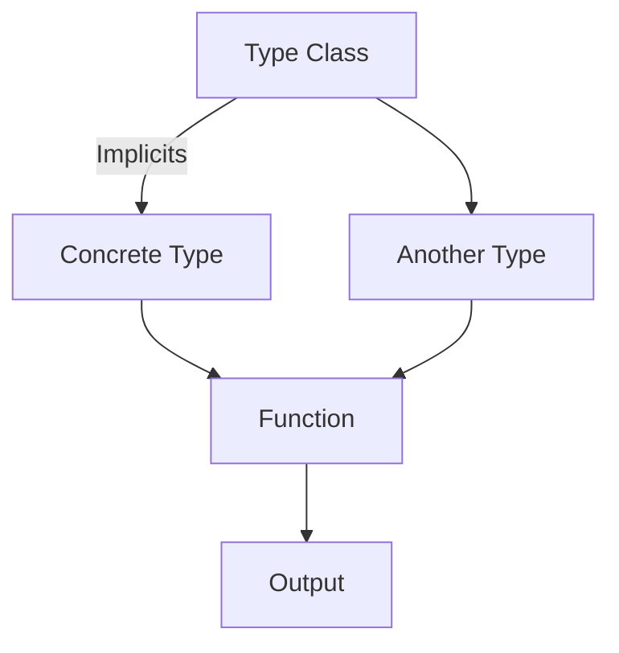

## 17.3 Overcomplicating with Type-Level Programming

Type-level programming in Scala is a powerful tool that allows developers to enforce constraints, perform computations, and express complex logic at the type level. However, with great power comes the potential for overcomplication. In this section, we will explore the pitfalls of overcomplicating code with type-level programming, how it can make code harder to read and maintain, and strategies to avoid these issues.

### Understanding Type-Level Programming

Type-level programming involves using types to perform computations and enforce constraints that would traditionally be handled at runtime. In Scala, this can be achieved through features such as:

- **Type Classes**: A pattern for ad-hoc polymorphism, allowing you to define behavior for types without modifying them.
- **Implicits**: Mechanisms for automatic parameter passing and type conversions.
- **Dependent Types**: Types that depend on values, allowing for more expressive type constraints.
- **Higher-Kinded Types**: Types that abstract over other types, enabling more generic and reusable code.

While these features can lead to elegant and robust solutions, they also introduce complexity that can obscure the code's intent.

### The Risks of Overcomplication

#### 1. **Readability Issues**

Type-level programming can make code difficult to read, especially for those unfamiliar with advanced Scala features. Consider the following example:

```scala
trait Show[A] {
  def show(a: A): String
}

implicit val intShow: Show[Int] = new Show[Int] {
  def show(a: Int): String = a.toString
}

implicit val stringShow: Show[String] = new Show[String] {
  def show(a: String): String = a
}

def printWithShow[A](a: A)(implicit show: Show[A]): Unit = {
  println(show.show(a))
}

printWithShow(42)      // Prints: 42
printWithShow("Scala") // Prints: Scala
```

While this code leverages type classes to provide a generic `printWithShow` function, the use of implicits can make it less intuitive for newcomers.

#### 2. **Maintenance Challenges**

Overly complex type-level constructs can make maintenance a nightmare. Changes to one part of the system can have unforeseen ripple effects due to tightly coupled type dependencies.

#### 3. **Error Messages**

Type-level programming can produce cryptic compiler error messages that are hard to decipher. This can slow down development and debugging processes.

### Strategies to Avoid Overcomplication

#### 1. **Simplify Type Constraints**

Avoid using complex type constraints unless absolutely necessary. Strive for simplicity and clarity in your type definitions.

#### 2. **Use Type Aliases**

Type aliases can help simplify complex type signatures, making them more readable:

```scala
type Result[T] = Either[String, T]

def process(input: String): Result[Int] = {
  if (input.forall(_.isDigit)) Right(input.toInt)
  else Left("Invalid input")
}
```

#### 3. **Limit Implicit Usage**

Use implicits judiciously. Overuse can lead to code that is difficult to follow and debug. Consider alternatives like explicit parameter passing when possible.

#### 4. **Document Complex Logic**

When complex type-level logic is unavoidable, ensure it is well-documented. Comments and documentation can help future maintainers understand the code's intent.

#### 5. **Leverage Compiler Plugins**

Tools like [Scalafix](https://scalacenter.github.io/scalafix/) can help enforce coding standards and catch potential issues early in the development process.

### Visualizing Type-Level Complexity

To better understand how type-level programming can complicate code, consider the following diagram illustrating the relationships between types and implicits in a typical Scala application:



This diagram shows how type classes and implicits interact with concrete types and functions, highlighting potential areas of complexity.

### Code Example: Simplifying Type-Level Logic

Let's refactor a complex type-level example to make it more readable and maintainable:

**Before:**

```scala
trait Monad[F[_]] {
  def flatMap[A, B](fa: F[A])(f: A => F[B]): F[B]
  def pure[A](a: A): F[A]
}

implicit val optionMonad: Monad[Option] = new Monad[Option] {
  def flatMap[A, B](fa: Option[A])(f: A => Option[B]): Option[B] = fa.flatMap(f)
  def pure[A](a: A): Option[A] = Some(a)
}

def combine[F[_]: Monad, A](fa: F[A], fb: F[A])(implicit m: Monad[F]): F[A] = {
  m.flatMap(fa)(_ => fb)
}
```

**After:**

```scala
trait Monad[F[_]] {
  def flatMap[A, B](fa: F[A])(f: A => F[B]): F[B]
  def pure[A](a: A): F[A]
}

implicit val optionMonad: Monad[Option] = new Monad[Option] {
  def flatMap[A, B](fa: Option[A])(f: A => Option[B]): Option[B] = fa.flatMap(f)
  def pure[A](a: A): Option[A] = Some(a)
}

def combine[F[_]: Monad, A](fa: F[A], fb: F[A]): F[A] = {
  implicitly[Monad[F]].flatMap(fa)(_ => fb)
}
```

In the refactored version, we use `implicitly` to access the implicit `Monad` instance, making the code more explicit and easier to follow.

### Try It Yourself

Experiment with the code examples by:

- Modifying the `Show` type class to support additional types.
- Refactoring the `combine` function to handle different monadic structures.
- Adding more complex type constraints and observing the impact on readability.

### Knowledge Check

- What are the potential downsides of using type-level programming excessively?
- How can type aliases improve code readability?
- Why is it important to document complex type-level logic?

### Conclusion

Type-level programming in Scala is a double-edged sword. While it offers powerful capabilities for enforcing constraints and expressing complex logic, it can also lead to overcomplication if not used judiciously. By following best practices and maintaining a focus on simplicity and clarity, you can harness the power of type-level programming without sacrificing code readability and maintainability.

## Quiz Time!



### What is a primary risk of overcomplicating code with type-level programming?

- [x] Readability issues
- [ ] Increased performance
- [ ] Simplified debugging
- [ ] Enhanced maintainability

> **Explanation:** Overcomplicating code with type-level programming can lead to readability issues, making it difficult for others to understand the code.

### How can type aliases help in type-level programming?

- [x] By simplifying complex type signatures
- [ ] By increasing code complexity
- [ ] By making code less readable
- [ ] By introducing more implicit conversions

> **Explanation:** Type aliases can simplify complex type signatures, making them more readable and easier to understand.

### Why should implicits be used judiciously in Scala?

- [x] To avoid making code difficult to follow and debug
- [ ] To increase the number of implicit conversions
- [ ] To enhance code complexity
- [ ] To reduce code readability

> **Explanation:** Overuse of implicits can make code difficult to follow and debug, so they should be used judiciously.

### What tool can help enforce coding standards in Scala?

- [x] Scalafix
- [ ] JavaScript
- [ ] HTML
- [ ] CSS

> **Explanation:** Scalafix is a tool that can help enforce coding standards and catch potential issues early in the development process.

### What is a benefit of documenting complex type-level logic?

- [x] It helps future maintainers understand the code's intent
- [ ] It increases code complexity
- [ ] It makes code less readable
- [ ] It introduces more implicit conversions

> **Explanation:** Documenting complex type-level logic helps future maintainers understand the code's intent, making it easier to maintain.

### Which of the following is NOT a feature of type-level programming in Scala?

- [x] HTML rendering
- [ ] Type Classes
- [ ] Implicits
- [ ] Higher-Kinded Types

> **Explanation:** HTML rendering is not a feature of type-level programming in Scala.

### What is a potential downside of using complex type constraints?

- [x] They can obscure the code's intent
- [ ] They simplify code readability
- [ ] They enhance code maintainability
- [ ] They improve performance

> **Explanation:** Complex type constraints can obscure the code's intent, making it harder to understand.

### How can type-level programming affect error messages?

- [x] It can produce cryptic compiler error messages
- [ ] It simplifies error messages
- [ ] It makes error messages more readable
- [ ] It reduces the number of error messages

> **Explanation:** Type-level programming can produce cryptic compiler error messages that are hard to decipher.

### What is a strategy to avoid overcomplicating code with type-level programming?

- [x] Simplify type constraints
- [ ] Increase the use of implicits
- [ ] Add more complex logic
- [ ] Avoid documenting the code

> **Explanation:** Simplifying type constraints is a strategy to avoid overcomplicating code with type-level programming.

### True or False: Type-level programming always improves code maintainability.

- [ ] True
- [x] False

> **Explanation:** Type-level programming does not always improve code maintainability; it can lead to overcomplication and maintenance challenges if not used judiciously.


