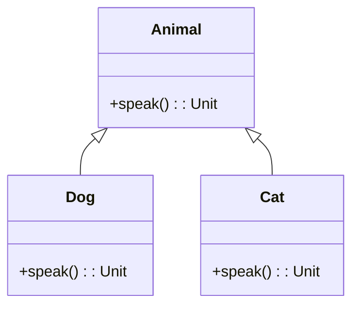
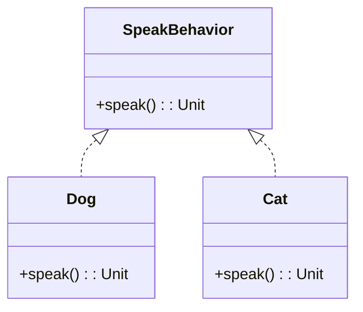

## 17.4 Excessive Use of Inheritance

In the realm of object-oriented programming, inheritance is a powerful tool that allows developers to create a hierarchy of classes, enabling code reuse and polymorphism. However, excessive use of inheritance can lead to rigid and fragile code structures that are difficult to maintain and extend. In this section, we will delve into the pitfalls of excessive inheritance, explore the benefits of favoring composition over inheritance, and provide practical guidance on how to apply these principles in Scala.

### Understanding Inheritance in Scala

Inheritance is a mechanism by which one class can inherit the properties and behaviors of another class. In Scala, inheritance is achieved using the `extends` keyword. Here's a simple example:

```scala
// Base class
class Animal {
  def speak(): Unit = println("Animal sound")
}

// Derived class
class Dog extends Animal {
  override def speak(): Unit = println("Bark")
}

val myDog = new Dog()
myDog.speak() // Outputs: Bark
```

In this example, the `Dog` class inherits from the `Animal` class and overrides the `speak` method to provide its own implementation.

### The Pitfalls of Excessive Inheritance

While inheritance can be useful, over-reliance on it can lead to several issues:

1. **Tight Coupling**: Inheritance creates a strong coupling between the base class and derived classes. Changes in the base class can inadvertently affect all derived classes, leading to a ripple effect of changes throughout the codebase.

2. **Fragile Base Class Problem**: The base class becomes a central point of potential failure. Any modification to the base class can have unintended consequences on all subclasses, making the system fragile.

3. **Limited Flexibility**: Inheritance imposes a strict hierarchy, which can limit flexibility. It can be challenging to adapt the hierarchy to accommodate new requirements without significant refactoring.

4. **Code Duplication**: In some cases, developers may resort to duplicating code across multiple classes to work around the limitations of the inheritance hierarchy.

5. **Violation of the Liskov Substitution Principle**: Excessive inheritance can lead to situations where subclasses do not adhere to the behavior expected by their base classes, violating the Liskov Substitution Principle.

### Favoring Composition Over Inheritance

Composition is an alternative design principle that advocates building complex objects by combining simpler ones. Instead of inheriting behavior from a base class, objects are composed of other objects that provide the desired functionality. This approach offers several advantages:

1. **Loose Coupling**: Composition results in loosely coupled components that can be easily replaced or modified without affecting other parts of the system.

2. **Greater Flexibility**: By composing objects, developers can create more flexible and adaptable systems that can evolve over time to meet changing requirements.

3. **Reusability**: Components can be reused across different parts of the system without being tied to a specific hierarchy.

4. **Adherence to SOLID Principles**: Composition aligns well with the SOLID principles, particularly the Single Responsibility Principle and the Open/Closed Principle.

### Implementing Composition in Scala

Scala provides several features that facilitate the implementation of composition, such as traits, case classes, and higher-order functions. Let's explore how to use these features to favor composition over inheritance.

#### Using Traits for Composition

Traits in Scala are a powerful tool for achieving composition. They allow you to define reusable pieces of behavior that can be mixed into classes.

```scala
// Define a trait
trait SpeakBehavior {
  def speak(): Unit
}

// Implement the trait
class Dog extends SpeakBehavior {
  override def speak(): Unit = println("Bark")
}

class Cat extends SpeakBehavior {
  override def speak(): Unit = println("Meow")
}

val myDog = new Dog()
val myCat = new Cat()
myDog.speak() // Outputs: Bark
myCat.speak() // Outputs: Meow
```

In this example, the `SpeakBehavior` trait defines a `speak` method that can be mixed into any class that needs this behavior. This approach allows for greater flexibility and reuse compared to a rigid inheritance hierarchy.

#### Composition with Case Classes

Case classes in Scala are ideal for modeling immutable data structures and can be used to compose complex objects.

```scala
// Define case classes
case class Engine(horsepower: Int)
case class Car(engine: Engine, brand: String)

val myCar = Car(Engine(150), "Toyota")
println(s"My car is a ${myCar.brand} with ${myCar.engine.horsepower} HP")
```

Here, the `Car` class is composed of an `Engine` class, demonstrating how composition can be used to build complex objects from simpler ones.

#### Higher-Order Functions for Behavior Composition

Higher-order functions are functions that take other functions as parameters or return them as results. They are a powerful tool for composing behavior in a functional style.

```scala
// Define a higher-order function
def applyOperation(x: Int, y: Int, operation: (Int, Int) => Int): Int = {
  operation(x, y)
}

// Use the higher-order function
val sum = applyOperation(3, 4, (a, b) => a + b)
val product = applyOperation(3, 4, (a, b) => a * b)

println(s"Sum: $sum, Product: $product")
```

In this example, the `applyOperation` function takes an operation as a parameter, allowing for flexible composition of behavior.

### Visualizing Inheritance vs. Composition

To better understand the differences between inheritance and composition, let's visualize these concepts using Mermaid.js diagrams.

#### Inheritance Hierarchy



This diagram illustrates a simple inheritance hierarchy where `Dog` and `Cat` inherit from `Animal`.

#### Composition Structure



In this composition structure, `Dog` and `Cat` implement the `SpeakBehavior` trait, allowing for more flexibility and reuse.

### Design Considerations

When deciding between inheritance and composition, consider the following:

- **Use Inheritance When**: You have a clear "is-a" relationship and expect the hierarchy to remain stable over time.
- **Use Composition When**: You need flexibility, reuse, and the ability to adapt to changing requirements.

### Differences and Similarities

Inheritance and composition are both mechanisms for reusing code, but they have distinct differences:

- **Inheritance**: Imposes a strict hierarchy and is best suited for stable, well-defined relationships.
- **Composition**: Offers greater flexibility and is ideal for creating adaptable systems.

### Try It Yourself

To solidify your understanding of composition, try modifying the code examples provided. Experiment with adding new behaviors using traits or composing different objects using case classes. Consider how you might refactor an existing inheritance hierarchy to use composition instead.

### Knowledge Check

- **Question**: What are the main drawbacks of excessive inheritance?
- **Exercise**: Refactor a simple inheritance hierarchy to use composition instead.

### Conclusion

Excessive use of inheritance can lead to rigid and fragile code structures. By favoring composition over inheritance, you can create more flexible, reusable, and maintainable systems. Remember, this is just the beginning. As you progress, you'll build more complex and interactive systems. Keep experimenting, stay curious, and enjoy the journey!

## Quiz Time!



### What is a primary disadvantage of excessive inheritance?

- [x] Tight coupling between base and derived classes
- [ ] Increased code readability
- [ ] Enhanced flexibility
- [ ] Simplified code maintenance

> **Explanation:** Excessive inheritance creates tight coupling, making changes in the base class affect all derived classes, leading to a fragile system.

### Which principle does composition align with more closely than inheritance?

- [x] SOLID principles
- [ ] DRY principle
- [ ] KISS principle
- [ ] YAGNI principle

> **Explanation:** Composition aligns well with the SOLID principles, particularly the Single Responsibility Principle and the Open/Closed Principle.

### How can traits be used in Scala to favor composition?

- [x] By defining reusable pieces of behavior that can be mixed into classes
- [ ] By creating a strict class hierarchy
- [ ] By enforcing a single inheritance model
- [ ] By duplicating code across multiple classes

> **Explanation:** Traits allow you to define reusable behavior that can be mixed into classes, promoting composition over inheritance.

### What is a benefit of using case classes for composition?

- [x] They model immutable data structures and can compose complex objects
- [ ] They enforce a strict class hierarchy
- [ ] They increase code duplication
- [ ] They limit flexibility

> **Explanation:** Case classes in Scala are ideal for modeling immutable data structures and can be used to compose complex objects.

### What does the Liskov Substitution Principle state?

- [x] Subtypes must be substitutable for their base types without altering the correctness of the program
- [ ] Objects should be open for extension but closed for modification
- [ ] A class should have only one reason to change
- [ ] Code should be easy to read and understand

> **Explanation:** The Liskov Substitution Principle states that subtypes must be substitutable for their base types without altering the correctness of the program.

### What is a higher-order function?

- [x] A function that takes other functions as parameters or returns them as results
- [ ] A function that only operates on primitive data types
- [ ] A function that is defined within a class
- [ ] A function that cannot be reused

> **Explanation:** Higher-order functions are functions that take other functions as parameters or return them as results, allowing for flexible composition of behavior.

### What is the main advantage of using composition over inheritance?

- [x] Greater flexibility and adaptability
- [ ] Easier to implement
- [ ] Requires less code
- [ ] Automatically enforces design patterns

> **Explanation:** Composition offers greater flexibility and adaptability, allowing systems to evolve over time to meet changing requirements.

### How does composition help with code reuse?

- [x] By allowing components to be reused across different parts of the system
- [ ] By enforcing a strict class hierarchy
- [ ] By duplicating code across multiple classes
- [ ] By limiting the use of interfaces

> **Explanation:** Composition allows components to be reused across different parts of the system without being tied to a specific hierarchy.

### True or False: Inheritance is always the best choice for code reuse.

- [ ] True
- [x] False

> **Explanation:** Inheritance is not always the best choice for code reuse. Composition often provides greater flexibility and adaptability.

### What does the term "fragile base class problem" refer to?

- [x] The issue where changes in the base class can have unintended consequences on all subclasses
- [ ] The inability to create new subclasses
- [ ] The requirement to duplicate code in subclasses
- [ ] The enforcement of strict access control

> **Explanation:** The fragile base class problem refers to the issue where changes in the base class can have unintended consequences on all subclasses, making the system fragile.


